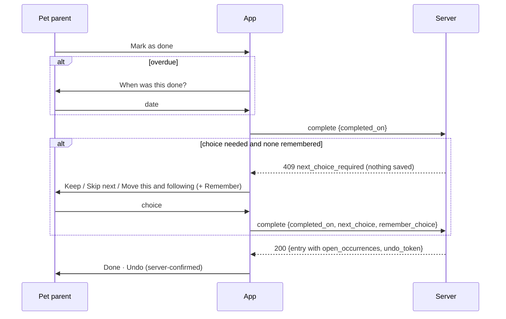

# Care Item occurrences: always-real next dates, two schedule types, one agenda — roadmap plan (v3)

> **Status: APPROVED BY OWNER (2026-09-29) — v3.1.** v3 added the owner's confirmations, the `/ui-design-deep` review (§5.18), the data reset and UAT seed upgrade (§6.3–6.4). **v3.1** folds in Cursor's review (§17: "ask before saving" completion, pause/type-switch simplifications, extra cases, write-path guard, test clock) and a full audit of existing BDD scenarios, Playwright specs, helpers, page objects and the CI canary, with a keep/update/delete/new disposition (§11.2–11.6). Review checklist: §15.
>
> **Amendment v4 (2026-10-01, owner-approved): §18.** Occurrence-first completion for children C, D and F (rows open their date, an occurrence screen, no stacked popups, no "dose" in copy, `health_history` dropped), the D-CSM-026 revision that already landed with A+B (completion never asks; the server keeps the waiting date), and a full data reset on UAT **and production**. Where §18 and earlier sections disagree, §18 wins.

## Metadata

| Field | Value |
|-------|-------|
| **plan_id** | `care-next-occurrence-c1a7` |
| **plan_kind** | `roadmap` (parent orchestrator; six child plans, §10) |
| **title** | Every active Care Item always has real, actionable occurrences; two plain schedule types; one Today / Due soon / Upcoming agenda; Absences use the same primitives |
| **author** | Claude Code session, with the product owner (2026-09-29) |
| **revisions** | v1 2026-09-29 · v2 2026-09-29 (product decisions) · v3 2026-09-29 (confirmations, UI review, data, E2E) · v3.1 2026-09-29 (review, test audit) · **v4 2026-10-01 (§18: occurrence-first completion, D-CSM-026 revision, full reset)** |
| **approval** | Owner sign-off in chat 2026-09-29 ("You have my sign off. Go ahead."), including the data wipe and category-default change. **v4** approved 2026-10-01: the recommended options D-a … D-g, the review corrections in §18.2, the D-CSM-026 server fallback in A+B, and a full reset on UAT and production ("no user") |
| **execution model** | Owner, 2026-09-29: execute-plan in essence. `claude/eager-edison-mf34j6` is the **integration branch for the whole plan**; phases are committed with the `phase(<n>/<m>):` prefix **without approval stops**; a **draft PR to `main`** is opened early for CI signal; it is marked ready and **merged** when every child is done and all gates are green; then **babysit `pre-uat-e2e.yml` until green** |
| **coordination (2026-09-30)** | Follows [parallel-programmes.md](../../docs/agent-efficiency/parallel-programmes.md) (CARE). **Lands per child**: A+B (landing 2b, after ARCH D; TEST slice 1 on `main` too), then C+D (3b), then E+F (5b), each its own integration → `main` PR with `/babysit-uat`; `claude/eager-edison-mf34j6` stays the shared integration line and merges main after every landing (no rebase or force-push after takeover). Migration `083_care_occurrence_model` is kept (first in the queue). One landing at a time; landing broadcast on every open programme control issue/PR. Area ownership: care engine (A+B), absences (E), care UI (C, D, F), pet-profile agenda (C); shared E2E files are append-only outside CARE's window (after TEST slice 1). From ARCH D / TEST slice 1 on: new Flutter code passes `scripts/check_feature_imports.js`; new Flutter test folders are added to `flutter_app/test/ci_shards.json` |
| **default_merge_mode** | `auto` |
| **programme_ref** | `docs/domains/pet_care/features/care-item-evolution.md` (canonical Care Item spec) |
| **reviewed commit** | `f6b6285` (`main`, 2026-09-29) — all file:line references are against this commit |
| **supersedes** | PR [KanopeeKa/AgathaCheck#1439](https://github.com/KanopeeKa/AgathaCheck/pull/1439) — closed 2026-09-29 |
| **amends (child A)** | D-CSM-001, D-CSM-004, D-CSM-005, D-CSM-018, D-ACP-003, D-ACP-007, D-ACP-009, D-ACP-010, D-CIE-002 (adds "Not recorded"), D-CIE-017, D-CIE-018; `occurrence-scheduling.md`; `care-schedule-management.md`; `care-item-evolution.md`; `terminology.md`; `care-item-view-ui.md`; `uat-demo-data.md` |

### Revision history (what changed and why)

| Area | v1 | v2 | v3 |
|------|----|----|----|
| Open occurrences | One open day per item | ≥ 1 open, several allowed; at most one computed | same |
| Schedule types | Tolerance bands | Two types with category defaults | Labels aligned with existing app copy: **Fixed schedule** / **After it's done** (§5.18 UIR-7) |
| Status word | "Overdue" | "Late" | **"Overdue" kept** (owner: "late can feel judgmental"); **"Not recorded"** added |
| Row actions | One row, menu everywhere | same | **One trailing action** (Mark as done / Review); other actions on the Care Item view (§5.18 UIR-1) |
| Completion feedback | Optimistic | Optimistic | **Server-confirmed only** (§5.18 UIR-2) |
| Existing data | Backfill | Backfill + default reset | **Wipe and reseed** (pre-launch) + **UAT seed upgrade** (§6.3–6.4) |
| E2E | Listed | Listed | **Dedicated E2E programme** with journeys, tags, a11y scans and local runs (§11.2) |
| **v3.1** Completion with a choice | — | Complete, then ask (two requests) | **Ask before saving**: the server saves nothing until the choice is known; one request commits (§5.6) |
| **v3.1** Pause / type switch | — | Special cases | **No special cases**: pause only hides; switching to After it's done closes fixed slots and lets the rule run (§5.8, §8.7) |
| **v3.1** Tests | — | Journeys listed | **Audit and disposition** of every care BDD scenario, spec, helper and page object; canary swap; test clock; API-only seeding (§11.2–11.6) |

---

## 1. Goal

1. **Every active planned Care Item always has at least one real, stored open occurrence** that can be acted on immediately (Mark as done, Skip, Change date, Postpone), created in the same transaction as the action that needs it — no placeholders, no "ensure first".
2. **Two schedule types users understand**, with safe defaults per category:
   - **Fixed schedule** — every scheduled date gets its own occurrence; missed ones stack so each can be recorded.
   - **After it's done** — one open occurrence; if overdue it stays overdue until done; the next date counts from when it was done.
3. **Irregular care is simple**: plan another date (booster, booked visit); planned dates take precedence; the schedule rule resumes when nothing planned remains.
4. **One agenda everywhere** (dashboard = pet profile): **Today** (overdue first), **Due soon**, **Upcoming**.
5. **One postpone mechanism** used by pause, pause-until and Absences.
6. **One Care Item component** in server and Flutter with a public API (child F).
7. **Canonical documentation first** (child A); **UAT data rebuilt** to demonstrate every behaviour (§6.4); **E2E journeys** for every user-visible rule (§11.2).

### 1.1 Product owner requirements (verbatim, 2026-09-29)

| # | Requirement |
|---|-------------|
| R1 | "I want to immediately see the next date even if it is far in the future." |
| R2 | "The occurrence needs to be materialised then and … I want to be able to manipulate that next occurrence immediately." |
| R3 | "That should also help making the 'absence' management easier." |
| R4 | "I must see the next occurrence of every care item I have for my pet, from the moment I close one occurrence … There is no delay (or a few seconds acceptable)." |
| R5 | "Organised cleanly under the Care Item Component domain with clean interactions that we can make evolve." |
| R6 | Late behaviour "updatable by the user (but provide a safe, clean default based on categories)." |
| R7 | "Pausing 'until' should be … the unique implementation of what happens when there's an absence and the user postpones a specific item … Avoid multiple implementation." |
| R8 | "On Vaccine make it clear a user can simply create another fixed occurrence, THEN start yearly recurrence." |
| R9 | "If we tick 'plan something' → show due date — if we tick 'record something' → show 'completed on' — do not show both." (fixed inside the domain amendment) |
| R10 | "Keep overdue in wording, 'late' can feel judgmental." |
| R11 | "For every new items, you can wipe the data — importantly, upgrade the data seeding for UAT. And of course, documentations, tests, pay extra attention to e2e tests." |
| R12 | "Check out the skill called something like UI-review-deep to ensure your specs for the UI are correct." |

---

## 2. Vocabulary (UI labels are EN; FR in child C/D)

| Term | Meaning | Storage |
|------|---------|---------|
| Care item | The lasting definition of care for one pet | `health_entries` |
| Occurrence | One scheduled or performed instance (internal word; never shown, D-CIE-001) | `health_occurrences` |
| Open occurrence | Not yet done or skipped | `status = 'pending'` |
| **Fixed schedule** | Dates follow the calendar rule regardless of completion | `recurrence_anchor = 'from_due_date'` (wire value unchanged; existing ARB `recurrenceFromDueDate`) |
| **After it's done** | Next date = completion date + interval | `recurrence_anchor = 'from_completion'` (wire unchanged; replaces ARB label "From completion") |
| Origin `schedule` | Date generated by a Fixed schedule rule | `health_occurrences.origin` (new) |
| Origin `computed` | Next date computed for an After-it's-done item | `origin` |
| Origin `planned` | Date set by a person: another date, a moved date, a postponed date, a booster, a booked visit | `origin` |
| Stack | Open past occurrences of a Fixed schedule item waiting to be recorded ("Not recorded") | derived |
| Care tick | The 15-minute job (§5.11) | `server/scripts/care/care_tick.js` (new) |

---

## 3. Decision record (product owner, 2026-09-29)

| Topic | Decision |
|-------|----------|
| Late behaviour | Configurable per item with category defaults; two schedule types (§5.1) |
| Category defaults | Medication → Fixed schedule. Vaccination, parasite prevention, wellness review and all other categories → After it's done |
| Fixed schedule, not done on time | Overdue until the next dose is due; then **Not recorded** and stacked so it can be recorded later (forgot to log ≠ forgot to give) |
| After it's done, not done on time | Overdue until done / skipped / postponed; the following date moves with today while overdue; when done, next = done date + interval |
| Stack window | Today plus the three calendar days before it stay open; anything with `scheduled_date < today − 3` closes as Not recorded, recordable from History (**confirmed**) |
| Leeway | **None.** Users can change the following date instead |
| Status words | **Overdue** kept (not "Late"); **Not recorded** added (**confirmed**) |
| Month-end | Clamp to the last day of the month |
| Early completion | Allowed everywhere; confirm when more than half an interval early |
| Resume after pause | Ask the date; default = what it would have been without the pause. "Pause until" optional (default no end date) |
| Pause until | Single postpone implementation, shared with Absences |
| Lists | **Today** (overdue first, then due today grouped Morning/Afternoon/Evening/Anytime only when ≥ 2 groups; otherwise "Today's list") / **Due soon** (next 7 days) / **Upcoming** (collapsed). Dashboard and pet profile identical. "Mark as done" button |
| Time-of-day groups | Morning < 12:00, Afternoon 12:00–17:59, Evening ≥ 18:00, Anytime = no time (**confirmed**) |
| Doses closing | Yes, recordable later (fixed schedule only) |
| Server "today" | Yes (pet home timezone) |
| Care tick | Yes |
| Several open occurrences | Yes. Planned/fixed dates take precedence; if nothing further exists, the After-it's-done logic resumes |
| Completing a later open date while an earlier one is open (After it's done) | Ask what to do with the earlier one (**confirmed**) |
| Irregular care / boosters | "Plan another date" everywhere; obvious on vaccines (booster, then yearly) |
| Done after the due date with a waiting date | Offer **Keep** / **Skip next** / **Move this and following**, plus **Remember my choice** for that care item |
| Moving a fixed date | Ask **This date only** (default) / **This and following** |
| New Care Item window | Collapsed **Advanced settings** with one-line summary: Where, Priority, Schedule type, If done after the due date, Provider (outside Notes), Documents. **Main section keeps** first due date, dosage (medication), notes |
| Plan/Record date bug | Fixed inside the form rework (child D) |
| Existing data | Wipe and reseed (pre-launch); category-default change approved |
| UAT data | Upgrade seeds so every behaviour is visible in UAT (§6.4) |
| Priorities | Documentation, tests, **extra attention to E2E** |

---

## 4. Current state (verified facts at `f6b6285`)

F1 was reproduced with the server's own `advanceSeries` test harness (monthly item completed on its due date → no next occurrence, `next_due_date = null`).

### 4.1 Server — write paths

| id | Fact | Evidence | Consequence |
|----|------|----------|-------------|
| F1 | After a close, the next occurrence is inserted only if due by tomorrow (T−1) or already past | `server/lib/care/schedule/advanceSeries.js:90-96`; `server/lib/occurrenceScheduling.js:100-103` | Weekly/monthly/yearly items done on time get no next occurrence |
| F2 | `next_due_date` is recomputed from pending rows only; none → `NULL` | `server/lib/occurrenceScheduling.js:156-173` | The next date disappears everywhere |
| F3 | No T−1 job exists anywhere in `server/` | `grep -rn "setInterval\|node-cron\|cron.schedule" server/lib server/routes` → none | `occurrence-scheduling.md:83` and D-CSM-004 describe behaviour that never runs |
| F4 | Create defers the first occurrence when the due date is beyond T−1 | `server/lib/occurrenceScheduling.js:65-76, 212-228`; `server/routes/healthEntries/crudRouter.js:216-221` | New future items cannot be completed |
| F5 | `PUT /api/health-entries/:id` writes `next_due_date`, `start_date`, `frequency`, `recurrence_anchor`, `repeat_end_date` directly | `crudRouter.js:237-401` (UPDATE at `:352`) | Item and occurrences diverge after an edit |
| F6 | Resume only flips status | `server/lib/care/schedule/pauseResumeSeries.js:81-110` | Resumed item may have no occurrence |
| F7 | Reopen sets `next_due_date = NULL`, creates nothing | `server/routes/healthEntries/completionRouter.js:218-254` | Reopened item has no occurrence |
| F8 | Undo complete/skip reopens the closed row only; weight-entry delete does the same | `server/lib/care/schedule/undoLastAction.js:139-163`; `server/routes/weightEntries.js:207-229` | Needs origin-aware undo (§5.9) |
| F9 | Care commands are many separate `pool.query` calls; only weight completion/deletion use a transaction; `server/lib/db/withTransaction.js` exists but no care command uses it | `completeWeightRouter.js:135-173`; `weightEntries.js:207-229` | Partial writes; concurrent Done can double-advance |
| F10 | Only DB guard: unique pending slot per (entry, date, time) | `db/migrations/047_health_occurrences.sql:30-36` | Fine for v3 |
| F11 | `POST /:id/mark-taken` returns 400 without a pending row; `completeOldestPendingOccurrence` lives in a route file | `completionRouter.js:18-73`; `occurrencesRouter.js:425` | List "Done" fails on items without a stored occurrence |
| F12 | Month arithmetic overflows (31 Jan + 1 month = 3 Mar; 29 Feb + 1 year = 1 Mar); fixed schedules chain from the previous date | `server/lib/recurrenceHelper.js:43-73` (`setMonth` `:56-58`); Dart copy `recurrence_advance.dart:16-45` | Permanent drift |
| F13 | Two next-date functions | `recurrenceHelper.js:82-93`; `advanceSeries.js:32-39` | Two sources of truth |
| F14 | Recommendations create path calls `materialiseInitialOccurrences` directly | `server/routes/careIntelligence/recommendationsRouter.js:109` | Extra create path |
| F15 | Category defaults: vaccination and parasite prevention → fixed; everything else (incl. medication) → after completion | `server/lib/care/schedule/recurrenceAnchorDefaults.js:12-31`; families `server/lib/care/enums.js:3-12` | Flipped by D-CSM-020 |
| F16 | Absence resolution decisions include `move_before`/`move_after` | `server/lib/care/absence/constants.js:1-10` | "Move after" reuses Postpone (§5.8) |

### 4.2 Server — read paths

| id | Fact | Evidence | Consequence |
|----|------|----------|-------------|
| F17 | Reminders need non-null `next_due_date`; "today" = server clock | `server/lib/checkDueNotifications.js:84-96` | Reminders stop after on-time completions |
| F18 | Away-plan projection: after-completion item with no pending row and null next date → no row, no uncertainty | `server/lib/care/schedule/projectSchedule.js:294-351` | Item vanishes from away plans |
| F19 | Fixed projection without a pending row chains from `start_date`, ignoring re-anchoring | `projectSchedule.js:220-222` | Wrong planned dates |
| F20 | Absence design assumes an open head exists | `away-care-planning-decisions.md:60`; `estimateOccurrences.js:33-46` | "Defensive" branch is the common case |
| F21 | "Today": pet home TZ (occurrence routes), server clock (reminders, absence planner), device clock (Flutter) | `occurrencesRouter.js:55`; `loadAbsenceCarePlan.js:46`; `checkDueNotifications.js:96`; `health_entry.dart:171-199` | Inconsistent statuses |
| F22 | List responses carry no occurrence data | `crudRouter.js:32-62` → `healthEntryToMap` (`routes/healthEntries/shared.js`) | Per-row fetches in Flutter |
| F23 | Seeds insert entries without occurrences, and one fixture deliberately seeds "Far-future next_due — no materialised occurrences" | `server/db/seeds/scenarios/health-care.js:~56`; `care-schedule-fixture.js:47` | Rebuilt in §6.4 |

### 4.3 Flutter

| id | Fact | Evidence | Consequence |
|----|------|----------|-------------|
| F24 | Grouping hides future items beyond `remindDaysBefore` | `pet_care/domain/services/care_temporal_grouping_service.dart:20-33` | Far-future items missing |
| F25 | Six different "due" rules across surfaces | `health_providers.dart:226-260`; `pet_list/due_events_section.dart:33-40`; `manage_events_filters.dart:216`; `pet_care_dashboard_helpers.dart:44-80`; `health_entry.dart:163-199`; `health_entry_status.dart:68-86`; `care_event_status_line.dart:38-49` | Inconsistent lists |
| F26 | Each list row fetches its own open occurrences | `care_event_row_host.dart:38-39` | N requests per list |
| F27 | Row "Done" falls back to legacy `mark-taken` | `home_event_actions.dart:40-49`; `occurrence_care_actions.dart:73-76, 98-100`; `health_dashboard_entry_list.dart:333-342` | 400s |
| F28 | Placeholder occurrences with empty id + "ensure first" | `occurrence_review_flow.dart:24-56` | Removed by D-CSM-019 |
| F29 | Global All care filters still read retired `health_history` | `pet_care_due_events_screen.dart:215-233` | Depends on a retired table |
| F30 | Unreachable screens/widgets: `PetEventViewScreen`, `HealthDashboardScreen`, `PetEventsPreviewSection` | not referenced by router or other `lib/` code | Dead code |
| F31 | Client re-implements server rules | `recurrence_advance.dart`; `pet_event_lifecycle.dart:10-24` | Against "backend authoritative" |
| F32 | Feature cycle between `health_tracking` and `pet_care`/`pet_profile`/`experience` (44 + 8 files) | grep over `flutter_app/lib/features/*` | A04/A05 in `docs/architecture/reviews/active-codebase-review.md` |
| F33 | No timezone package; `Pet.homeTimezone` unused for status | `pubspec.yaml`; `care_temporal_grouping_providers.dart:15` | Server supplies "today" |
| F34 | **Bug:** Plan mode shows both "Due date" and "Completed on" | `entry_due_completed_row.dart:55-73`; `health_entry_form_content.dart:163-170` | Planned items can be saved as completed |
| F35 | The schedule-type toggle is titled "Next due date" ("From completion" / "Fixed schedule") and sits in the frequency section | ARB `recurrenceAnchorTitle`/`recurrenceFromCompletion`/`recurrenceFromDueDate` (`app_en.arb:469-473`); `health_entry_frequency_section.dart:121` | Title collides with the due-date field; moves to Advanced as "Schedule type" |
| F36 | Optimistic completion shows Done before the server confirms | `pet_care_section.dart` `_optimisticallyCompletedIds`; `pet_care_upcoming_events_section.dart` `_completed` | Conflicts with `docs/design/system.md` §6.9 (server-confirmed results only) |

### 4.4 Every server call site that creates, removes or re-dates open occurrences

`materialiseInitialOccurrences` (`crudRouter.js:220`, `recommendationsRouter.js:109`); `advanceSeries` (`completeOccurrence.js:87`, `skipOccurrence.js:64`, `adjustCadence.js:114`, `undoLastAction.js:235`); `ensureOpenOccurrence` (`ensureOpenOccurrenceRouter.js:29`); `insertOccurrencesForDay` (`adjustCadence.js:~111`); `skipMissedOccurrences` (`occurrencesRouter.js:130, 239`); `closeHealthEntrySeries` / `skipAllPendingOccurrences` (`occurrenceLifecycle.js`); `reopenOccurrence` (`undoLastAction.js:~92`); weight delete reopen (`weightEntries.js:212-221`); `rescheduleOccurrence.js`; `pauseResumeSeries.js`; PUT edit (`crudRouter.js:237`); reopen route (`completionRouter.js:218`); migration backfill 047; seeds (`server/db/seeds/scenarios/*`).

---

### 4.5 Tests and CI (audit, v3.1)

| id | Fact | Evidence | Consequence |
|----|------|----------|-------------|
| F37 | E2E helpers write occurrences directly with `psql` | `e2e/playwright/support/api.ts:1331-1430` (`seedMultiDoseHealthEntry`, `seedPlannerOccurrenceChain`, `pinOpenOccurrenceForEntry`) | Bypass the engine, break the new invariants, cannot run on live UAT → replaced by API helpers + test clock (§11.5) |
| F38 | "Snoozing" E2E edits `next_due_date` with `PUT` and asserts the item is hidden by the reminder window | `e2e/playwright/tests/health.tracking.spec.ts:260-296` | Encodes two rules this plan removes → deleted (§11.2) |
| F39 | Header-only BDD mappings and orphan headers | `health.tracking.spec.ts:1-18` ("Filtering entries by type using tabs" has no test); `guardian.dashboard.spec.ts:3-4` (titles not in the feature; reported by `check_bdd_coverage.js` as title drift) | Coverage overstated → fixed in C6 (§11.2) |
| F40 | `DueEventsSection` is unreachable: rendered only when the pet list is not embedded, and its only route embeds it | `pet_list_screen.dart:198`; `pet_care_all_pets_screen.dart:43-46` | Two BDD scenarios test dead UI → deleted; widget deleted in F2 |
| F41 | PR canary = 4 `@smoke-ci` tests; the only care test is "due health entry appears on dashboard after API seed" | `.github/workflows/ci.yml:167-178`; `grep @smoke-ci e2e/playwright/tests` | Swapped for the completion → next-date journey (§11.4) |
| F42 | BDD gate at 79.1 % (151/191) vs 68 %; only `@frozen`/`@legacy` excluded | `node e2e/scripts/check_bdd_coverage.js --report-only`; `check_bdd_coverage.js:84-93` | New scenarios must land with their specs (no `@planned` tag exists) |
| F43 | No `completed` notification type exists on the server | `server/lib/checkDueNotifications.js` (types `overdue`, `due_soon`) | "Notification generated when entry is completed" can never pass → deleted |

## 5. Target behaviour (decisions frozen in child A)

### 5.1 Schedule types and category defaults — D-CSM-019, D-CSM-020

**D-CSM-019 — Occurrence guarantee.** Every active planned Care Item always has **at least one** open occurrence (INV-1). Occurrences are created synchronously inside the command that needs them. The T−1 window is removed. *Amends D-CSM-004 (T−1 part), D-CSM-018 (ensure-open becomes compatibility only), `occurrence-scheduling.md` §Materialisation.*

**D-CSM-020 — Two schedule types with category defaults.**

| Category (`care_family`) | Default |
|--------------------------|---------|
| `medication` | **Fixed schedule** |
| `vaccination`, `parasite_prevention`, `wellness_review`, `dental`, `weight_monitoring`, `grooming`, `nail_care`, `other` | **After it's done** |

The user can change it per item (Advanced settings). Items with several times of day require Fixed schedule (validation `times_require_fixed_schedule`). *Amends D-CSM-001.* Rationale: parasite labels say to give a missed dose and resume monthly from then; the next booster counts from the date given (D-ACP-007); medication needs a per-dose record.

### 5.2 Occurrence origins and precedence — D-CSM-021

1. The app **never moves** `planned` or `schedule` occurrences on its own.
2. At most **one** open `computed` occurrence per item.
3. After a close, if any other open occurrence exists, **no** computed occurrence is created. If none exists, the rule creates the next one (`computed` for After it's done; `schedule` for Fixed schedule).
4. Moving a `computed` occurrence (Change date, Postpone) turns it into `planned`.

### 5.3 Rules per schedule type — D-CSM-022, D-CSM-023, D-CSM-024

**D-CSM-022 — After it's done.**

| Event | Result |
|-------|--------|
| Done | If another open occurrence waits → it is next (§5.6 check). Else `computed` = `completed_on + interval` (clamped) |
| Skipped | Same, computed from `max(scheduled_date, today) + interval` |
| Not done after its day/time | **Overdue** until done, skipped or postponed. No stack. The following date shows **Estimated: today + interval** and moves forward each day |
| Example | Due 5 Jun → next would be 5 Jul. On 7 Jun still not done: "Overdue · 5 Jun", "Estimated next: 7 Jul". Done on 6 Jun (recorded 7 Jun) → next 6 Jul |
| Estimated next (v3.1) | **Display only**: a subtitle on the item, never a row, never an action, never a reminder. Only `open_occurrences[]` are actionable and only they drive reminders and `next_due_date` |
| When was it done? | D-CIE-009 stays: completing an **overdue** item asks "When was this done?" first; the answer can decide whether §5.6 applies |

**D-CSM-023 — Fixed schedule.**

| Rule | Detail |
|------|--------|
| Which occurrences exist | Every slot of every series date from **today − 3 days** through **today** not yet closed, plus every slot of the **next series date after today** (unless paused or past the end date), plus any `planned` extras |
| Overdue | From its time (or the end of its day when untimed) until the **next slot of the series** is due |
| Not recorded | Once the next slot is due, a still-open slot shows **Not recorded** and is part of the stack |
| Stack window | Slots with `scheduled_date < today − 3` are closed by the care tick as `skipped` with `close_reason = 'not_recorded'` |
| Record later | From History, a Not recorded slot can be **recorded as given** (becomes `completed` with its `completed_on`); no reopening, so the tick never re-closes it |
| Done / skipped | Never moves another date |
| Dates | `schedule_anchor_date + n × interval`, clamped (D-CSM-024), never chained |
| Persisted (v3.1) | The slots above are **stored rows** (created by commands and the care tick), not computed on screen; tomorrow's slots exist but only Today is listed |
| Counting (v3.1) | The stack row counts **slots**: "3 doses not recorded" (medication) or "3 not recorded" (other care) |
| Given / Not given (v3.1) | In "Record earlier doses", **Given** → `completed` (`completed_on` = slot date unless changed); **Not given** → `skipped` with `close_reason = 'user'` (a statement), distinct from `not_recorded` (unknown) |

**D-CSM-024 — Month-end clamp.** When the anchor's day does not exist in the target month, use its last day (31 Jan → 28/29 Feb → 31 Mar; 29 Feb yearly → 28 Feb in non-leap years). After-it's-done additions use the same clamp.

### 5.4 Status words — D-CIE-024 (amends D-CIE-002 by adding "Not recorded")

| Word | When | Chip (system.md §6.8) |
|------|------|------------------------|
| **Coming up** | Before its day (or time, for timed care) | neutral text |
| **Due** | On its day / at its time | warning tokens + text |
| **Overdue** | After its time (timed) or day (untimed). After it's done: until done/skipped/postponed. Fixed schedule: until the next slot is due. Same at every priority (D-CIE-006) | error tokens + text + urgency icon |
| **Not recorded** | Fixed schedule only: the next slot is already due | info tokens + text + icon (not error: assumes commitment) |
| **Done** · **Skipped** · **Paused** | As today | success + check · neutral · neutral + pause icon |

Stored statuses stay `pending` / `completed` / `skipped`; `close_reason` distinguishes `user`, `not_recorded`, `paused`, `covered`, `system`. API per-occurrence status: `coming_up` | `due` | `overdue` | `not_recorded`.

### 5.5 Plan another date (irregular care, boosters) — D-CSM-025

- Any item can get extra **planned** occurrences: **Plan another date** on the Care Item view, and in the form (vaccination helper).
- **Change date** moves an occurrence; **Plan another date** adds one.
- Adding a date within half an interval of an existing open occurrence warns: "Another date is already planned for 5 Jun. Add this one too?"
- **Vaccines:** "+ Add a booster date" under the first due date. Example: first dose 1 Jun, booster 1 Jul, yearly After it's done. First dose done → next is the booster (no computed date). Booster done → computed = booster date + 1 year.
- After it's done: completing a **later** open occurrence while an **earlier** one is open asks "The date on 1 Jun is still open: Mark it done / Skip it / Keep it". Fixed schedule slots are independent.
- Deleting a planned date: if nothing else is open, the rule creates the next one and the user confirms the date.

### 5.6 Done after the due date, with a waiting date — D-CSM-026

> **Superseded 2026-10-01 by §18.3 (D-CSM-026 revised, landed with A+B):** completion never asks. Without `next_choice` the server applies the remembered choice if it fits, otherwise **Keep**; the 409 `next_choice_required` and 409 `earlier_choice_required` are withdrawn, and the late-choice sheet (UIR-8) is dropped. The text below is kept as the v3.1 record.

Trigger: an occurrence is done after its due time/day, another open `planned` or `schedule` occurrence waits, and the gap to it has shrunk by **more than half** of the originally planned gap (`waiting.scheduled − closed.scheduled`; minutes for timed slots, days otherwise).

Sheet (§5.18 UIR-8): **Keep [date]** (pre-selected; default when dismissed) · **Skip [date]** · **Move this and following by [N]** (Fixed schedule: new anchor; After it's done: shifts waiting planned dates) · ☐ **Remember my choice for this care item** → `health_entries.late_completion_choice` (`keep` | `skip_next` | `shift_following`; `null` = ask), shown and resettable in Advanced settings as **"If done after the due date"**.

No medical advice in the copy (D-CIE-004).

**Ask before saving (v3.1, replaces "complete then ask"):** one command, one commit.

1. The app sends `POST …/occurrences/:occId/complete { completed_on, next_choice?, remember_choice? }`. For an overdue item it first asks "When was this done?" (D-CIE-009) and sends that date.
2. If the trigger fires, no `next_choice` is sent and nothing is remembered, the server **saves nothing** and replies **409 `next_choice_required`** with `{ waiting_occurrence: { id, scheduled_date, scheduled_time }, shift: { days | minutes }, options: ['keep','skip_next','shift_following'] }`.
3. The app shows the sheet (step 2 of the same sheet when the date question was step 1) and re-sends the same request with `next_choice` (and `remember_choice: true` when ticked).
4. The server commits completion + choice (+ remembered preference) in **one transaction**. Dismissing the sheet sends `next_choice: 'keep'`.

Consequences: no half-finished state, no separate `/late-choice` endpoint, undo reverses one command. A retry after a lost response gets **409 `occurrence_not_open`**; the app then reloads the item (no idempotency keys needed — there are no users yet).



### 5.7 Moving dates — D-CSM-027 (amends D-ACP-007, D-ACP-009)

| Schedule | Change date |
|----------|-------------|
| Fixed schedule | Ask **This date only** (default: becomes `planned`, series untouched; cannot pass the next series date) / **This and following** (new `schedule_anchor_date`; open future `schedule` slots regenerate) |
| After it's done | The occurrence moves and becomes `planned` |

### 5.8 Postpone until (single mechanism) — D-CSM-028 (amends D-CSM-005, D-CIE-018, absence `move_after`)

One command: **Postpone until [date]**; no date = **Pause**. Used by Pause, Pause until, Absence "move after return", and moves beyond one step. Ledger event `postponed { from, until, reason: pause | absence | manual, absence_id? }`.

| Schedule | Postpone until a date | Pause (no date) | Resume |
|----------|-----------------------|-----------------|--------|
| After it's done | Open occurrence moves to the date (`planned`) | `status = 'paused'`; its open occurrence stays, hidden from agenda and reminders | Ask the date; default = step from the open date by the interval until on/after today |
| Fixed schedule | `status = 'paused'`, `paused_until = date`; open future slots before it close as `paused`; the stack stays; the tick resumes on the date | Same with `paused_until = null` | Ask the date; default = first series slot on/after now |

Past dates rejected. D-CSM-005 (no catch-up) kept. `pauseSeries`/`resumeSeries` and absence `move_after` become callers of this command.

**Pause and the stack (v3.1, no special case):** pausing only hides the item from agenda lists and reminders. The care tick keeps applying the 3-day window as usual (older slots close as `not_recorded`); the Care Item view still shows "Paused since …" and, if any, "N doses not recorded · Review"; History keeps "Record as given". Nothing is frozen.

### 5.9 Undo — D-CSM-029

Undo reverses the **whole last command**: reopen the closed occurrence; delete the `computed` occurrence the command created **if still `computed`**; never delete `planned`/`schedule` ones; reverse a late choice applied in the same command; weight-entry deletion = undo of that completion; postpone/pause/resume restore the previous state from the ledger.

### 5.10 Early completion — D-CSM-030

Allowed on any open occurrence from any surface. Confirmation when more than half an interval early. After it's done: next counts from the completion date. Fixed schedule: other dates unchanged. `completion_timing = 'early'`.

### 5.11 Care tick — D-CSM-031

Every **15 minutes** (`server/scripts/care/care_tick.js`, host cron; `pg_try_advisory_lock`; idempotent): Fixed-schedule items get slots that became due plus the next series date; stack slots older than 3 days close as `not_recorded`; `paused_until` items resume; all per pet home timezone. **Every command runs the same catch-up for its item first**, so data is correct even when the tick is late. The tick processes **one item per transaction** (`SELECT … FOR UPDATE SKIP LOCKED`), so it never holds two item locks and never waits on a user command. It never creates a `computed` occurrence (only Fixed-schedule `schedule` slots).

### 5.12 Edits, cache, transactions — D-CSM-032, D-CSM-033

- **D-CSM-032:** PUT no longer writes `next_due_date`. Schedule fields go through commands: first/next date → Change date; frequency/interval → cadence "this and following" from today; schedule-type switch → §8.7 rules with confirmation; times of day → rebuild open slots of today and the next date; end date → close occurrences after it; start date locked once anything is closed (`start_date_locked`). `next_due_date` = earliest open occurrence (derived cache, kept on the wire).
- **D-CSM-033:** every command runs in `withCareItemLock` (transaction + `SELECT … FOR UPDATE`). Audit, activity and notifications after commit. Closing a non-open occurrence → **409** `occurrence_not_open`. Any future command touching several items locks them in ascending `health_entry_id` order (none exists in this plan; the rule prevents deadlocks later).
- **Write-path guard (v3.1):** no `INSERT` / `UPDATE` / `DELETE` on `health_occurrences` outside `server/lib/care/occurrence/**` (migrations excluded; seeds must call commands). Enforced by `scripts/check_occurrence_writes.js` in `./scripts/pre-push.sh` (child B, phase B4 exit).
- **Compatibility routes are temporary (v3.1):** `mark-taken`, `ensure-open`, `pause` wrappers, `skip-missed` and the legacy `undo-complete` exist only until child C ships the new client, and are **deleted in child F** (no installed native clients to protect).

### 5.13 Agenda — D-CIE-025

Same component on the **dashboard** (all pets) and the **pet profile** (one pet):

1. **Today** — **Overdue** first (both types; a Fixed-schedule stack is one row "3 doses not recorded" with **Review**); then items due today grouped **Morning / Afternoon / Evening / Anytime** with headings **only when ≥ 2 groups are non-empty**, otherwise one heading **"Today's list"**; items done today stay at the end, quiet (check + time), until the day ends.
2. **Due soon** — next 7 days after today.
3. **Upcoming** — later dates, collapsed, with a count.

Items repeating daily or more often appear only in Today. The reminder window never hides anything. Care Status keeps its rule. Orientation line on the dashboard: "2 overdue · 3 due today"; when both are zero: "Nothing due today" (§5.18 UIR-17).

### 5.14 Row — D-CIE-026 (revised by §5.18 UIR-1)

One row composition everywhere, built on the existing `CareActionRow` inside `CareCollectionInsetList` (`docs/design/system.md` §8.1): identity (pet avatar on the dashboard only), name, status chip + date/time, **one trailing action** — **Mark as done** (or **Review** for a stack row). Tapping the row opens the Care Item view, where the occurrence menu offers Skip, Change date, Postpone, Plan another date, Add note (D-CIE-017). A multi-slot row acts on the most urgent open slot.

### 5.15 New / Edit Care Item form — D-CIE-027 (fixes F34, F35)

**Main section:** pet(s) · **Plan something / Record something** · category · name · **dosage (medication only)** · repeat (frequency, times of day) · **Plan → Due date only (required)** / **Record → Completed on only (required)** · vaccination: **+ Add a booster date** · reminder · notes · related health issue.

**Advanced settings** — collapsed; one-line summary (e.g. "At home · Essential · After it's done · Ask me"):
- Where
- Priority
- **Schedule type**: **Fixed schedule** / **After it's done** (category default) with the existing info sheet, copy from `care-item-evolution.md` §Schedule ("The next date counts from the due date, even if it's done early or late." / "The next date counts from the day you mark it done.")
- **If done after the due date**: Ask me / Keep the next date / Skip the next date / Move this and following
- Provider (moved out of Notes & documents)
- Documents

Category change updates only Advanced fields the user has not touched. Server: planned create with `completed_on` → 400; record create without `completed_on` → 400 (existing).

### 5.16 Server supplies "today" — D-CIE-028

List and detail responses include `as_of { date, time, timezone }` and per-occurrence `status`. The app shows them as delivered, may promote Due → Overdue locally for timed slots as minutes pass, and re-requests on resume, every 15 minutes while a care surface is visible, and when the pet's local day changes (computed from `as_of`). Times show the pet's zone when the device zone differs ("18:00 · Paris time", D-CIE-005).

**Test clock (v3.1):** the server honours a request header `X-Care-As-Of: <ISO local date-time>` that replaces "now" for care reads and commands, **only** when `APP_ENV` is `development`, `test` or `ci` (ignored and logged on `uat`/`production`). Used by DB integration tests, localhost Playwright shards (via `page.setExtraHTTPHeaders`) and seeds. Flutter widget tests inject `as_of` into the controller. UAT and canary journeys stay clock-independent by design (§11.4).

### 5.17 Absences — D-ACP-011 (supersedes D-ACP-010; amends D-ACP-003)

Every active item has a real open occurrence with an id; `indeterminate_pending` only for paused items. Plan another date works inside a trip; "looked after by" attaches to real occurrences. **Move after return** = Postpone until (return + 1 day). **Move before** = Change date. Estimates only for After-it's-done dates after the last open occurrence; Fixed-schedule dates in a window are computed from the anchor and stored as they become due or when someone plans/assigns them. "Review date" no longer calls ensure-open.

### 5.18 UI review (`/ui-design-deep`, 2026-09-29)

Sources read: `docs/design/true-north.md`, `principles.md`, `copy-tone.md`, `terminology.md`, `system.md` (§6.1, 6.5, 6.8–6.10, 8, 8.1), `care-item-view-ui.md`, `.cursor/rules/design.mdc`, `.cursor/rules/accessibility.mdc`. Labels: **R** requirement (a11y/usability), **Rec** recommendation, **P** preference.

| id | Problem (v2 spec) | Why / rule | Fix in v3 | Label |
|----|-------------------|-----------|-----------|-------|
| UIR-1 | Row had a menu of five actions | `system.md` §6.5: trailing affordance = single relevant action; rows navigate, detail pages explain | One trailing action (Mark as done / Review); other actions on the Care Item view occurrence menu (D-CIE-017) | R |
| UIR-2 | Optimistic "Done" before server | `system.md` §6.9: completion/Undo must state the server-confirmed result | Button shows progress; row changes only after the response; snackbar "Done · Undo" from the server result; remove `_optimisticallyCompletedIds` / `_completed` patterns | R |
| UIR-3 | Status colours unspecified | §6.8 + `design.mdc`: colour never alone; Overdue same at every priority | Chip table §5.4; "Not recorded" uses info, not error | R |
| UIR-4 | No semantics for groups | §8 a11y: reading order, headers | Today / Due soon / Upcoming and time groups are `Semantics(header: true)`; Upcoming toggle exposes expanded/collapsed; stable ids `care_agenda_today`, `care_agenda_due_soon`, `care_agenda_upcoming`, `care_agenda_group_<morning\|afternoon\|evening\|anytime>`, `care_agenda_stack_<entryId>` | R |
| UIR-5 | States missing | §6.10 | Loading skeleton (no empty copy while loading); error + Retry; no care at all → existing illustrated empty state + "Add care"; nothing overdue/today → one line "Nothing due today", then Due soon / Upcoming (reassure, then stop) | R |
| UIR-6 | Checklist could drift into gamification | True North #4, copy-tone "Care over engagement" | No progress bars, rings, "3 of 5", or praise; done rows quiet | R |
| UIR-7 | New labels "Fixed dates" / "Counts from when it's done" | Existing ARB "Fixed schedule" and canonical copy "after it's done"; toggle title "Next due date" collides with the date field | **Fixed schedule** / **After it's done**; title **Schedule type** | Rec |
| UIR-8 | Late-choice sheet unspecified; risk of medical advice | D-CIE-004; copy-tone "Safety without alarmism" | Radio group (Keep pre-selected) + checkbox + one primary "Save"; copy "Recorded after its planned time. The next dose is planned for 18:00." | R |
| UIR-9 | Stack review options "Given/Skipped" | Assume commitment; plain labels | Title "Record earlier doses"; per slot **Given** / **Not given** (medication) or **Done** / **Not done** (other categories); footer "All given" / "None given" with the safe action first | Rec |
| UIR-10 | Early completion confirmation | §6.9 proportional confirmations | Dialog: "Planned for 12 Mar. Mark it as done today?" · Cancel first · Mark as done | R |
| UIR-11 | Change date scope | Clarity; existing preview R-C3 | Sheet: date picker + radio This date only (default) / This and following + preview of the next two dates | R |
| UIR-12 | Postpone / resume | Clarity | Sheet: date field + "No end date (pause)" switch + one-line consequence per type; resume sheet pre-filled with the default and "This is when it would have been" | R |
| UIR-13 | Advanced settings | Persistent labels; errors must be visible | Expandable header ≥ 48dp, summary as subtitle and in the semantics label; auto-expand and focus the first error on validation failure | R |
| UIR-14 | Plan/Record | Clarity (R9) | Segmented control; switching hides and clears the other date; required markers | R |
| UIR-15 | Booster helper | Discoverability without clutter | Text button "+ Add a booster date"; added dates as removable chips (48dp, label "Remove booster date 1 Jul") | Rec |
| UIR-16 | Time grouping across pets | D-CIE-005 | Group by each pet's local time; show zone suffix only when device zone differs | R |
| UIR-17 | Orientation counts duplicated Upcoming | Reduce mental load | "2 overdue · 3 due today"; zero → "Nothing due today"; drop the upcoming pill | Rec |
| UIR-18 | Row semantics | §6.5, §8 | Row ≥ 56 visual height, whole row tappable, trailing button ≥ 48dp, merged label "Buddy, Flea treatment, Overdue, 5 June" | R |
| UIR-19 | Motion | principles.md | Row moves (done → end of Today) respect reduced motion | R |
| UIR-20 | l10n | design.mdc | All strings in `app_en.arb` + `app_fr.arb`; enum labels localized | R |
| UIR-21 | Care Item view hero | `care-item-view-ui.md` | Needs attention keeps one primary (Mark as done, or Review for a stack) + outlined Change date; occurrence menu (Skip, Postpone, Plan another date, Add note); item menu (Edit, Pause/Resume via Postpone, Archive, Delete) | R |
| UIR-22 | Wide layout | principles.md layout | Dashboard wide: agenda in the main column, Today first; no side-by-side split of Today | P |

**Acceptance checklist (skill):** theme tokens only · focus visible · touch ≥ 48dp · l10n EN/FR · empty/loading/error states · `/pc/*` context · `./scripts/pre-push.sh` · E2E/BDD for every journey (§11.2) · `@smoke-a11y` axe pass on agenda and sheets.

---

## 6. Invariants, data model, data reset, UAT seeds

### 6.1 Invariants

| id | Invariant | Enforced by |
|----|-----------|-------------|
| INV-1 | Every active planned item (`care_planning` ≠ `unplanned`, `status = 'active'`, not series-closed) has **≥ 1** open occurrence | `syncOpenOccurrences` after every command; DB property test; repair script |
| INV-2 | At most **one** open `computed` occurrence per item; created only when no other open occurrence exists | same |
| INV-3 | Fixed-schedule items: open `schedule` slots = exactly the D-CSM-023 set at the item's `as_of` (after catch-up) | same + care tick |
| INV-4 | Completed or unplanned ⇒ no open occurrences. Paused ⇒ no **new** occurrences; existing ones hidden from agenda and reminders | commands |
| INV-5 | `next_due_date` = earliest open occurrence date (or null); only the sync writes it | tests |
| INV-6 | Commands hold `SELECT … FOR UPDATE` on the item in one transaction | `withCareItemLock` |
| INV-7 | "Today" = pet home calendar day on every server path | `resolveOccurrenceAsOf` everywhere |
| INV-8 | No two open occurrences on the same (item, date, slot) | unique index `047:30-36` |

### 6.2 Schema (child B, migration `083_care_occurrence_model`)

| Table | Column | Type |
|-------|--------|------|
| `health_occurrences` | `origin` | `VARCHAR(16)` NOT NULL DEFAULT `'computed'` CHECK in (`schedule`,`computed`,`planned`) |
| `health_occurrences` | `close_reason` | `VARCHAR(16)` NULL CHECK in (`user`,`not_recorded`,`paused`,`covered`,`system`) |
| `health_entries` | `schedule_anchor_date` | `DATE` NULL |
| `health_entries` | `late_completion_choice` | `VARCHAR(16)` NULL CHECK in (`keep`,`skip_next`,`shift_following`) |
| `health_entries` | `paused_until` | `DATE` NULL |

Ledger (`care_schedule_events`) new types: `postponed`, `materialised` (`cause`, `caused_by_occurrence_id`), `late_choice_applied`, `not_recorded_closed`, `schedule_scope_changed`. UUIDs generated in JS (no `gen_random_uuid()`, AGENTS.md).

### 6.3 Data reset (owner-approved; replaces v2 backfill; extended to production 2026-10-01)

The app is pre-launch (`docs/ops/prod-backup-restore-plan.md`) and has **no users**; existing data is disposable.

- Migration 083 only adds columns with safe defaults and a light JS hook that sets `origin` on existing open rows, sets `schedule_anchor_date` for fixed items and runs `syncOpenOccurrences` inside the migration runner's transaction, so any database keeps working. No attempt to preserve history semantics.
- **Full reset, owner decision 2026-10-01:** **UAT and production** are both reset after the deploy that carries migration 083. A full reset empties **every application table** (users included), keeping the schema and `_migrations`.
  - **UAT:** **Actions → UAT reset demo data** (`scripts/db/uat-refresh-demo.sh`: truncates application tables, re-seeds the demo dataset). Announce it on the open programme control issues first: other programmes' UAT accounts are wiped too.
  - **Production:** truncate only, **no demo seed**. `uat-refresh-demo.sh` refuses production by design, so the operator runs the one-off steps in `docs/ops/care-tick.md` §"Production reset (one-off, 2026-10)": a `pg_dump` first, a user count check, then `server/db/seeds/truncate-data.js` with an explicit one-off `APP_ENV` override. Migrations insert no reference rows, so an empty database is valid.
  - **Local:** `APP_ENV=development scripts/db/uat-reset.sh`.
- Category defaults: new data uses D-CSM-020; the reset removes old-default items.
- Repair script `server/scripts/care/repair_occurrences.js --dry-run|--apply` reports INV-1…5 violations; run the dry run after each reset (expect 0).
- The care tick cron is installed on each host **after** its reset (`docs/ops/care-tick.md`).

### 6.4 UAT seed upgrade (child B, phase B3)

**Principle:** seeds create care through the **same server commands** as the app (create, complete, skip, plan another date, postpone, record), relative to the seed date in the pet's timezone (`Europe/Paris`), with fixed UUIDs, idempotent. No raw SQL for occurrences.

New scenario `server/db/seeds/scenarios/care-occurrences.js` (registered after `health-care` in `scenarios/index.js` and in `ALL_SCENARIOS`); `health-care.js`, `care-schedule-fixture.js` (drop the "far-future, no occurrences" blind-spot fixture), `care-item-model-fixture.js` and `away-planning.js` rebuilt on the same helpers.

| Pet (owner) | Care item | Setup | What UAT shows |
|-------------|-----------|-------|----------------|
| Buddy (Frederique; Carol has shared access) | Apoquel (medication, Fixed schedule, 08:00 & 18:00, started 10 days ago) | Yesterday 18:00 and today 08:00 not recorded; older doses recorded | Today: "1 dose not recorded" + 08:00 Overdue or Not recorded (time-dependent) + 18:00 Due; Evening group |
| Buddy | Heart tablet (medication, Fixed schedule, daily 09:00) | Remembered choice "Skip the next date" | Advanced settings shows the remembered choice |
| Buddy | NexGard (parasite prevention, monthly, After it's done) | Due in 3 days | Due soon |
| Buddy | DHPP (vaccination, yearly, After it's done) | First dose done 20 days ago; booster planned in 10 days | Due soon: booster (planned); after booster → yearly |
| Buddy | Rabies (vaccination, yearly) | Due in 200 days | Upcoming (collapsed) |
| Buddy | Wellness review (yearly, After it's done) | Overdue by 5 days | Today → Overdue first; "Estimated next" moves with today |
| Buddy | Dental chew (dental, daily, After it's done, no time) | Due today | "Anytime" group (or "Today's list") |
| Buddy | Monthly weigh-in (weight monitoring, **Fixed schedule set explicitly in Advanced settings** — the category default is After it's done — anchored on the 31st of last month) | Month-end anchor | Next dates show the clamp (e.g. 30 Nov, 31 Dec); Advanced summary shows the non-default schedule type |
| Buddy | Grooming (every 6 weeks, After it's done) | Paused until next week | Paused state; resumes automatically |
| Buddy | Trip (existing away-planning persona) starting in 12 days for 6 days | NexGard postponed to the day after return (reason absence); DHPP booster kept with Carol | Away plan uses real occurrences; looked-after-by on a planned date |
| Whiskers (Frederique) | Methimazole (medication, Fixed schedule, 08:00 & 20:00) | Last 3 days not recorded + one older dose auto-closed | Stack row "6 doses not recorded" → Review; History shows "Record as given" |
| Whiskers | Flea treatment (parasite prevention, monthly, 19:00) | Due today 19:00 | Evening group |
| Whiskers | Nail trim (every 3 weeks, After it's done) | Due tomorrow | Due soon |
| Whiskers | Vaccination (yearly) | Due in 90 days | Upcoming |
| Whiskers | Vet visit (recorded, unplanned) | Last week | History only, no open occurrence |

Every row uses its **category default schedule type** unless the row says "set explicitly".

Checks: `server/test/db/seeds/careOccurrencesSeed.test.js` (DB-backed, CI PostgreSQL job) asserts every row of this table and INV-1…5 after seeding, seeding through the test clock (§5.16) so the dataset is identical whatever the time of day; a contract test asserts the list payload for Buddy (Apoquel stack included) matches the DTO and stays small (review R3); `server/test/seed.test.js` updated; `docs/e2e/uat-demo-data.md` gains a "Care occurrences" section listing the table above; `docs/e2e/uat-demo-personas.md` synced via `server/scripts/sync-demo-credentials-doc.js` if personas change.

---

## 7. Architecture

### 7.1 Server layout (created in child B, completed in child F)

```
server/lib/care/
  schedule/                      # pure — no DB
    seriesRule.js  seriesDates.js  fixedSlots.js  nextComputed.js
    lateCompletion.js  occurrenceStatus.js
    …existing projectSchedule.js, estimateOccurrences.js, validateReschedule.js, scheduleFlexibility.js
  occurrence/                    # DB, transactional
    careItemLock.js  occurrenceRepository.js  syncOpenOccurrences.js  careTick.js
    commands/  complete.js  skip.js  recordAsGiven.js  changeDate.js  planAnotherDate.js
               postpone.js  resume.js  applyLateChoice.js  resolveStack.js  undo.js
  item/                          # child F
```

`advanceSeries.js`, `ensureOpenOccurrence.js`, `pauseResumeSeries.js`, `rescheduleOccurrence.js` become thin callers in child B and are removed in child F. Routes: parse → authorise → `withCareItemLock` → command → map → post-commit effects.

### 7.2 API (additive; installed clients keep working)

| Method | Path | Change |
|--------|------|--------|
| GET | `/api/health-entries[?pet_id=]`, `/:id` | Add `open_occurrences[] { id, scheduled_date, scheduled_time, status, origin }`, `as_of`, `estimated_next { date, basis }`, `schedule_anchor_date`, `late_completion_choice`, `paused_until` |
| POST | `/:id/occurrences/:occId/complete` | Accept `next_choice?`, `remember_choice?`; **409 `next_choice_required`** (nothing saved) when §5.6 applies; 200 response adds `entry` (with `open_occurrences`), `undo_token` |
| POST | `/:id/occurrences/:occId/skip` | Same response additions |
| POST | `/:id/occurrences` | **New** — plan another date `{ scheduled_date, scheduled_time? }` |
| POST | `/:id/occurrences/:occId/reschedule` | Add `scope: 'this' \| 'following'` (default `this`) |
| POST | `/:id/occurrences/:occId/record` | **New** — record a Not recorded slot as given `{ completed_on }` |
| POST | `/:id/occurrences/resolve-stack` | **New** — `{ given: [ids], not_given: [ids] }` (`skip-missed` stays as a wrapper) |
| POST | `/:id/postpone` | **New** — `{ until: date \| null, reason, absence_id? }` |
| POST | `/:id/resume` | Add `{ date }`; without it, the default date |
| POST | `/:id/pause` | Compat → postpone `until: null` |
| POST | `/:id/occurrences/ensure-open` | Compat: returns current open occurrences, `created: false` |
| POST | `/:id/mark-taken` | Compat: completes the most urgent open slot; never 400 for active planned items |
| POST | `/:id/schedule/undo` | Origin-aware (§5.9) |

OpenAPI: list/detail DTOs in `docs/architecture/openapi/pet-care-critical.json`; cases in `server/test/openapi/petCareContract.test.js`.

Compat rows (`mark-taken`, `ensure-open`, `pause`, `skip-missed`, legacy `undo-complete`) are deleted in child F (§5.12). `PUT /:id` ignores `next_due_date` from child B on; tests that used it to move dates switch to `reschedule` (§11.5).

### 7.3 Flutter layout (created in child C, completed in child F)

```
flutter_app/lib/features/care_item/
  care_item.dart                 # public barrel
  domain/        occurrence_status.dart  care_agenda.dart  schedule_type.dart
  data/          care_item_remote_datasource.dart  models/
  application/   care_items_controller.dart   # single owner of entries + open occurrences (server-confirmed)
  presentation/
    agenda/      care_agenda_view.dart  today_section.dart  due_soon_section.dart  upcoming_section.dart
    row/         care_item_row.dart     # composes CareActionRow + status chip + one trailing action
    sheets/      record_earlier_doses_sheet.dart  late_choice_sheet.dart  change_date_sheet.dart
                 postpone_sheet.dart  resume_date_sheet.dart  plan_another_date_sheet.dart  early_completion_dialog.dart
    form/        (child D) advanced_settings_section.dart  schedule_type_field.dart  booster_dates_field.dart
    detail/      (child F moves care_item_detail/*)
```

Reuses `pet_care/presentation/widgets/care_surface/*` primitives (`CareCollectionInsetList`, `CareActionRow`, `CareItemModule`, `CareItemStatusPill` — extend its tone enum with `notRecorded`). Rule (child F): other features import only `features/care_item/care_item.dart`.

---

## 8. Case matrix (standard and edge) — each becomes a test

"AID" = After it's done; "FX" = Fixed schedule. Dates illustrative.

### 8.1 After it's done

| id | Case | Expected |
|----|------|----------|
| AID-1 | Monthly flea due 5 Jun, done 5 Jun | Next `computed` 5 Jul, same request |
| AID-2 | Not done; today 7 Jun | "Overdue · 5 Jun"; "Estimated next: 7 Jul" |
| AID-3 | Done on 6 Jun (recorded 7 Jun) | Next 6 Jul |
| AID-4 | Skipped on 7 Jun | Next 7 Jul |
| AID-5 | Done 20 May (16 days early of 30) | Confirmation; next 20 Jun |
| AID-6 | Yearly wellness review due 1 Mar, done 15 Apr | Next 15 Apr next year |
| AID-7 | Daily dental chew, not done for 3 days | One Overdue occurrence (no stack) |
| AID-8 | "Twice a day, after it's done" | Rejected `times_require_fixed_schedule`; form prevents |
| AID-9 | Created with due date 200 days away | Open occurrence exists; Mark as done works |
| AID-10 | Overdue item shows "Estimated next" | Subtitle only; no row, no action, no reminder for the estimated date |
| AID-11 | Overdue item → Mark as done | "When was this done?" first; its answer is sent with the completion |

### 8.2 Fixed schedule

| id | Case | Expected |
|----|------|----------|
| FX-1 | Twice daily 08:00/18:00, at 07:00 | Today's and tomorrow's slots exist; only today's are listed |
| FX-2 | 08:00 not logged at 12:00 | "Overdue · 08:00" |
| FX-3 | 08:00 still not logged at 18:01 | 08:00 → "Not recorded" (stack); 18:00 Due |
| FX-4 | Mon, Tue not logged; today Wed | Stack of 4 (Review); Wed slots Due |
| FX-5 | On Fri, Mon's slots | Closed by the tick as `not_recorded` |
| FX-6 | Record a closed Not recorded dose from History | `completed`; nothing else changes; tick leaves it |
| FX-7 | Weekly Mondays, done Wednesday | Next Monday; no prompt (gap shrank 2/7) |
| FX-8 | Weekly Mondays, done Saturday | Prompt: Keep Mon / Skip Mon / Move by 5 days |
| FX-9 | Monthly injection not logged | Stack of 1; next month's slot when due |
| FX-10 | Record next dose early | Slot completed; dates unchanged; confirmation if > half interval early |
| FX-11 | End date passes | No slots after it; item finishes when nothing is open |
| FX-12 | Record earlier doses: one Given, one Not given | `completed` / `skipped` with `close_reason = 'user'`; History shows "Given" and "Not given", not "Not recorded" |
| FX-13 | Twice-daily stack of 3 slots | Row reads "3 doses not recorded" (slots, not days); other care reads "3 not recorded" |

### 8.3 Month-end

| id | Case | Expected |
|----|------|----------|
| ME-1 | FX monthly anchored 31 Jan | 28 Feb (29 leap), 31 Mar, 30 Apr, 31 May |
| ME-2 | Every 6 months from 31 Aug | 28/29 Feb, 31 Aug |
| ME-3 | Yearly from 29 Feb 2028 | 28 Feb 2029 … 29 Feb 2032 |
| ME-4 | AID monthly done 31 Jan | 28 Feb; then from each completion |
| ME-5 | FX "This and following" moved to 31 Oct | 30 Nov, 31 Dec |

### 8.4 Planned dates and boosters

| id | Case | Expected |
|----|------|----------|
| PL-1 | Vaccine yearly AID: first dose 1 Jun, booster 1 Jul | 1 Jun done → next 1 Jul (no computed); booster done → 1 Jul next year |
| PL-2 | First dose done 20 Jun (due 1 Jun), booster 1 Jul waiting | Gap 11 < 15 → sheet Keep / Skip / Move by 19 days |
| PL-3 | Change date on the open computed 5 Jun → 20 Jun | Same occurrence, now `planned`; no second one |
| PL-4 | Plan another date 8 Jun while 5 Jun open | Warning; add anyway → two open |
| PL-5 | AID: mark the later 1 Jul done while 5 Jun open | Ask: mark 5 Jun done / skip / keep |
| PL-6 | Delete the only planned date | Rule creates next; user confirms date |
| PL-7 | FX: plan an extra one-off dose | `planned`, independent of the series |

### 8.5 Postpone, pause, resume

| id | Case | Expected |
|----|------|----------|
| PP-1 | AID postpone 5 Jun → 20 Jun | Occurrence at 20 Jun (`planned`); done → next 20 Jul |
| PP-2 | AID pause; resume 1 Aug | Hidden while paused; resume default 5 Aug; user picks 3 Aug |
| PP-3 | FX daily postpone until 10 Jun (today 5 Jun) | 6–9 Jun not created; stack stays; tick resumes 10 Jun |
| PP-4 | FX pause; resume 20 Jun | Default = first slot on/after now |
| PP-5 | Absence 10–15 Jun: move after on AID flea due 12 Jun | Postpone until 16 Jun (`reason: absence`) |
| PP-6 | Postpone to a past date | 400 |
| PP-7 | Undo right after pause | Previous state |
| PP-8 | FX item paused with 2 doses not recorded; 4 days pass | Item absent from agenda; tick closes the now-old slots as `not_recorded` as usual; Care Item view shows Paused + remaining stack; History allows "Record as given" |

### 8.6 Late choice and undo

| id | Case | Expected |
|----|------|----------|
| LC-1 | Remember "Skip the next date" | Applied automatically in the completion transaction; visible and resettable in Advanced |
| LC-2 | Dismiss the sheet | Keep; nothing remembered |
| UN-1 | AID done → computed next → Undo | Reopen; computed next deleted |
| UN-2 | AID done → next edited (planned) → Undo | Reopen; planned kept |
| UN-3 | FX dose done → Undo | Reopen only |
| UN-4 | Done with "skip next" applied → Undo | Whole command reversed |
| UN-5 | Delete a weigh-in's weight entry | Same as UN-1 |
| LC-3 | FX twice daily: 08:00 dose recorded at 15:00, 18:00 waiting | Gap shrank from 10 h to 3 h (> half) → 409 `next_choice_required`; Keep / Skip 18:00 / Move by 7 h |
| LC-4 | Trigger fires; app re-sends with `next_choice: 'skip_next'` | One transaction: dose completed, 18:00 skipped; Undo reverses both |
| LC-5 | Complete succeeds but the response is lost; app retries | 409 `occurrence_not_open`; app reloads the item and shows its real state |

### 8.7 Type switches and edits

| id | Case | Expected |
|----|------|----------|
| TS-1 | FX → AID with 3 Not recorded + next scheduled (v3.1 rule) | Confirm dialog, then: **all** open `schedule` slots close as `not_recorded` (recordable from History); `planned` ones stay; if nothing is open, the AID rule creates the next date from the last completion (may be Overdue at once). No "which one stays" choice |
| TS-1b | Same, but a `planned` date exists | Planned date stays and becomes the only open occurrence; no computed date is created |
| TS-2 | AID → FX with a planned future date | Planned kept; anchor = open date; slots generated; no duplicate slot |
| TS-3 | FX weekly → every 2 weeks | Cadence "this and following" from today |
| TS-4 | Edit form changes the next date | Change date on the open occurrence |

### 8.8 Agenda

| id | Case | Expected |
|----|------|----------|
| AG-1 | Only Anytime items today | Heading "Today's list", no sub-groups |
| AG-2 | Morning + Anytime | Two headings |
| AG-3 | Overdue items | First in Today |
| AG-4 | Daily med after all doses done | Stays in Today as Done until the day ends; never in Due soon |
| AG-5 | Weekly item due in 3 / 20 days | Due soon / Upcoming (collapsed) |
| AG-6 | Every-3-days item due tomorrow | Due soon |
| AG-7 | Stack of 3 | One row "3 doses not recorded" + Review |
| AG-8 | Pet profile | Same groups, one pet |
| AG-9 | Yearly vaccine in 200 days, reminder 7 days | Upcoming; no notification yet |
| AG-10 | Nothing overdue or due today | "Nothing due today", then Due soon / Upcoming |
| AG-11 | Loading / error | Skeleton / Retry; no empty copy while loading |

### 8.9 Absences, concurrency, time

| id | Case | Expected |
|----|------|----------|
| AB-1 | AID done before a trip | Away plan lists it with its occurrence id |
| AB-2 | Plan a date inside the trip, looked after by Carol | Real occurrence carries the assignment |
| AB-3 | FX twice-daily med over a 7-day trip | One rhythm row; dates from the anchor; slots stored as days arrive |
| AB-4 | Trip dates change | Resolution "needs review" (existing) |
| CR-1 | Tick overlaps itself | Advisory lock; no duplicates |
| CR-2 | Tick late by 2 hours | Next command catches up first |
| CR-3 | Pet timezone differs from server | Day boundaries per pet timezone |
| CR-4 | Two carers complete the same slot | One 200, one 409 |
| CR-5 | Two carers complete different stack slots | Both 200 |
| CR-6 | Clock goes forward (last Sunday of March, `Europe/Paris`), slot at 02:30 | Slot kept on its calendar date; its status uses 03:00 as its effective time; tick creates no duplicate |
| CR-7 | Clock goes back (last Sunday of October), tick runs twice in the repeated hour | Idempotent: no duplicate slots, no double closing |

### 8.10 Origins (v3.1, from review)

| id | Case | Expected |
|----|------|----------|
| OR-1 | AID item: `computed` 5 Jun moved to 20 Jun (now `planned`); the tick runs | Tick creates nothing (it never creates `computed`); still exactly one open occurrence |
| OR-2 | FX item with a `planned` extra dose; "This and following" regenerates the series | Only `schedule` slots are regenerated; the `planned` extra stays |
| OR-3 | AID vaccine: first dose overdue, booster `planned`; the booster is marked done first | Asks about the earlier date (PL-5); never creates a `computed` date while the first dose is open |
| OR-4 | Any command sequence from §8 | Property test: never zero open occurrences for an active planned item; never two `computed` |

### 8.11 Form

| id | Case | Expected |
|----|------|----------|
| FM-1 | Plan mode | Only Due date (required) |
| FM-2 | Record mode | Only Completed on (required); switching clears the hidden field |
| FM-3 | API planned create with `completed_on` | 400 |
| FM-4 | Advanced collapsed | Summary matches values; error inside auto-expands |
| FM-5 | Category change | Updates untouched Advanced fields only |
| FM-6 | Medication | Dosage in the main section |
| FM-7 | Vaccination | "+ Add a booster date" creates a planned date |
| FM-8 | Several times of day | After it's done not selectable |

---

## 9. Canonical documentation changes (child A)

| File | Change |
|------|--------|
| `docs/domains/pet_care/changes/care-schedule-management-decisions.md` | Add D-CSM-019…033; mark amended parts of D-CSM-001, 004, 005, 018 |
| `docs/domains/pet_care/features/care-schedule-management.md` | Primitives (sync, commands, tick), HTTP table (§7.2), defaults (§5.1), remove T−1 |
| `docs/domains/health_tracking/changes/occurrence-scheduling.md` | Rewrite §Materialisation, §Zones & sort, §Surfaces; add the §8 case matrix as the acceptance table |
| `docs/domains/pet_care/features/care-item-evolution.md` (canonical) | D-CIE-024…028; update "Where we start", "Occurrence status" (add Not recorded), "Needs attention", "Completing care", "Schedule", "Absences", Lifecycle (Postpone). **v3.1 (review R5):** add explicit "Amends (timing)" rows and retire the "Preserve" label for materialisation ("Future occurrences"), pause/resume, category defaults and "Schedule — Next"; add the §5.6 completion sequence diagram |
| `docs/domains/pet_care/changes/away-care-planning-decisions.md` | D-ACP-011; amend D-ACP-003, 007, 009; supersede D-ACP-010 |
| `docs/domains/pet_care/features/care-context.md` | Absence ↔ Postpone |
| `docs/design/terminology.md` | Not recorded, Fixed schedule, After it's done, Plan another date, Postpone, Record earlier doses |
| `docs/design/care-item-view-ui.md` | Agenda layout, row, sheets, form Advanced settings, §5.18 findings |
| `docs/architecture/api-reference.md` | §7.2 |
| `docs/e2e/uat-demo-data.md` | Reset procedure + seed table (child B) |
| `.agents/memory/health-entry-completion.md` + `MEMORY.md` | Replace stale `health_history`/sentinel description |
| `e2e/README.md` (child B/C) | Test clock header, API-only care helpers, no SQL seeding for care |
| `docs/pipelines/ci-cd-gates.md`, `docs/pipelines/e2e-ci-canary-plan.md` (child C) | Canary journey list: "API-seeded health read" → "care completion shows the next date" (§11.4) |

---

## 10. Child plans and phases

Order **A → B → C → D → E → F**, all on the integration branch `claude/eager-edison-mf34j6` (execution model in Metadata). Each phase: local verification (§11) then a `phase(<n>/<m>): …` commit and push, with no approval stop. Merge `origin/main` into this shared branch regularly; preserve history rather than rebasing or force-pushing.

**Landings (parallel-programmes.md §6, 2026-09-30):** three slices, each through its own integration → `main` PR:

| Slice | Children | Landing # | Gate before opening the `main` PR |
|---|---|---|---|
| A+B | A (docs), B (engine, migration 083, seeds) | 2b (after ARCH D; TEST slice 1 also on `main`) | No other programme `main` PR open; merge `main`; full `./scripts/pre-push.sh`; all 9 localhost Playwright shards; CI green; then `/babysit-uat` |
| C+D | C (agenda, row, sheets), D (form, Care Item view) | 3b | Same, plus `scripts/check_feature_imports.js` and `flutter_app/test/ci_shards.json` for new test folders |
| E+F | E (absences), F (module, compat routes deleted) | 5b | Same |

PR [KanopeeKa/AgathaCheck#1448](https://github.com/KanopeeKa/AgathaCheck/pull/1448) carries the A+B slice; C+D and E+F open new PRs from the same branch after each landing and main merge.

### Child A — `care-occurrence-spec-c1a7` (docs only)

| Phase | Scope | Exit |
|-------|-------|------|
| A1 | All §9 files except `uat-demo-data.md` (child B) and the pipeline/E2E docs (children B/C) | `bash scripts/validate_docs.sh` green; PR description includes `git diff --stat f6b6285..main -- server/lib/care server/lib/occurrenceScheduling.js server/routes/healthEntries flutter_app/lib/features/health_tracking flutter_app/lib/features/pet_care` (checked 2026-09-29: no drift) |
| — | BDD scenarios are **not** added in child A: the BDD gate only excludes `@frozen`/`@legacy`, so every new or rewritten scenario lands in the same phase as its Playwright spec (B10, C6, D4, E6). The scenario texts are frozen in §11.2 of this plan | — |

### Child B — `care-occurrence-engine-c1a7` (server + seeds)

| Phase | Scope | exit_checklist |
|-------|-------|----------------|
| B1 | Pure `schedule/*` + table tests (§8.1–8.3, LC trigger) | `default` |
| B2 | Migration 083 (§6.2) + light hook + repair script | `single-backend-route` |
| B4b | **Provider snapshot (PEOPLE I12):** completion records the item's attached contact without filtering by the completer's directory (`providerUsed.js`); co-parent regression test | `single-backend-route` |
| B3 | `withCareItemLock`, `syncOpenOccurrences`, transactions, 409s, post-commit effects | `single-backend-route` |
| B4 | Rewire every path in §4.4 (create incl. recommendations, complete with ask-before-saving, skip, stack, record, undo, PUT reconcile, close/reopen, weight, compat routes) + write-path guard `scripts/check_occurrence_writes.js` wired into `./scripts/pre-push.sh` | `single-backend-route` |
| B5 | New commands and routes (§7.2) | `single-backend-route` |
| B6 | Care tick + `server/scripts/care/care_tick.js` + ops note (host cron; coordinate with `docs/ops/prod-backup-restore-plan.md`) | `default` |
| B7 | Readers: reminders (pet TZ, skip paused, never on estimated dates), projection/planner "today", list/detail DTOs, OpenAPI; **test clock** header (§5.16) | `single-backend-route` |
| B8 | **UAT seed upgrade** (§6.4) + seed DB tests + `uat-demo-data.md` | `default` |
| B9 | DB integration tests (split across `server/test/db/careOccurrences.*.integration.test.js` and `migration083.integration.test.js`): property test ≥ 500 random steps asserting INV-1…5 and OR-4; CR-1…7; LC-3…5; migration rollback/retry/idempotency | `default` |
| B10 | **E2E fallout of server changes** (§11.3 "B" rows): replace SQL care helpers with API helpers + test clock; update specs that relied on T−1, the reminder window or `PUT next_due_date`; notifications and away specs green | `bdd-journey` |

**Exit:** all §8.1–8.7 and §8.10 cases as Jest tests; PostgreSQL CI job green; `mark-taken`/`ensure-open` never 400 for active planned items; reminder after on-time completion; AB-1 via existing endpoints; repair dry-run 0 violations after seeding; write-path guard green; **existing away-planning, notifications, health and dashboard Playwright specs green on localhost** (review R10); `./scripts/pre-push.sh` green. Response additions only.

### Child C — `care-agenda-c1a7` (Flutter agenda, row, sheets)

| Phase | Scope | exit_checklist |
|-------|-------|----------------|
| C1 | `care_item` scaffold; models parse new fields; single owner controller (server-confirmed updates, injectable `as_of` for tests); no per-row fetch; optional warn-only `scripts/check_care_item_boundary.sh` (review R14; becomes blocking in F3) | `default` |
| C2 | `occurrence_status.dart` + `care_agenda.dart`; delete the six old rules (F25) | `default` |
| C3 | Agenda on dashboard, pet profile, global and per-pet All care, pet list, nav badge (files in F25/F29) | `flutter-screen-split` |
| C4 | Row (UIR-1, 2, 18) and sheets (UIR-8…12); remove `mark-taken` paths and placeholders | `flutter-screen-split` |
| C5 | Copy EN + FR (§5.4, §5.13, sheets) | `default` |
| C6 | Widget tests (AG-1…11, FX-13) + Flutter test disposition (§11.6) + **E2E**: `care_agenda.feature` and `care_schedules.feature` scenarios with `care.agenda.spec.ts`, `care.schedules.spec.ts`, `care.a11y.spec.ts`; §11.3 "C" rows; **canary swap** (§11.4); page objects (§11.5) | `bdd-journey` |

### Child D — `care-item-form-c1a7` (form + Care Item view actions)

| Phase | Scope | exit_checklist |
|-------|-------|----------------|
| D1 | Plan/Record date fix + server 400 (FM-1…3) | `flutter-screen-split` + `single-backend-route` |
| D2 | Advanced settings + summary; Schedule type (renamed); If done after the due date; Provider/Documents moves (UIR-13) | `flutter-screen-split` |
| D3 | Booster helper; Plan another date; Care Item view hero and menus (UIR-21) | `flutter-screen-split` |
| D4 | Widget tests FM-* + **E2E**: `care_item_form.feature` with `care.item.form.spec.ts`; §11.3 "D" rows | `bdd-journey` |

### Child E — `care-absence-real-occurrences-c1a7`

| Phase | Scope | exit_checklist |
|-------|-------|----------------|
| E1 | `expandItemForWindow` | `default` |
| E2 | Projection, estimate, presentation, planner, per-item context, coverage use E1; remove unreachable branches (`presentation.js:116-130`, `projectSchedule.js:294-351` null-head paths) keeping wire fields | `single-backend-route` |
| E3 | `move_after` → Postpone; Review date without ensure-open; planned dates + looked-after-by in trips | `single-backend-route` |
| E4 | One read model `buildAbsenceCareView` behind existing endpoints | `single-backend-route` |
| E5 | Flutter: away rows always carry an occurrence id; remove `ensure_open_occurrence_result.dart` usage | `flutter-screen-split` |
| E6 | Corpus (`carePeriodProjectionCorpus.js`) + **E2E**: new scenarios in `care_item_absence.feature` / `away_care_planning.feature`; §11.3 "E" rows | `bdd-journey` |

### Child F — `care-item-module-c1a7`

| Phase | Scope | exit_checklist |
|-------|-------|----------------|
| F1 | Move care-item files into `features/care_item/`; barrel; imports | `flutter-screen-split` |
| F2 | Delete dead code (F30) and its tests; move rules out of widgets; **delete compat routes** (`mark-taken`, `ensure-open`, `pause` wrapper, `skip-missed`, `undo-complete`) and their tests (§5.12) | `flutter-screen-split` + `single-backend-route` |
| F3 | `scripts/check_care_item_boundary.sh` in `pre-push.sh` (**governance change: owner approval**) | `governance` |
| F4 | Server moves into `lib/care/*`; remove thin callers; thin routes | `single-backend-route` |
| F5 | "Care Item" component entry in `docs/architecture/index.md` | `governance` |
| F6 | Full E2E regression (all 9 shards locally) + BDD gate + orphan-mapping report clean for care specs | `bdd-journey` |

---

## 11. Test strategy

### 11.1 Unit, integration, contract

| Level | What | Where |
|-------|------|-------|
| Pure unit | §8 date/rule cases | `server/test/careSchedule/*.test.js` |
| Command unit (mock pool with `connect()`, pattern `server/test/pets/helpers.js:46`) | Every command, origins, 409s, undo, late choice | `server/test/careSchedule/`, `server/test/healthEntries/` |
| DB integration (real PostgreSQL; CI job "Backend integration (PostgreSQL)" runs `server/test/db`) | Property test INV-1…5; CR-*; migration; seeds | `server/test/db/` |
| Contract | DTOs | `server/test/openapi/petCareContract.test.js` |
| Flutter unit/widget | Agenda, groups, row, sheets, form | `flutter_app/test/features/care_item/**` |
| Baselines | CSM corpus + `integrationGate.test.js`; `server/test/careContext/*`; care-item widget tests | existing |

Tests that invert on purpose (document in PRs): `advanceSeries.test.js:294`, `materialiseInitialOccurrences.test.js`, pause/resume, D-ACP-007 re-anchor, grouping tests that hid far-future items.

### 11.2 BDD scenarios — audit and disposition (v3.1)

Audit of `flutter_app/test/bdd/features/*.feature` against the new behaviour (2026-09-29). BDD gate today: **79.1 %** (151/191 active scenarios mapped; gate 68 %). The gate only excludes `@frozen`/`@legacy`, and mapping is by the `@bdd` header of a spec, so **every new or rewritten scenario lands in the same phase as its Playwright test**. The audit found header-only mappings with no real test (`health.tracking.spec.ts`: "Filtering entries by type using tabs"; "Snoozing a health entry" is simulated with `PUT next_due_date`) and two orphan headers in `guardian.dashboard.spec.ts` ("Guardian Today prioritises pets and care", "Care preview separates Due and Soon", already flagged by the script as title drift).

**Existing scenarios**

| Feature · Scenario | Decision | Why | Phase |
|--------------------|----------|-----|-------|
| health_tracking · Creating a medication entry (P0) | **Move + rewrite** → care_item_form "Medication care defaults to a fixed schedule" | Old steps use tabs and a legacy dashboard | D4 |
| health_tracking · Creating a preventive / vet visit / procedure entry | **Delete** | Assert tabs that no longer exist; category defaults covered in care_item_form | C6 |
| health_tracking · Adding a photo attachment | **Keep**, steps updated (Documents in Advanced settings) | Still valid | D4 |
| health_tracking · Viewing all entries in the dashboard; Filtering by type using tabs; Grouping by due date / pet / species | **Delete** | Describe the unreachable health dashboard (F30); tabs mapping has no test | C6 |
| health_tracking · Empty guardian due-events inbox shows all caught up | **Replace** → care_agenda "Nothing due today still shows what is coming" | New empty-state rule (UIR-5) | C6 |
| health_tracking · Editing a health entry; Unified event edit route redirects legacy paths; Deleting a health entry | **Keep** | Unaffected (dosage stays in the main section) | — |
| health_tracking · Marking a health entry as taken (P0) | **Replace** → care_agenda "Marking care as done shows its next date straight away" (P0, canary) | Core bug of this programme | C6 |
| health_tracking · Multi-dose daily medication shows stack sheet | **Replace** → care_schedules "Missed fixed-schedule doses can be recorded together" | New stack model | C6 |
| health_tracking · Undoing a completed entry | **Replace** → care_agenda "Undo after marking done removes the new next date" | Origin-aware undo | C6 |
| health_tracking · Snoozing a health entry | **Delete** | Snooze removed (CSM-15); test fakes it with `PUT`, which child B stops honouring | B10 |
| health_tracking · Viewing history for a health entry | **Rewrite** "History lists done, not given and not recorded dates" | History comes from occurrences, not retired `health_history` | C6 |
| health_tracking · Creating / Linking a health issue; Exporting CSV / PDF; Filtering by organisation | **Keep** | Unaffected | — |
| health_tracking · Due events appear on the pet list screen; No due events shows all caught up | **Delete** (and delete `DueEventsSection` in F2) | Only rendered when the pet list is not embedded in the shell; the only route embeds it, so the UI is unreachable. The spec actually asserts the dashboard | C6 |
| guardian_dashboard · Care preview orders overdue, due today, and upcoming items (P0) | **Move + rewrite** → care_agenda "Care on the dashboard is grouped into Today, Due soon and Upcoming" (P0) | New grouping | C6 |
| guardian_dashboard · Care preview supports completion and undo (P0) | **Delete** (covered by the two care_agenda scenarios above) | Duplicate | C6 |
| guardian_dashboard · Care preview row opens the event view screen | **Move + rewrite** → care_agenda "A care row opens the care item" (drop the snooze step) | Snooze gone; single row action | C6 |
| guardian_dashboard · Today orientation prioritises attention above the management sections | **Update** steps: "2 overdue · 3 due today" / "Nothing due today" | UIR-17 | C6 |
| guardian_dashboard · Global events screen shows unified list without tabs | **Move + rewrite** → care_agenda "All care uses the same Today, Due soon and Upcoming groups" | Same agenda everywhere | C6 |
| guardian_dashboard · all other scenarios | **Keep**; remove the two orphan header lines | — | C6 |
| pet_profiles · Pet profile shows care section instead of legacy care preview | **Move + rewrite** → care_agenda "The pet profile shows the same care groups for one pet" | Same agenda | C6 |
| notifications · overdue / due soon generated | **Keep** | Still valid | — |
| notifications · Notification generated when entry is completed | **Delete** | No `completed` notification type exists on the server; never mapped | B10 |
| notifications · (new) A reminder is created again after care is done on time | **New** | Proves F17 is fixed | B10 |
| away_care_planning · Completion-based care shows an estimated date | **Rewrite** wording "After-it's-done care…"; seed via API | Vocabulary + no SQL | B10 / E6 |
| away_care_planning · Changing a care date from the care item updates the next dates | **Rewrite** with "This date only" | D-CSM-027 | E6 |
| away_care_planning · (new) Care done before the trip still appears on the away plan | **New** | AB-1; proves review R10 | B10 |
| away_care_planning · other scenarios; away_plan_detail_v2; away_planning | **Keep**; seed via API | — | B10 |
| care_item_absence · both scenarios | **Rewrite**: "Review date" opens the date directly (no ensure step) | D-ACP-011 | E6 |
| care_item_absence · (new) Moving care after the trip postpones it to the day after return | **New** | PP-5 | E6 |
| care_item_absence · (new) A date planned during the trip can be looked after by the carer | **New** | AB-2 | E6 |

**New feature files (exact scenario titles; plain `Scenario:` lines)**

`care_agenda.feature` (C6): @P0 Marking care as done shows its next date straight away · @P0 Care on the dashboard is grouped into Today, Due soon and Upcoming · @P0 Care far in the future is listed under Upcoming · @P1 Overdue care is listed first under Today · @P1 Today's list has no time headings when everything is due any time · @P1 Today groups care by time of day when there is more than one group · @P1 Nothing due today still shows what is coming · @P1 The pet profile shows the same care groups for one pet · @P1 All care uses the same Today, Due soon and Upcoming groups · @P1 A care row opens the care item · @P1 Undo after marking done removes the new next date · @P1 A dose recorded by a shared carer appears for the owner · @P1 History lists done, not given and not recorded dates

`care_schedules.feature` (C6): @P1 Missed fixed-schedule doses can be recorded together · @P1 Doses older than three days can still be recorded from history · @P1 Care done after its due date asks about the next planned date · @P1 A remembered choice is applied without asking again · @P1 Changing one fixed-schedule date leaves the other dates · @P1 Changing a fixed-schedule date for this and following dates moves the schedule · @P1 Postponing care moves its next date · @P1 Resuming paused care suggests the date it would have had · @P1 Overdue after-it's-done care shows an estimated next date

`care_item_form.feature` (D4): @P0 Planning care asks only for a due date · @P1 Recording care asks only for the date it was done · @P1 Medication care defaults to a fixed schedule · @P1 Vaccination care defaults to after it's done · @P1 Advanced settings show a one-line summary · @P1 A vaccine booster date becomes the next date after the first dose

Pure date rules (month-end clamp, DST, origins, property test) stay in Jest — no BDD scenario.

### 11.3 Playwright specs — disposition and shards

| Spec | Action | Phase |
|------|--------|-------|
| `health.tracking.spec.ts` | Shrink to edit / delete / legacy redirect / health issues / export; move completion, stack, undo and canary tests to the new care specs; delete tabs, snooze, pet-list and mark-taken tests | B10 (snooze/filter tests break on the server change), C6 (moves) |
| `guardian.dashboard.spec.ts` | Remove orphan header lines; move care-preview tests to `care.agenda.spec.ts`; keep navigation, brand, empty, people and a11y tests | C6 |
| `pet.profiles.spec.ts` | Care-section test → `care.agenda.spec.ts`; rest unchanged | C6 |
| `notifications.spec.ts` | Replace `markHealthEntryTaken` with `completeOccurrence`; add the reminder-after-completion test | B10 |
| `away.care.planning.spec.ts` | Replace `seedPlannerOccurrenceChain` / `pinOpenOccurrenceForEntry` (psql) with API helpers + test clock; add AB-1; wording updates | B10, E6 |
| `away.plan.detail.v2.spec.ts`, `away.planning.spec.ts` | Seed via API; assertions unchanged | B10 |
| `care.item.absence.spec.ts` | Remove ensure-open expectations; add PP-5 and AB-2 | E6 |
| `weight.tracking.spec.ts` | Check weigh-in completion and weight-entry deletion (UN-5) still pass | B10 |
| `sharing.spec.ts`; frozen `adoption.spec.ts`, `organisation.pet.management.spec.ts` | Run active sharing in B10. Adoption and organisation pet management are excluded by the frozen-domain manifest; do not reactivate them for the nine-shard Pet Care gate | B10 |
| **New** `care.agenda.spec.ts` | `care_agenda.feature` | C6 — shard 1 (with `health.tracking`, `care.item.absence`) |
| **New** `care.schedules.spec.ts` | `care_schedules.feature` (localhost; uses the test clock for time-of-day cases) | C6 — shard 4 (currently one file) |
| **New** `care.item.form.spec.ts` | `care_item_form.feature` | D4 — shard 6 (with `weight.tracking`, `care-suggestion`) |
| **New** `care.a11y.spec.ts` | `@smoke-a11y` axe on agenda, Record earlier doses, next-date choice, Advanced settings | C6 — shard 8 |

`e2e/scripts/shard-files.mjs` gains the four files (still 9 shards); `validate-shard-manifest.mjs` must pass.

### 11.4 CI canary and smoke tiers

Today the PR canary (`ci.yml` → `ci-e2e-canary`, `@smoke-ci`, retries 0, ~3–4 journeys by design per `docs/pipelines/e2e-ci-canary-plan.md`) runs **4 tests**: login, one care read ("due health entry appears on dashboard after API seed"), two sharing tests. The only care check proves nothing about what this programme fixes.

**Decision: swap, don't add.** In C6, the care read is replaced by `@smoke-ci @smoke-uat Marking care as done shows its next date straight away`: API-seed a weekly After-it's-done item due today (untimed, so not overdue: no date question, no choice sheet) → dashboard → **Mark as done** → server-confirmed "Done" → the item shows under **Due soon** with today + 7, without reload. It exercises the engine (B), the agenda (C), the single row action and server-confirmed feedback, is clock-independent, and adds only one tap. The canary stays at 4 tests; **no workflow change** (the job selects by tag). Until C6 the existing care read stays and must stay green after B.

Docs updated with the swap: `docs/pipelines/ci-cd-gates.md` (canary contents), `docs/pipelines/e2e-ci-canary-plan.md` ("(2) API-seeded health read" → "(2) care completion shows the next date").

**`@smoke-uat`** (advisory nightly on live UAT: no test clock, no psql): add "Missed fixed-schedule doses can be recorded together" (API-seeded with a past start date, so a stack exists at any time of day), "A vaccine booster date becomes the next date after the first dose" and "Moving care after the trip postpones it to the day after return". **`@smoke-a11y`**: `care.a11y.spec.ts`. Full localhost suite: `pre-uat-e2e.yml` (9 shards) runs everything on merge.

### 11.5 E2E helpers, fixtures and page objects

| Item | Change |
|------|--------|
| `support/api.ts` — add | `createCareItem({ category, plan \| record, dueDate \| completedOn, frequency, interval, times?, scheduleType? })`, `getCareItem` (with `open_occurrences`, `as_of`), `completeOccurrence({ completedOn, nextChoice?, rememberChoice? })` (returns the 409 payload), `skipOccurrence`, `recordEarlierDoses`, `planAnotherDate`, `changeDate({ scope })`, `postpone({ until })`, `resume({ date })`, `undoLast`, `withCareClock(pageOrRequest, isoLocal)` (localhost only) |
| `support/api.ts` — delete (after callers move) | `markHealthEntryTaken`, `undoCompleteHealthEntry`, `seedMultiDoseHealthEntry`, `seedPlannerOccurrenceChain`, `pinOpenOccurrenceForEntry` (psql: bypass the engine, break the new invariants, impossible on live UAT), `getHealthEntryHistory` (retired table) |
| `support/api.ts` — change | `updateHealthEntry` no longer moves dates (PUT ignores `next_due_date`); callers use `changeDate` |
| `fixtures/auth.fixture.ts` | `seedPetWithDueHealthEntry` → `createCareItem` |
| Pages — new | `care-agenda.page.ts` (shared by dashboard, pet profile, All care: sections by UIR-4 ids, `markAsDone(name)`, `expectInSection(name, section)`, `expandUpcoming()`, `stackRow(name).review()`), `record-earlier-doses.sheet.ts`, `next-date-choice.sheet.ts`, `change-date.sheet.ts`, `postpone.sheet.ts` |
| Pages — update | `guardian-dashboard.page.ts` (care via agenda), `health-dashboard.page.ts` (remove `selectDueOverdueFilter` / `showAllStatusEntries` / "Due and Overdue"), `pet-detail.page.ts`, `care-item.page.ts` (hero, occurrence menu, Plan another date, Paused), `health-entry-form.page.ts` (Plan/Record, Advanced settings, booster) |
| Pages — delete | `occurrence-stack-sheet.page.ts` (C6) |

Edits to `support/api.ts` are serialized (shared file, `docs/architecture/index.md`).

### 11.6 Unit and widget tests — disposition

| Area | Delete | Rewrite | New |
|------|--------|---------|-----|
| Flutter | `health_dashboard_screen_test.dart`, `pet_event_view_screen_test.dart`, `pet_events_preview_section_test.dart`, `mark_entry_taken_test.dart`, `has_due_or_overdue_events_test.dart`, `care_temporal_grouping_service_test.dart`, `care_temporal_grouping_agreement_test.dart`, `care_temporal_grouping_providers_test.dart` | `pet_care_dashboard_helpers_test.dart`, `pet_care_upcoming_events_section_test.dart`, `global_events_list_actions_test.dart` (+ `pet_care_events_test_helpers.dart`), `pet_care_section_test.dart`, `all_care_list_test.dart`, `care_event_row_test.dart` → `care_item_row_test.dart`, `health_entry_test.dart` (drop due getters), `reschedule_occurrence_preview_test.dart`, `health_remote_datasource_test.dart`, `health_repository_impl_test.dart`, `care_item_dates_section_test.dart`; regenerate `test/helpers/mock_health_*` | `care_item/domain/occurrence_status_test.dart`, `care_agenda_test.dart` (AG-*), surface agreement test (dashboard = profile = All care), `care_item_row_test.dart`, sheet tests, controller test with injected `as_of` |
| Server | Tests of compat routes (child F) | `advanceSeries.test.js` (T−1 cases invert), `materialiseInitialOccurrences.test.js`, `pauseResumeSeries.test.js`, `undoLastAction.test.js`, `adjustCadence.test.js`, `ensureOpenOccurrence.test.js`, `rescheduleOccurrence.test.js` / `validateReschedule.test.js` (scope), `integrationGate.test.js`, `careContext/*` corpus, `checkDueNotifications.test.js`, `healthEntries.test.js`, `weightEntries.test.js`, seed tests | `seriesDates`, `fixedSlots`, `nextComputed`, `lateCompletion`, `occurrenceStatus`, `syncOpenOccurrences`, commands, `careTick`, test-clock guard (ignored on `uat`/`production`), write-path guard, DB property test |

**Gates per E2E phase:** `node e2e/scripts/check_bdd_coverage.js`; `node e2e/scripts/check_test_quality.js --report-only`; `node e2e/scripts/validate-shard-manifest.mjs`; `node e2e/scripts/check-smoke-tags.mjs`; **local run** of the touched specs against PostgreSQL + `flutter build web --release --no-tree-shake-icons` + `server/bin/start.js` (`e2e/scripts/run-local.sh`), results summarised in the PR; canary (`npm run test:smoke-ci`) run locally before any PR that touches care UI.

---

## 12. Risks

| Risk | Mitigation |
|------|------------|
| Stacks confuse users | 3-day window; one row + Review; "All given / None given" |
| Care tick not running on the host | Per-command catch-up; ops checklist; repair script |
| Seeds drift from real behaviour | Seeds call the same commands; DB-backed seed tests |
| E2E flakiness around time of day | Test clock header on localhost (§5.16); UAT/canary journeys clock-independent by design (§11.4) |
| Scope | Six children; split any child > 48h |
| Absence endpoints change shape | Wire fields kept; contract tests |
| Concurrency | Row lock; 409; CR-4/5 |

## 13. Out of scope

Clinical vaccination courses and lapse rules (copy hint later) · "As needed" medication (use Record something) · push reminder delivery (D-CIE-021) and reminder dedupe per due date · carer notifications on missed doses (People + notifications) · renaming `health_entries` / wire fields.

## 14. Owner confirmations (validated 2026-09-29)

All six were formally validated by the owner on 2026-09-29:

1. **UIR-7:** labels **Fixed schedule** / **After it's done**, section title **Schedule type** — ✅
2. **UIR-1:** one action per row (Mark as done / Review); other actions on the Care Item view — ✅
3. **UIR-9:** **Given / Not given** (medication), **Done / Not done** (other care) — ✅
4. **§5.15:** setting label **"If done after the due date"** — ✅
5. **§6.4:** the UAT dataset — ✅
6. **§11.4:** canary swap to "Marking care as done shows its next date straight away" — ✅

## 15. Review checklist for Cursor

1. Facts (§4): re-check on `main`.
2. Write paths (§4.4): anything missing?
3. Invariants (§6.1): sufficient, testable, not forbidding a legitimate state?
4. Rules (§5): challenge D-CSM-022/023/026 with concrete schedules.
5. Origins (§5.2): any sequence leading to two computed or zero open occurrences?
6. Care tick (§5.11): idempotency, overlap, time zones, DST.
7. Transactions (§5.12): deadlock risk for multi-item operations.
8. Data reset and seeds (§6.3–6.4): coverage of every behaviour; idempotency.
9. API (§7.2): additive; payload size.
10. Phases (§10): one outcome each; overlapping paths; > 48h.
11. Tests (§11): gaps, especially E2E time-of-day stability; is the §11.2–11.6 disposition complete (any care scenario, spec, helper or page object missed)?
12. UI (§5.13–5.18): consistency with `docs/design/*` and `care-item-view-ui.md`.

Record findings under a new "## Review findings" heading (finding, severity, proposed change).

## 16. Sources

Todoist ([recurring dates](https://www.todoist.com/help/articles/introduction-to-recurring-dates-YUYVJJAV), [completing](https://www.todoist.com/help/articles/complete-a-task-with-a-recurring-date-dmI6SVqdP), [Upcoming](https://www.todoist.com/help/articles/plan-your-week-with-the-upcoming-view-OKOg1mR8)) · Things ([Repeating To-Dos, Refined](https://culturedcode.com/things/blog/2026/08/repeating-to-dos-refined/), [Today/Upcoming](https://culturedcode.com/things/support/articles/4001304/)) · Apple ([medications](https://support.apple.com/guide/iphone/track-your-medications-iph811670c81/ios), [TidBITS](https://tidbits.com/2022/10/07/an-apple-a-day-ios-16-medications-feature-provides-alerts-logging-and-peace-of-mind/)) · [Medisafe Med-Friend](https://app.medisafe.com/tips/med-friend-in-need-is-med-friend-indeed/) · [Habitica Cron](https://habitica.fandom.com/wiki/Cron) · [Pet Care Reminder & Tracker](https://apps.apple.com/ye/app/pet-care-reminder-tracker/id6444908248) · [PetTimely](https://pettimely.app/) · [ezyVet reminders](https://www.ezyvet.com/blog/how-to-use-ezyvets-standards-of-care-to-drive-client-compliance) · Missed doses ([Healthline](https://www.healthline.com/health/missed-antibiotic-dose)) · Parasite labels ([NexGard PLUS](https://animalhealth.boehringer-ingelheim.com/pets/canine/products/parasiticides/nexgard-plus), [Simparica](https://dailymed.nlm.nih.gov/dailymed/fda/fdaDrugXsl.cfm?setid=91fc9ba1-35e6-4e37-8c37-c5e40699bd5b)) · Vaccines ([Vet Help Direct](https://vethelpdirect.com/vetblog/2021/04/01/how-long-can-pets-go-without-booster-vaccines/), [Today's Veterinary Practice](https://todaysveterinarypractice.com/preventive-medicine/dog-cat-vaccination-recommendations/)) · Calendar standards ([RFC 5545](https://icalendar.org/iCalendar-RFC-5545/3-8-5-3-recurrence-rule.html), [RFC 7529](https://datatracker.ietf.org/doc/html/rfc7529), [Google Calendar](https://developers.google.com/google-apps/calendar/recurringevents))


## 17. Cursor review (2026-09-29) — findings and resolutions

Context for every resolution: **there are no users yet** (pre-launch), so compatibility, migrations and scale concerns are weighed accordingly.

| # | Finding (Cursor) | Severity (Cursor) | Resolution in v3.1 |
|---|------------------|-------------------|--------------------|
| R1 | Late choice split across two requests | High | **Adopted, simplified**: "ask before saving" — 409 `next_choice_required` saves nothing; one request commits completion + choice; `/late-choice` endpoint dropped; merged with D-CIE-009 date question (§5.6, LC-3…5) |
| R2 | "Estimated next" vs actionable occurrences | Medium | **Adopted**: display-only subtitle, never a row/action/reminder (§5.3, AID-10) |
| R3 | List payload growth | Medium | **Not adopted**: 3-day window bounds it to a few slots per item; contract test on Buddy's stack instead (§6.4) |
| R4 | Seed row with non-default schedule type | Low | **Adopted** (the row is Buddy's weigh-in, not Whiskers'): marked "set explicitly" (§6.4) |
| R5 | Canonical spec still says "Preserve" for timing | Medium | **Adopted**: child A adds "Amends (timing)" rows and retires those "Preserve" labels (§9) |
| R6 | Pause + stack unclear | Medium | **Adopted, simplified**: no special case — pause only hides; the 3-day window keeps running; History keeps "Record as given" (§5.8, PP-8) |
| R7 | Type switch TS-1 underspecified | Medium | **Adopted, simplified**: close all open fixed slots as `not_recorded`, keep planned dates, let the rule create the next (TS-1, TS-1b) |
| R8 | Multi-item lock order | Medium | **Documented only**: no multi-item command exists; ascending-id rule for the future; tick is one item per transaction with `SKIP LOCKED` (§5.11, §5.12) |
| R9 | DST cases | Medium | **Adopted as two unit tests** (CR-6, CR-7): dates are calendar dates, so DST only affects "now" |
| R10 | Away plan broken between B and E | Medium | **Disagree with the premise**: child B already guarantees real open occurrences, so existing projection code stops dropping items; child E is cleanup. Added to B exit: existing away/notifications/health/dashboard specs green (§10) |
| R11 | §4.4 completeness | Low | **Adopted as a guard**: verified the only other writer is the weight-entry delete (F8; occurrence PATCH edits notes only); `scripts/check_occurrence_writes.js` in pre-push (B4) |
| R12 | Same-day twice-daily late completion | Low | **Adopted** (LC-3) |
| R13 | App backgrounded across the pet's midnight | Low | **Adopted**: refresh on resume and on pet-day change (§5.16) |
| R14 | Early boundary check | Low | **Adopted as optional** warn-only in C1, blocking in F3 |
| R15 | Migration 083 free | Info | — |
| R16 | Re-check facts before build | Low | **Done** 2026-09-29: 4 new commits on `main`, none touch care code; diff command in child A PR |
| Origins 1–3 | Sequences to prove | — | Case 1 mixed two different care items (the "earlier date" question is per item) — valid version is PL-5/OR-3; cases 2–3 **adopted** (OR-1, OR-2); OR-4 property |
| FX-1 persisted? | Stored vs computed | — | **Stored rows** (§5.3) |
| Stack count | Slots vs days | — | **Slots** ("3 doses not recorded") (§5.3, FX-13) |
| Not given | close reason | — | `skipped` + `close_reason = 'user'` (§5.3, FX-12) |
| Reminders | Never on estimated dates | — | **Adopted** (§5.3, B7) |
| D-CIE-009 | Interplay with completion | — | Kept; first step of the completion sheet (§5.6) |
| Tests | BDD gate mid-stack; E2E clock; widget clock | — | Scenarios land with specs (no gate change; coverage 79.1 % vs 68 %); env-gated test clock; injectable `as_of` (§5.16, §11) |
| Suggested INV on max planned dates | — | — | **Not adopted** (no users; YAGNI) |
| Category-flip rationale for post-launch | — | — | **Not needed** now (pre-launch wipe) |

---

## 18. Amendment v4 (2026-10-01) — occurrence-first completion

| Field | Value |
|---|---|
| **status** | Approved by the owner 2026-10-01 (recommended options D-a … D-g; review corrections §18.2; full reset on UAT and production) |
| **applies to** | Child C (agenda, row, sheets), child D (form, Care Item view), child F (module, compat routes). §18.3 already landed with A+B |
| **does not change** | Child A and B decisions, except D-CSM-026 / PL-5 (§18.3) and the ids amended in §18.5 |
| **lands with** | The C+D slice (landing 3b). C0 (server) is the first phase of that slice |
| **supersedes** | §5.6 (late-choice flow), §5.14 (row destination), §5.18 UIR-1 (row destination), UIR-8 (late-choice sheet), UIR-9 (stack review sheet), UIR-21 (occurrence menu on the Care Item view) |

### 18.1 Owner requirements (2026-09-30 / 10-01)

| # | Requirement |
|---|---|
| R13 | Remove duplicate popups. Completing care never stacks one sheet on top of another. |
| R14 | Care family is what matters; health entry type is nearly retired. |
| R15 | Only fields required to mark care as done can block completion (weight is required). Everything else lives on the occurrence screen. |
| R16 | When there is more than one date to sort out, open the care item and handle each date there with Done, Skip or Change date. |
| R17 | Every stored occurrence can be acted on, including upcoming ones. Upcoming occurrences never count toward a stack. |
| R18 | No "dose" in any copy. Buttons say **Done**; the accessible label is **"Mark {name} as done"** (FR "Marquer {name} comme fait"). |
| R19 | "Add details" opens the occurrence screen, not a sheet. |
| R20 | Lists make a clear difference between the care item and the occurrence, with one list type everywhere. |
| R21 | Logging, tests and documentation are planned with each phase. |
| R22 | `health_history` is removed. Reseed instead of migrating. |
| R23 | A calendar will come later. |
| R24 | Full reset on UAT **and production** (no users). |

### 18.2 Review corrections folded into this amendment (2026-10-01)

| # | Finding | Resolution |
|---|---|---|
| RV-1 | The current app records a late dose without a next-date choice; the A+B server answered 409 `next_choice_required`, and neither the stack sheet nor weight completion could handle it | Fixed in A+B (§18.3): the server never asks |
| RV-2 | Draft DN-6 had the app send `late_completion_choice ?? 'keep'`. A remembered **Move this and following** is not offered for an hours shift on care given several times a day, so the server would answer 400 and save nothing | The one-tap path sends **no** `next_choice`; the server applies the remembered choice only when it fits, otherwise Keep. Explicit choices come only from Change flows |
| RV-3 | Draft stack rule counted only overdue and not-recorded slots. For a Fixed schedule item without a time, yesterday's slot is Not recorded and today's is Due **all day**, so one tap would record **yesterday's** slot while today's stays due (double-dose risk) | Stack = two or more open slots that have **started** (§18.4, D-CIE-034) |
| RV-4 | Completing a later After-it's-done date while an earlier one is open (409 `earlier_choice_required`) had no defined behaviour once every occurrence is actionable (R17) | DN-1c: the tick opens the Care Item view. The server keeps the earlier date open when no `earlier_choice` is sent (§18.3) |
| RV-5 | Editing a completion date (D-CSM-034) is its own action, so it becomes the item's last action; "Undo" on that occurrence would undo the date edit, not the completion | The Undo button names what it reverses (§18.6.2); the next date to move is identified from the completion's ledger payload |
| RV-6 | `health_history` has **no writers** on `main` (only `GET /:id/history` and the GDPR export read it): history in All care filters is already stale | Migration `*_drop_health_history` and the reader switch are C0's first change. Referenced by name; numbered at landing (`parallel-programmes.md` §5 rule 5) |
| RV-7 | `server/lib/gdprUserExport.js` may belong to another programme; C0 + C4b make C+D large | Confirm ownership on the control issue before C0. C+D may land as **3b-i (C0 + C)** and **3b-ii (D)** if it grows beyond one reviewable PR; announce the split on the control issue |

### 18.3 D-CSM-026 / PL-5 revision — landed with A+B (2026-10-01)

| Rule | Behaviour |
|---|---|
| Done late with a waiting date, no `next_choice` sent | The item's remembered choice applies **if it is offered for this completion**; otherwise **Keep**. `late_completion_choice = null` means Keep (was "ask") |
| Explicit `next_choice` that is not offered | **400 `next_choice_not_available`**, nothing saved |
| Response | `next_choice_applied` (`keep` / `skip_next` / `shift_following`, or `null` when the trigger did not fire) on `…/complete` **and** `…/complete-weight` |
| After it's done: later date completed while an earlier one is open, no `earlier_choice` | The earlier date stays open (Keep). `complete` / `skip` still close it in the same transaction |
| Withdrawn | 409 `next_choice_required`, 409 `earlier_choice_required`, the late-choice sheet (UIR-8), "Remember my choice" in the sheet |
| Unchanged | Trigger (D-CSM-026), one transaction, whole-command undo, 409 `occurrence_not_open` |

Canonical docs updated in A+B: `care-schedule-management-decisions.md` (D-CSM-026, PL-5 row), `care-schedule-management.md`, `care-item-evolution.md`, `occurrence-scheduling.md`, `api-reference.md`, `openapi/pet-care-critical.json`.

### 18.4 Decision record v4

| id | Topic | Decision |
|---|---|---|
| D-a | Completing overdue care | **Fixed schedule:** one tap, done today; the confirmation offers **Change date**. **After it's done:** "When was this done?" (D-CIE-009 kept) as the only completion sheet, Today preselected |
| D-b | Completing early (more than half an interval, D-CSM-030) | The confirmation dialog stays (UIR-10) |
| D-c | Row | **R3:** the row opens its **occurrence**; the occurrence screen links to its care item (§18.6.3) |
| D-d | Calendar | No stored horizon. A future calendar reads stored occurrences plus estimated dates; estimates have no actions (D-CIE-033) |
| D-e | Occurrence screen | Added; occurrence actions move there from the Care Item view menu (§18.6.4) |
| D-f | Copy | "Dose" removed everywhere, including the approved stack copy (§18.6.7) |
| D-g | Vehicle | This amendment, in the roadmap before child C starts |

**Decisions amended (by id):**

| id | Was | Now |
|---|---|---|
| D-CIE-009 | Every overdue completion asks "When was this done?" | Only for **After it's done** items. Fixed schedule completes today, with Change date afterwards |
| D-CSM-026 | 409 + late-choice sheet with Remember | §18.3. The remembered choice is set only in Advanced settings ("If done after the due date": Keep · Skip the next date · Move this and following) |
| D-CSM-023 (copy) | "3 doses not recorded" | "3 not recorded" for every family |
| D-CIE-017 | Occurrence menu on the Care Item view | Occurrence actions live on the occurrence screen; the Care Item view keeps item actions and lists occurrences |
| D-CIE-026 / UIR-1 | Row opens the Care Item view | Row opens the occurrence screen. Stack rows and rows without an open occurrence open the Care Item view. One trailing action is kept |
| UIR-8 | Late-choice sheet | Deleted |
| UIR-9 | "Record earlier doses" with Given / Not given | Deleted; stacks are handled on the Care Item view (§18.6.5) |
| UIR-21 | Hero: Mark as done / Review + occurrence menu | The hero shows the leading occurrence; tapping it opens the occurrence screen; its Done follows §18.6.1 |

**New decisions:**

| id | Decision |
|---|---|
| D-CIE-029 | **Occurrence screen:** one screen per occurrence, for every status (§18.6.4) |
| D-CIE-030 | **Done shortcut:** one rule on every surface (§18.6.1) |
| D-CIE-031 | **Completion requirements per family:** only *required* inputs; today only weight monitoring (weight value) (§18.6.2) |
| D-CIE-032 | **Copy:** no "dose"; buttons **Done**; label and required-input heading "Mark {name} as done"; confirmation "{name} done" (§18.6.7) |
| D-CIE-033 | **Calendar:** read-only projection, deferred; out of scope for C+D |
| D-CIE-034 | **Stack:** two or more open slots of one Fixed-schedule item that have **started** — overdue, not recorded, or due with their time reached (a slot without a time has started from the beginning of its day). Coming-up slots and slots later today never count |
| D-CSM-034 | **Edit the completion date** of a completed occurrence (§18.7.2) |
| D-CSM-035 | **`health_history` is dropped**; history comes only from occurrences (§18.7.3) |

### 18.5 Vocabulary additions (§2)

| Term | Meaning |
|---|---|
| Occurrence screen | The screen for one occurrence, titled with the care item name and date |
| Leading occurrence | The occurrence a row represents: the most urgent started one (overdue / not recorded / due), otherwise the next coming up |
| Stack | D-CIE-034 |
| Completion requirement | An input that must have a value before an occurrence can be completed (D-CIE-031) |

### 18.6 Behaviour

#### 18.6.1 Done shortcut (D-CIE-030)

The same rule applies to the tick on any row, the Care Item view hero, an occurrence line, and the occurrence screen's **Done**.

| # | Situation | Done does |
|---|---|---|
| DN-1 | Stack (D-CIE-034) | Opens the Care Item view at Needs attention. Nothing is saved |
| DN-1c | After it's done: the occurrence has an earlier open date | Opens the Care Item view. Nothing is saved |
| DN-2 | Completion requirement (weight), not on the occurrence screen | Opens the occurrence screen with the field focused. Nothing is saved |
| DN-3 | After it's done, overdue | "When was this done?" (Today preselected / due date / Other…) → complete with that date |
| DN-4 | More than half an interval early | Early-completion dialog (UIR-10) → complete today |
| DN-5 | Anything else (coming up, due, a single started Fixed-schedule slot) | Completes today with one request |
| DN-6 | Every completion | Sends **no** `next_choice` (§18.3 applies the remembered choice or Keep). The button shows progress; the row changes only after the server confirms (UIR-2) |
| DN-7 | Success | "{name} done · Undo". Second line only when useful: "Next: 1 Nov", or "Next stays 18:00 · Change" when `next_choice_applied` is set (Change opens Change date on the waiting occurrence). A Fixed-schedule overdue / not-recorded completion adds **Change date** (opens the occurrence screen on the date field) |
| DN-8 | Item paused, closed or recorded-only | No tick |
| DN-9 | Failure | Error with Retry. 409 `occurrence_not_open` reloads silently and shows "Already updated" |

DN-3 and DN-4 are the only places where completion opens anything, and they never apply together (an overdue occurrence can't be early). **SH-1:** no completion path opens a modal while another modal it opened is showing.

#### 18.6.2 Completion requirements (D-CIE-031)

| Family | Requirement | Endpoint |
|---|---|---|
| `weight_monitoring` | `weight { value, unit }`, value > 0 | `…/complete-weight` |
| All others | none | `…/complete` |

A requirement is shown only on the occurrence screen, under "Mark {name} as done", above **Done**. Adding one later = one enum entry + one field widget + server validation. The server stays the authority (400 without the requirement).

#### 18.6.3 Row (R3; replaces §5.14)

Built on `CareActionRow` and the shared `CareMarkDoneButton` (PR #1472).

| State | Third line | Tap row | Tick |
|---|---|---|---|
| One started or coming-up occurrence | "Next · {date[ · time]} · {status chip}" | Occurrence screen | §18.6.1 |
| Stack | "{n} not recorded" (info chip) | Care Item view | Care Item view (DN-1) |
| Done today (quiet row at the end of Today) | "Done · 08:12" | Completed occurrence screen | none |
| Paused / closed / recorded-only (All care) | "Paused since …" / "Ended {date}" / "Done {date}" | Care Item view | none |

Accessibility (amends UIR-18): one merged row label ("Bella, Heartworm pill, next 28 Sep, overdue. Opens this date."; a stack row ends "Opens the care item."); the tick label "Mark Heartworm pill as done"; two focus stops per row.

#### 18.6.4 Occurrence screen (D-CIE-029)

Route `/pet/:petId/events/:entryId/occurrences/:occurrenceId` (with `returnTo`). Loads `GET /api/health-entries/:entryId/occurrences/:occId` (§18.7.1). Same components as the Care Item view (`CareItemModule`, `CareItemSectionHeader`, `CareItemStatusPill` with `notRecorded`).

| Element | Rule |
|---|---|
| Header | Care item name with › (opens the Care Item view); pet · family · schedule type; status pill + date/time (pet-zone suffix when it differs, UIR-16) |
| Open: primary | "Mark {name} as done"; required fields; "When was this done?" inline (required for After-it's-done overdue, Today for others); **Done** |
| Open: secondary | **Skip**, **Change date** (UIR-11); ⋯ holds Postpone (UIR-12) and Plan another date |
| Completed | Inline edit: When was this done? (D-CSM-034), notes, provider, documents. **Undo** when this item's last action is on this occurrence; its label names the action ("Undo", or "Undo date change" after an edit) |
| Closed (skipped / not recorded) | "Record as done" (existing `…/record`) with a date field, within the history window |
| Estimated date | Never an occurrence screen; a subtitle on the Care Item view only |
| States | Skeleton; error + Retry; 404 "This date no longer exists" + link to the care item |
| Accessibility | Header `Semantics(header: true)`; persistent labels; Done disabled until required fields are valid, hint names the missing field; ids `occurrence_screen`, `occurrence_done`, `occurrence_skip`, `occurrence_change_date`, `occurrence_field_weight`, `occurrence_field_completed_on` |
| Analytics | `occurrenceDetail` in `sensitiveAnalyticsScreens` |

#### 18.6.5 Care Item view (amends UIR-21, §5.13 stack)

| Area | Change |
|---|---|
| Needs attention | Open occurrences as `OccurrenceLine` rows (date, status chip, tick); a line opens its occurrence screen; a stack shows every slot (today − 3 … today, D-CSM-023) |
| Bulk (stack only) | **Mark all as done** (each slot on its own date, `resolve-stack` `given`) and **Skip all** (`not_given`); server-confirmed; one Undo |
| Coming up | Next open occurrence(s) as actionable lines (R17) |
| Estimated next | Display-only subtitle (AID-10) |
| History | Closed occurrences as lines; each opens its occurrence screen |
| Removed | The occurrence ⋯ menu on this view, and Review |

#### 18.6.6 Sheets and dialogs (amends §7.3 `sheets/`)

| Kept | Removed |
|---|---|
| `completion_date_sheet.dart` (DN-3) · `early_completion_dialog.dart` (DN-4) · `change_date_sheet.dart` · `postpone_sheet.dart` · `resume_date_sheet.dart` · `plan_another_date_sheet.dart` | Planned but not built: `record_earlier_doses_sheet.dart`, `late_choice_sheet.dart`. Today's code: `occurrence_stack_sheet.dart`, `mark_complete_sheet.dart`, `overdue_completion_sheet.dart`, `occurrence_add_details_sheet.dart`, `occurrence_review_sheet.dart`, the health-issue linkage prompt (becomes a field on the completed occurrence screen). `AddWeightEntrySheet` stays for standalone weight logging only; its input becomes a shared `WeightInputField` |

#### 18.6.7 Copy (D-CIE-032)

| Key | EN | FR |
|---|---|---|
| `done` (existing) | Done | Fait |
| `careMarkDoneLabel` (replaces `dueEventRowMarkDoneLabel`) | Mark {name} as done | Marquer {name} comme fait |
| `careDoneSnackbar` | {name} done | {name} · fait |
| `careNextDate` | Next: {date} | Prochaine : {date} |
| `careNextStays` | Next stays {dateOrTime} | Prochaine inchangée : {dateOrTime} |
| `careAlreadyUpdated` | Already updated | Déjà mis à jour |
| `careStackCount` | {n} not recorded | {n} non enregistré(s) (ICU plural) |
| `careMarkAllDone` / `careSkipAll` | Mark all as done / Skip all | Tout marquer comme fait / Tout ignorer |
| `careRecordAsDone` | Record as done | Enregistrer comme fait |
| `occurrenceAboutItem` | About this care item | À propos de ce soin |
| `occurrenceGone` | This date no longer exists | Cette date n'existe plus |
| `careCategoryBlockProductDose*` | Product and amount / Add product details / Amount / Unit | Produit et quantité / Ajouter le produit / Quantité / Unité |

Deleted once unused: `occurrenceStackSheetTitle`, `occurrenceRecordHead`, `occurrenceSkipEarlierMissed`, `markCompleteSheetTitle`, `markCompleteSheetSubtitle`, `markCompletedAction`. **Guard test:** no `app_en.arb` / `app_fr.arb` value matches `\bdoses?\b` (empty allowlist).

### 18.7 Server changes in C0 (small, additive; writes stay in `server/lib/care/occurrence/**`)

#### 18.7.1 `GET /api/health-entries/:id/occurrences/:occId` (new)

Same authorization as `GET /:id/occurrences`. Response `{ occurrence, entry: { id, pet_id, name, care_family, recurrence_anchor, late_completion_choice, status, as_of }, last_action: { type, occurrence_id } | null, linked_weight?: { value, unit } }`. 404 when not found or not on that entry. OpenAPI entry + contract test.

#### 18.7.2 `PATCH /:id/occurrences/:occId` adds `completed_on` (D-CSM-034)

- Completed occurrences only; not in the future; not before the item's `start_date`.
- **Fixed schedule:** only the date changes.
- **After it's done:** if this is the latest completion and the computed occurrence **its completion command created** (from that command's ledger payload, `created[].origin = 'computed'`) is still open and still `computed`, it is re-dated to `completed_on + interval` (D-CSM-024 clamp) in the same `withCareItemLock` transaction. If it has become `planned` (moved), it stays; the response carries `next_unchanged: true`. Earlier completions: date only.
- Runs through `executeCareCommand`: ledger `completion_date_changed { from, to, occurrence_id, moved_computed_id? }`, audit `health_occurrence.completed_on_changed` after commit; undo reverses it like any command (RV-5).

#### 18.7.3 Drop `health_history` (D-CSM-035)

- Migration `<NNN>_drop_health_history.sql`, referenced by name and numbered at landing: the next free number on `main` when the C+D PR opens, renumbered on rebase if taken (`parallel-programmes.md` §5 rule 5). Down recreates the empty table from `canonical.sql`; manifest and `canonical.sql` regenerated; backup docs checked.
- `GET /:id/history` reads closed occurrences (same wire fields). The GDPR export exports occurrences (owner of `gdprUserExport.js` confirmed first, RV-7).
- Remaining readers removed: Flutter All care filters (F29), seeds, tests.
- Reset: §6.3 (UAT and production).

#### 18.7.4 No change

`…/complete`, `…/complete-weight`, `resolve-stack`, `record`, `reschedule`, `postpone`, undo. The client calls them per §18.6.1.

### 18.8 Flutter layout (amends §7.3)

```
flutter_app/lib/features/care_item/
  domain/        completion_requirements.dart  leading_occurrence.dart  stack_rule.dart
  application/   care_completion_flow.dart (the only entry point for Done)
                 care_completion_service.dart (endpoint, error mapping; never sends next_choice on one-tap)
                 occurrence_controller.dart
  presentation/  row/care_item_row.dart
                 occurrence/ occurrence_line.dart occurrence_screen.dart occurrence_primary_block.dart
                             occurrence_details_block.dart fields/{weight_input_field,completed_on_field}.dart
                 sheets/ completion_date_sheet.dart change_date_sheet.dart postpone_sheet.dart
                         resume_date_sheet.dart plan_another_date_sheet.dart early_completion_dialog.dart
```

Files ≤ 300 lines where possible, ≤ 500 always. `test/features/care_item/**` registered in `flutter_app/test/ci_shards.json`. No new cross-feature edges (`scripts/check_feature_imports.js`). Removed in C4 / F2: `OccurrenceCareActions`, `PetEventOccurrenceActions.markDone`, `WeightOccurrenceCareActions` (merged into the service), `HomeEventActions.markDone` / `showCompletionSheet` / `commitCompletion`, the dashboard `_markTaken`, every `_optimisticallyCompletedIds` / `_completed` pattern, the sheets in §18.6.6.

### 18.9 Case matrix additions (each becomes a test)

| id | Case | Expected |
|---|---|---|
| DN-1 | Fixed med, 3 not recorded, tick | Care Item view at Needs attention; no request |
| DN-1b | Daily Fixed med **without a time**: yesterday Not recorded, today Due, tick | Stack (two started) → Care Item view; no request (RV-3) |
| DN-1c | AID flea treatment overdue 5 Jun + planned 1 Jul, tick on 1 Jul | Care Item view; no request (RV-4) |
| DN-2 | Weigh-in due, tick | Occurrence screen, weight focused; Done disabled until weight > 0 |
| DN-2b | Weigh-in screen, 12.4 kg, Done | `complete-weight`; "Monthly weigh-in done · Undo" |
| DN-3 | AID overdue 5 days, tick | Date sheet, Today preselected; no second modal |
| DN-3b | Same on the occurrence screen | Inline required date; no sheet |
| DN-4 | Monthly item done 20 days early | Dialog; Cancel saves nothing |
| DN-5 | Weekly due today, tick | One request; "… done · Undo" + "Next: {+7}"; row moves to Due soon without reload |
| DN-5b | Fixed med 08:00 overdue at 10:00 (18:00 not yet), tick | Completed today; Change date offered |
| DN-6a | Late with a waiting date, nothing remembered | No `next_choice` sent; 200 `next_choice_applied: keep`; "Next stays 18:00 · Change" |
| DN-6b | Remembered `skip_next` | Applied by the server; message reflects it |
| DN-6c | Remembered `shift_following`, twice daily at 15:00 | Server falls back to keep; 200 (RV-2) |
| DN-9 | Two carers, second taps Done | 409 → silent reload + "Already updated" |
| RW-1…4 | Row taps (single → occurrence; stack → Care Item view; paused → Care Item view, no tick; done-today → completed occurrence) | As §18.6.3 |
| OS-1 | Change a completed date (Fixed) | Only that occurrence changes |
| OS-2 | Latest AID completion, its computed next still computed | Next re-dated, same transaction |
| OS-3 | Same, next now planned | Unchanged; `next_unchanged: true` |
| OS-3b | Undo right after OS-2 | Reverses the date change only; label "Undo date change" (RV-5) |
| OS-4 | Not recorded slot → Record as done | `record`; slot shows Done |
| OS-5 | Occurrence removed by undo while open | 404 state + link |
| OS-6 | Coming-up occurrence | Done / Skip / Change date available (R17) |
| CI-1 | Stack: Mark all as done | One `resolve-stack`; one Undo restores all |
| HX-1 | After `drop_health_history` | History from occurrences, same fields; GDPR export without `health_history` |
| SH-1 | Every completion path | Never two modals at once |
| CP-1 | ARB guard | No "dose"/"doses" in EN or FR |

### 18.10 Logging and observability

- **Client analytics** (consent-gated; fixed values only, no names, weights, notes or dates): `care_done_tapped`, `care_done_succeeded` (`status_before`, `schedule_type`, latency bucket), `care_done_failed` (`network` / `validation` / `conflict` / `not_open` / `unknown`), `care_done_undone`, `care_completion_date_changed` (shift bucket), `care_stack_resolved`, `occurrence_screen_opened` (`source`). Each with `family`, `surface`, `path` where relevant.
- **Client diagnostics:** `CareCompletionService` maps errors to a sealed `CareCommandFailure`, logged via `developer.log` (`care.completion`) with error class and HTTP status only. No empty `catch (_)` in care completion code.
- **Server:** audit metadata gains optional `source` / `path`; new audit `health_occurrence.completed_on_changed`; warn logs with request id for 400 and 409 `occurrence_not_open`; migration `drop_health_history` logs the row count before the drop.
- **Health check:** repair dry run after every reset (0 violations; `health_history` absent after `drop_health_history`).

### 18.11 Tests and documentation

- **Flutter:** domain tests (`completion_requirements`, `leading_occurrence`, `stack_rule` incl. DN-1b), `care_completion_flow_test` (DN-*, SH-1 with a modal counter), `care_completion_service_test`, `care_item_row_test`, `occurrence_screen_test`, `occurrence_line_test`, ARB guard. Delete or rewrite the tests of removed widgets.
- **Server:** GET occurrence (authz, 404, DTO), PATCH `completed_on` (OS-1…3b, validation, undo), history from occurrences, GDPR export, migration `drop_health_history` up/down/idempotency; the property test gains the PATCH command; OpenAPI contract tests.
- **BDD (C6 / D4, scenarios land with their specs):** care_agenda "A care row opens its date, and the date links to the care item"; new @P1 "Care that needs a weight opens its date to enter the weight", "Several dates to sort out open the care item", "Upcoming care can be marked as done early"; care_schedules "Missed fixed-schedule care can be marked as done together on the care item", "Care older than three days can still be recorded from history", "Care done after its due date keeps the next planned date and offers to change it" (replaces the ask scenario), "A remembered choice is applied without asking again" (kept), new @P1 "Changing when care was done moves the next date of after-it's-done care"; health_tracking history scenario rewritten without `health_history`. The A+B scenario "A dose recorded late keeps the next dose" is reworded "Care recorded late keeps the next date" in C5.
- **Playwright:** new `occurrence.page.ts`, `completion-date.sheet.ts`; not created: `record-earlier-doses.sheet.ts`, `next-date-choice.sheet.ts`; `care-agenda.page.ts` `stackRow(name).open()`, `openRow(name)` → `OccurrencePage`; `care-item.page.ts` `needsAttentionLines()`, `markAllDone()`, `skipAll()`; `support/api.ts` `getOccurrence`, `patchOccurrence`; axe on the occurrence screen and completion date sheet; weigh-in through the occurrence screen. The canary (§11.4) is unchanged.
- **Docs:** `care-item-evolution.md` (D-CIE-029…034, amended D-CIE-009 / 017 / 026), `care-schedule-management.md` (D-CSM-034, 035, D-CSM-023 copy), `care-item-view-ui.md` (R3, occurrence screen, sheet inventory), `terminology.md` / `copy-tone.md` ("dose" retired), `api-reference.md` + OpenAPI, `uat-demo-data.md` (history from occurrences, reseed after `drop_health_history`), `docs/debt/debt.md` (calendar projection, notification deep link to the occurrence).

### 18.12 Phase changes (amends §10)

| Phase | Change |
|---|---|
| **C0 (new, server)** | §18.7.1–18.7.3, audit `source` / `path`, OpenAPI. Exit `single-backend-route`; DB integration tests; repair dry run 0 |
| C1 | + `completion_requirements`, `leading_occurrence`, `stack_rule` (D-CIE-034), `CareCompletionService` with tests (no UI) |
| C3 | Agenda rows route per R3 (stack → Care Item view) |
| C4 | Row R3 + `CareCompletionFlow` on every surface; sheets per §18.6.6; removed sheets and helpers deleted; analytics events |
| **C4b (new)** | Occurrence screen, route, `OccurrenceLine`, weight input, completed-occurrence editing, `occurrenceDetail` sensitive screen. Exit `flutter-screen-split` |
| C5 | Copy §18.6.7 + ARB guard |
| C6 | BDD / Playwright per §18.11 |
| D2 | Advanced settings "If done after the due date": Keep · Skip the next date · Move this and following (no "Ask me") |
| D3 | Care Item view per §18.6.5 (Needs attention lines, bulk actions, occurrence menu removed) |
| F2 | Confirm no client, test or doc still relies on the withdrawn 409s; compat routes deleted as planned |

### 18.13 Risks

| Risk | Mitigation |
|---|---|
| One tap on a Fixed-schedule overdue occurrence records today instead of the real time | Change date in the confirmation; `care_completion_date_changed` measures use; for Fixed schedule the date only affects history |
| Accidental tick on upcoming care moves an After-it's-done schedule | Early dialog (more than half an interval) + Undo |
| Users expect the row to open the care item | › on the occurrence header; row label says "Opens this date"; `occurrence_screen_opened{source}` monitored |
| Keep by default hides "Move this and following" | Change date → This and following on the waiting occurrence; remembered choice in Advanced settings |
| Migration `drop_health_history` is irreversible for data | Pre-launch; down recreates an empty table; UAT and production reset |
| C+D grows | C0 and C4b are separate phases with exits; split into 3b-i / 3b-ii if needed (RV-7) |

### 18.14 Out of scope (each tracked as a debt issue)

Calendar view and `GET /api/care-calendar` (D-CIE-033) · notification deep link to the occurrence · further family completion requirements · renaming `health_entries` / `health_occurrences`.


### 18.15 Execution notes for C+D (2026-10-03)

Recorded before C0 starts; every item below is approved with the phases (execute-plan, pause after C1 for an effort change only).

| # | Note |
|---|---|
| EX-1 | Integration branch `claude/eager-edison-mf34j6` takes `main` by **merge** (never rebase or force-push), before C0 and before the C+D PR opens |
| EX-2 | Migrations are referenced **by name** and numbered at landing (`parallel-programmes.md` §5 rule 5). C+D adds two: `*_care_completion_date_event` (adds `completion_date_changed` to `care_schedule_events_event_type_check`; needed by D-CSM-034 so the date change is an undoable ledger command) and `*_drop_health_history`. On the branch the first is `084_…`; renumber it if `main` takes 084 first |
| EX-3 | **GDPR export ownership** asked on the ARCH control issue ([#1446 comment](https://github.com/KanopeeKa/AgathaCheck/issues/1446#issuecomment-5970721429)). Until it is answered, C0 ships the **reader switch only** (`GET /:id/history` from occurrences, D-CSM-035) and leaves the table and `gdprUserExport.js` untouched. `*_drop_health_history` + the export change land in the C+D PR once ARCH answers; if the answer has not come when C+D is ready, they move to E+F (landing 5b) and HX-1's export half moves with them |
| EX-4 | `PATCH …/occurrences/:occId` takes `completed_on` **on its own** (400 `completed_on_with_other_fields` otherwise), so one request is one command and one Undo |
| EX-5 | "Not before the start date" applies when the item has a `start_date`; items created with only a due date have no lower bound (a past treatment can be logged) |
| EX-6 | Audit `source` / `path` accept short snake_case tags only (`^[a-z][a-z_]{0,31}$`); anything else is dropped, never stored |
| EX-7 | C0 follow-ups folded in: `docs/ops/care-tick.md` uses typed cron fields (cPanel has no fifteen-minute common setting); unused `uuidv4` import removed from `completeWeightRouter.js`; the older care DB suites fail instead of skipping when PostgreSQL is not migrated (`openStrictHarness`) |
| EX-8 | Order: C0 → C1 (pause, report) → C2–C5 → C4b → C6 → D2/D3 (+ D4). If the diff stops being one reviewable PR, land **3b-i (C0 + C)** and **3b-ii (D)** and announce it on the control issue (RV-7) |
| EX-10 | C1 shape: `flutter_app/lib/features/care_item/` imports **no other feature** (core only). Its authenticated client comes from `careItemHttpClientProvider`, overridden in `lib/main.dart` (composition) with `authHttpClientProvider`; tests override it with a mock. `CareItemsController` (one list read, server-confirmed updates) and `CareCompletionService` (endpoint by family, never `next_choice` / `earlier_choice`, sealed failures, `developer.log('care.completion')`) are not wired to any screen until C3/C4. The optional warn-only `check_care_item_boundary.sh` is not added: `check_feature_imports.js` already blocks new edges |
| EX-11 | C2 shape: `HealthEntry.schedule` (`CareItemSchedule`, parsed from the list/detail read) is the only status source for server data. The six old rules (F25) now go through it: `HealthEntry.isOverdue` / `isDueToday` (stacks and not recorded count as overdue), and `CareTemporalGroupingService.groupForSchedule` (agenda overdue → needs attention, today → today, due soon → upcoming; later dates and done-today rows do not change Care Status). Their device-clock fallbacks remain only for entries built without a server read (tests, local drafts) and are deleted in F2. New edges `health_tracking→care_item`, `pet_care→care_item` (and later consumers) are accepted exceptions: `care_item` is a leaf that imports core only, so it cannot join the import cycle. Server read additions gain `last_done { occurrence_id, completed_on, time }` for done-today rows |
| EX-12 | C3–C4b shape: one agenda widget `pet_care/…/care_agenda/` (`CareAgendaCollection`, rows `CareAgendaRowTile`) on the dashboard (with the orientation line), the pet profile, the pet's All care and global All care; paused / ended / recorded-only items follow without a tick. Every Done goes through `CareCompletionFlow` (`care_item/presentation`): `decideDone` (DN-1…DN-8), at most one modal (date sheet or early dialog), one request, snackbar "{name} done · Undo" with "Next: …" / "Next stays … · Change" and Change date for a late Fixed-schedule completion; 409 → "Already updated". Rows open the occurrence screen (`/pet/:petId/events/:entryId/occurrences/:occurrenceId`, analytics-sensitive `occurrenceDetail`); stacks and done-today rows open the Care Item view. The Care Item view's Needs attention lists every open occurrence as a line with Mark all as done / Skip all for a stack (`resolve-stack`, one Undo). `careDataChangedProvider` (overridden in `main.dart`) reloads care data after occurrence-screen commands. Old optimistic rows, their tests and the unused `PetEventsPreviewSection` are deleted; the old completion helpers (`OccurrenceCareActions`, sheets) remain only behind the legacy dates section for entries without a schedule and are deleted in F2. New cross-feature imports of the shared agenda are accepted exceptions, consolidated in F1/F3. Live minutes: the agenda advances timed Due → Overdue each minute and reloads every 15 minutes |
| EX-9 | Known red checks that are not CARE's: UAT live E2E in-host smoke (`node: command not found`, TEST [#1470](https://github.com/KanopeeKa/AgathaCheck/issues/1470)); production post-deploy smoke while production is in coming-soon mode |

---

## Runtime state

```yaml
autonomy: active
current_phase: "C5"
last_completed_phase: "C4b"
halt_reason: null
next_action: "C5: copy + ARB dose guard; then C6 tests/E2E, D2/D3"
artifact_ref:
  branch: claude/eager-edison-mf34j6
  plan_path: .agents/plans/care-next-occurrence-c1a7.md
  amendment: "§18 (v4, 2026-10-01); execution notes §18.15 (2026-10-03)"
  snapshot_path: null
  snapshot_commit: null
open_prs: []
merge_commits:
  a_b: a3afd15
  a_b_hotfix_1473: baf7f77
phase_commits:
  c0: d9e03b4
  c1: f592202
  c2: 48ef57c
pending_answers:
  gdpr_export_owner: "https://github.com/KanopeeKa/AgathaCheck/issues/1446#issuecomment-5970721429"
debt_issue_refs: []
```
