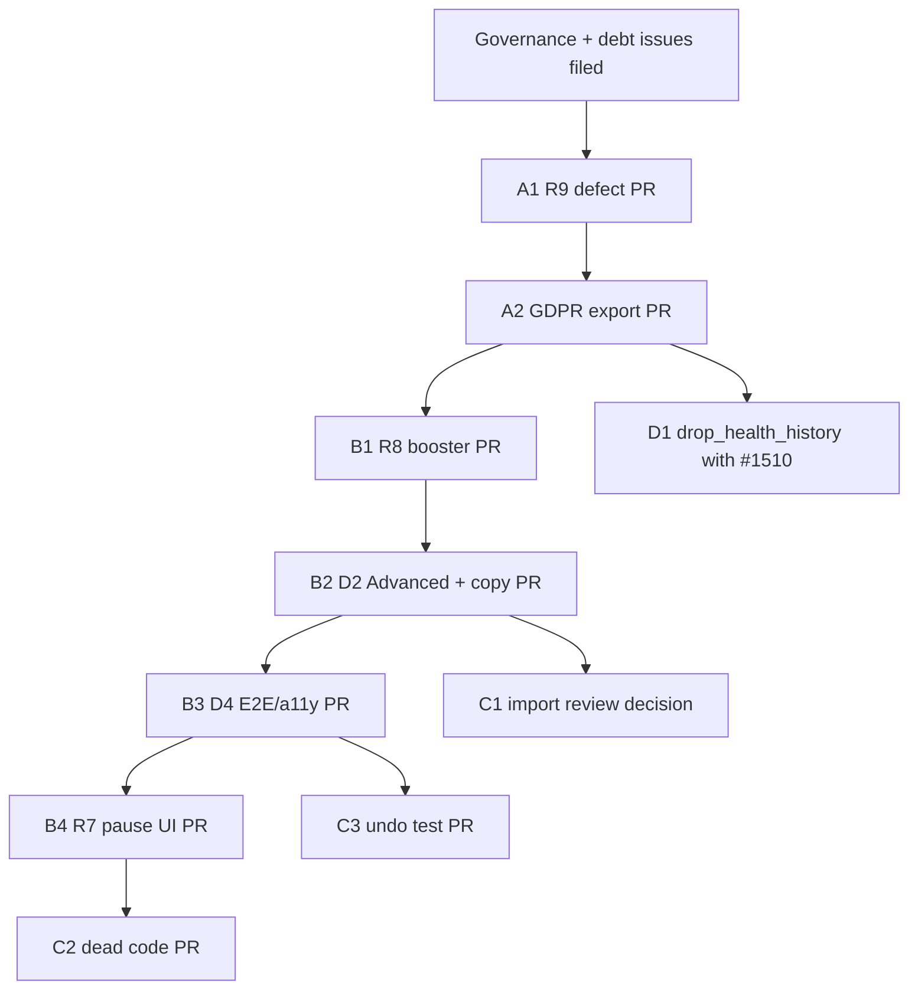

# CARE requirements gap close — follow-up plan

## Metadata

| Field | Value |
|-------|-------|
| **plan_id** | `care-requirements-gap-close-c1a7` |
| **plan_kind** | `follow-up` (post–roadmap; does not reopen `care-next-occurrence-c1a7`) |
| **parent** | `.agents/plans/care-next-occurrence-c1a7.md` (slot **5b closed**; R1–R12 + §18 **not** complete) |
| **programme_ref** | `docs/agent-efficiency/parallel-programmes.md` |
| **base_branch** | `main` |
| **default_merge_mode** | `auto` |
| **control_issue** | *TBD — open when execution starts* |
| **approved_at** | *pending owner* |
| **author** | Owner + agent review synthesis (2026-10-04) |

## Decision record (owner, 2026-10-04)

| Question | Answer |
|----------|--------|
| Is parallel-programmes slot **5b** closed? | **Yes** — A–F landed; pre-UAT localhost green on `main`. |
| Are **R1–R12** and **§18** complete? | **No** — partial on R5, R7, R8, R9, R12; EX-3/HX-1 not done; child D form scope largely undelivered. |
| How to treat gaps? | **Defects on `main` now** (R9, GDPR export) · **Small follow-up plan** (R7/R8/D UX + E2E) · **Debt issues** (§18.14, drop table, import review, ops/UAT). |

## Revised requirements scorecard (baseline for this plan)

| Req | Status | Notes for execution |
|-----|--------|---------------------|
| R1, R2, R4 | **Met** | No change. |
| R3 | **Met** | Absence view + postpone command + away rows with occurrence ids. |
| R5 | **Partial — structural** | Server write guard OK. `care_item` detail is in the import cycle despite EX-10/11 “leaf” rationale; needs **edge review or screen split**, not “wait for migration.” |
| R6 | **Met, UX gap** | Defaults + remembered choice work; field lives in frequency section, not Advanced settings (D2). |
| R7 | **Partial** | **Met for absences.** Manual Postpone-until and Resume date picker **have no UI** (empty `{}` to `/postpone` and `/resume`). |
| R8 | **Server only** | `planned_dates` / `planAnotherDateCommand` on server; **no Flutter** booster or “Plan another date.” |
| R9 | **Defect** | Server `completed_on_not_allowed`; form can still offer Plan + Record fields that produce rejected payloads. **Ship first.** |
| R10 | **Met** | Optional copy nit: EN “1 day late” vs R10 wording; FR “en retard” — product call. |
| R11 | **Split** | **Automated:** seeds, localhost shards, BDD gate — met. **Operational:** care tick cron on UAT/prod, prod reset, repair dry-run, live UAT — **unverified** (track under TEST/ops, not blocking this plan’s code phases). |
| R12 | **Partial** | UIR-13, UIR-15, UIR-21 not delivered (Advanced settings, booster helper, Care Item hero). |

## Goals (ordered outcomes)

1. **Stop shipping broken saves** — R9 Plan/Record mutual exclusion in Flutter matches server.
2. **Restore trustworthy export** — GDPR export includes `health_occurrences` (additive); coordinate `health_history` drop with ARCH erasure (#1510).
3. **Deliver deferred child-D product** — booster / Plan another date (R8), pause-until / resume date (R7), Advanced settings + schedule copy (D2, F35), trailing form E2E + a11y (D4).
4. **Honest governance** — parent/child plan records, docs, and §18.14 debt issues; no silent “merged” for partial D.
5. **Architecture honesty** — resolve or document `care_item` import cycle vs EX-10/11; small F2 dead-code cleanup.
6. **Ledger confidence** — one integration test for per-occurrence undo vs `schedule/undo` (no route deletion).

## Non-goals (this plan)

- Calendar projection (D-CIE-033) — debt only.
- Full deletion of `health_tracking` or instant cycle-free graph — separate ARCH G / PEOPLE work.
- Fixing UAT live E2E migrate failure — TEST/ops triage (may reference #1470 lineage).
- Re-opening control issue #1482 or un-merging 5b.

---

## Work streams

### Stream A — Defects on `main` (immediate)

#### A1 — R9 Plan/Record exclusivity (P0)

**Intent:** One visible mode; payload never sends `completed_on` in Plan mode; switching modes clears incompatible fields; client validation mirrors `scheduleValidation.js`.

**Acceptance:**

- Create/edit care item in Plan mode cannot submit with `completed_on`.
- Record mode behaviour unchanged where server allows.
- Widget or integration test covering mode switch Record → Plan clears completed date.
- Docs: `care-item-evolution.md` Plan/Record section matches behaviour.

**Risk:** Low. **Atomic PR:** yes (single verifiable outcome).

#### A2 — GDPR export occurrences (P0)

**Intent:** Add occurrence completion history to export (wire fields aligned with `GET /:id/history` occurrence reader). **Do not** drop `health_history` in this PR.

**Acceptance:**

- Export includes per-pet or per-entry occurrence data sufficient for user data portability (define minimum field set from existing history API).
- Tests on `gdprUserExport` (mock DB).
- ARCH (#1446) tagged as **reviewer**, not blocker; short comment on #1446 closing the EX-3 export half.

**Risk:** Low additive. **Atomic PR:** yes.

---

### Stream B — Follow-up plan phases (product gaps)

Sequence follows RV-7 / owner agreement: **R9 (A1) → R8 → D2/copy → D4 E2E/a11y → R7 UI**.

#### B1 — R8 Booster and “Plan another date” (P1)

**Intent:** Flutter sends `planned_dates` (or dedicated command UI) for vaccination-style irregular care; surfaces “Plan another date” where spec §5 / R8 require (vaccine path obvious).

**Acceptance:**

- At least one happy path: plan booster date then yearly recurrence resumes per server tests (`careOccurrences.afterDone`, seeds).
- API client + form or occurrence-adjacent entry point wired to `planAnotherDateCommand` or CRUD `planned_dates`.
- BDD: extend existing `care_schedules` / vaccination scenario **or** new `@P1` row — not orphan titles.
- English copy; FR in same PR or debt if l10n batch is large.

**Dependencies:** A1 merged (form touch same files).

**Atomic PR:** prefer **one** PR (R8); split only if form diff exceeds review budget.

#### B2 — D2 Advanced settings + schedule copy (P1)

**Intent:** Collapsed Advanced settings (spec §3 table): schedule type labels (Fixed schedule / After it's done), “If done after the due date,” provider/docs fields as scoped in child D; fix **F35** `recurrenceAnchorTitle` collision (“Next due date” vs schedule-type anchor).

**Acceptance:**

- Advanced section present on create/edit with one-line summary when collapsed.
- Late choice moves under Advanced (R6 placement).
- ARB/EN labels match D-CSM / UIR-7; `recurrenceAnchorTitle` disambiguated.
- `flutter analyze` + affected widget tests.

**Dependencies:** B1 optional overlap — if same files, stack B1 then B2 or combine with clear checklist.

#### B3 — D4 Form E2E + a11y (P2, trailing gate)

**Intent:** Ship disposition from parent §11: `care_item_form.feature` (or agreed subset), `care.item.form.spec.ts`, extend `care.a11y.spec.ts` for form surfaces.

**Acceptance:**

- BDD gate: no new orphan titles; F6-style orphan report clean for new specs.
- Shard assignment via `node e2e/scripts/shard-files.mjs --summary`.
- Pre-UAT shard list documented in PR body.

**Dependencies:** B1 + B2 behaviour stable.

#### B4 — R7 Pause-until and Resume date UI (P2)

**Intent:** Postpone sheet with optional end date (“pause until”); resume suggests default date per spec §3; same postpone primitive as absences (server already unified).

**Acceptance:**

- Pause sends structured body (not `{}` only) when user sets until-date.
- Resume flow offers date defaulting per D-CSM pause rules.
- E2E or integration test for pause → resume on a scheduled item.

**Dependencies:** May share sheets with B2 — schedule after B2 if UX conflicts.

---

### Stream C — Architecture and cleanup (parallel or after B1)

#### C1 — `care_item` import edge review (P1 governance)

**Intent:** Reconcile EX-10/11 with reality: detail screen inside `care_item` with cross-feature imports and cycle in `check_feature_imports`.

**Options (pick one in phase kickoff):**

1. **Split:** move detail composition to `pet_profile` / `experience` shell; `care_item` keeps leaf domain + presentation primitives.
2. **Re-baseline:** accept cycle with documented exceptions + tighten gate to prevent growth.
3. **Incremental:** extract ports (ARCH G-aligned) — larger; only if owner chooses.

**Acceptance:** Written decision on control issue; either PR reducing cycle or updated baseline JSON + architecture note.

#### C2 — F2 dead-code cleanup (P3)

**Intent:** Remove provably unreachable/dead artifacts identified in review.

| Item | Action |
|------|--------|
| `pet_care_preview_optimistic.dart` | Delete if zero importers |
| `DueEventsSection` + `pet_list_screen` import | Delete or wire — prove unreachable vs F40 |

**Acceptance:** `flutter analyze`; no test references broken; file-size gate OK.

#### C3 — Undo mechanism consistency (P2)

**Intent:** **Do not** remove per-occurrence `/undo` (away-plan, reschedule, completion feedback depend on it). Add **one** integration or E2E test documenting interaction with `schedule/undo` after multi-step commands.

**Acceptance:** Test name + comment in `care-schedule-management.md` or occurrence doc § undo.

#### C4 — EX-11 documentation correction (P3)

**Intent:** Plan/docs state device-clock fallbacks remain **for drafts/tests only**; production paths always use server `schedule`.

**Acceptance:** Edit `care-next-occurrence-c1a7.md` EX-11 footnote or MEMORY; no code required unless tests falsely rely on fallback in “production” fixtures.

---

### Stream D — Privacy schema (coordinated, not blocked on #1446)

#### D1 — `drop_health_history` migration (P1, coordinated)

**Intent:** Land `<NNN>_drop_health_history` per EX-2/HX-1 when ARCH account erasure (#1510) inventory confirms occurrences + ledger + resolutions covered.

**Acceptance:**

- Migration up/down/idempotent tests.
- `canonical.sql` + manifest.
- `gdprUserExport` no longer reads `health_history` (after A2 export ships occurrences).
- Erasure path deletes/anonymizes occurrences consistently.
- UAT seed docs updated.

**Dependencies:** A2 merged; #1510 erasure design sign-off.

**Owner:** CARE implements; ARCH reviews erasure matrix.

---

### Stream E — Debt registry (§18.14 + review findings)

File **one GitHub issue per row** (or one umbrella # with checklist — prefer separate for atomic triage). Link all from parent snapshot `debt_issue_refs` and `care-item-form-c1a7` partial note.

| ID | Title (suggested) | Source |
|----|-------------------|--------|
| DEBT-D-CAL | Calendar read-only projection (D-CIE-033) | §18.14 |
| DEBT-D-NOTIF | Notification deep link to occurrence | §18.14 |
| DEBT-D-FAM | Further family completion requirements | §18.14 |
| DEBT-D-RENAME | Rename `health_entries` / `health_occurrences` | §18.14 |
| DEBT-D-FORM | Child D partial: booster, Advanced, form E2E (track until B1–B4 done) | Review + §10 child D |
| DEBT-PRIV-DROP | `health_history` table drop + doc sweep | EX-3, HX-1, Stream D1 |
| DEBT-ARCH-CYCLE | `care_item` import cycle resolution | R5, Stream C1 |
| DEBT-OPS-R11 | UAT live smoke / migrate / care tick verification | R11 operational |
| DEBT-DOC-STALE | Compat routes in care-schedule-management; Plan/Record copy | Review §4 |
| DEBT-1476 | Occurrence detail schedule context (DN-1c/DN-4) | #1476 — **close if #1479 fixed** after repro |

After B-stream merges, close or narrow DEBT-D-FORM.

---

## Governance (before or with Stream A)

1. **Parent snapshot** (`care-next-occurrence-c1a7.snapshot.json`): keep children `merged`; add `status_detail` or linked debt on `care-item-form-c1a7`: `partial — see care-requirements-gap-close-c1a7 / DEBT-D-FORM`.
2. **`care-item-form-c1a7`**: add stub plan or amend parent §10 table — “merged (#1475): late choice + occurrence lines only.”
3. **`parallel-programmes.md` §1**: mark CARE 5b **done**; point to this follow-up for R gaps.
4. **Do not** set `care-next-occurrence-c1a7` autonomy back to `active` without owner approval.

---

## Verification matrix

| Stream | Pre-push | Pre-UAT | Manual |
|--------|----------|---------|--------|
| A1 R9 | `pre-push-changed.sh` + Flutter tests on form | Shards touching health form | Create item Plan/Record |
| A2 GDPR | Jest export tests | — | — |
| B1 R8 | Flutter + server if API touched | Care schedule shard | Booster path on vaccine seed |
| B2 D2 | analyze + widget tests | + form shard if E2E | Advanced collapse |
| B3 D4 | BDD report + `--e2e-shards` | Full matrix if canary touched | a11y scan |
| B4 R7 | lifecycle tests | pause shard | Pause until |
| C1 cycle | `check_feature_imports.js` | — | — |
| D1 drop | migration tests + `pre-push.sh` before main | All shards | export + erasure smoke |

---

## Suggested execution order (single agent / serial PRs)



**Parallelism:** A2 and B1 can run in parallel after A1 if different owners; D1 waits A2 + #1510.

**Merge policy:** Each PR → `main` with `/babysit-uat` (or `/babysit-plus` for docs-only governance PR).

---

## #1476 triage (gate before DEBT-1476)

1. Repro on `main`: occurrence detail → `decideDone` with schedule context DN-1c/DN-4.
2. If fixed in #1479: close #1476 with link; remove from active backlog.
3. If not: fold into B1/B2 or standalone micro-PR.

---

## Open questions for owner (kickoff)

| # | Question |
|---|----------|
| Q1 | Combine B1+B2 in one PR if review size OK? |
| Q2 | C1 preferred option: split detail vs re-baseline cycle? |
| Q3 | FR copy for R10 “late” vs “overdue” in `recurrenceAnchorInfoBody` — change or accept? |
| Q4 | Control issue for this follow-up plan: new `#` or comment thread on #1446? |

---

## Runtime state (initial)

```yaml
autonomy: pending
current_phase: null
last_completed_phase: null
halt_reason: null
next_action: "Owner approve plan; file debt issues; open control issue; start A1"
control_issue: null
parent_plan: care-next-occurrence-c1a7
debt_issue_refs: []
artifact_ref:
  branch: main
  plan_path: .agents/plans/care-requirements-gap-close-c1a7.md
  baseline_main: 965da9ab
```

---

## Related

- Review synthesis: owner chat 2026-10-04 (Cursor review + pushbacks).
- Remedial E2E: #1501 (away plan occurrence navigation).
- Landing 5b: #1499 (`d755564e`).
- Erasure coordination: #1510 (ARCH F).
- GDPR thread: #1446 comment 5970721429.
