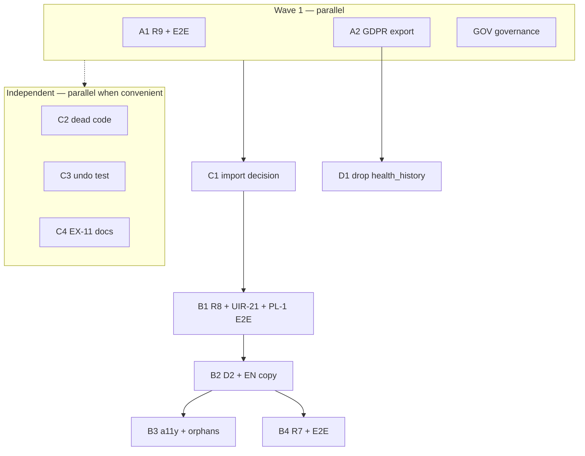

# CARE requirements gap close — follow-up plan

## Metadata

| Field | Value |
|-------|-------|
| **plan_id** | `care-requirements-gap-close-c1a7` |
| **plan_kind** | `follow-up` (post–roadmap; does not reopen `care-next-occurrence-c1a7`) |
| **parent** | `.agents/plans/care-next-occurrence-c1a7.md` (slot **5b closed**; R1–R12 + §18 **not** complete) |
| **programme_ref** | `docs/agent-efficiency/parallel-programmes.md` |
| **base_branch** | `cursor/care-requirements-gap-close-integration-50b4` |
| **default_merge_mode** | `auto` |
| **artifact_branch_policy** | `phase-branch` |
| **control_issue** | *(set in snapshot after `init-control-issue`)* |
| **author** | Owner + agent review synthesis (2026-10-04) |

## Decision record (owner, 2026-10-04)

| Question | Answer |
|----------|--------|
| Is parallel-programmes slot **5b** closed? | **Yes** — A–F landed; pre-UAT localhost green on `main`. |
| Are **R1–R12** and **§18** complete? | **No** — partial on R5, R7, R8, R9, R12; EX-3/HX-1 not done; child D form scope largely undelivered. |
| How to treat gaps? | **Defects on `main` now** (R9, GDPR export) · **Phased follow-up on integration** (R7/R8/D UX) · **Debt issues** (§18.14, ops/UAT). |
| Execution model | **Multi-phase integration branch** → one PR integration → `main` with `/babysit-uat`. |
| Test rule | **F42 / `bdd-journey`:** each B-phase (and A1) lands **its Playwright spec + BDD row in the same PR**; B3 is a11y + orphan cleanup only. |

## Revised requirements scorecard (baseline)

| Req | Status | Notes |
|-----|--------|-------|
| R1, R2, R4 | **Met** | |
| R3 | **Met** | |
| R5 | **Partial — structural** | `care_item` in import cycle; **C1 decides before B1/B2 UI lands.** |
| R6 | **Met, UX gap** | Late choice moves in **B2** (Advanced settings). |
| R7 | **Partial** | **Met for absences.** Manual Postpone-until and Resume date UI in **B4** + E2E in same PR. |
| R8 | **Server only** | **B1** delivers both booster-at-create and Plan another date on existing item + **UIR-21**. |
| R9 | **Defect** | **A1** — includes Plan/Record E2E + edit-with-existing-`completed_on` case. |
| R10 | **Met** | **B2** fixes EN `recurrenceAnchorInfoBody` (“1 day late” nit). **Q3 (FR only):** ~7 keys use “en retard” vs Overdue policy. |
| R11 | **Split** | Automated met; operational (cron, prod reset, repair dry-run, live UAT) — **DEBT-OPS-R11**. |
| R12 | **Partial** | UIR-13 → **B2**; UIR-15 + UIR-21 → **B1**. |

## Goals

1. **R9** — stop illegal Plan/Record saves (A1).
2. **GDPR export** — full CARE user-data tables (A2); **D1** drops `health_history` with same inventory + erasure (#1510).
3. **R8 + UIR-21** — booster + Plan another date + Care Item hero (B1 + PL-1 E2E).
4. **D2** — Advanced settings, schedule copy, F35 (B2).
5. **R7** — pause-until / resume date (B4 + E2E).
6. **C1 before B UI** — import-cycle decision so detail is not moved twice.
7. **Governance + debt** — honest partial-D record (GOV, parallel with A1/A2).

## Non-goals

- Calendar (D-CIE-033), notif deep link, table renames — §18.14 debt only.
- Full `health_tracking` removal — ARCH G / PEOPLE.
- UAT live migrate fix — TEST/ops.
- Reopen #1482.

---

## GDPR / erasure inventory (A2 + D1 shared)

**Tables CARE created that must appear in export (A2) and erasure verification (D1):**

| Table | Scope in export |
|-------|-----------------|
| `health_occurrences` | Rows for user's pets via `health_entries.user_id` |
| `care_schedule_events` | Ledger rows for user's care entries |
| `health_entry_absence_resolutions` | Absence resolution rows for user's entries/absences |

**A2:** Add these to `buildUserDataExport` (and audit metadata counts). Keep `health_history` in export until **D1** removes it.

**D1:** Drop `health_history`; remove from export; confirm `docs/engineering/privacy/erasure-data-map.json` and account erasure cover the three tables above (coordinate #1510 / ARCH F).

---

## Phases (execute-plan snapshot ids)

### A1 — R9 Plan/Record exclusivity

**Intent:** Flutter matches `scheduleValidation.js`; no `completed_on` in Plan mode; mode switch clears incompatible fields.

**Acceptance:**

- Create: Plan mode cannot submit with `completed_on`.
- **Edit:** Saving a **planned** item that already has a stored `completed_on` unchanged must succeed (mirror server `existingCompletedOn` exemption).
- Record mode unchanged where server allows.
- Widget/integration tests for mode switch Record → Plan clears completed date.
- **E2E:** short Plan/Record scenario + spec in **this PR** (defect reached users).
- Docs: `care-item-evolution.md` Plan/Record matches behaviour.

**Parallel with:** A2, GOV. **Does not block on GOV.**

---

### A2 — GDPR export (CARE tables)

**Intent:** Add the **full inventory** above to export. Do not drop `health_history` yet.

**Acceptance:**

- Jest tests on `gdprUserExport` for all three tables.
- Comment on #1446 (EX-3 export half); ARCH as reviewer, not blocker.

**Parallel with:** A1, GOV. **No dependency on A1.**

---

### GOV — Governance + debt filing

**Intent:** Parent partial-D note; `parallel-programmes` §1; file §18.14 debt issues; #1476 repro.

**Acceptance:**

- `care-item-form-c1a7` marked partial + `debt_issue_refs` on parent snapshot.
- Debt issues filed (see Stream E table).
- #1476 closed or confirmed open after repro.

**Parallel with:** A1, A2. **Does not gate A1.**

---

### C1 — `care_item` import decision (before B1)

**Intent:** Choose split vs re-baseline vs defer-to-ARCH-G **before** B1/B2 add Care Item view UI.

**Options:** (1) Split detail shell out of `care_item` (2) Re-baseline cycle + doc (3) Explicit defer with owner sign-off.

**Acceptance:** Decision on control issue; if (1) or (2), land minimal PR before **B1** starts.

**Blocks:** B1, B2.

---

### C2 — F2 dead-code cleanup

**Intent:** `pet_care_preview_optimistic.dart`; `DueEventsSection` / F40 unreachable path.

**Acceptance:** `flutter analyze`; no broken tests.

**Parallel:** Any time after plan start (independent of B-stream).

---

### C3 — Undo ledger test

**Intent:** One integration/E2E test: per-occurrence `/undo` vs `schedule/undo` after multi-step command; **do not delete** per-occurrence route.

**Acceptance:** Test + doc note in `care-schedule-management.md`.

**Parallel:** Independent of B-stream ordering (not gated on B3).

---

### C4 — EX-11 documentation

**Intent:** Device-clock fallbacks = drafts/tests only; production uses server `schedule`.

**Acceptance:** Plan/MEMORY/doc edit only.

---

### B1 — R8 + UIR-15 + UIR-21

**Intent:** Two **distinct** flows (not “or”):

| Flow | Spec anchor | Delivery |
|------|-------------|----------|
| **Booster at create** | UIR-15 | Form sends `planned_dates` (vaccination / irregular create path) |
| **Plan another date** | §5.5 | Care Item view command → `planAnotherDateCommand` / API on **existing** item |
| **Care Item hero** | UIR-21 | Leading occurrence hero: primary action (Mark as done / Review stack), Change date, occurrence menu (Skip, Postpone, Plan another date, Add note); item menu unchanged |

**Acceptance:**

- **PL-1 E2E:** first dose → booster date → yearly recurrence (end-to-end).
- BDD row + Playwright spec in **this PR** (F42).
- English copy; FR debt if batch too large.

**Depends on:** C1 merged (decision implemented if split/re-baseline required).

---

### B2 — D2 Advanced settings + schedule copy

**Intent:** Collapsed Advanced settings; schedule type labels; late choice under Advanced; F35 `recurrenceAnchorTitle`; fix EN **`recurrenceAnchorInfoBody`** (“1 day late” → Overdue-aligned wording).

**Acceptance:**

- Widget tests as needed.
- BDD + spec for **form Advanced / schedule-type** journey in **this PR**.

**Depends on:** B1 merged (or disjoint paths — orchestrator avoids file conflict).

---

### B3 — A11y + orphan mapping cleanup

**Intent:** **Not** a trailing gate for B1/B2 specs (those ship with B1/B2). B3 = extend `care.a11y.spec.ts` for form surfaces touched in B1/B2 + F6 orphan report clean.

**Acceptance:**

- `check_bdd_coverage.js` / orphan report: no new orphan titles from CARE form work.
- a11y scan pass on agreed surfaces.

---

### B4 — R7 Pause-until + Resume date

**Intent:** Postpone sheet with until-date; resume with suggested date; structured POST bodies.

**Acceptance:**

- Pause/resume E2E + BDD row in **this PR** (not after B3 only).

**Depends on:** B2 merged if shared sheets; else after B1.

---

### D1 — `drop_health_history` + export removal

**Intent:** Migration drops table; down recreates **empty** table; `canonical.sql` + manifest regenerated; export drops `health_history`; erasure map aligned with A2 inventory.

**Acceptance:**

- Migration up/down/idempotent tests.
- `gdprUserExport` no longer queries `health_history`.
- Erasure tests cover `health_occurrences`, `care_schedule_events`, `health_entry_absence_resolutions` with #1510 owners.
- **Not** “UAT seed docs” (seeds never used `health_history`).

**Depends on:** A2 merged; #1510 erasure sign-off.

---

## Stream E — Debt registry (GOV phase files these)

| ID | Title | Issue |
|----|-------|-------|
| DEBT-D-CAL | Calendar (D-CIE-033) | [#1539](https://github.com/KanopeeKa/AgathaCheck/issues/1539) |
| DEBT-D-NOTIF | Notification deep link | [#1540](https://github.com/KanopeeKa/AgathaCheck/issues/1540) |
| DEBT-D-FAM | Family completion requirements | [#1541](https://github.com/KanopeeKa/AgathaCheck/issues/1541) |
| DEBT-D-RENAME | Table renames | [#1542](https://github.com/KanopeeKa/AgathaCheck/issues/1542) |
| DEBT-D-FORM | Close when B1–B4 done | [#1543](https://github.com/KanopeeKa/AgathaCheck/issues/1543) |
| DEBT-PRIV-DROP | Track until D1 merged | [#1544](https://github.com/KanopeeKa/AgathaCheck/issues/1544) |
| DEBT-ARCH-CYCLE | Until C1 resolved | [#1545](https://github.com/KanopeeKa/AgathaCheck/issues/1545) |
| DEBT-OPS-R11 | UAT live / cron / reset | [#1546](https://github.com/KanopeeKa/AgathaCheck/issues/1546) |
| DEBT-DOC-STALE | Stale compat-route docs | [#1547](https://github.com/KanopeeKa/AgathaCheck/issues/1547) |
| DEBT-1476 | Occurrence detail decideDone context | [#1476](https://github.com/KanopeeKa/AgathaCheck/issues/1476) (open after GOV repro) |

---

## Execution order



**Notes:**

- A1 and A2 have **no** dependency on each other; GOV does **not** block A1.
- C1 **must** complete before B1.
- C2/C3/C4 may run in parallel with wave 1 or each other.
- D1 waits A2 + #1510 coordination.
- After all phases merge to **integration**, one PR → `main` + `/babysit-uat`.

---

## Verification matrix

| Phase | Pre-push | E2E in same PR |
|-------|----------|----------------|
| A1 | Flutter tests + changed pre-push | Plan/Record spec |
| A2 | Jest export | — |
| B1 | analyze + BDD gate | PL-1 booster journey |
| B2 | analyze + BDD gate | Advanced / schedule-type |
| B3 | a11y + orphan script | — |
| B4 | lifecycle + BDD gate | Pause/resume |
| D1 | migration tests + `pre-push.sh` before main merge | optional smoke |

---

## Open questions

| # | Question |
|---|----------|
| Q1 | Combine B1+B2 if review size OK? (Default: separate phases.) |
| Q2 | C1 option — owner preference if worker cannot decide? |
| Q3 | **French only:** align ~7 “en retard” keys with Overdue policy, or accept? (EN nit closed in B2.) |

---

## Runtime state

```yaml
autonomy: active
current_phase: C3
last_completed_phase: C2
halt_reason: null
next_action: "continue phase C3 on branch cursor/care-gap-c3-undo-50b4"
artifact_ref:
  branch: cursor/care-gap-c3-undo-50b4
  plan_path: .agents/plans/care-requirements-gap-close-c1a7.md
  plan_commit: 43099a27a55e06bc1e9d99a79310ebae0901de58
  snapshot_path: .agents/plans/care-requirements-gap-close-c1a7.snapshot.json
  snapshot_commit: 43099a27a55e06bc1e9d99a79310ebae0901de58
open_prs: ["https://github.com/KanopeeKa/AgathaCheck/pull/1559"]
merge_commits: {}
debt_issue_refs: [1539,1540,1541,1542,1543,1544,1545,1546,1547,1476]
```

---

## Related

- Parent landing #1499 · Remedial #1501 · Erasure #1510 · GDPR thread #1446
- Review amendments: owner chat 2026-10-04 (10 items)
