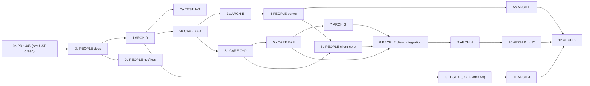

# Parallel programmes — landing order and coordination

**As of 2026-09-30 (`main` @ `a436175f`).** Four multi-phase programmes are in flight. Land **one commit at a time** and wait for pre-UAT green on that SHA before the next merge (mid-run merges waste the in-flight pre-UAT run). Their `allowed_paths` overlap on the same files. This page sets **which programme owns which area when**, the **order in which they land on `main`**, and the **rebase rules** that keep everyone's work from being redone. Every programme's plan must link here and follow §4–§6.

**Slots 0a–0c closed (2026-09-30):** slot **0c** closed when pre-UAT passed on `3ca7bd4` ([#1464](https://github.com/KanopeeKa/AgathaCheck/pull/1464), [run 36776956776](https://github.com/KanopeeKa/AgathaCheck/actions/runs/36776956776); includes server B2 via [#1462](https://github.com/KanopeeKa/AgathaCheck/pull/1462) @ `985f2ca`). Slot **0b** on `eee5cb1b` ([#1454](https://github.com/KanopeeKa/AgathaCheck/pull/1454)). Slot **0a** on `238ca5f8` via [#1456](https://github.com/KanopeeKa/AgathaCheck/pull/1456) and [#1458](https://github.com/KanopeeKa/AgathaCheck/pull/1458). **Next People landing:** slot **4** (`people-server-7f3b`) after CARE A+B (2b) and ARCH E (3a) are on `main`. **Out-of-order:** [#1455](https://github.com/KanopeeKa/AgathaCheck/pull/1455) (`e32fff71`, TEST 1a / shard manifest) merged before 0b; treat as an early partial of slot **2a**, not as slot 1 (ARCH D).

Related: [autonomous-pr-policy.md](./autonomous-pr-policy.md) · [execute-plan-schema.md](./execute-plan-schema.md) · [atomic-pr-policy.md](./atomic-pr-policy.md) · stale-plan closure ledger: [.agents/plans/README.md](../../.agents/plans/README.md) § Closed stale plans.

---

## 1. Programmes

| Code | Plan | Control / PR | Work branch | Scope | State (2026-09-30) |
|---|---|---|---|---|---|
| **CARE** | `care-next-occurrence-c1a7` (roadmap, children A–F) | draft PR #1448 | `claude/eager-edison-mf34j6` | Care occurrence engine (migration `083_care_occurrence_model`, data reset, reseed), agenda, form, absences, Care Item module (server + Flutter), care E2E programme | Child A committed; child B (engine) in progress |
| **ARCH** | `active-codebase-completion-e41f` (roadmap, children D–K) | #1446 (roadmap), #1447 (D) | `cursor/active-codebase-d-integration-e41f` (one integration branch per child) | Guardrails, transactions and cleanup jobs, account erasure, client authority, ports and transport, public APIs, acyclic graph, standards | Approved; child D starting — **rebase onto `main` after #1455** (CI workflows) before D.2/D.3 edits |
| **TEST** | `test-health-ci-5f3a` (7 phases) | #1449 | `claude/relaxed-einstein-jqecfg` | Flutter shards, CI speed, pre-merge E2E, KPI and coverage docs, BDD hygiene, WAF-proof UAT smoke, security and perf tests | **#1455** (1a), **#1463** (1b) landed early; **#1468** (phase 4 KPI) landed out of order. Remaining slice **2a** (phases 2–3) still waits slot **1** (ARCH D). Do not duplicate ARCH D.3 coverage doc edits in flight PRs. |
| **PEOPLE** | `people-domain-refactor-7f3b` (roadmap, 4 children) | [#1460](https://github.com/KanopeeKa/AgathaCheck/issues/1460) | per-child integration branches (see roadmap) | Hotfixes, server, client core, client integration (target doc on `main`) | Slot **0c** done; roadmap **halted** (`human_pause`) until CARE **2b** + ARCH **3a** on `main` and fresh `approve-autonomous` before `people-server-7f3b` |

---

## 2. Why serialise

1. **The same files are in several plans.** Examples at the time of writing:

   | File or area | CARE | ARCH | TEST | PEOPLE |
   |---|---|---|---|---|
   | `server/lib/care/**`, completion and occurrence routes | B, F | E (weight in completion transaction), H | 7 (IDOR tests) | server s2 (provider rules) |
   | `server/routes/careContext/plannedAbsencesRouter.js` | E | E, H | — | server s1 (carer contact writes via `lib/people`, no route change) |
   | `server/routes/pets/peopleRelationshipsRouter.js`, `pets/coreRouter.js` | — | E, H | — | server s3 |
   | `server/routes/sharing/**` (invites) | — | E (invite replay, D22), H | — | server s6 |
   | `flutter_app/lib/features/health_tracking/presentation/**` | C, D, F | G, H | — | client-integration i1 (provider field) |
   | `flutter_app/lib/features/pet_care/context/**` | E | G (one widget) | — | client-integration i1 (carer picker, handover) |
   | `pet_profile/.../pet_detail_screen.dart` and pet-profile sections | C (agenda) | G, I2 (move to `experience`) | — | client-integration i1, i2 |
   | `.github/workflows/_reusable-test.yml`, coverage config, 70% threshold docs | — | D.2, D.3 (additive governance steps), J | 2, 4 | — |
   | `e2e/scripts/shard-files.mjs`, `e2e/playwright/support/api.ts`, canary tags | E2E programme | F, G | 1, 3, 5 | client-core c8, client-integration i4 |
   | `db/migrations/*`, `db/schema/**` | 083 | E, F (3 tables) | 7 (canonical check) | 4 tables |

2. **Integration branches get no CI.** `ci.yml` runs `pull_request` only for PRs into `main`. Phase PRs into an integration branch are gated only by the agent's local `./scripts/pre-push.sh`, which doesn't run Playwright. So conflicts and E2E breakage stay invisible until the final PR to `main`. That is how the ~18 `fix(e2e)` PRs after the last two People plans happened, including #1442–#1444.
3. **CARE merges once at the end.** A single long-lived branch that merges after six children would force every other programme either to wait weeks or to rebase over one very large change.

---

## 3. Area ownership

An **owner** may change files in an area; everyone else waits until the owner's slice has **landed on `main`**, then rebases. A non-owner that needs a change in an owned area files it as a requirement on the owner's control issue or PR. It doesn't edit the files.

| Area (paths) | Owner, in order | Released when |
|---|---|---|
| Care engine: `server/lib/care/**`, `server/routes/healthEntries/**`, occurrence routes, care seeds | CARE (A+B) → ARCH E → PEOPLE server s2 → ARCH H | each slice lands |
| Absences: `server/routes/careContext/**`, `flutter_app/lib/features/pet_care/context/**` | CARE (E) → PEOPLE client-integration i1 → ARCH H | CARE E+F lands |
| Care UI: `flutter_app/lib/features/health_tracking/presentation/**` | CARE (C, D, F) → ARCH G → PEOPLE client-integration i1 → ARCH H | CARE C+D, then E+F land |
| People server: `server/lib/people/**`, `server/routes/people/**`, `server/routes/pets/peopleRelationshipsRouter.js`, `server/lib/households/**`, `server/routes/households/**` | PEOPLE server (`people-server-7f3b`) | PEOPLE server lands |
| Pets core and transactions: `server/routes/pets/coreRouter.js`, `pets/shared.js`, `server/lib/db/**` | ARCH E → PEOPLE server s3 (vet_id adapter only) | ARCH E lands |
| Sharing invites: `server/routes/sharing/**`, `server/services/sharing/**` | ARCH E (E.4) → PEOPLE server s6 | ARCH E lands |
| Pet profile composition: `pet_profile/presentation/screens/**`, pet-profile sections | CARE C → ARCH G → PEOPLE client-integration i1/i2 → ARCH I2 | each slice lands |
| People client: `flutter_app/lib/features/people/**` | PEOPLE client-core, then client-integration | each PEOPLE client landing |
| CI and coverage: `.github/workflows/**`, coverage config, threshold docs | TEST (1–3), with one exception: ARCH D.2/D.3 may **add** governance steps to `_reusable-test.yml` (additions only; nothing removed, reordered or weakened). Then TEST (4) → ARCH J | TEST slice 1 lands |
| Shared E2E infrastructure: `e2e/scripts/shard-files.mjs`, `e2e/playwright/support/api.ts`, smoke/canary tags, `scripts/bdd-priority-tag-map.json` | TEST (1, 3) → CARE (E2E programme) → TEST (5) → PEOPLE c8 / i4 → ARCH K | each slice lands; others append only |
| Shared docs: `docs/architecture/api-reference.md`, `openapi/pet-care-critical.json`, `docs/design/terminology.md`, `.agents/memory/MEMORY.md` | everyone | textual merges; update in the same PR as the code |

---

## 4. Landing order

Landings into `main` happen **one at a time**. Each is followed by pre-UAT E2E green on its merge SHA (`/babysit-uat`) before the next one lands. Items marked **(disjoint)** may swap: whichever is green first lands first. Development may start earlier on each programme's own branch, as long as it respects §3.

| # | Landing on `main` | Must already be on `main` | Develops in parallel with |
|---|---|---|---|
| 0a | **Done — PR #1445** (`f04e19a`). Slot closed when pre-UAT passed on **`238ca5f8`** ([#1456](https://github.com/KanopeeKa/AgathaCheck/pull/1456), [#1458](https://github.com/KanopeeKa/AgathaCheck/pull/1458)) | — | — |
| 0b | **Done — PEOPLE docs PR #1454** (`eee5cb1b`): roadmap, four child plans, this page, stale-plan closure. Pre-UAT green [run 36766914323](https://github.com/KanopeeKa/AgathaCheck/actions/runs/36766914323) on `eee5cb1b` | 0a closed | — |
| 0c | **Done — PEOPLE hotfixes** `people-hotfixes-7f3b` ([#1464](https://github.com/KanopeeKa/AgathaCheck/pull/1464) @ `3ca7bd4`, [#1462](https://github.com/KanopeeKa/AgathaCheck/pull/1462) @ `985f2ca`) | 0b | ARCH D |
| 1 | **ARCH D** (guardrails: baseline, feature-import gate, D7 report, D.2/D.3 additive governance steps in `_reusable-test.yml`, D.3 coverage docs) | 0b | CARE B, TEST 1–3 |
| 2a | **TEST slice 1** (phases 1–3: Flutter shards, CI speed, pre-merge E2E, CI for integration PRs) (disjoint with 2b). **Partial early landing:** [#1455](https://github.com/KanopeeKa/AgathaCheck/pull/1455) (`e32fff71`, TEST 1a manifest) merged before 0b; remaining 2a work still waits for slot **1** (ARCH D) | 1 | CARE B |
| 2b | **CARE A+B** (canonical spec, occurrence engine, migration 083, reseed) (disjoint with 2a) | 1 | TEST 1–3, ARCH E prep |
| 3a | **ARCH E** (transactions, cleanup jobs, pet delete, invite replay, weight-in-completion) (disjoint with 3b) | 2b | CARE C+D, PEOPLE server |
| 3b | **CARE C+D** (agenda, row, form, Care Item view) (disjoint with 3a) | 2b | ARCH E, PEOPLE server |
| 4 | **PEOPLE server** (`people-server-7f3b`, s1–s7) | 3a | CARE E+F, PEOPLE client core |
| 5a | **ARCH F** (account erasure; inventory includes People tables) (disjoint with 5b) | 3a, 4 | CARE E+F |
| 5b | **CARE E+F** (absences on real occurrences, Care Item module, care E2E programme) (disjoint with 5a, 5c) | 3b | ARCH F, PEOPLE client core |
| 5c | **PEOPLE client core** (`people-client-core-7f3b`: typed core, picker, hub, detail, edit, add, households UI, E2E; People-owned client files only) (disjoint with 5a, 5b) | 4, 3b | CARE E+F, ARCH F |
| 6 | **TEST slice 2** (phases 4, 6, 7). Phase 5 (BDD hygiene) rides here only if CARE's BDD disposition has landed (5b); otherwise it lands after 5b | 1 (and 5b for phase 5) | ARCH G |
| 7 | **ARCH G** (client authority; Package 8 re-baselined against CARE F's Care Item module) | 5b | PEOPLE client |
| 8 | **PEOPLE client integration** (`people-client-integration-7f3b`: consumers, People around {pet}, legacy deletion, E2E) | 5c, 5b, 7 | ARCH H prep |
| 9 | **ARCH H** (ports and transport; converts the new People and Care data layers once) | 8 | ARCH J |
| 10 | **ARCH I1 → I2** (public entrypoints, then acyclic graph: pet-profile surfaces move to `experience`) | 9 | ARCH J |
| 11 | **ARCH J** (standards; builds on TEST's CI and KPI generator) | 6 | I1, I2 |
| 12 | **ARCH K** (final acceptance) | all | — |



**Why this order:**

- **Clear the red first (resolved 2026-09-30).** Vet/People shard-9 failures were fixed on `main` via #1445 → #1456 → #1458; pre-UAT is green on `eee5cb1b`. New landings follow §4 from slot **0c** onward.
- **Guardrails first.** ARCH D's feature-import gate should exist before new feature code lands, so no programme adds edges it later has to remove.
- **Signal next.** TEST slice 1 gives every later landing faster CI and CI on integration PRs.
- **The biggest behavioural change lands early and in slices.** CARE B, C+D and E+F land separately, so dependants rebase over small changes.
- **Infrastructure before its users.** ARCH E's transaction and cleanup helpers and its invite semantics land before the PEOPLE server writes new transactional code and invite links. ARCH F erasure lands after PEOPLE adds new personal-data tables.
- **Structural moves last.** ARCH H and I1/I2 move files across features; they run after the feature programmes stop moving those files.

---

## 5. Rules for every programme

1. **One landing at a time.** Before opening an integration → `main` PR, check that no other programme's `main` PR is open. If one is, wait for its pre-UAT green (or its close). The order in §4 decides ties; swaps are allowed only between items marked disjoint.
2. **Landing broadcast.** After each landing, post on **every open programme control issue or PR**:
   - `Landed: <programme/slice> @ <merge sha>`;
   - the areas touched (§3 names);
   - any migrations added.
3. **Rebase on every landing.** Each programme rebases its integration branch on `main` (or merges `main` in, per its merge policy):
   - at the start of the next phase after a broadcast;
   - at least daily for long-lived branches;
   - immediately before its own `main` PR.

   After the rebase: full `./scripts/pre-push.sh`, plus the pre-UAT shards for the areas it touches, before the next phase PR.
4. **Stay in your area.** Don't edit files in an area another in-flight programme owns (§3). File the need as a requirement on the owner instead.
5. **Migrations by name, numbered at landing.** Plans reference migrations by name (`db/migrations/*_<name>.sql`). The number is the next free one on `main` when the integration → `main` PR is opened; renumber on rebase if taken. Update `db/schema/migration-manifest.json` and the canonical schema in the same PR. CARE keeps `083` because it lands first among the migration-bearing slices.
6. **Shared E2E files are append-only outside their owner's window.** `shard-files.mjs`, `support/api.ts`, smoke tags and the BDD priority map change in one programme's landing at a time. Others add entries; they don't restructure.
7. **Contracts travel with code.** `api-reference.md` and `openapi/pet-care-critical.json` are updated in the same PR as the route change. `node scripts/validate_openapi.js` must be green.
8. **No cross-branch merges.** Integration branches never merge each other. Work reaches another programme only through `main`.
9. **Areas touched → shards run.** Before each phase PR and each `main` PR, run `./scripts/pre-push-changed.sh --e2e-shards <n,…>` for the Pre-UAT shards covering the areas touched. Shards are **duration-balanced** (LPT on `e2e/scripts/spec-durations.json`); indices **change when specs are added or timings shift** — always resolve with `node e2e/scripts/shard-files.mjs --summary` (do not rely on stale index→area notes). As of TEST 1b (2026-09-30): 1 ≈ pet profiles, 2 ≈ health tracking, 3 ≈ People hub + notifications + care absence, 4 ≈ Away detail + GDPR + help, 5 ≈ auth + guardian dashboard, 6 ≈ Away planning + timeline + vet, 7 ≈ away planning hub + pet detail + weight, 8 ≈ account + care suggestion + experience nav, 9 ≈ signup + guardian nav/onboarding + sharing. E2E-only PRs also get **affected localhost specs** via `ci-e2e-affected` (see `docs/pipelines/ci-cd-gates.md`); server-only PRs stay short (no affected legs).
10. **Close properly.** At the end: `complete-plan`, close the control issue, and update the runtime block. A plan whose window expires unfinished is marked `revoked` with its unfinished phases listed (see the ledger), not left `active`.

---

## 6. Changes each programme needs

Each list below is the delta against that programme's current plan. It is ready to paste into the programme's session or control issue.

### CARE — `care-next-occurrence-c1a7`

1. **Land per child instead of once at the end:** A+B as soon as B is green, then C+D, then E+F. Each goes through its own integration → `main` PR with `/babysit-uat`. Keep `claude/eager-edison-mf34j6` as the integration line and rebase it after each landing.
2. Keep migration `083_care_occurrence_model` (first migration in the queue). If anything lands a migration before it, renumber on rebase (§5.5).
3. In child B's completion commands, record the **provider snapshot from the contact attached to the care item without filtering by the completer's own directory**. This is PEOPLE invariant I12; today a co-parent or carer completion silently drops the provider (`server/lib/care/providerUsed.js:47`). PEOPLE `people-server-7f3b` s2 adds the People-façade validation and regression tests on top after CARE B lands.
4. Coordinate E2E infrastructure with TEST: the shard manifest restructure and the canary swap either land after TEST slice 1 or are agreed with it on #1449.
5. Child E owns `plannedAbsencesRouter.js` and `features/pet_care/context/**` until it lands; PEOPLE `people-client-integration-7f3b` i1 (carer picker, handover contacts) waits. Child C's pet-profile agenda lands before ARCH G and PEOPLE i2 touch the pet profile.

### ARCH — `active-codebase-completion-e41f`

1. **D** proceeds now. D.3 is the single owner of the coverage-threshold (70%) doc alignment. D.2 and D.3 may **add** governance steps to `.github/workflows/_reusable-test.yml` (additions only: no step removed, reordered or weakened). Every other `.github/workflows/**` edit waits for TEST slice 1, and J builds on that afterwards. Name the added steps on #1449 so TEST phase 2's batching keeps them.
2. **E** starts after CARE B has landed. E's weight-in-completion (D12) and `plannedAbsencesRouter.js` changes apply to CARE's new engine. Remove `server/routes/pets/peopleRelationshipsRouter.js` from E's `allowed_paths` before the E child is bootstrapped (its snapshot is still a draft): PEOPLE `people-server-7f3b` s3 rewrites that router onto the shared transaction helper. E keeps `pets/coreRouter.js`; PEOPLE s3 rebases on it.
3. **F** starts after the PEOPLE server (`people-server-7f3b`) has landed. Its F.1 personal-data inventory must include:
   - `people_contacts`, `people_contact_private_notes`, `people_contact_household_notes`;
   - `household_invites`, `pet_share_invites.contact_id`;
   - contact `linked_user_id` links.
4. **G** starts after CARE E+F have landed. Re-baseline Package 8 (health store, `CareScheduleController`) against CARE F's Care Item module before implementing; expect G.2/G.3 to shrink or close.
5. **H** runs after the PEOPLE client landings, so each new data layer is converted once. Publish H's port/transport convention early (in D or E docs) so PEOPLE `people-client-core-7f3b` c1 can adopt it from the start.
6. **I2** runs after PEOPLE `people-client-integration-7f3b` i2 and CARE F, since it moves pet-profile surfaces those two add.
7. **J** runs after TEST slice 2 and uses TEST's KPI generator rather than a second one.

### TEST — `test-health-ci-5f3a`

1. **Land phases 1–3 first** as one slice (phase 1 is done). TEST owns `.github/workflows/**`, coverage config and the shard manifest structure until then, except ARCH D.2/D.3's additive governance steps in `_reusable-test.yml`: keep them when restructuring CI in phase 2.
2. In phase 2 or 3, **run the short PR CI tier for PRs into integration branches** (`cursor/*-integration-*`, plus the CARE and TEST work branches), not only PRs into `main`. Integration programmes currently land blind (§2.2). Keep the ≤5 min Flutter / ≤8 min UI+E2E budgets.
3. Phase 4: take the 70% domain-gate doc alignment from ARCH D.3 instead of re-doing it; own the KPI generator that ARCH J will reuse.
4. Phase 5 (BDD hygiene): run after CARE's BDD/Playwright disposition (CARE §11.2–11.6) has landed, or exclude care features from it.
5. Phase 7: the migrations-vs-canonical-schema check should enforce §5.5 (numbered at landing, manifest and canonical schema in the same PR). The IDOR matrix gets People and Care routes appended when those programmes land.

### PEOPLE — `people-domain-refactor-7f3b`

Applied in the plan itself (2026-09-29):

- **Four landings** (roadmap `people-domain-refactor-7f3b`): hotfixes right after this page lands (0c); server after ARCH E (4); client core after the server and CARE C+D (5c); client integration after CARE E+F and ARCH G (8).
- **Pre-bootstrap gate:** no overlapping live plan, artifacts on `main`, and an entry gate on every phase that depends on another programme.
- **Scope:** server writer/access (s1) split from usages/provider rules (s2); migrations by name; B6 handed to CARE B; every UI phase resolves E2E shards with `node e2e/scripts/shard-files.mjs --summary` and each client child ships its own journeys; c1 adopts ARCH D20 (entrypoint) and H (transport) conventions.

---

## 7. Landing broadcast template

```markdown
**Landed:** <programme> <slice> @ <merge sha> (PR #<n>)
**Areas:** <§3 area names>
**Migrations:** <names + numbers, or none>
**Action for other programmes:** rebase at next phase start; run shards <n,…> if you touch <areas>.
```

---

## 8. Housekeeping

- **Stale plans:** 42 snapshots that still said `active` on `main` were closed on 2026-09-29, along with 7 open control issues (#1427, #1373, #1094, #1093, #671, #652, #500). The ledger is in [.agents/plans/README.md](../../.agents/plans/README.md) § Closed stale plans.
- **Idle sessions that look superseded** (the owner is archiving them, 2026-09-30):
  - People contact detail/edit flows (`claude/blissful-tesla-zo0yyg`) — superseded by #1440 and PEOPLE.
  - Unified care team concept review (`claude/friendly-hopper-la0gx7`) — spec landed via #1344.
  - Care Item Evolution specification review (`claude/festive-einstein-tgv8yh`) — superseded by CARE.
- **Branches:** the `cursor/preuat-fix-*` and phase branches of completed plans can be deleted once their PRs are closed; none are needed by the programmes above.
