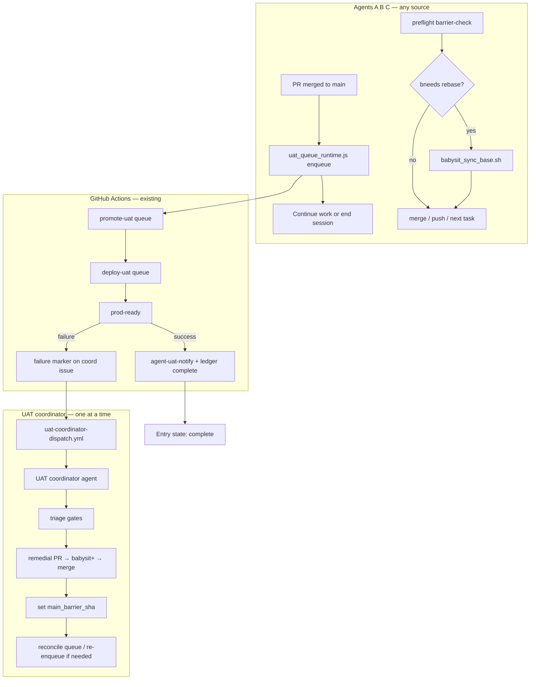

# Cross-agent UAT coordinator — implementation plan

**Status:** Draft for review  
**Owner track:** Agent efficiency + CI/CD reliability  
**Related:** [autonomous-pr-policy.md](./autonomous-pr-policy.md) §Post-merge UAT, [e2e-ci-canary-plan.md](../e2e-ci-canary-plan.md) Phase 5, [promotion-contract.md](../promotion-contract.md), [github-issue-workflow.md](../github-issue-workflow.md)  
**Supersedes (when implemented):** per-merge Task sub-agents in babysit-plus §8; per-plan-only UAT watch ledgers

---

## Summary

Coordinate UAT babysitting **across all agents** (issue agents, execute-plan phases, ad-hoc babysit+) using a **repo-backed queue ledger**, a **main barrier** for rebase coordination, and a **single UAT coordinator agent** dispatched only on failure or stale watcher.

**Success path = zero agent babysitting.** GitHub Actions already queues `promote-uat` and `deploy-uat`; `agent-uat-notify` already posts results to linked issues. This plan adds the missing cross-session coordination layer.

---

## Problem

Today, babysit-plus §8 tells each agent to spawn a **background Task sub-agent** after merge to poll UAT deploy until `prod-ready`. That breaks down when multiple agents work in parallel:

| Gap | Effect |
|-----|--------|
| Task sub-agents are **session-ephemeral** | A new agent session cannot see prior UAT babysitters |
| **No cross-agent ledger** | Each run may re-poll the same deploy run |
| **Duplicate failure triage** | Two agents may open competing remedial PRs |
| **No rebase signal** | When main moves due to a UAT remedial fix, agents with open PRs discover stale bases late |
| **Expensive idle waiting** | Agents blocking in-session on another agent's UAT poll burns Cloud Agent minutes |

UAT **deploy** is already serialized by GitHub Actions (`deploy-uat` concurrency group, `cancel-in-progress: false` per [promotion-contract.md](../promotion-contract.md)). The gap is **agent attention**, not deploy slots.

---

## Design principles

1. **CI queues deploys; ledger queues agent responsibility.**
2. **Passive success** — no agent babysit when `prod-ready` is green.
3. **Active failure only** — one coordinator agent owns triage + remedial loop.
4. **Enqueue and exit** — agents do not block in-session waiting for another agent's UAT.
5. **Main barrier, not hand-written notes** — remedial merge advances `main_barrier_sha`; all agents check before merge/push.
6. **Marker comments on a canonical issue** — same pattern as `<!-- agent-uat-result -->` in `issue-agent-handlers.js`.
7. **Challenge accepted:** strict FIFO agent waiting is rejected in favour of barrier + preflight.

---

## Target architecture



### Responsibility split

| Layer | Owns | Does not own |
|-------|------|--------------|
| `promote-uat.yml` / `deploy-uat.yml` | Tag creation, deploy, E2E gates, `prod-ready` | Agent remedial PRs |
| `agent-uat-notify` | Linked issue status (**In UAT** / failure) | Cross-agent queue |
| **UAT queue ledger** (new) | Enqueue, barrier, watcher lease, entry state | Running E2E tests |
| **UAT coordinator agent** (new) | Failure triage, remedial PR, barrier update | PR CI for unrelated agents |
| **Work agents** (A/B/C) | Enqueue after merge; `barrier-check` before merge | Polling deploy on success path |

---

## Core components

### 1. UAT coordination issue

A single pinned GitHub issue (e.g. `[uat-coordinator] queue`) — not per-plan, not per-PR.

| Property | Value |
|----------|-------|
| Title | `[uat-coordinator] UAT deploy queue` |
| Labels | `uat-coordinator`, `governance` |
| Body | Human summary + link to this doc |
| Machine state | Upserted marker comments (see below) |

**Marker types** (upserted by CLI or Actions):

```html
<!-- uat-queue-state:v1 -->
<!-- uat-queue-entry seq=2 pr=205 merge=abc1234 state=pending -->
<!-- uat-queue-barrier sha=def5678 reason="UAT remedial PR #199" -->
<!-- uat-queue-watcher holder=bc-xyz lease=2026-07-23T14:00:00Z -->
```

The canonical JSON lives inside `<!-- uat-queue-state:v1 -->` for `reconcile` to parse. Per-entry markers are optional denormalized hints for humans.

### 2. Queue ledger schema

```json
{
  "version": 1,
  "updated_at": "2026-07-23T12:00:00Z",
  "main_barrier_sha": "def5678",
  "main_barrier_reason": "UAT remedial PR #199 merged",
  "main_barrier_at": "2026-07-23T11:45:00Z",
  "active_watcher": {
    "holder": "bc-xyz",
    "lease_until": "2026-07-23T14:00:00Z",
    "watching_seq": 2
  },
  "entries": [
    {
      "seq": 1,
      "pr_number": 201,
      "merge_sha": "sha1",
      "uat_tag": "uat-260723-201",
      "enqueued_by": "issue-42",
      "enqueued_at": "2026-07-23T10:00:00Z",
      "state": "complete",
      "result": "success",
      "deploy_run_id": "12345",
      "completed_at": "2026-07-23T10:55:00Z"
    },
    {
      "seq": 2,
      "pr_number": 205,
      "merge_sha": "sha2",
      "uat_tag": "uat-260723-205",
      "enqueued_by": "plan:e2e-ci-canary phase-3",
      "enqueued_at": "2026-07-23T11:00:00Z",
      "state": "failed",
      "result": "failure",
      "deploy_run_id": "12346",
      "gate_summary_ref": "run 12346 prod-ready job"
    }
  ]
}
```

**Entry `state` values:**

| State | Meaning |
|-------|---------|
| `pending` | Enqueued; deploy not started or not yet observed |
| `deploying` | Deploy run identified; in progress |
| `complete` | `prod-ready` green |
| `failed` | `prod-ready` red |
| `remedial` | Coordinator owns fix PR |
| `superseded` | Skipped (e.g. duplicate enqueue for same merge SHA) |

**Dedupe key:** `merge_sha` (one active entry per merge commit).

### 3. CLI — `scripts/uat_queue_runtime.js`

Shared library: `scripts/lib/uat_queue_lib.js` (parse markers, merge state, CAS watcher lease).

| Command | Caller | Purpose |
|---------|--------|---------|
| `enqueue --merge <sha> --pr <n> --ref <context>` | Any agent after merge | Add entry; idempotent on `merge_sha` |
| `reconcile [--issue <n>]` | Session preflight, Actions job | Sync ledger from Actions + marker comments |
| `status [--merge <sha> \| --seq <n>]` | Any | Resolve tag → deploy run → gate table |
| `barrier-check [--branch <name>]` | Before merge/push | `needs_rebase` vs `origin/main` and barrier |
| `acquire-watcher [--issue <n>]` | Coordinator only | CAS lease; exit `2` if held |
| `release-watcher --result <success\|failure>` | Coordinator | Clear lease |
| `set-barrier --sha <sha> --reason <text>` | Coordinator after remedial merge | Advance main barrier |
| `render-state` | Debug | Print current ledger JSON |

**Exit codes:** `0` = ok; `2` = expected wait (watcher held, barrier blocks); `1` = error.

`status` wraps `scripts/ci/assert-uat-gates.sh` output when deploy run is terminal.

### 4. UAT coordinator agent

**Skill:** `.cursor/skills/uat-coordinator/SKILL.md` (new)

**Dispatch:** `.github/workflows/uat-coordinator-dispatch.yml` (new)

| Trigger | Dispatch? |
|---------|-----------|
| `deploy-uat.yml` completed with `prod-ready` failure | Yes |
| `workflow_dispatch` (manual) | Yes |
| Enqueue + pending `failed` + no fresh watcher lease | Yes (via reconcile hook or periodic dispatch) |
| `prod-ready` success | No |

```yaml
concurrency:
  group: uat-coordinator
  cancel-in-progress: false
```

Coordinator workflow:

1. `reconcile` → identify head `failed` or `deploying` entry needing attention
2. `acquire-watcher`
3. If `failed`: triage gate table → remedial PR → babysit+ §0–7 → merge → `set-barrier`
4. If `deploying`: poll until terminal (coordinator may watch one run; success path usually resolved by Actions before coordinator starts)
5. `release-watcher`
6. Comment summary on coordination issue + affected PRs/control issues

**Remedial PR conventions:**

- Branch: `cursor/uat-fix-<pr>-bfaa`
- Body: `Refs #<original-issue>` + link to failed deploy run
- One remedial PR per failure burst when failures share root cause; batched when gate table shows same shard class

### 5. Agent workflow changes

#### After merge (all agents — issue, execute-plan, babysit+)

```bash
node scripts/uat_queue_runtime.js enqueue \
  --merge "$MERGE_SHA" --pr "$PR_NUMBER" --ref "issue-$ISSUE"
# Do NOT spawn Task sub-agent on success path
```

#### Session preflight (before merge, push, or resume)

```bash
node scripts/uat_queue_runtime.js reconcile
node scripts/uat_queue_runtime.js barrier-check --branch "$(git branch --show-current)"
# if needs_rebase:
./scripts/babysit_sync_base.sh --pr <url> --push
```

#### Execute-plan integration

- **Keep** `uat_paused` / `resume-uat` for plan-scoped pause when coordinator blocks a specific plan's next phase.
- **Replace** babysit-plus §8 Task spawn with `enqueue`.
- Coordinator calls `pause` / `resume-uat` on control issue when plan context is known (`--ref plan:<id>`).

---

## Scenario walkthrough (agents A, B, C)

| Step | Agent | Action |
|------|-------|--------|
| 1 | A merges PR #201 | `enqueue`; CI deploy #1 starts; A continues or ends session |
| 2 | B finishes CI, ready to merge | `barrier-check` → clean → merge #205 → `enqueue` |
| 3 | C same | `barrier-check` → merge #210 → `enqueue` |
| 4 | CI | Deploys queue: #201 → #205 → #210 (existing Actions concurrency) |
| 5 | Deploy #201 fails | `agent-uat-notify` + ledger `failed`; dispatch coordinator |
| 6 | Coordinator | Triage → remedial PR #212 → merge → `set-barrier` to new `main` SHA |
| 7 | B resumes (open PR) | Preflight `barrier-check` → `needs_rebase: true` → `babysit_sync_base.sh` |
| 8 | C resumes (open PR) | Same |
| 9 | C already merged before fix | No rebase — merge SHA is immutable; deploy #210 may fail same gate; coordinator handles or marks `superseded` if fix already on main when deploy runs |

**Note:** Agents B and C never waited in-session for A. Barrier + preflight replaces ad-hoc "rebase required" notes.

---

## Phased delivery

### Phase 0 — Design sign-off (this document)

**Exit:** Review approved; coordination issue number chosen; `uat-coordinator` label created.

### Phase 1 — Ledger + CLI (no coordinator yet)

| Deliverable | Detail |
|-------------|--------|
| `scripts/lib/uat_queue_lib.js` | Parse/merge marker state; dedupe; barrier logic |
| `scripts/uat_queue_runtime.js` | CLI commands above |
| `scripts/uat_queue_runtime.test.js` | Unit tests (marker merge, dedupe, barrier-check) |
| Coordination issue | Created manually; number in `scripts/lib/uat_queue_constants.js` |
| Extend `agent-uat-notify` | On success/failure: `reconcile` + update ledger entry state |
| Docs | Label entry in [github-labels.md](./github-labels.md) |

**Policy change (docs only until Phase 2):** babysit-plus §8 → `enqueue` instead of Task spawn.

**Exit:** After merge, `enqueue` works; Actions updates ledger; `barrier-check` returns correct `needs_rebase`; tests green in `./scripts/pre-push-changed.sh`.

**Risk:** Low.

### Phase 2 — Work-agent integration

| Deliverable | Detail |
|-------------|--------|
| Update `.cursor/skills/babysit-plus/SKILL.md` §8 | `enqueue` + remove Task sub-agent |
| Update `.cursor/skills/execute-plan/SKILL.md` preflight | `reconcile` + `barrier-check` |
| Update [autonomous-pr-policy.md](./autonomous-pr-policy.md) §Post-merge UAT | Link this plan |
| Update [github-issue-workflow.md](../github-issue-workflow.md) | Post-merge step mentions enqueue |

**Exit:** Issue agents and execute-plan agents call CLI; no Task sub-agents spawned.

**Risk:** Low — behaviour change is "stop polling on success."

### Phase 3 — UAT coordinator dispatch

| Deliverable | Detail |
|-------------|--------|
| `.github/workflows/uat-coordinator-dispatch.yml` | Failure trigger + `workflow_dispatch` |
| `.cursor/skills/uat-coordinator/SKILL.md` | Coordinator playbook |
| `launch-cursor-agent.js` payload | Sanitized UAT failure context |
| Label `agent-uat-fix` | Eligibility for coordinator dispatch (optional) |

**Exit:** Simulated UAT failure dispatches one coordinator; remedial PR merges; barrier advances; `resume-uat` fires for paused plans.

**Risk:** Medium — 48h autonomy window; infra vs code classification.

### Phase 4 — Hardening (optional)

| Item | Detail |
|------|--------|
| Remedial freeze | While `state: remedial`, hold dequeuing of later entries until barrier clears |
| Stale watcher reclaim | `acquire-watcher` after lease expiry |
| `uat_deploy_runtime.js` alias | Thin wrapper if callers expect deploy-specific name from e2e-ci-canary plan |
| Dashboard comment | Periodic coordination-issue summary table |

**Exit:** No duplicate coordinators in soak test; lease reclaim verified.

---

## PR sequencing

| PR | Phase | Scope | One-sentence outcome |
|----|-------|-------|----------------------|
| A | 1 | `uat_queue_lib.js` + `uat_queue_runtime.js` + tests | Cross-agent UAT queue CLI exists with tests. |
| B | 1 | Extend `agent-uat-notify` + constants + label doc | Actions updates UAT ledger on deploy result. |
| C | 2 | babysit-plus + execute-plan + autonomous-pr-policy docs | Work agents enqueue instead of spawning Task sub-agents. |
| D | 3 | `uat-coordinator-dispatch.yml` + coordinator skill | UAT failure dispatches a single coordinator agent. |
| E | 4 | Freeze + lease hardening | Queue resists duplicate coordinators and stale leases. |

Each PR is independently mergeable; later PRs depend on earlier ones.

---

## Labels and issues

| Label | Purpose |
|-------|---------|
| `uat-coordinator` | Marks the coordination issue |
| `agent-uat-fix` | Optional — triggers coordinator dispatch (Phase 3) |

| Issue | Purpose |
|-------|---------|
| `[uat-coordinator] UAT deploy queue` | Canonical ledger host (pinned) |
| Per-issue / per-plan control issues | Unchanged; receive coordinator comments on failure |

---

## Policy updates (when implemented)

| Document | Change |
|----------|--------|
| `babysit-plus/SKILL.md` §8 | `enqueue` replaces Task sub-agent; coordinator owns failure |
| `execute-plan/SKILL.md` | Preflight: `reconcile` + `barrier-check` |
| `autonomous-pr-policy.md` §Post-merge UAT | Link queue + passive success model |
| `e2e-ci-canary-plan.md` Phase 5 | Point to this plan as canonical |
| `execute-plan-runtime.md` | Note `resume-uat` triggered by coordinator, not Task sub-agent |

---

## Cost model

| Approach | Agent minutes (3 merges, all succeed) | On 1 UAT failure |
|----------|--------------------------------------|------------------|
| Current (3 Task sub-agents polling) | ~135–180 min | Up to 3 agents triage |
| In-session queue (B,C wait for A) | ~90–120 min idle + work | Better; still wasteful |
| **This plan** | **~0 min** (enqueue only) | **~1 coordinator session** |

---

## Success metrics

| Metric | Baseline | Target |
|--------|----------|--------|
| Duplicate UAT poll sessions per merge SHA | Unbounded (per agent session) | ≤ 1 (coordinator only on failure) |
| Competing remedial PRs per UAT failure | Possible | 1 |
| Agent session time blocked on UAT | Up to 60 min | 0 (enqueue + exit) |
| Open PRs rebased before merge after remedial | Ad hoc | 100% via `barrier-check` |
| Success-path agent involvement post-merge | Task sub-agent spawn | `enqueue` only (~seconds) |

---

## Non-goals

- Replacing the 10-shard UAT E2E contract or `prod-ready` gates
- Serializing `deploy-uat` further (already queued)
- Making UAT prod-ready a mandatory execute-plan phase gate (optional `uat_gate: serial` may be a future snapshot field)
- Project board writes from Cloud Agents (unchanged)
- Weakening gates to pass UAT

---

## Risks and mitigations

| Risk | Mitigation |
|------|------------|
| Coordination issue comment races | Canonical state in single `<!-- uat-queue-state:v1 -->` marker; `reconcile` is idempotent; watcher CAS with lease |
| Coordinator session dies mid-remedial | Lease expires; redispatch on `workflow_dispatch` or next failure notify |
| Already-merged PR fails UAT for code merged earlier | Coordinator remedial fix on `main`; later deploys pick up fix automatically if their merge commit includes it |
| Infra blocker (`UAT_AUTO_MIGRATE` off) | Escalate per babysit-plus §9; do not weaken gates |
| Ledger drift from Actions | `reconcile` pulls `gh run list` + existing `agent-uat-notify` markers |

---

## Open questions for review

1. **Coordination issue number** — dedicated new issue vs reusing an existing governance issue?
2. **Remedial freeze** — while coordinator fixes, should later queued deploys be cancelled (`UAT_CANCEL_IN_PROGRESS=true`) or allowed to fail and retry? Default: allow queue (audit evidence); coordinator sets barrier before they run when possible.
3. **Execute-plan `uat_paused`** — keep plan-scoped pause, or rely solely on global barrier? Recommendation: both — barrier for open PRs; `uat_paused` when coordinator blocks next phase commit.
4. **Coordinator payload** — dispatch from failed deploy run only, or also from `workflow_dispatch` on coordination issue? Recommendation: both.

---

## References

- `docs/promotion-contract.md` §Concurrency — UAT deploy queue
- `.github/scripts/issue-agent-handlers.js` — `<!-- agent-uat-result -->` pattern
- `.github/workflows/deploy-uat.yml` — `agent-uat-notify` job
- `.cursor/skills/babysit-plus/SKILL.md` §8 — current post-merge UAT (to be updated)
- `scripts/babysit_sync_base.sh` — rebase helper for barrier response
- `scripts/ci/assert-uat-gates.sh` — gate table for coordinator triage
