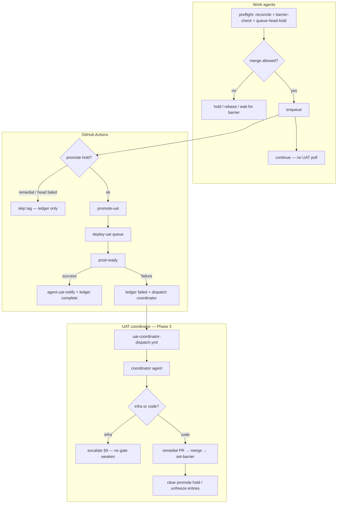

# Cross-agent UAT coordinator — implementation plan

**Status:** Phase 1–2 merged (#281, #307); **Phase 1b bootstrap in progress**; Phase 3 not started  
**Soak:** Jul 23 2026 — 50 deploy runs, 26% success; see [§Jul 23 soak review](#jul-23-soak-review)  
**Owner track:** Agent efficiency + CI/CD reliability  
**Related:** [autonomous-pr-policy.md](./autonomous-pr-policy.md) §Post-merge UAT, [e2e-ci-canary-plan.md](../e2e-ci-canary-plan.md) Phase 5, [promotion-contract.md](../promotion-contract.md), [github-issue-workflow.md](../github-issue-workflow.md)  
**Supersedes (when implemented):** per-merge Task sub-agents in babysit-plus §8; per-plan-only UAT watch ledgers

---

## Summary

Coordinate UAT babysitting **across all agents** (issue agents, execute-plan phases, ad-hoc babysit+) using a **repo-backed queue ledger**, a **main barrier** for rebase coordination, a **single UAT coordinator agent** dispatched on failure, and **optional CI promote/deploy throttling** when the queue is unhealthy.

**Success path = zero agent babysitting.** GitHub Actions queues `promote-uat` and `deploy-uat`; `agent-uat-notify` posts results to linked issues. This plan adds cross-session **agent** coordination and, where needed, **CI back-pressure** so rapid merges do not stack doomed deploys.

---

## Is the UAT coordinator still a good idea?

**Yes — but the original plan solved only half the Jul 23 problem.**

| Problem class | Coordinator helps? | Evidence (Jul 23 soak) |
|---------------|-------------------|------------------------|
| Duplicate agent polling / competing remedial PRs | **Yes** — core value | Task sub-agents were unreliable; #307 replaced with enqueue |
| Cross-session ledger / barrier for rebases | **Yes** — if bootstrapped | Ledger never activated (`UAT_COORDINATION_ISSUE` unset) |
| Single failure owner | **Yes** — Phase 3 | Failures assigned to @KanopeeKa per-issue; no coordinator dispatch |
| **Too many promote/deploy runs** | **No (alone)** | 33 promotes on Jul 23; ledger freeze does not stop `promote-uat` |
| **WAF / infra smoke failures** | **Partially** | Coordinator escalates (§9); does not replace host whitelist |
| **E2E drift on large UI sprints** | **Partially** | Coordinator opens remedial PRs; prevention = integration branch + PR E2E |

**Verdict:** Keep the coordinator. **Revise scope:** treat agent coordination and CI back-pressure as one system. Ledger-only freeze was a **necessary but insufficient** brake — Jul 23 proved agents keep merging when the ledger is inert or barrier-check is optional.

**Do not build:** a coordinator that only updates GitHub issue comments while CI runs 33 full deploy cycles. That burns CI minutes without improving UAT signal.

---

## Problem

Babysit-plus §8 previously told each agent to spawn a **Task sub-agent** after merge to poll UAT until `prod-ready`. That breaks down under parallel agents:

| Gap | Effect |
|-----|--------|
| Task sub-agents are **session-ephemeral** | New sessions cannot see prior babysitters |
| **No cross-agent ledger** | Duplicate polls; no shared failure state |
| **Duplicate failure triage** | Competing remedial PRs for the same gate |
| **No rebase signal** | Stale PR bases after remedial merges |
| **Expensive idle waiting** | Agents block ~45–60 min on UAT poll |

**Additional gap (discovered Jul 23):** even with enqueue-and-exit, **nothing stops the next merge** when:

- Bootstrap is missing (ledger is a no-op)
- Phase 3 coordinator does not exist
- `promote-uat.yml` fires on **every** `main` push regardless of queue health

UAT **deploy** is serialized by GitHub Actions (`deploy-uat` concurrency, `cancel-in-progress: false`). The original plan correctly identified **agent attention** as the primary gap. The soak showed a **secondary gap: promote/deploy volume** when merge rate exceeds UAT capacity.

---

## Design principles

1. **CI queues deploys; ledger queues agent responsibility; promote gate limits volume when unhealthy.**
2. **Passive success** — no agent babysit when `prod-ready` is green.
3. **Active failure only** — one coordinator agent owns triage + remedial loop.
4. **Enqueue and exit** — work agents do not block on another agent's UAT poll.
5. **Main barrier + merge hold** — remedial merge advances `main_barrier_sha`; work agents **must** `barrier-check` before merge; execute-plan adds **soft hold** when head queue entry is `failed`/`remedial` (see [§Review decision 3 revised](#3-execute-plan-on-uat-failure--revised-jul-23)).
6. **Bootstrap is not optional** — code without `UAT_COORDINATION_ISSUE` provides zero coordination.
7. **Marker comments on a canonical issue** — same pattern as `<!-- agent-uat-result -->`.
8. **Infra vs code classification first** — WAF/migration/SSH blockers escalate; do not burn remedial PRs on host config.

---

## Jul 23 soak review

Analysis of the last 50 `deploy-uat.yml` runs (Jul 21 22:33 – Jul 23 22:36 UTC).

### Outcomes

| Result | Count | Notes |
|--------|-------|-------|
| Success | 13 (26%) | Clustered early morning + after CI remedials (#274, #279, #283) |
| Failure | 30 (60%) | Root cause always post-deploy gates, not FTP deploy |
| Cancelled | 7 (14%) | Zero jobs started — queued runs superseded before start |

**Deploy job:** 43/43 success when build succeeded. **Build:** 1 failure (compile error).

### Root failure taxonomy (coordinator triage input)

| Gate | Failures | Dominant error | Coordinator action |
|------|----------|----------------|-------------------|
| HTTP smoke | 8 | o2switch **WAF 503** on auth warmup (11/12 smoke-related) | **Escalate §9** — whitelist GitHub Actions egress; do not code-fix |
| Live `@smoke-uat` E2E | 12 | Stuck on `#/landing` after login (120s timeout) | Often WAF/auth readiness; check smoke first |
| Localhost E2E shard | 9 | Nav v2 / org / notifications locator drift | Remedial PR; batch if same shard class |
| Flutter build | 1 | `colorScheme` compile error | Should have been caught in PR CI |

### What worked vs what failed

| Merge pattern | UAT result |
|---------------|------------|
| Small CI/UAT infra fix (`fix(ci):`, `fix(uat):`) | Usually green |
| E2E alignment in same PR as UI change (#269) | Green |
| Stacked theme/Nav v2 `phase(N/M):` merges | **0/11 green** on first deploy |
| Rapid remedial chains (`fix(uat):` after `fix(uat):`) | Often fails next gate |

### Coordinator implementation state during soak

| Component | State during soak |
|-----------|-------------------|
| Phase 1 code (#281, 13:18 UTC) | Merged |
| Phase 2 skills (#307, 22:35 UTC) | Merged (too late for afternoon sprint) |
| Coordination issue | **Not created** |
| `UAT_COORDINATION_ISSUE` variable | **Unset** (empty in workflow logs) |
| `uat-coordinator-dispatch.yml` | **This PR** — on `deploy-uat` failure + `workflow_dispatch` |
| Ledger enqueue/sync | Always `skipped: true` |

### Key lesson

**Phase 1 shipped as "safe to merge without bootstrap"** — technically true (no-op), but operationally **false**: the afternoon theme sprint ran with **no coordination layer at all**, while agents believed enqueue would help.

---

## Target architecture



### Responsibility split

| Layer | Owns | Does not own |
|-------|------|--------------|
| `promote-uat.yml` | Tag creation (**may hold** when queue unhealthy — Phase 3b) | Agent remedial PRs |
| `deploy-uat.yml` | Deploy, E2E gates, `prod-ready` | Cross-agent triage |
| `agent-uat-notify` | Linked issue status; ledger sync | Dispatching coordinator (Phase 3) |
| **UAT queue ledger** | Enqueue, barrier, watcher lease, entry state | Running E2E tests |
| **UAT coordinator agent** | Failure triage, remedial PR, barrier, infra escalation | PR CI for unrelated agents |
| **Work agents** | Enqueue; preflight gates; respect merge hold | Polling deploy on success path |

### What the coordinator does **not** do

- Replace `prod-ready` gates or reduce shard count
- Fix o2switch WAF without human/host action
- Guarantee UAT green on stacked UI sprint merges (use integration branch)

---

## Core components

### 1. UAT coordination issue

Single pinned issue — not per-plan, not per-PR.

| Property | Value |
|----------|-------|
| Title | `[uat-coordinator] UAT deploy queue` |
| Labels | `uat-coordinator`, `governance` |
| Body | Human summary + link to this doc + bootstrap checklist |
| Machine state | `<!-- uat-queue-state:v1 -->` marker comment |

**Bootstrap (blocking — not a follow-up):**

1. Create and pin the issue.
2. Set repo Actions variable: `UAT_COORDINATION_ISSUE=<n>`.
3. Run smoke verification (see Phase 1b).
4. Post initial empty ledger via `render-state` + first `enqueue` test.

Until step 2 is done, Phase 1 code is **inactive**. PRs that add queue code must not merge without a tracked bootstrap issue or same-PR bootstrap instructions executed by operator within 24h.

### 2. Queue ledger schema

Unchanged from v1 — see prior schema. Add optional field on ledger root:

```json
{
  "promote_hold": false,
  "promote_hold_reason": null,
  "promote_hold_since": null
}
```

Set by coordinator on `failed`/`remedial`; cleared on `set-barrier` or infra resolution.

**Entry states:** `pending` | `deploying` | `complete` | `failed` | `infra_failed` | `remedial` | `frozen` | `superseded`

`infra_failed` (added Jul 24 — see [Review decision 5](#5-infra-only-failures-must-not-freeze-promotion-added-jul-24)) marks a deploy failure where every failed gate classifies `maybe_infra` (WAF/deploy transport) with no code-regression evidence. Unlike `failed`, it does **not** trip `queueHeadHold` — later merges keep promoting/deploying while ops resolves the infra blocker.

**Dedupe key:** `merge_sha`

### 3. CLI — `scripts/uat_queue_runtime.js`

| Command | Caller | Purpose |
|---------|--------|---------|
| `enqueue` | Work agent after merge | Add entry; idempotent |
| `reconcile` | Preflight, Actions | Sync from Actions API |
| `status` | Any | Tag → deploy run → gate table |
| `barrier-check` | Before merge/push | `needs_rebase` vs barrier |
| `queue-head-hold` | Execute-plan preflight | Exit `2` if head entry `failed`/`remedial` |
| `acquire-watcher` / `release-watcher` | Coordinator | CAS lease |
| `set-barrier` | Coordinator after remedial | Advance barrier; unfreeze; clear promote hold |
| `set-promote-hold` / `clear-promote-hold` | Coordinator | Phase 3b CI gate |
| `health-check` | CI / operator | Verify issue + variable + writable marker |

**Exit codes:** `0` ok; `2` expected wait; `1` error.

### 4. UAT coordinator agent (Phase 3)

**Skill:** `.cursor/skills/uat-coordinator/SKILL.md`  
**Dispatch:** `.github/workflows/uat-coordinator-dispatch.yml`

| Trigger | Dispatch? |
|---------|-----------|
| `deploy-uat` `prod-ready` failure | Yes (primary) |
| `workflow_dispatch` on coordinator workflow | Yes (recovery) |
| Stale watcher + head `failed` | Phase 4 |

**Concurrency:** `group: uat-coordinator`, `cancel-in-progress: false`

#### Triage playbook (gate → action)

| Failed gate | First check | Remedial? |
|-------------|-------------|-----------|
| HTTP smoke — WAF body | `signup probe WAF challenge` in logs | **No** — escalate §9 |
| HTTP smoke — Passenger/404 | `uat-post-deploy-smoke.sh` hint | Infra — escalate or cPanel fix |
| Live E2E — `#/landing` stall | HTTP smoke / WAF on same run | Often infra; else auth E2E fix |
| Localhost E2E — single shard | Shard test name + screenshot artifact | Yes — one PR per root cause |
| Localhost E2E — Nav v2 cluster | Multiple shards, same sprint | Batch remedial; consider integration branch stop |
| Flutter build | Compile log | Yes — should be PR CI gap |
| Migrations pending | `migrate_pending_count` | Escalate if `UAT_AUTO_MIGRATE` off |

**Remedial PR conventions:**

- Branch: `cursor/uat-fix-<pr>-2b0b`
- Body: `Refs #<issue>` + failed run URL + gate table
- One remedial PR per failure **burst** when root cause shared

**Coordinator must not:** weaken gates, disable shards, or merge without green PR CI.

### 5. Work-agent workflow

#### After merge

```bash
node scripts/uat_queue_runtime.js enqueue \
  --merge "$MERGE_SHA" --pr "$PR_NUMBER" --ref "issue-$ISSUE" --write
```

#### Session preflight (before merge, push, or resume)

```bash
node scripts/uat_queue_runtime.js health-check || exit 1
node scripts/uat_queue_runtime.js reconcile --write
node scripts/uat_queue_runtime.js barrier-check --branch "$(git branch --show-current)"
node scripts/uat_queue_runtime.js queue-head-hold   # exit 2 → do not merge yet
```

#### Execute-plan

- **Soft hold:** if `queue-head-hold` exits `2`, finish open PR work but **do not merge** until coordinator clears barrier or head entry is `complete`/`superseded`.
- Plan phases may continue in parallel (branches, CI); merge is the throttle.
- Coordinator comments on control issue on failure.

---

## Phased delivery (revised)

### Phase 0 — Design sign-off

**Exit:** This document approved. `uat-coordinator` label exists.

**Status:** Done.

### Phase 1 — Ledger + CLI

| Deliverable | Status |
|-------------|--------|
| `uat_queue_lib.js`, `uat_queue_runtime.js`, tests | **Done** (#281) |
| `issue-agent-handlers.js` enqueue + deploy sync | **Done** |
| Workflows pass `UAT_COORDINATION_ISSUE` | **Done** |
| Coordination issue + repo variable | **Issue #313** (pinned, marker live); **variable pending operator** |

### Phase 1b — Bootstrap + health gate (new — blocking)

| Deliverable | Detail |
|-------------|--------|
| Create coordination issue | **Done** — [#313](https://github.com/KanopeeKa/AgathaCheck/issues/313) |
| Set `UAT_COORDINATION_ISSUE` | **Done** — repo variable `313` |
| `health-check` command | **Done** |
| CI smoke | **Done** — `uat-queue-health.yml` (weekly + dispatch) |
| Bootstrap script + runbook | **This PR** — `scripts/uat_coordinator_bootstrap.js` |
| Verify enqueue on merge | PR #312 backfilled; CI merge handler after variable set |

**Exit:** One test merge produces ledger entry; deploy result updates entry state.

**Risk:** Low. **This should have been Phase 1 exit criteria.**

### Phase 2 — Work-agent integration

| Deliverable | Status |
|-------------|--------|
| babysit-plus §8 enqueue | **Done** (#307) |
| execute-plan preflight docs | **Done** |
| autonomous-pr-policy link | **Done** |
| Agents actually calling `enqueue --write` | **Unverified** — depends on 1b |

**Exit:** No Task sub-agents; enqueue in merge handler logs.

### Phase 3 — Coordinator dispatch + triage skill

| Deliverable | Detail |
|-------------|--------|
| `uat-coordinator-dispatch.yml` | On `deploy-uat` failure + `workflow_dispatch` |
| `.cursor/skills/uat-coordinator/SKILL.md` | Triage playbook (§4 table) |
| `launch-uat-coordinator.js` payload | Sanitized failure context |
| `queue-head-hold` CLI | **Done** — exit `2` when merge should wait |
| `set-promote-hold` / `mark-remedial` CLI | **This PR** — ledger freeze + promote signal |

**Exit:** Simulated failure → one coordinator → remedial or escalate → barrier advanced.

**Status:** **Merged** (#317) — dispatch workflow + skill; Phase 3b (promote hold in CI) follows.

### Phase 3b — CI promote/deploy back-pressure (new — recommended)

Addresses Jul 23 queue pile-up. **Not in original plan; required for merge-rate control.**

| Mechanism | Detail |
|-----------|--------|
| **Promote hold** | `promote-uat.yml` reads ledger (or env from reconcile job): skip tag when `promote_hold=true` or head entry `remedial` |
| **Deploy supersede** | When `UAT_CANCEL_IN_PROGRESS=true`, cancel queued `deploy-uat` runs with no started jobs when newer tag promoted |
| **Latest-wins deploy** | Optional: only deploy head `pending` entry's tag after hold clears |

| Repo variable | Default | Effect |
|---------------|---------|--------|
| `UAT_PROMOTE_HOLD_ENABLED` | `true` after Phase 3b | Enforce promote skip on hold |
| `UAT_CANCEL_IN_PROGRESS` | `false` | Cancel stale queued deploys (freshness over audit) |

**Trade-off:** Skipping promote delays UAT for held merges but saves ~45–60 min × N doomed runs. Aligns with [promotion-contract.md](../promotion-contract.md) §Concurrency optional freshness mode.

**Exit:** 5 rapid merges with head failure → ≤2 deploy runs start (not 5).

### Phase 4 — Hardening

| Item | Detail |
|------|--------|
| Stale watcher reclaim | `acquire-watcher` after lease expiry |
| Dashboard comment | Periodic coordination-issue summary |
| Soak metric alerts | Success rate &lt; 50% over 24h → comment on coord issue |

---

## PR sequencing (revised)

| PR | Phase | Scope | Outcome |
|----|-------|-------|---------|
| A | 1 | Queue lib + CLI + tests | **Merged** (#281) |
| B | 1 | agent-uat-notify hooks | **Merged** (#281) |
| C | 2 | Skill + policy updates | **Merged** (#307) |
| **D** | **1b** | Bootstrap issue + `health-check` + operator runbook | **In PR** — issue #313 live; variable pending |
| **E** | 3 | Dispatch workflow + coordinator skill + promote-hold CLI | **In PR** |
| **F** | **3b** | Promote hold + optional deploy cancel | **In PR** |
| G | 4 | Lease hardening | Duplicate coordinator resistance |

---

## Success metrics (revised)

| Metric | Baseline (Jul 23) | Target |
|--------|-------------------|--------|
| UAT deploy success rate (rolling 50) | 26% | ≥ 60% (after infra + sprint discipline) |
| Promotes per day during sprint | 33 | ≤ 12 or promote-hold active |
| Ledger `skipped: true` on merge | 100% | 0% |
| Duplicate coordinator sessions per failure | N/A | ≤ 1 |
| Competing remedial PRs per failure | Possible | 1 |
| Agent minutes blocked on UAT poll | ~0 after #307 | 0 |
| Queued deploys cancelled before start | 7 / 50 | 0 when hold works; acceptable when supersede intentional |
| Infra failures opened as code remedials | Unknown | 0 (WAF → escalate) |

---

## Non-goals

- Replacing the 10-shard UAT E2E contract or `prod-ready` gates
- Weakening gates to pass UAT
- Project board writes from Cloud Agents
- Coordinator as substitute for WAF whitelist or `UAT_SSH_ENABLED` / `UAT_AUTO_MIGRATE`

## Goals (clarified — changed from original)

- **May** skip or delay `promote-uat` when queue head is unhealthy (Phase 3b)
- **May** cancel queued `deploy-uat` runs superseded by newer tags when `UAT_CANCEL_IN_PROGRESS=true`
- **Should** use integration branches for multi-phase UI sprints (process, not coordinator code)

---

## Risks and mitigations (revised)

| Risk | Mitigation |
|------|------------|
| Bootstrap never done | Phase 1b blocking; `health-check` in agent preflight |
| Ledger freeze without CI effect | Phase 3b promote hold |
| Barrier-only insufficient for execute-plan | `queue-head-hold` soft merge stop |
| WAF misclassified as code failure | Coordinator triage table §4; escalate §9 |
| Coordination issue comment races | Single marker; CAS watcher lease |
| Coordinator dies mid-remedial | Lease expiry + `workflow_dispatch` recovery |
| Large UI sprint stacks failures | Integration branch policy; coordinator batches remedials |
| Skill-only enforcement | Merge handler enqueue (Actions) + preflight CLI |

---

## Review decisions

### 1. Coordination issue — dedicated new issue

**Unchanged.** New pinned issue; `UAT_COORDINATION_ISSUE` repo variable.

**Revision:** Bootstrap is **Phase 1b exit**, not "after merge at operator leisure."

### 2. Remedial freeze — ledger + CI (revised Jul 23)

| Layer | Original | Revised |
|-------|----------|---------|
| Ledger `frozen` state | Yes | Yes — agent visibility |
| Stop `promote-uat` | No | **Yes** when `UAT_PROMOTE_HOLD_ENABLED` and head `remedial`/`failed` |
| Cancel queued deploys | Optional `UAT_CANCEL_IN_PROGRESS` | Recommend `true` during high-churn sprints |

**Rationale:** Jul 23 — ledger-only freeze did nothing to CI; 7 runs cancelled manually or by queue pressure without coordinated supersede.

### 3. Execute-plan on UAT failure — revised Jul 23

| Option | Original | Revised |
|--------|----------|---------|
| Plan continues | Yes | Yes — phases keep building |
| Merge throttle | Barrier only | **Barrier + `queue-head-hold`** — no merge while head `failed`/`remedial` |
| `uat_paused` halt | No | Still no full plan halt |

**Rationale:** Afternoon Jul 23 — agents merged phases 1–10 while UAT was red; barrier-check alone did not stop merges (ledger inert + no hold command).

### 4. Coordinator dispatch triggers

**Unchanged:** deploy failure (primary) + `workflow_dispatch` (recovery).

**Add:** dispatch payload includes gate taxonomy (smoke/e2e/build) from `assert-uat-gates.sh` summary.

### 5. Infra-only failures must not freeze promotion (added Jul 24)

**Problem (Jul 24 WAF incident):** `agent-uat-notify` marked the ledger entry `failed` on **every** `deploy-uat` failure, including pure o2switch WAF challenges where SSH deploy had already succeeded. `queueHeadHold` reacts to `failed`/`remedial` head entries **independently of `promote_hold`** — so the entry state transition alone froze all subsequent merges, before the coordinator agent even ran. The coordinator's own `setPromoteHold` call added a second, redundant freeze on top and was never cleared for infra-only causes (WAF requires a human/host fix, not a merge).

**Fix:**

- `assert-uat-gates.sh` classifies the failure (`gate_failure_class`: `none` \| `infra_only` \| `code`) from known job results (deploy/smoke/live-e2e = infra candidates; build/localhost-E2E/migrations = code — any code signal wins, conservative default is `code`) and exposes it as a `prod-ready` job output.
- `agent-uat-notify` forwards `gate_failure_class` to `applyDeployResult`, which records `infra_failed` (not `failed`) when the class is `infra_only`.
- `headEntryNeedingAttention` / `queueHeadHold` do not react to `infra_failed` — later merges keep tagging and deploying.
- `uat-coordinator-dispatch.js` classifies via the same `GATE_CLASSIFIERS` taxonomy (job names from the Actions API) before touching the ledger, so the `reconcileFailedDeployLedger` fallback path (used when `agent-uat-notify` skipped ledger sync) gets the same treatment, and skips `setPromoteHold` entirely for infra-only runs (no code-classified `failed`/`remedial` entry exists to act on).
- Also fixed: `GATE_CLASSIFIERS` regexes had drifted from real job names (`UAT post-deploy smoke`, `Build and deploy to UAT`, etc. did not match) and aggregate jobs (`Prod ready`, `UAT release conclusion`) were polluting `isInfraOnlyFailure` by always appearing as an extra "failed" job.

**Not changed:** genuine code failures (build, localhost E2E, migrations pending) still mark `failed`/`remedial` and freeze the queue exactly as before — this only affects the WAF/deploy-transport-only case.

---

## Immediate actions (operator)

1. Create `[uat-coordinator] UAT deploy queue` issue; pin it.
2. Set `UAT_COORDINATION_ISSUE=<n>`.
3. Merge a trivial PR; confirm merge handler log: `UAT queue: enqueued PR #…`.
4. Prioritize PR **E** (Phase 3) then **F** (Phase 3b).
5. Open infra issue: whitelist GitHub Actions egress on UAT (WAF) — blocks 40% of Jul 23 failures.

---

## Implemented quick wins (2026-07-23)

| Item | Implementation |
|------|----------------|
| WAF fail-fast | `scripts/ci/uat-waf.lib.sh`; streak default 3 in smoke, warmup, Playwright `globalSetup` |
| Full E2E after smoke | `uat-e2e-full` waits for HTTP smoke — no shard burn on WAF/deploy failure |
| Shard 11 split | `org.onboarding` isolated in shard 10; lighter specs in shard 11 |
| Playwright fail-fast | `--max-failures=1` on localhost shards and live `@smoke-uat` |
| Full E2E cadence | `scripts/ci/uat-full-e2e-cadence.sh` + `UAT_FULL_E2E_MERGE_THRESHOLD` (default 1) |
| Queue CLI | `health-check`, `queue-head-hold` |

**Coordinator + cadence:** when full E2E is skipped by cadence, coordinator should set `UAT_FULL_E2E_FORCE_RUN=true` on the next remedial recovery deploy if failure was test drift (not WAF).

---

## References

- `docs/promotion-contract.md` §Concurrency
- `.github/scripts/issue-agent-handlers.js`
- `.github/workflows/deploy-uat.yml` — `agent-uat-notify`
- `.cursor/skills/babysit-plus/SKILL.md` §8
- `scripts/ci/assert-uat-gates.sh`
- `scripts/ci/warmup-uat-auth.sh` — WAF detection
- `docs/e2e/uat-live-operations-runbook.md`
