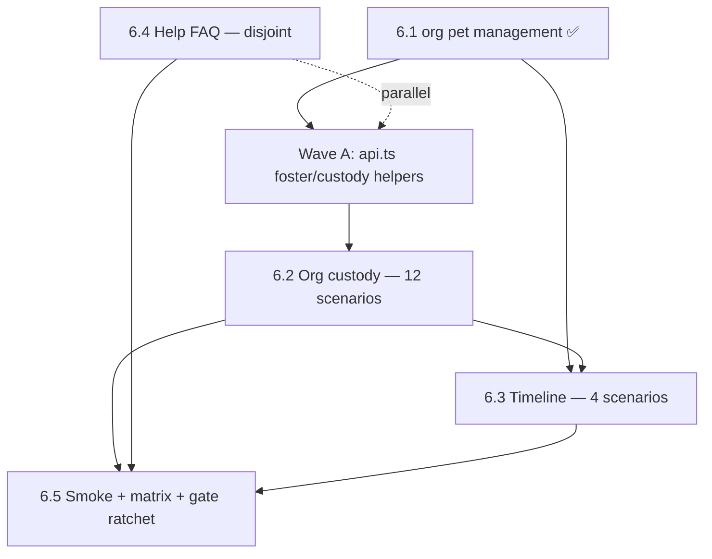

# Sprint 6 — execution plan (remainder)

**Status after 6.1:** 87/165 BDD scenarios mapped (52.7%). CI gate: 81 ✅  
**Sprint exit target:** **105/165 (65%)** — need **+18 scenarios**  
**Persona gate:** ≥ **80% of @P1** scenarios mapped (guardian + org-operator paths)

**Integration branch (multi-agent):** `cursor/sprint-6-org-bdd-integration-13e3`  
**Single-agent alternative:** direct-to-`main` PRs per wave (allowed for disjoint domains)

Companion: `docs/debt/refactoring-log.md` · Skill: `/spawn-sprint-agents` · Templates: `docs/agent-efficiency/prompt-templates.md`

---

## Remaining work inventory

| Item | Feature file(s) | Scenarios | Priority mix | BDD Δ | Spec target | Status |
|------|-----------------|----------:|--------------|------:|-------------|--------|
| **6.1** | `organisation_pet_management.feature` | 6 | @P1 | +6 | `organisation.pet.management.spec.ts` | ✅ Done (#111) |
| **6.2** | `org_foster_and_adoption`, `org_to_org_transfer`, `org_pet_return`, `pet_ownership_and_adoption` | **12** | @P1 | +12 | `adoption.spec.ts` (+ split optional) | Partial* |
| **6.3** | `organisation_pet_timeline.feature` | **4** (of 6) | @P1 | +4 | `org.timeline.spec.ts` | Planned |
| **6.4** | `help_faq.feature` | **10** | @P2 | +10 | `help.faq.spec.ts` | Planned |
| **6.5** | — (smoke realignment) | 0 | @P0 | — | existing `@smoke` titles | Planned |

\* `adoption.spec.ts` has 3 custody tests but **no `Scenario:` headers** — they contribute **0** to the BDD gate today. Rewrite required.

**If all remaining mapped:** 87 + 12 + 4 + 10 = **113/165 (68.5%)** — clears 105 exit with margin.

**Minimum path to 105:** 6.2 (12) + 6.3 (4) + 2 scenarios from 6.4 = **103 + 2 = 105**.

---

## Dependency graph



| Dependency | Reason |
|------------|--------|
| 6.2 after Wave A | Needs `api.ts` foster placement, org-to-org transfer, return helpers |
| 6.3 after 6.1 | Reuses `createFamilyEvent`, `seedHappyPawsClinic`; benefits from org pet patterns |
| 6.3 after 6.2 (soft) | Timeline Gherkin overlaps foster/placement language; custody stable reduces flake |
| 6.4 independent | `/help` route, no org APIs — **parallel with Wave A or 6.2** |
| 6.5 last | Retag `@smoke` only after specs stabilise; no BDD count change |

---

## Wave A — Foundation (serial, 1 agent)

**Branch:** `cursor/sprint-6-foundation-api-feec` → merge to integration or `main`  
**Owns:** `e2e/playwright/support/api.ts` only  
**Do not touch:** spec files, page objects

### Deliverables

Add API helpers (mirror Node routes in `server/routes/organizations/placements/`, `custodyTransfers.js`):

| Helper | Used by |
|--------|---------|
| `seedRescueHearts(baseURL)` | 6.2, 6.3 backgrounds (Alice + Eve foster + org) |
| `createFosterPlacement(...)` / `acceptFosterPlacement(...)` | org_foster_and_adoption |
| `endFosterPlacement(...)` | hide-cleared scenario |
| `initiateDirectAdoption(...)` / `confirmAdoption(...)` | direct adoption scenario |
| `requestOrgToOrgTransfer(...)` / `acceptCustodyTransfer(...)` | org_to_org_transfer |
| `disconnectOrgs(...)` | cancel pending transfer scenario |
| `requestPetReturn(...)` / `acceptReturn(...)` | org_pet_return |
| `hideOrgPetFromHome(...)` / `hideFosteredPet(...)` | hide scenarios (API or UI note) |

### Exit criteria

- Helpers covered by smoke calls in a tiny `api.custody.test.ts` or documented in spec comments
- `node e2e/scripts/check_bdd_coverage.js` still passes
- No spec file changes in this PR

---

## Wave B — Parallel track (2 agents)

### Agent B1 — 6.4 Help / FAQ (disjoint)

**Branch:** `cursor/sprint-6-4-help-faq-feec`  
**Owns:**
- `e2e/playwright/tests/help.faq.spec.ts` (new)
- `e2e/playwright/pages/help.page.ts` (new)

**Avoid:** `api.ts`, org specs, adoption specs

| # | Scenario | UI approach |
|---|----------|-------------|
| 1 | Opening Help from user menu | Pet list menu → Help |
| 2 | Help page displays title | Assert `Help & FAQ` |
| 3 | All feature sections visible | Section headers from ARB |
| 4 | Expanding a FAQ section | Tap Pet Profiles → Q&A visible |
| 5 | Collapsing a FAQ section | Tap header again |
| 6 | Multiple sections expanded | Account + Health both open |
| 7 | Help page scrollable | Scroll to Subscriptions section |
| 8 | English content | Default locale |
| 9 | French content | Set locale via profile/API + re-login |
| 10 | Back navigates to pet list | AppBar back |

**Note:** All @P2 — boosts BDD % but not P1 persona gate. Still valuable for 105 exit.

**Effort:** Low–medium (single screen, no backend). Good parallel filler.

---

### Agent B2 — 6.2 Org custody (heavy)

**Branch:** `cursor/sprint-6-2-org-custody-feec`  
**Owns:**
- `e2e/playwright/tests/adoption.spec.ts` (rewrite + expand)
- Optional split: `org.foster.spec.ts`, `org.transfer.spec.ts`, `org.return.spec.ts` if file >500 lines
- `e2e/playwright/pages/organization-detail.page.ts` (extend)
- `e2e/playwright/pages/pet-detail.page.ts` (extend for foster section)

**Avoid:** `api.ts` until Wave A merged; `help.faq.spec.ts`

#### 6.2 scenario map (12 total)

| Feature | Scenario | Suggested approach |
|---------|----------|------------------|
| org_foster_and_adoption | Foster placement gives Eve care… | UI: start placement → Eve accepts → API assert guardian |
| org_foster_and_adoption | Direct adoption requires foster confirmation | UI + API shadow check |
| org_foster_and_adoption | Org admin hides fostered pet from home | UI swipe/dismiss (reuse pet-list patterns) |
| org_foster_and_adoption | Fosterer hides from notifications/dashboard | UI hide + dashboard assert |
| org_foster_and_adoption | Hide cleared when foster ends | End placement → pet reappears |
| org_to_org_transfer | Connected orgs transfer with acceptance | Extend existing connection test + transfer UI |
| org_to_org_transfer | Transfer rejected without connection | API 4xx assert |
| org_to_org_transfer | Disconnect cancels pending transfer | API + UI disconnect |
| org_pet_return | Individual returns adopted pet | Return flow UI |
| org_pet_return | Receiving org returns to sender | Org-to-org return variant |
| pet_ownership_and_adoption | Share org pet with adopter | Reuse sharing API + org pet |
| pet_ownership_and_adoption | Frozen shadow after adoption | Extend archived pets UI (#108) |

**Critical:** Add exact `Scenario:` lines to `@bdd` header block for **each** test (gate counts headers, not feature file names).

**Risk:** Foster/hide flows are UI-heavy; budget hybrid API+UI like 6.1. Park impossible UI in `docs/debt/refactoring-debt.md` only with explicit human review.

---

## Wave C — 6.3 Organisation pet timeline (serial, 1 agent)

**Branch:** `cursor/sprint-6-3-org-timeline-feec`  
**After:** Wave A + 6.1 merged; prefer 6.2 merged  
**Owns:** `e2e/playwright/tests/org.timeline.spec.ts`, timeline page helpers

### In scope (4 scenarios)

| Scenario | Rationale |
|----------|-----------|
| Recording a foster stay for a pet | API family event + optional UI |
| Recording an open-ended placement | API family event |
| Viewing all family events for a pet | API list assert; UI if pet detail section exists |
| Family events appear in health dashboard | Care Events tab (mirrors 6.1 dashboard pattern) |

### Deferred (2 scenarios — park in debt)

| Scenario | Defer reason |
|----------|--------------|
| Removing a family event | No complete family-event UI on pet detail yet |
| Notifications for ending family events | Requires notification cron + org notification routing |

---

## Wave D — 6.5 Smoke + documentation (serial, 1 agent)

**Branch:** `cursor/sprint-6-5-smoke-p0-feec`  
**After:** Waves B + C merged  
**Owns:** `@smoke` title changes only across `e2e/playwright/tests/*.spec.ts`, `docs/quality/bdd-journey-matrix.md`

### P0 guardian smoke set (target)

| Keep @smoke | Gherkin @P0 source |
|-------------|-------------------|
| `auth.login` — valid credentials | authentication.feature |
| `auth.signup` — valid credentials | *(add @smoke if not present)* |
| `pet.profiles` — create pet required fields | pet_profiles.feature |
| `health.tracking` — one due-entry path | health_tracking.feature |
| `sharing` — anonymous shared pet view | sharing.feature |
| `weight.tracking` — one happy path | weight_tracking.feature |

### Demote (remove @smoke, keep test)

| Current @smoke | Reason |
|----------------|--------|
| `organisation.management` — create org | Org-operator persona; not guardian P0 |
| `veterinarian` — create vet | P1-heavy |
| `notifications` — empty state | P0 exists but not guardian-critical path |

UAT axe runs on remaining `@smoke` only.

---

## Wave E — Sprint exit (coordinator)

**Single PR or chore branch after all waves**

| Task | Action |
|------|--------|
| BDD count | Confirm ≥ **105/165** via `node e2e/scripts/check_bdd_coverage.js` |
| CI ratchet | Update `GATE` in `check_bdd_coverage.js` from 81 → **105** (or defer to Sprint 7.4 per log) |
| Matrix | Update `docs/quality/bdd-journey-matrix.md` org + help sections |
| Refactoring log | Mark 6.2–6.5 Done |
| Persona gate | Run manual tally of @P1 mapped %; document in scorecard |

---

## Recommended execution order

### Option 1 — Maximum parallelism (3 agents after foundation)

```
1. Wave A (foundation)     → merge
2. Parallel: B1 (6.4) + B2 (6.2)   → merge both
3. Wave C (6.3)            → merge
4. Wave D (6.5)            → merge
5. Wave E (exit)           → integration → main
```

### Option 2 — Single agent, efficiency-ordered (lowest conflict)

```
1. Wave A (foundation)
2. 6.4 Help (quick win, +10 BDD, builds page-object pattern)
3. 6.2 Custody (hardest, +12 BDD)
4. 6.3 Timeline (+4 BDD)
5. 6.5 Smoke
6. Wave E
```

Single-agent order puts **6.4 before 6.2** because help is faster and reaches 105 sooner (87+10=97, then 6.2 pushes well past 105).

### Option 3 — Product-priority first

```
1. Wave A → 6.2 → 6.3 → 6.4 → 6.5 → Wave E
```

Prioritises org-operator journeys before help polish.

**Recommendation:** **Option 1** if you can spawn agents; **Option 2** for one agent (fastest path to green gate).

---

## Agent spawn cheat sheet

Copy to spawn (after Wave A merges):

```
Wave B1: "Go on Sprint 6.4 — help_faq.feature, 10 scenarios, branch cursor/sprint-6-4-help-faq-feec, do not touch api.ts"

Wave B2: "Go on Sprint 6.2 — org custody 12 scenarios, branch cursor/sprint-6-2-org-custody-feec, use api.ts foster helpers from foundation PR, rewrite adoption.spec.ts @bdd headers"

Wave C: "Go on Sprint 6.3 — org timeline 4 scenarios, branch cursor/sprint-6-3-org-timeline-feec"

Wave D: "Go on Sprint 6.5 — realign @smoke to P0 guardian paths only"
```

---

## Human review triggers

Escalate before merge if:

- Foster/adoption UI flow differs materially from Gherkin (product decision)
- Family-event UI missing for timeline scenarios (accept API-only with debt doc)
- CI BDD gate ratchet to 105 breaks unrelated PRs (coordinate Sprint 7.4)

---

## Metrics tracker

| Milestone | Mapped | % |
|-----------|-------:|--:|
| Now (6.1 done) | 87 | 52.7% |
| +6.4 only | 97 | 58.8% |
| +6.2 | 109 | 66.1% |
| +6.3 (4) | 113 | 68.5% |
| Sprint exit gate | **105** | **63.6%** |
