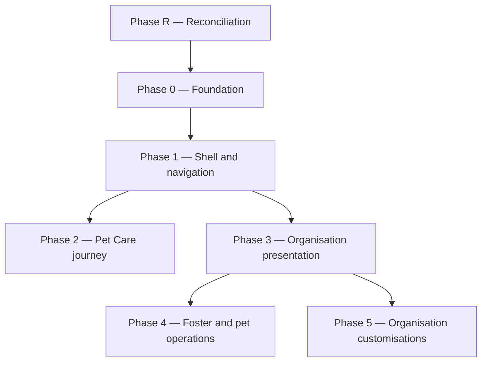

# Cross-domain programme index

Normative product requirements for cross-cutting capabilities live in domain `features/` or `docs/architecture/` / `docs/design/`. This file indexes **delivery and programme** material and records process decisions folded from retired `changes/` docs.

| Doc | Purpose |
|-----|---------|
| [program-contract.md](program-contract.md) | Experience-program vocabulary and cross-cutting contracts |
| [navigation-decisions.md](/docs/domains/navigation/features/navigation-decisions.md) | Phase R → 5 sprint detail (folded phase history) |
| [documentation-migration-handover.md](/docs/domains/documentation/changes/documentation-migration-handover.md) | Canonical-docs migration waves |

**Active execution plans** (in `changes/` until complete):

| Plan | Focus | Status |
|------|-------|--------|
| [sprint-6-execution-plan.md](../changes/sprint-6-execution-plan.md) | BDD coverage sprint (org/foster/help) | In delivery |
| [agatha-care-journey-programme.md](/docs/domains/pet_care/changes/agatha-care-journey-programme.md) | Profile facts → welfare → coordination (PR-01–14); execute-plan `agatha-care-journey` | Proposed |

**Documentation migration:** authoritative handover is [documentation-migration-handover.md](/docs/domains/documentation/changes/documentation-migration-handover.md). The Aug 2025 cross-domain consolidation plan was retired in Wave 0 (file deleted).

## Requirements

| ID | Rule | Status |
|----|------|--------|
| DELIVERY-PLANS-INDEX-R-001 | Agents use the documentation migration handover for consolidate waves, not superseded cross-domain consolidation plans | Live |
| DELIVERY-PLANS-INDEX-R-002 | Experience program phases run **R → 0 → 1 → 2 → 3 → 4 → 5** unless an explicit ownership map authorises parallel work within a phase | Live |
| DELIVERY-PLANS-INDEX-R-003 | Phase **R (Reconciliation)** runs before Phase 0, closing D2/D6 and tagging affected BDD `@legacy` per G0 §14.2 | Live |
| DELIVERY-PLANS-INDEX-R-004 | Default delivery is **single-agent, sequential, direct-to-`main` per phase**; `/spawn-sprint-agents` only with disjoint paths and a published ownership map | Live |

## User journeys

| Journey | Summary |
|---------|---------|
| Programme planning | Orchestrator reads phase order here, then opens navigation-decisions for sprint tables and linked phase change docs |
| Sprint execution | Agent follows one phase doc + program-contract; merges phase PR to `main` (or integration when multi-agent) per merge policy |

## Acceptance criteria

| Given / When / Then | Requirement | Coverage |
|---------------------|-------------|----------|
| Given an agent is asked to migrate domain docs, when they search for a consolidation plan, then they open `documentation-migration-handover.md` | DELIVERY-PLANS-INDEX-R-001 | none — #1787 |
| Given Experience program delivery, when phase order is chosen, then R precedes 0 and 1 precedes content phases 2–5 | DELIVERY-PLANS-INDEX-R-002 | none — #1787 |
| Given reconciliation work, when conflicting nav-v2 / acf1 artefacts remain, then Phase R close-out in navigation-decisions is satisfied before Phase 0 | DELIVERY-PLANS-INDEX-R-003 | none — #1787 |

## Decision log

| ID | Decision | Rationale | Status | Date | PR |
|----|----------|-----------|--------|------|-----|
| DELIVERY-PLANS-INDEX-D-001 | Retire `documentation-consolidation-plan.md` in favour of documentation-domain migration handover | Single authoritative migration plan; avoids duplicate 2025 three-PR strategy | Live | 2026-10-07 | TBD |
| DELIVERY-PLANS-INDEX-D-002 | **D32** — Dedicated Phase R before Phase 0 | Close D2/D6; `@legacy` BDD tags | Live | 2026-07-25 | TBD |
| DELIVERY-PLANS-INDEX-D-003 | **D33** — Default single-agent sequential to `main` | merge-policy; spawn only when disjoint | Live | 2026-07-25 | TBD |
| DELIVERY-PLANS-INDEX-D-004 | Retire `roadmap-delivery-plan.md` and `delivery-decisions.md` after fold | Sprint tables remain in navigation-decisions + domain phase docs | Live | 2026-10-08 | TBD |
| DELIVERY-PLANS-INDEX-D-005 | `docs-domain-audit-63ad` wave 3 complete — no further domain `git mv` | Inventory outcome: debt row migration + index cleanup (file deleted) | Live | 2026-08-22 | TBD |
| DELIVERY-PLANS-INDEX-D-006 | Sprint 10 Flutter 3.44 upgrade plan delivered | Execution detail in refactoring-log (plan doc deleted) | Live | 2026-07-10 | TBD |

### Experience program phase order (folded from roadmap)

**Recommended order:** R → 0 → 1 → 2 → 3 → 4 → 5 (Phase 2 before 3 by default). Never parallelise within a phase without an ownership map (`agent-coordination.mdc`).

**Merge policy:** Direct-to-`main` per phase PR unless multi-agent integration applies.
