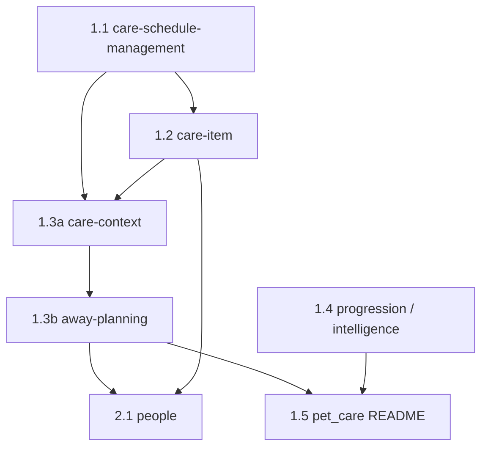

# Documentation consolidation — migration handover

**Date:** 2026-10-07 · **Audience:** agents and humans running `/canonical-docs consolidate` · **Status:** mechanisms on `main` are live (blocking CI); capability migration **not started** (Wave 0 publishes this plan only).

**Goal:** Each capability has **one** canonical `features/<capability>.md` describing how it works *now* (requirements, acceptance criteria, decision log). Temporary `changes/` trails and duplicate feature files go away; git history is the audit trail.

**Supersedes:** `docs/domains/cross-domain/changes/documentation-consolidation-plan.md` (Aug 2025 three-PR plan — retired Wave 0).

---

## 1. What exists today

| Mechanism | Role | Location |
|-----------|------|----------|
| Policy | One canonical doc per capability; decision log inside; `changes/` temporary | `docs/domains/documentation/standards.md` |
| Procedure | Mode A `sync` (every behaviour PR); Mode B `consolidate` (one capability per PR) | `.cursor/skills/canonical-docs/SKILL.md` |
| Agent wiring | Docs before PR; steward / pr-hygiene / babysit+ / execute-plan | `.cursor/rules/documentation.mdc`, `.claude/skills/steward/SKILL.md` |
| CI (blocking on `main`) | Gates A–E + legacy baseline **R-L3** | `.github/workflows/docs-gate.yml` (`DOCS_GATE_MODE=block`) |
| Weekly hygiene | Tracking issue: stale proposals, duplicate IDs, memory backlog | `quality-kpis.yml` → `docs-hygiene` |
| Legacy baseline | Shrink-only grandfather list | `scripts/docs-legacy-baseline.json` |
| Memory backlog | Product rules still only in `.agents/memory/` | `scripts/docs-memory-backlog.json` when present on `main` |

**Principle P1:** A PR never fails because of a doc it did not touch. Legacy paths stay exempt until edited; consolidation removes baseline entries when a doc is fully migrated.

**Verify before each wave:** `main` moves. Re-count baseline and domain line totals; do not trust static tables blindly.

```bash
node -e "
const fs=require('fs');
const b=JSON.parse(fs.readFileSync('scripts/docs-legacy-baseline.json'));
const lines=p=>fs.readFileSync(p,'utf8').split('\n').length;
const sum=a=>a.reduce((n,p)=>n+lines(p),0);
console.log('features',b.features.length,'lines',sum(b.features));
console.log('changes',b.changes.length,'lines',sum(b.changes));
"
```

---

## 2. Baseline snapshot (refresh on `main`)

Approximate starting point after Wave 0 (90 change docs if `documentation-consolidation-plan` removed from baseline):

| Domain | Feature docs | Change docs | Notes |
|--------|--------------|-------------|--------|
| pet_care | 7 (~2.1k lines) | 28 (~7.4k) | Worst trail; highest agent risk |
| shelter | 7 | 11 | **Frozen** — see Wave 6 |
| fostering | 6 | 6 | **Frozen** |
| pet_profile | 5 | 9 | Guardian / dashboard cluster |
| cross-domain | 0 | 6+ | Programme + contract (post Wave 0) |
| notifications | 4 | 4 | v2 spec is large |
| people | 2 | 4 | Largely canonical already |
| navigation | 2 | 6 | Many decision ID families |
| health_tracking | 2 | 3 | Scheduling wrong until Pet Care fold |
| Small domains | 2–3 each | 2 each | Mechanical merges |

**Debris outside `domains/`:** `.agents/plans/` snapshots (separate retention track), stale `docs/README.md` domain table, debt redirect stubs — Wave 5.2.

---

## 3. Unit of work — one capability per PR

Run `/canonical-docs consolidate <domain>/<capability>`. **Do not bundle unrelated capabilities** — if folding feels forced, treat it as a **separation-of-concerns smell** (doc and possibly code boundaries) and split capabilities instead of merging files.

### Definition of done (each consolidate PR)

1. **One canonical doc** at `docs/domains/<domain>/features/<capability>.md`, template-shaped, Gate C without baseline exemption; remove migrated paths from `scripts/docs-legacy-baseline.json`.
2. **Reconcile every rule against code and tests** — statuses `Live` | `In delivery` | `Planned` | `Retired` (never copy blindly).
3. **Acceptance criteria** — Given/When/Then; normative coverage per standards §Enforcement. Rows without tests: `none — #<issue>` (one coverage-gap issue per capability is fine; use sections inside the issue for large caps).
4. **Before deleting any source file — AC inventory (mandatory):** grep the file for AC tables, `AC-`, Given/When/Then blocks, and BDD scenario references. Every row lands in the canonical doc or a linked issue; **no silent deletion**.
5. **Decision log** inside the canonical doc. Keep repo-unique legacy IDs (e.g. `D-CSM-019`). Rename only **colliding** or bare `D1`-style IDs; note former ID in Rationale. Do not mass-rename stable families (`D-v4-*`, `D-shelter-NAV-*`) without a collision.
6. **Reference sweep:** `docs/`, `.cursor/`, `AGENTS.md`, `e2e/`, `flutter_app/` (comments, features), `.github/`.
7. **Deletion guard:** delete only fully superseded sources; trim + `status: in-delivery` when scope remains; `grep -rn <file> .agents/plans docs` before delete.
8. **Memory:** move backlog entries into the canonical doc; shrink memory to pointer; update `scripts/docs-memory-backlog.json`.
9. **Indexes:** domain `README.md`, `docs/README.md` where relevant.
10. **PR `## Docs`:** source → destination table; IDs added; files deleted/trimmed; conflicts → `## Still open` + issue (never guess).

### Capability boundary rules

| Situation | Action |
|-----------|--------|
| Two feature files, one user-facing capability | **Split work** — pick one canonical file; other becomes `Planned` cross-links or separate capability |
| Timing vs dose vs away context (Pet Care) | **Separate capabilities** — `care-schedule-management`, `care-item`, `care-context`, `away-planning` (not one mega-doc) |
| Merging would change `feature_id` / all R-IDs | **PO decision first** (see §8) — prefer stable `feature_id` over shorter filename |

**Flag smells:** If Wave plan rows repeatedly say “merge X and Y”, open a **debt issue** “capability boundary / code SRP” rather than bundling docs.

---

## 4. Integration branch and two-phase gates

**Branch:** `cursor/documentation-migration-integration-514a` (integration parent for all migration PRs; single squash merge to `main` when complete).

### Phase A — migrate under advisory CI (integration only)

1. Branch integration from `main`.
2. **One governance PR on integration** sets `DOCS_GATE_MODE: warn` in `.github/workflows/docs-gate.yml` (integration branch only). Document in PR body: temporary; restored in Phase B.
3. Run execute-plan **roadmap** `documentation-migration` with child plans per wave; each phase = one consolidate PR → **merge to integration** via `/babysit-plus` (not babysit-uat).
4. Parallel agents: assign **disjoint `allowed_paths`** per phase (no two PRs touch same source files). Serialize within a wave when files overlap.

**Why warn on integration:** Many agents can land large reconciliations without blocking on every AC row; weekly hygiene + local `DOCS_GATE_MODE=block` on touched files still recommended.

### Phase B — harden before `main`

1. **Governance PR on integration:** restore `DOCS_GATE_MODE: block`; run full `node scripts/check_docs_canonical.js` / `validate_docs.sh` on integration HEAD.
2. Fix stragglers (coverage, shape noise, duplicate IDs) in as many small PRs as needed.
3. **One integration → `main` PR** via `/babysit-uat` (pre-UAT gate on final merge).

`main` stays **block** throughout; only the integration line uses warn during Phase A.

---

## 5. Dependency order (Pet Care and People)

Execute in order; **do not skip** AC inventory on deletes.



| Blocked until | File / topic | Reason |
|---------------|--------------|--------|
| 1.3b | `people/changes/amends-away-planning.md` | People vocabulary + away rules |
| 2.1 | Wave 1.3 away + care-context | “People Dn” citations in away docs |
| 1.2 | 1.1 timing ownership written | Single source for schedule / occurrence rules |
| 3.2 guardian docs | `docs/design/terminology.md` Pet Care naming | Workspace rename |

**Detail preservation:** When folding, copy **Rationale** cells and normative bullets; drop phase/shipped tables and narrative history only.

---

## 6. Waves (atomic capabilities)

Each row = **one PR** unless noted. Pet Care Wave 1 is **sequential**.

### Wave 0 — governance (merged separately)

Publish this handover; retire Aug 2025 consolidation plan; link from `documentation/README.md`.

### Wave 1 — Pet Care core

| ID | Capability (`features/…`) | Primary sources | Memory | Notes |
|----|---------------------------|-----------------|--------|-------|
| 1.1 | `care-schedule-management` | CSM decisions + delivery; `health_tracking/changes/occurrence-scheduling.md`; retire wrong rows in `health_tracking/features/specs.md` (pointer/`Retired`, not full fold in same PR if too large) | `health-entry-completion`, `care-schedule-status-source` | **Template PR** — split 1.1b if diff explodes |
| 1.1b | (optional) | Finish health_tracking scheduling fold | — | Only if 1.1 split |
| 1.2 | `care-item` (rename to `care-item.md` only after §8.5) | context-header, bulk-scope, not-recorded bug, model delivery plan | dose + guardian completion memories | Do not duplicate timing from 1.1 |
| 1.3a | `care-context` | `care-context.md` + away planning **context** slices only | — | **Do not merge** away-planning carer model here |
| 1.3b | `away-planning-carer-model` (or `away-planning.md`) | away-* decision/delivery pairs, handover spec, `care-through-change-delivery-plan` | — | `amends-away-planning` → `Planned` + decisions; after 2.1 if needed |
| 1.4a | `care-progression` | progression delivery, roadmap slices, cp0/d0/d4a/d5a/d7, taxonomy spec → `Planned` | — | Mostly delete history |
| 1.4b | `care-intelligence` | `care-intelligence.md` + related changes | — | Separate from progression |
| 1.5 | `pet_care` index | domain-rename + terminology inventory (delete if done), hardening-discovery → `Planned` or `changes/` | — | Rewrite `pet_care/README.md` |

### Wave 2 — nearly canonical

| ID | Capability | Sources |
|----|------------|---------|
| 2.1 | `people-care-team` + `vocabulary` | `people/changes/*` except keep `people-domain-refactor` as `proposed` `changes/` |
| 2.2 | notifications (single doc — confirm name) | v2 spec, decisions, journeys, programme/security |
| 2.3 | weight tracking | model + specs + journeys |

### Wave 3 — profile, navigation, health remainder

| ID | Capability | Notes |
|----|------------|-------|
| 3.1 | pet profile (+ activity model, tags) | Dedupe `docs/architecture/pet-activity-model.md` vs domain copy |
| 3.2 | guardian dashboard / today | Confirm delete `guardian-ui-wave2-issue-briefs` only after AC extraction |
| 3.3 | navigation shell | Keep unique decision IDs; delete phase history docs |
| 3.4 | health_tracking remainder | If only scheduling left, domain may shrink to README pointer to Pet Care |

### Wave 4 — small domains (parallel if disjoint)

`auth`, `sharing`, `subscription`, `help_about`, `vet` — merge journeys + specs per domain. **PO:** vet separate or folded into People (§8.2).

### Wave 5 — cross-cutting

| ID | Scope |
|----|--------|
| 5.1 | `cross-domain/changes/*` — land contract vocabulary in `docs/design/terminology.md` / architecture before delete |
| 5.2 | Root indexes, debt stubs, duplicate logs |
| 5.3 | Memory → `terminology.md` |

### Wave 6 — frozen domains (PO decision)

`shelter`, `fostering`: prefer **frozen-state** doc under `docs/engineering/frozen-domains/` + decision log; do not full consolidate without PO approval. Baseline may **not** reach zero — track `canonical_ratio` for MVP domains separately.

### Separate track — `.agents/plans/`

Retention rule PR (delete terminal snapshots > N days; keep `_example`). Never delete plans still linked from docs.

---

## 7. Gotchas

- **G1** — New/changed AC rows: no `TBD — consolidate` (**R-T2**); use `none — #issue`.
- **G2** — Baseline removal ⇒ full Gate C (no delivery noise).
- **G3** — Deleting `changes/*.md` ⇒ fold target edited same PR (**R-A4** / **R-A4b**).
- **G4** — Requirement IDs from `feature_id`; decisions globally unique (**R-D3** report).
- **G5** — Decision log columns fixed; `Agreed` → `Live`.
- **G6** — Active execute-plan snapshots pin files.
- **G7** — Copy rationale, not narrative essays.
- **G8** — `cd server && npm ci`; `validate_docs.sh`; `check_docs_canonical.js --base origin/<integration>`.
- **G9** — Trust weekly `docs-hygiene` after memory governance lands on `main`.
- **G10** — Fix detectors in governance PRs; no inline exemptions.
- **G11** — **AC scan before every delete** (§3).

---

## 8. Product owner decisions

1. Frozen domains: frozen-state doc vs full consolidate vs baseline as-is.
2. Vet: separate capability vs People fold.
3. `guardian-ui-wave2-issue-briefs` + navigation phase docs: history-only delete after AC extract.
4. `.agents/plans/` retention N.
5. `care-item-evolution.md` → `care-item.md` (ID migration) — **before** writing `CARE-ITEM-*` IDs.
6. Draft specs (`care-classification-taxonomy`, `hardening-discovery`): `Planned` rows vs stay in `changes/`.

---

## 9. Execute-plan orchestration

| Item | Choice |
|------|--------|
| Parent | `plan_kind: roadmap`, integration `base_branch: cursor/documentation-migration-integration-514a` |
| Children | One plan per wave (or per capability for Wave 1) |
| Phase exit | merge-done on integration; `/babysit-plus` each phase |
| Final | `/babysit-uat` integration → `main` |
| Human checkpoints | **None** for routine progress — see §10 |

**Bootstrap prompt (Wave 1.1):**  
Run `/canonical-docs consolidate pet_care/care-schedule-management` per this handover §6 Wave 1.1. AC inventory before deletes. Product conflicts → issue + `## Still open`. Coverage gaps → one issue per capability. Merge to integration via `/babysit-plus`.

---

## 10. Execute-plan autonomy (confirm for operators)

From `.cursor/skills/execute-plan/SKILL.md` when `gate <plan_id>` exits `0`:

- **Do not** ask the human to continue, approve the next phase, or merge.
- **Run-until-blocked:** implement → PR → babysit+ → merge → next phase in one flow.
- **User chat** only for §Halt / escalation (`**Needs you:**`, revoke, `session_limit`).
- **Human checkpoint** = explicit `halt` on the control issue — not milestones, not “PR is open”, not end-of-turn summaries.

Orchestrator merges with squash when gates pass; post-merge pre-UAT on `main` is CI-owned, not a phase gate for intermediate integration merges.

---

## 11. Tracking

| Signal | Target |
|--------|--------|
| Baseline entries | → 0 for active MVP domains (frozen exempt by decision) |
| `canonical_ratio` | → 1.0 per active domain (`check_docs_canonical.js --report`) |
| Memory backlog file | → empty |
| Weekly `docs-hygiene` issue | Self-closes when empty |

When this migration fully delivers, fold §1–11 into `standards.md` (or a short `documentation/README` section), delete this file per deletion guard.
