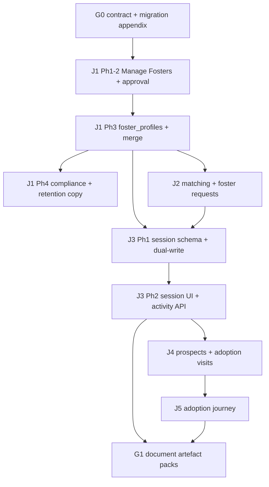

# Fostering platform — delivery plan (J1–J5 + G1)

**Status:** Active coordination doc  
**Last updated:** 2026-07-25  
**Parent:** [`g0-contract-pack.md`](g0-contract-pack.md) · [`migration-appendix.md`](migration-appendix.md)

This document defines **sequential gates**, **parallel sprint boundaries**, and **execute-plan** IDs for autonomous delivery. Journey specs remain the source of behaviour; this doc owns **order and ownership only**.

---

## Dependency graph (must respect)

### Hard gates (no parallel override)

| Gate | Blocks | Reason |
|------|--------|--------|
| G0 + migration appendix `locked` | All journeys | Status maps, entity dispositions |
| J1 Ph3 `foster_profiles` + `foster_profile_id` | J2 capacity identity, J3 `shelter_foster_relationship_id` | G0 §5.1–5.2, migration §2.2–2.4 |
| J1 Ph4 privacy/retention copy | J1 manual foster expansion to prod | G0 §11, DPIA §17.3 |
| J3 Ph1 status migration + dual-write | J4 visit scheduling on sessions | G0 §5.5 |
| J3 `active` session path | J4 foster-context visits | G0 §5.5 default |
| J4 visit validation | J5 journey start (visit path) | G0 §5.6 |
| J3/J5 checklist hook freeze | G1 template keys | G0 §5.7 |

### Soft parallel (disjoint ownership — use `/spawn-sprint-agents`)

| After gate | Parallel track A | Parallel track B | Coordination |
|------------|------------------|------------------|--------------|
| J1 Ph3 backend merged | **J2** `server/routes/fosterRequests/` + tables | **J3** `db/migrations/` session columns + `fosterPlacementsRouter` | J2 capacity formula needs J3 session counts — ship J2 matching first with declared capacity only; wire J3 counts in integration PR |
| J3 Ph1 merged | **J3** Flutter session screens | **J4** prospect table + API (no visits yet) | J4 visits UI waits for J3 session read model |
| J5 Ph1 merged | **G1** session checklist templates | **G1** adoption milestone templates | Same integration branch; disjoint template dirs |

---

## Execute-plan registry

One **execute-plan per journey wave** (48h autonomy window each). Multi-phase plans use an **integration branch** → single PR to `main`.

| plan_id | Journey | Phases | Integration branch | Status |
|---------|---------|--------|-------------------|--------|
| `fostering-platform-foundation-e877` | G0 + J1 Ph1-2 | 2 | `cursor/fostering-platform-foundation-e877-integration` | **merged** |
| `fostering-platform-j1-phase2-e877` | J1 Ph2 approval | 2 | `cursor/fostering-platform-j1-phase2-e877-integration` | **merged** |
| `fostering-platform-j1-phase3-e877` | J1 Ph3 profiles + merge | 2 | `cursor/fostering-platform-j1-phase3-e877-integration` | **merged** |
| `fostering-platform-j1-phase4-e877` | J1 Ph4 compliance | 2 | `cursor/fostering-platform-j1-phase4-e877-integration` | **merged** |
| `fostering-platform-j2-e877` | J2 matching + requests | 3 | `cursor/fostering-platform-j2-j3-e877-integration` | **merged** |
| `fostering-platform-j3-e877` | J3 fostering sessions | 4 | `cursor/fostering-platform-j2-j3-e877-integration` | **merged** |
| `fostering-platform-j4-e877` | J4 visits + prospects | 3 | `cursor/fostering-platform-j2-j3-e877-integration` | **merged** |
| `fostering-platform-j5-e877` | J5 adoption conversion | 3 | `cursor/fostering-platform-j2-j3-e877-integration` | **merged** |
| `fostering-platform-g1-e877` | G1 document packs | 2 | `cursor/fostering-platform-j2-j3-e877-integration` | **merged** |

---

## Sprint ownership map (Wave B example — after J1 Ph3)

Publish before spawning parallel agents (`docs/refactoring-log.md` §Fostering platform).

| Agent | Branch suffix | Owns | Avoid |
|-------|---------------|------|-------|
| **j2-backend** | `cursor/j2-foster-requests-backend-e877` | `db/migrations/*foster_request*`, `server/routes/organizations/fosterRequestsRouter.js`, `server/test/organizations/fosterRequests*` | `fosterPlacements*`, `flutter_app/**` |
| **j3-migration** | `cursor/j3-session-schema-e877` | `db/migrations/*foster_placement*`, `server/lib/fosterPlacements.js`, placement tests | `fosterRequests*`, `flutter_app/**` |
| **coordinator** | `cursor/fostering-platform-j2-j3-e877-integration` | Plan artifacts, capacity read-model glue PR | — |

Flutter agents for J2/J3 start **after** backend API contracts merge to integration.

---

## Journey phase summaries

### J1 Phase 3 — foster_profiles + manual merge

- `foster_profiles` table; `foster_profile_id` on `org_foster_parents`
- Backfill profiles for existing manual + member fosters
- Merge API (email match → link to registered user profile)
- Audit `foster_merge_completed`
- Flutter: merge suggestion + confirm flow on Manage Fosters

### J1 Phase 4 — compliance + retention

- Retention category flags per G0 §11 (org-configurable within bounds)
- Privacy notice copy (EN/FR); Art. 14 template refresh
- DPIA checklist items in `regulatory/internal/dpia-foster-directory.md`
- Opt-out (`opt_out_at` on relationship) UI

### J2 — matching + requests (3 phases)

1. Schema + send/list foster requests API  
2. Flutter: find fosters, send request, foster response inbox  
3. Capacity filter (declared + J3 session counts) + BDD  

### J3 — fostering sessions (4 phases)

1. Migration: session columns, status dual-write, index swap  
2. Session lifecycle API (preparation → active → end)  
3. Flutter: session detail, dual-start confirm, end flows  
4. `fostering_activity_summary` for Manage Fosters tabs + BDD  

### J4 — adoption visits (3 phases)

1. `prospects` table + manual prospect merge (reuse G0 §9)  
2. `adoption_visits` table + scheduling API  
3. Flutter visit screens + foster assignment + BDD  

### J5 — adoption conversion (3 phases)

1. `adoption_journeys` table; migrate open placement adoption rows  
2. Journey workflow API; supersede legacy placement adoption endpoints  
3. Flutter journey UI + custody transfer hook + BDD  

### G1 — document packs (2 phases)

1. Template storage + session checklist item rendering (J3 hooks)  
2. Adoption milestone templates + register export (J5 hooks)  

---

## Recommended delivery order

1. **Sequential:** J1 Ph3 → J1 Ph4  
2. **Parallel sprint:** J2 backend ∥ J3 Ph1 schema (integration branch)  
3. **Sequential:** J3 Ph2–4 (blocks J4 visits)  
4. **Sequential:** J4 → J5  
5. **Final:** G1 (hooks stable)  

**Never parallelize:** same router file, same migration number, same Flutter screen, `.github/workflows/`.

---

## Open questions (block specific phases only)

| ID | Question | Blocks |
|----|----------|--------|
| Q1 | Non-member foster portal access? | J2 email CTAs (not J2 API skeleton) |
| Q4 | `foster_profiles` vs user extension? | **Resolved for Ph3:** dedicated `foster_profiles` table per migration appendix §2.3 |
