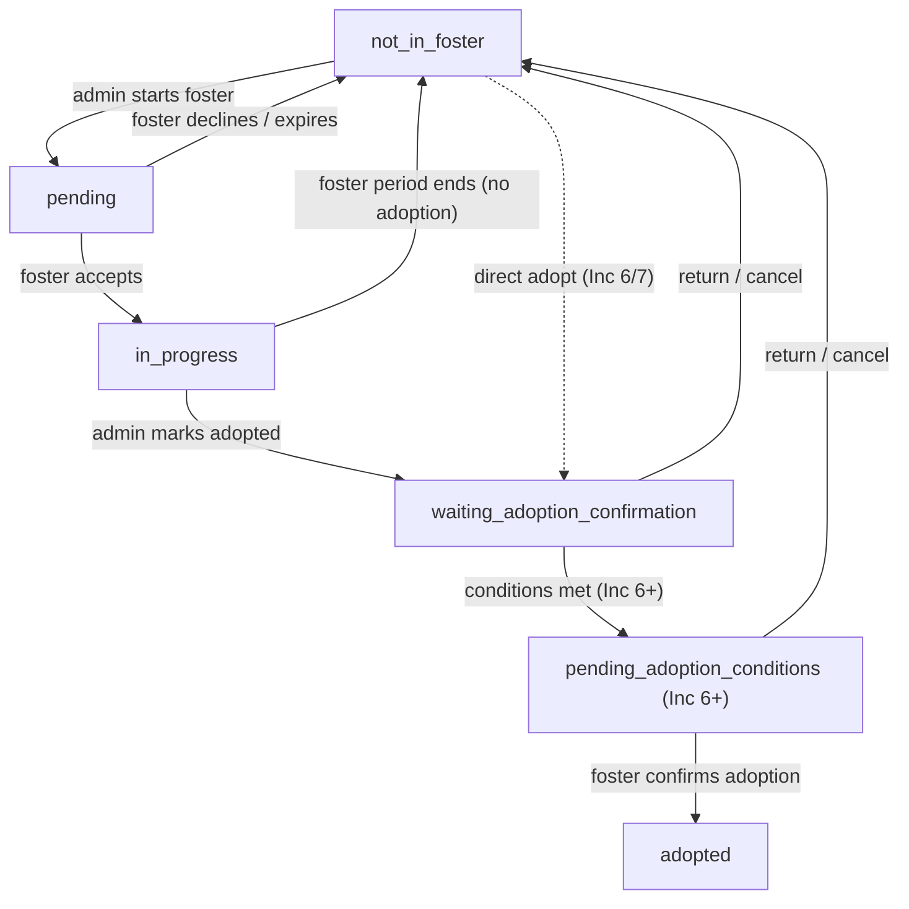

# Foster placement lifecycle

Extracted from [/docs/domains/fostering/changes/org-fostering-strategy.md](/docs/domains/fostering/changes/org-fostering-strategy.md). Custody **data model** (guardianship vs care) lives in the [organization domain](/docs/domains/shelter/features/org-custody-model.md).

## State machine

## Locked decisions

- A foster parent may foster **multiple pets** at once.
- **Admins** are valid foster parents (included in picker).
- Declining a pending placement → `not_in_foster`.
- Non-adoption exits return to `not_in_foster` (org retains the pet).
- During adoption (`waiting` / `pending_adoption_conditions`), placement can return to `not_in_foster`.

## Contracts

Full API/workflow contracts: [g0-contract-pack.md](g0-contract-pack.md) · Onboarding: [j1-foster-onboarding.md](../changes/j1-foster-onboarding.md)

**Session detail UI (foster + shelter lenses):** [session-detail-view.md](session-detail-view.md) — viewer contexts, routes, actions matrix, pet profile entry points.

> **Note:** J3 target statuses (`pending_acceptance`, `preparation`, `ready_to_start`, `active`, …) extend this legacy diagram. See G0 §6.2 and [session-detail-view.md](session-detail-view.md) for the canonical session lifecycle UI.
