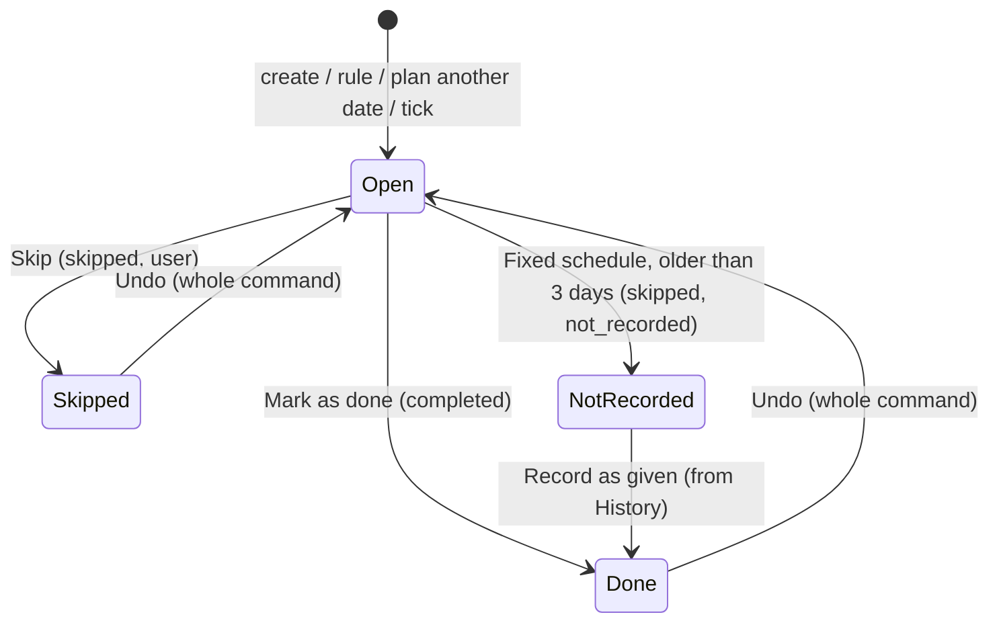

# Health occurrence scheduling

Canonical spec for timestamp-aware care occurrences. Implements multi-dose-per-day tracking as first-class `health_occurrences` rows.

> **CSM ownership:** Write behaviour (complete, skip, change date, plan another date, postpone, undo, cadence) is owned by [Care Schedule Management](/docs/domains/pet_care/features/care-schedule-management.md) (decisions D-CSM-019 … D-CSM-033). User-facing words and the agenda are owned by [care-item-evolution.md](/docs/domains/pet_care/features/care-item-evolution.md) (D-CIE-024 … D-CIE-028). This document covers **which occurrences exist**, **status per occurrence**, **agenda placement** and the **acceptance case matrix**.

## Goals

- Every scheduled instant is an occurrence: `(scheduled_date, scheduled_time)` where `scheduled_time` may be `NULL` (any time of day).
- Every active planned Care Item always has **at least one stored open occurrence** that can be acted on at once (D-CSM-019). Closing one creates the next in the same request.
- Two schedule types (D-CSM-020): **Fixed schedule** (each date is its own occurrence; missed doses stack so they can be recorded) and **After it's done** (one open date; the next counts from the done date).
- One agenda everywhere: **Today** (Overdue first), **Due soon**, **Upcoming** (D-CIE-025).

## Data model

### `health_occurrences`

| Column | Type | Notes |
|--------|------|-------|
| `id` | UUID | PK |
| `health_entry_id` | UUID | FK → `health_entries` |
| `scheduled_date` | DATE | Calendar day (`YYYY-MM-DD` wire) |
| `scheduled_time` | TIME | Local wall-clock; `NULL` = all-day |
| `status` | VARCHAR | `pending` \| `completed` \| `skipped` |
| `completed_on` | DATE | When given (calendar day) |
| `completion_timing` | VARCHAR | `early` \| `on_time` \| `late` — set on complete (CSM-5) |
| `marked_at` | TIMESTAMPTZ | Audit instant |
| `marked_by_user_id` | UUID | FK → `users` |
| `notes` | TEXT | Optional |
| `origin` | VARCHAR | `schedule` \| `computed` \| `planned` (D-CSM-021) |
| `close_reason` | VARCHAR | `user` \| `not_recorded` \| `paused` \| `covered` \| `system`; null while open |

Unique pending constraint per entry + instant: `(health_entry_id, scheduled_date, scheduled_time)` where status is open.

### Series template on `health_entries`

| Column | Type | Notes |
|--------|------|-------|
| `schedule_times` | JSONB | Ordered `["08:00","18:00"]`; empty/null with checkbox off → all-day (`NULL` time) |
| `recurrence_anchor` | VARCHAR | `from_due_date` = **Fixed schedule**, `from_completion` = **After it's done**; default from care family on create (D-CSM-020) |
| `schedule_anchor_date` | DATE | Fixed schedule: the date series dates are counted from (D-CSM-023, D-CSM-024) |
| `late_completion_choice` | VARCHAR | `keep` \| `skip_next` \| `shift_following`; null = keep (D-CSM-026) |
| `paused_since` | DATE | Set when series paused (CSM-9) |
| `paused_until` | DATE | Postpone-until end date for Fixed-schedule items; null = no end (D-CSM-028) |
| `schedule_policy_version` | VARCHAR | CSM policy tag on entry |

## Timezone and “now”

Follow `docs/architecture/calendar-dates.md`:

- Schedule uses `DATE` + `TIME` (local wall clock in the **pet's home timezone**), not `TIMESTAMPTZ` for dose instants. `marked_at` uses `TIMESTAMPTZ`.
- **The server decides “today” and “now”** in the pet's home timezone and returns them as `as_of { date, time, timezone }` with a per-occurrence `status` (D-CIE-028). The app shows what the server sent; it may promote Due → Overdue locally for timed slots as minutes pass, and refreshes on resume, every 15 minutes while a care surface is visible, and when the pet's local day changes.
- Daylight saving: dates are calendar dates. A slot in a skipped hour (02:30 on the spring change) keeps its date and uses 03:00 as its effective time; the care tick is idempotent across the repeated autumn hour.
- Test clock: `X-Care-As-Of` header, honoured only in `development`, `test` and `ci` (see CSM).

## Which occurrences exist

| Schedule type | Stored open occurrences |
|---------------|------------------------|
| **Once** | The single occurrence until it closes |
| **After it's done** | Exactly one open date from the rule (`computed`), **unless** a person planned dates (`planned`), in which case those are the open dates and no computed one exists. Created when the item is created and whenever the last open date closes (D-CSM-022) |
| **Fixed schedule** | Every slot from **today − 3 days** through **today** not yet closed, the latest series date on or before today, plus every slot of the **next series date after today** (if a person already closed that date, the one after it), plus any `planned` extras (D-CSM-023). A Not recorded slot closes once the slot after it is three days old; an Overdue slot is never closed automatically. Kept up to date by every command's catch-up and by the care tick every 15 minutes (D-CSM-031) |
| **Paused** | Whatever was open stays (hidden); nothing new is created (D-CSM-028) |
| **Unplanned / recorded** | None |

- **No T−1 window.** A yearly item has its next open occurrence a year ahead; a monthly item done today has next month's occurrence straight away.
- Dates: Fixed schedule = `schedule_anchor_date + n × interval`; After it's done = done date + interval. Both use the **month-end clamp** (D-CSM-024).
- `next_due_date` on `health_entries` = earliest open occurrence (read-only cache).

### Origins and precedence (D-CSM-021)

1. `planned` and `schedule` occurrences are never moved by the app.
2. At most one open `computed` occurrence, only when nothing else is open.
3. When an occurrence closes and another one is open, no computed date is created; when none is open, the rule creates the next one.
4. Change date or Postpone on a `computed` occurrence makes it `planned`.



## Status per occurrence

The server returns `status` for each open occurrence: `coming_up` | `due` | `overdue` | `not_recorded`.

| Status | Timed slot | Any-time slot |
|--------|-----------|---------------|
| **Coming up** | before its day | before its day |
| **Due** | on its day, until its time | on its day |
| **Overdue** | after its time. After it's done: until done, skipped or postponed. Fixed schedule: until the **next slot of the series** is due | from the next day, same limits |
| **Not recorded** | Fixed schedule only: the next slot is due; the slot joins the stack | same |

Closed statuses: **Done** (`completed`), **Skipped** (`skipped`, `close_reason = 'user'`), **Not given** (stack review, `skipped` + `user`), **Not recorded** (`skipped` + `not_recorded`, recordable as given).

## Agenda placement (D-CIE-025)

| Section | Contains | Order |
|---------|----------|-------|
| **Today** | Overdue items first (a Fixed-schedule stack is one row, “3 doses not recorded”, with **Review**); then items due today in **Morning** (< 12:00), **Afternoon** (12:00–17:59), **Evening** (≥ 18:00), **Anytime** (no time). Headings only when ≥ 2 groups are non-empty; otherwise one heading **“Today's list”**. Done-today rows stay at the end, quiet, until the day ends | Overdue by date/time ASC; groups by time ASC |
| **Due soon** | Next 7 days after today | Date ASC |
| **Upcoming** | Later dates; collapsed with a count | Date ASC |

Items repeating daily or more often appear only in Today. The reminder window never hides anything. Grouping uses each pet's local time.

## Surfaces

- **Agenda rows** (dashboard, pet profile, All care): one row per item; one trailing action — **Mark as done** (or **Review** for a stack); tap opens the Care Item view. A multi-slot item acts on its most urgent open slot. Completion is shown only after the server confirms (D-CIE-026).
- **Record earlier doses** sheet (stack review): per slot **Given / Not given** (medication) or **Done / Not done** (other care); footer “All given” / “None given”.
- **Care Item view:** Needs attention (Mark as done or Review + Change date); occurrence menu (Skip, Postpone, Plan another date, Add note); History with done, not given and not recorded dates (“Record as given” on Not recorded); no snooze.

## Acceptance case matrix

Every row is a test (Jest for rules and commands, Flutter widget tests for the agenda, Playwright for journeys). “AID” = After it's done; “FX” = Fixed schedule. Dates are illustrative.

### After it's done

| id | Case | Expected |
|----|------|----------|
| AID-1 | Monthly flea due 5 Jun, done 5 Jun | Next `computed` 5 Jul, same request |
| AID-2 | Not done; today 7 Jun | “Overdue · 5 Jun”; “Estimated next: 7 Jul” |
| AID-3 | Done on 6 Jun (recorded 7 Jun) | Next 6 Jul |
| AID-4 | Skipped on 7 Jun | Next 7 Jul |
| AID-5 | Done 20 May (16 days early of 30) | Confirmation; next 20 Jun |
| AID-6 | Yearly wellness review due 1 Mar, done 15 Apr | Next 15 Apr next year |
| AID-7 | Daily dental chew, not done for 3 days | One Overdue occurrence (no stack) |
| AID-8 | “Twice a day, after it's done” | Rejected `times_require_fixed_schedule`; the form prevents it |
| AID-9 | Created with due date 200 days away | Open occurrence exists; Mark as done works |
| AID-10 | Overdue item shows “Estimated next” | Subtitle only; no row, action or reminder |
| AID-11 | Overdue item → Mark as done | “When was this done?” first; the answer is sent with the completion |

### Fixed schedule

| id | Case | Expected |
|----|------|----------|
| FX-1 | Twice daily 08:00/18:00, at 07:00 | Today's and tomorrow's slots exist; only today's are listed |
| FX-2 | 08:00 not logged at 12:00 | “Overdue · 08:00” |
| FX-3 | 08:00 still not logged at 18:01 | 08:00 → Not recorded (stack); 18:00 Due |
| FX-4 | Mon, Tue not logged; today Wed | Stack of 4 (Review); Wed slots Due |
| FX-5 | On Fri, Mon's slots | Closed by the tick as `not_recorded` |
| FX-6 | Record a closed Not recorded dose from History | `completed`; nothing else changes; the tick leaves it |
| FX-7 | Weekly Mondays, done Wednesday | Next Monday; no prompt (gap shrank 2/7) |
| FX-8 | Weekly Mondays, done Saturday | Prompt: Keep Mon / Skip Mon / Move by 5 days |
| FX-9 | Monthly injection not logged | Stack of 1; next month's slot when due |
| FX-10 | Record next dose early | Slot completed; dates unchanged; confirmation if more than half an interval early |
| FX-11 | End date passes | No slots after it; the item finishes when nothing is open |
| FX-12 | Record earlier doses: one Given, one Not given | `completed` / `skipped` + `user`; History shows “Given” and “Not given” |
| FX-13 | Twice-daily stack of 3 slots | “3 doses not recorded” (slots); other care: “3 not recorded” |

### Month-end

| id | Case | Expected |
|----|------|----------|
| ME-1 | FX monthly anchored 31 Jan | 28 Feb (29 leap), 31 Mar, 30 Apr, 31 May |
| ME-2 | Every 6 months from 31 Aug | 28/29 Feb, 31 Aug |
| ME-3 | Yearly from 29 Feb 2028 | 28 Feb 2029 … 29 Feb 2032 |
| ME-4 | AID monthly done 31 Jan | 28 Feb; then from each completion |
| ME-5 | FX “This and following” moved to 31 Oct | 30 Nov, 31 Dec |

### Planned dates and boosters

| id | Case | Expected |
|----|------|----------|
| PL-1 | Vaccine yearly AID: first dose 1 Jun, booster 1 Jul | 1 Jun done → next 1 Jul (no computed); booster done → 1 Jul next year |
| PL-2 | First dose done 20 Jun (due 1 Jun), booster 1 Jul waiting | Gap 11 < 15 → Keep / Skip / Move by 19 days |
| PL-3 | Change date on the open computed 5 Jun → 20 Jun | Same occurrence, now `planned` |
| PL-4 | Plan another date 8 Jun while 5 Jun open | Warning; add anyway → two open |
| PL-5 | AID: mark the later 1 Jul done while 5 Jun is open | No `earlier_choice` → 5 Jun stays open; `complete` / `skip` close it in the same transaction. The app opens the Care Item view for this case |
| PL-6 | Delete the only planned date | Rule creates the next; user confirms the date |
| PL-7 | FX: plan an extra one-off dose | `planned`, independent of the series |

### Postpone, pause, resume

| id | Case | Expected |
|----|------|----------|
| PP-1 | AID postpone 5 Jun → 20 Jun | Occurrence at 20 Jun (`planned`); done → next 20 Jul |
| PP-2 | AID pause; resume 1 Aug | Hidden while paused; resume default 5 Aug; user picks 3 Aug |
| PP-3 | FX daily postpone until 10 Jun (today 5 Jun) | 6–9 Jun not created; stack stays; the tick resumes on 10 Jun |
| PP-4 | FX pause; resume 20 Jun | Default = first slot on or after now |
| PP-5 | Absence 10–15 Jun: move after on AID flea due 12 Jun | Postpone until 16 Jun (`reason: absence`) |
| PP-6 | Postpone to a past date | 400 |
| PP-7 | Undo right after pause | Previous state |
| PP-8 | FX paused with 2 doses not recorded; 4 days pass | Not in the agenda; the tick closes old slots as `not_recorded`; the Care Item view shows Paused + remaining stack; History allows Record as given |

### Next-date choice and undo

| id | Case | Expected |
|----|------|----------|
| LC-1 | Remember “Skip the next date” | Applied automatically in the completion transaction; visible and resettable in Advanced settings |
| LC-2 | Nothing remembered, no choice sent | Keep; `next_choice_applied: keep` |
| LC-3 | FX twice daily: 08:00 recorded at 15:00, 18:00 waiting | Gap 10 h → 3 h → the trigger fires; with no choice the 18:00 dose is kept (200). Only Keep / Skip 18:00 are offered (Move is not offered for an hours shift on care given several times a day): an explicit `shift_following` gets 400 `next_choice_not_available`, and a remembered one falls back to Keep |
| LC-4 | Sent with `next_choice: 'skip_next'` | One transaction: dose completed, 18:00 skipped; Undo reverses both |
| LC-5 | Response lost; app retries | 409 `occurrence_not_open`; the app reloads the item |
| UN-1 | AID done → computed next → Undo | Reopen; computed next deleted |
| UN-2 | AID done → next changed (planned) → Undo | Reopen; planned kept |
| UN-3 | FX dose done → Undo | Reopen only |
| UN-4 | Done with “skip next” applied → Undo | Whole command reversed |
| UN-5 | Delete a weigh-in's weight entry | Same as UN-1 |

### Schedule type switches and edits

| id | Case | Expected |
|----|------|----------|
| TS-1 | FX → AID with 3 Not recorded + next scheduled | Confirm; all open `schedule` slots close as `not_recorded`; planned stay; if nothing is open, the AID rule creates the next from the last completion |
| TS-1b | Same, with a `planned` date | The planned date is the only open occurrence; no computed date |
| TS-2 | AID → FX with a planned future date | Planned kept; anchor = open date; slots generated without duplicates |
| TS-3 | FX weekly → every 2 weeks | Cadence “this and following” from today |
| TS-4 | Edit form changes the next date | Change date on the open occurrence |

### Agenda

| id | Case | Expected |
|----|------|----------|
| AG-1 | Only Anytime items today | Heading “Today's list”, no sub-groups |
| AG-2 | Morning + Anytime | Two headings |
| AG-3 | Overdue items | First in Today |
| AG-4 | Daily med after all doses done | Stays in Today as Done until the day ends; never in Due soon |
| AG-5 | Weekly item due in 3 / 20 days | Due soon / Upcoming (collapsed) |
| AG-6 | Every-3-days item due tomorrow | Due soon |
| AG-7 | Stack of 3 | One row “3 doses not recorded” + Review |
| AG-8 | Pet profile | Same groups, one pet |
| AG-9 | Yearly vaccine in 200 days, reminder 7 days | Upcoming; no notification yet |
| AG-10 | Nothing overdue or due today | “Nothing due today”, then Due soon / Upcoming |
| AG-11 | Loading / error | Skeleton / Retry; no empty copy while loading |

### Absences, concurrency, time

| id | Case | Expected |
|----|------|----------|
| AB-1 | AID done before a trip | The away plan lists it with its occurrence id |
| AB-2 | Plan a date inside the trip, looked after by Carol | The real occurrence carries the assignment |
| AB-3 | FX twice-daily med over a 7-day trip | One rhythm row; dates from the anchor; slots stored as days arrive |
| AB-4 | Trip dates change | Resolution “needs review” |
| CR-1 | Tick overlaps itself | Advisory lock; no duplicates |
| CR-2 | Tick late by 2 hours | The next command catches up first |
| CR-3 | Pet timezone differs from server | Day boundaries per pet timezone |
| CR-4 | Two carers complete the same slot | One 200, one 409 |
| CR-5 | Two carers complete different stack slots | Both 200 |
| CR-6 | Spring clock change, slot at 02:30 | Slot kept on its date; effective time 03:00; no duplicate |
| CR-7 | Autumn clock change, tick runs twice in the repeated hour | No duplicate slots, no double closing |

### Origins

| id | Case | Expected |
|----|------|----------|
| OR-1 | AID computed 5 Jun moved to 20 Jun (planned); the tick runs | Nothing created; one open occurrence |
| OR-2 | FX with a planned extra; “This and following” rebuilds the series | Only `schedule` slots rebuilt; the planned extra stays |
| OR-3 | AID vaccine: first dose overdue, booster planned; booster done first | Asks about the earlier date (PL-5); no computed date while the first dose is open |
| OR-4 | Any command sequence above | Property test: never zero open occurrences for an active planned item; never two computed |

## API

**Canonical reference:** [care-schedule-management.md](/docs/domains/pet_care/features/care-schedule-management.md) §HTTP API and [api-reference.md](/docs/architecture/api-reference.md).

| Method | Path | Purpose |
|--------|------|---------|
| GET | `/api/health-entries/:id/occurrences` | List open (`status=open`) or past (`status=past`) |
| POST | `/api/health-entries/:id/occurrences/:occId/complete` | Complete (400 `next_choice_not_available` / 409 `occurrence_not_open`) |
| POST | `/api/health-entries/:id/occurrences/:occId/skip` | Skip |
| POST | `/api/health-entries/:id/occurrences` | Plan another date |
| POST | `/api/health-entries/:id/occurrences/:occId/reschedule` | Change date (`scope: this \| following`) |
| POST | `/api/health-entries/:id/occurrences/:occId/record` | Record a Not recorded slot as given |
| POST | `/api/health-entries/:id/occurrences/resolve-stack` | Record earlier doses |
| POST | `/api/health-entries/:id/postpone` | Postpone until / pause |
| POST | `/api/health-entries/:id/resume` | Resume on a date |
| POST | `/api/health-entries/:id/schedule/undo` | Undo the last command |

### Compatibility and removed paths

| Path | Status |
|------|--------|
| `POST /:id/mark-taken`, `POST /:id/occurrences/ensure-open`, `POST /:id/pause`, `POST /:id/occurrences/skip-missed`, `POST /:id/undo-complete`, `POST /:id/occurrences/:occId/undo` | **Compatibility only** until the new client ships, then deleted (D-CSM-033) |
| `POST /:id/skip`, `POST /:id/unskip` | **Removed** (CSM-7) |
| `GET /:id/history` | **Read-only** legacy `health_history` rows (D-CSM-003) |

### E2E seeding (Playwright `api.ts`)

Create a twice-daily series and list open occurrences:

```json
POST /api/health-entries
{
  "pet_id": "<petId>",
  "name": "Twice Daily Meds",
  "type": "medication",
  "frequency": "daily",
  "next_due_date": "2026-09-02",
  "schedule_times": ["08:00", "18:00"]
}
```

```http
GET /api/health-entries/<entryId>/occurrences
```

Returns the two slots of the anchor day and the two slots of the next day (Fixed schedule, D-CSM-023).

> **Seeding rule:** care is seeded **through the API only** (create, complete, skip, plan another date, postpone), never with SQL on `health_occurrences` — SQL bypasses the invariants and cannot run against live UAT. Localhost suites pin time with the `X-Care-As-Of` test clock.

Complete one dose:

```json
POST /api/health-entries/<entryId>/occurrences/<occId>/complete
{ "completed_on": "2026-09-02" }
```

## Removed

- The **T−1 materialisation window** and intent materialisation (`ensureOpenOccurrence`) — replaced by the occurrence guarantee (D-CSM-019).
- The Missed / Due today / Coming up **zones** and the stack sheet — replaced by the agenda and Record earlier doses (D-CIE-025).
- Entry-level **snooze** (UI and new occurrence flows).
- Entry-level **skip** / **unskip** (CSM-7).
- **`health_history` writes** on complete/skip (D-CSM-003).
