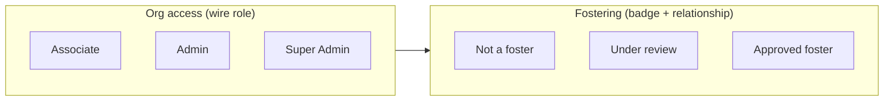

# Organisation people, permissions & foster v4 — delivery plan

**Status:** Locked for implementation (2026-08-06)  
**Parent:** [`decisions-log.md`](decisions-log.md) (D-v4-*) · [`organisation-ux-v3-delivery-plan.md`](organisation-ux-v3-delivery-plan.md)  
**Supersedes (partially):** D13 foster wire role · Admin contacts as standalone screen · immediate-save permissions UI · Apply Foster/Pet/Team Admin as top-level preset buttons

---

## Purpose

Unify organisation people management, simplify the role model, and separate **org access tier**
(associate / admin / super_admin) from **fostering status** (badge + onboarding). Deliver staged
permission editing, org-customisable default permission sets, foster invite improvements, and a
foster onboarding timeline on person profiles.

**Non-goals (this plan):**

| ID | Deferred |
|----|----------|
| **DEF-MSG** | In-app messaging transport (#569) |
| **DEF-NOTIF** | Full org-admin notification product (#568) |
| Foster invite email for **existing** users | In-app only (D-v4-FOSTER-2) |
| Email logo/contact block rendering | Template variables defined; rendering deferred |
| Timeline step action buttons | Read-only + org override confirm only in v4 Phase H |

---

## Locked decisions

All rows logged as **D-v4-*** in [`decisions-log.md`](decisions-log.md). Read that file before
implementing any phase.

### Conceptual model



| Axis | Values | Storage |
|------|--------|---------|
| Wire role | `associate` · `admin` · `super_admin` | `organization_users.role` |
| Foster badge | None · Under review · Approved · Needs attention · External | `org_foster_parents` + `approval_state` |
| Permissions | G0 defaults ∪ org tier defaults ∪ individual overrides | `organization_permissions` (per key) |

**Rules:**

- Every app member has a wire role; minimum = **associate**.
- External/manual fosters have no wire role until they register.
- `foster` wire role migrates → `associate` + foster relationship preserved.
- Foster Admin / Pet Admin / Team Admin are **UI group headers** in the detailed permission list only.

---

## Routes & navigation

| Route | Change |
|-------|--------|
| `/o/orgs/:id/people` | **New** — unified People directory |
| `/o/orgs/:id/people?filter=admins` | Admin contacts nav row destination (same screen, filtered) |
| `/o/orgs/:id/admin-contacts` | **Redirect** → `/people?filter=admins` (then remove route) |
| `/o/orgs/:id/customisations/roles` | Redesign — staged save, bulk selection, new preset buttons |
| `/o/orgs/:id/customisations/bundle-defaults` | **New** — org default permission sets per tier |
| `/o/orgs/new` | Same template as edit (branding hero, Create / Cancel) |
| `/o/orgs/:id/edit` | Primary button **Save** (not "Edit Organisation") |

### Profile nav row order (member tier)

1. **Admin contacts** → People `filter=admins` (label unchanged)
2. **People** → People (unfiltered) — **new**
3. Foster parents → `/fosters` (unchanged)
4. Fostering sessions → `/sessions`
5. Pets → `/pets`
6. Connected organisations → `/connections`
7. Organisation Administration → `/customisations`

---

## Phase A — Create / Edit organisation parity

| Field | Value |
|-------|-------|
| **Branch** | `cursor/org-v4-a-create-edit-form-63a7` |
| **Exit** | `bdd-journey` subset + widget tests |

### Scope

- `organization_form_screen.dart`: create path shows `OrganizationBrandingSection` (may require
  create-then-upload flow or deferred upload until org id exists — document chosen approach in PR).
- Primary CTA: **Create** / **Save** (ARB keys).
- Create: **Cancel** navigates back without save; no Delete.
- Edit: Delete unchanged (`manage_permissions` gate).

### Tests

- Widget: create shows hero + Cancel; edit shows Save + Delete.
- Update any BDD referencing "Create Organisation" / "Edit Organisation" button labels.

### Exit criteria

- [ ] Create and edit share the same visual template
- [ ] Button labels Create / Save / Cancel per D-v4-EDIT-1
- [ ] Branding upload works on create (or documented two-step if blocked by missing org id)

---

## Phase B — People screen & Admin contacts retirement

| Field | Value |
|-------|-------|
| **Branch** | `cursor/org-v4-b-people-screen-63a7` |
| **Exit** | `bdd-journey` |

### Scope

**Flutter**

- New `organization_people_screen.dart`:
  - `GET /people` via `orgPeopleProvider`
  - Search by name (client filter v1; server `?q=` optional debt)
  - `OrgPersonTile` grid — all kinds in one list
  - Order: self pinned → alphabetical last name
  - Query param `filter=admins` → admin + super_admin only
- Profile nav: add **People** row above Pets (`D-v4-NAV-1`)
- Admin contacts row → `/people?filter=admins`
- Remove `admin_contacts_screen.dart` (or thin redirect wrapper one release)
- Delete route `/admin-contacts` after redirect period

**Permissions**

- Screen visible to all org members (no `view_admin_contacts` gate on entry)
- Per-tile phone/message/edit gated by existing privacy + permission keys

### Test migration

| Asset | Action |
|-------|--------|
| `admin_contacts.feature` | Retarget steps to People screen + `filter=admins` |
| `organisation_profile.feature` | Add People nav row; admin contacts → filtered People |
| `organisation.admin-contacts.spec.ts` | Update URLs + selectors |
| `admin_contacts_screen_test.dart` | Remove or repoint to People screen tests |
| Keys `admin_contacts_*` | Rename to `org_people_*` where needed (snag ladder: same PR if ≤15 lines/key) |

### Exit criteria

- [ ] `/people` lists all people kinds in one grid
- [ ] Admin contacts nav opens filtered People; label unchanged
- [ ] `/admin-contacts` redirects or is removed
- [ ] BDD admin contacts scenarios pass against People + filter
- [ ] Self-card pinning preserved

---

## Phase C — Wire role retirement & foster badge

| Field | Value |
|-------|-------|
| **Branch** | `cursor/org-v4-c-role-badge-63a7` |
| **Exit** | Jest migration + `bdd-journey` |

### Scope

**Backend**

- Migration: `UPDATE organization_users SET role = 'associate' WHERE role = 'foster'` (and
  `pending_foster` → `pending_associate` if applicable).
- `orgRoles.js`: remove `ORG_ROLE_FOSTER` from assignable roles; update
  `assignableRolesFor`, `FOSTER_PARENT_MEMBER_ROLES` (foster directory uses relationship not wire role).
- Invite API: remove `foster` from invitable wire roles.
- G0 default grants: map former foster defaults to associate tier + foster badge logic.

**Flutter**

- `OrgMemberRole`: deprecate `foster` / `pendingFoster` (parse legacy wire as associate).
- `OrgPersonTile`: role bar = Associate / Admin / Super Admin only.
- Foster **badge** pill below name (see §Foster badge visual spec).
- Update `org_person_role_bar.dart` — remove foster bar colour as wire role; badge uses foster tokens.

### Foster badge visual spec

| State | Label (EN) | Style |
|-------|------------|-------|
| Under review | Foster · Under review | `organizationLight` bg, `organizationPrimary` text |
| Approved | Foster | `organizationPrimary` fill, white icon |
| Needs attention | Foster · Needs attention | White fill, `danger` 2px ring |
| External | Foster · External | Same as under review |

Stacking: **role bar** (top of meta) + **badge** (below name). Super-admin + approved foster
shows both (D-v4 answer #8).

### Exit criteria

- [ ] No new assignments of wire role `foster`
- [ ] Migration applied; Jest role matrix updated
- [ ] Tiles show wire role + foster badge independently
- [ ] D-v3-TILE-2 updated in code: foster light-teal bar removed for wire role (badge only)

---

## Phase D — People multi-select & bulk actions shell

| Field | Value |
|-------|-------|
| **Branch** | `cursor/org-v4-d-people-bulk-63a7` |
| **Exit** | widget tests + Playwright smoke |

### Scope

- Selection mode on People screen (checkbox overlay or long-press — pick one, document in PR).
- Nav context: bulk actions menu when ≥1 selected.
- Menu items (v1):
  - **Change role** → `/customisations/roles?people=<ids>` (or extra state)
  - **Onboard as foster** (Phase G may add; stub disabled until G if needed)
- Pass selected people to Roles & Permissions via router `extra` or query.

### Exit criteria

- [ ] Multi-select works on People grid
- [ ] Bulk menu appears in app bar context area
- [ ] Change role navigates to permissions with selection pre-loaded

---

## Phase E — Staged Roles & Permissions editor

| Field | Value |
|-------|-------|
| **Branch** | `cursor/org-v4-e-permissions-staged-63a7` |
| **Exit** | Jest batch API + `bdd-journey` |

### Scope

**UI**

- Selected people chips at top (removable ✕); search to add more.
- Preset buttons: **Apply Associate**, **Apply Admin**, **Apply Super Admin**.
- Preset click: set toggles per org tier defaults; OFF extras; show confirm snackbar/dialog before
  staging (D-v4-PERM-4).
- **Detailed permissions** — `ExpansionTile` collapsed by default.
- Permission list grouped by headers: **Foster Admin**, **Pet Admin**, **Team Admin** (D-v4-PERM-3).
- Tri-state toggle widget for bulk mismatches (indeterminate centre).
- Pending change: blue disc (or arrow) trailing icon — uniform size; Semantics "Pending change".
- **Save** commits all staged diffs; **PopScope** warns on leave.

**Backend**

- `POST /:orgId/permissions/batch` (or similar): body `{ changes: [{ user_id, permission_key, granted: bool }] }`
  transactional per user; audit per key (D16).
- Wire role change remains separate endpoint; preset may also stage role change if tier switch
  (Associate/Admin/Super Admin) — clarify in API: preset applies permission keys only; wire role
  changed via explicit role control if present.

**Person profile**

- **Edit permissions** button → same screen with single person pre-selected (D-v4 answer #9).

### Exit criteria

- [ ] No API call until Save
- [ ] Indeterminate state for mismatched keys
- [ ] Preset buttons Apply Associate/Admin/Super Admin
- [ ] Group headers Foster/Pet/Team Admin in detailed list
- [ ] Leave warning on unsaved changes
- [ ] `organisation_permissions.feature` updated

---

## Phase F — Org default permission sets

| Field | Value |
|-------|-------|
| **Branch** | `cursor/org-v4-f-org-bundle-defaults-63a7` |
| **Exit** | Jest + widget tests |

### Scope

**Data model**

```sql
-- Illustrative — final schema in migration PR
CREATE TABLE organization_role_permission_defaults (
  organization_id UUID NOT NULL REFERENCES organizations(id),
  role_tier VARCHAR(16) NOT NULL, -- 'associate' | 'admin' (super_admin not editable)
  permission_key VARCHAR(64) NOT NULL,
  granted BOOLEAN NOT NULL DEFAULT true,
  PRIMARY KEY (organization_id, role_tier, permission_key)
);
```

**Rules (D-v4-PERM-5)**

- Effective defaults for a tier = **G0 role defaults ∪ org rows** (org adds/removes from preset).
- Super-admin tier: G0 only; **no org override UI**.
- Administration screen: "What bundle do you want to adjust?" → three buttons (Associate / Admin /
  Super Admin read-only for super) → toggle keys → Save with **org-wide apply warning**.
- On org save: rewrite affected users' permission overrides to match new tier defaults (with
  warning); individuals with extra grants may need manual fix (user acknowledged).

### Exit criteria

- [ ] CRUD API for org tier defaults (`manage_permissions`)
- [ ] Administration UI route `/customisations/bundle-defaults`
- [ ] Preset buttons in Phase E read from org defaults ∪ G0
- [ ] Confirm dialog on org-wide apply

---

## Phase G — Foster invite flows & email templates

| Field | Value |
|-------|-------|
| **Branch** | `cursor/org-v4-g-foster-invite-63a7` |
| **Exit** | Jest + BDD |

### Scope

**Flows**

1. **Existing connection, not foster** — People card or bulk **Onboard as foster**.
2. **Not on AgathaTrack** — Foster Parents section: person+ icon, email only →
   `Invitation to foster via AgathaTrack` email (EN/FR).
3. **Existing AgathaTrack user, not connection** — Foster Parents email → in-app notification
   "Foster for {org}" (no email).
4. Both paths → connection + foster `under_review`.
5. **Manual add** retained.

**Email templates**

- New section under Document templates → **Email templates**.
- Default template id: `foster_invitation_new_user` (EN/FR).
- Separate template: `foster_invitation_existing_user` (for when email ships later).
- Variables (v1): `{{org.name}}`, `{{org.description}}`, `{{org.contact_email}}`,
  `{{inviter.name}}`, `{{inviter.role}}`, `{{signup_url}}`, `{{org.logo_url}}`.

### Exit criteria

- [ ] Email sent for new users only
- [ ] In-app notification for existing users
- [ ] Template storage + org override hook (editor may be minimal v1)
- [ ] `foster_onboarding.feature` extended

---

## Phase H — Foster onboarding timeline

| Field | Value |
|-------|-------|
| **Branch** | `cursor/org-v4-h-foster-timeline-63a7` |
| **Exit** | widget tests + BDD skeleton |

### Scope

**Widget:** `FosterOnboardingTimeline` on `organization_person_detail_screen.dart` below contact
details. Title: **Foster onboarding status**. Shown when person has foster relationship.

**Visual (D-v4-FOSTER-3)**

- Vertical spine left; cards right (`Card` theme, 16px radius).
- Disc states:
  - **Complete:** `organizationPrimary` fill + **white checkmark**
  - **Current:** `organizationPrimary` fill, no check; spine fades below
  - **Not started:** hollow, `outline` border
  - **Issue:** white fill, `danger` 2px ring
- Deferred steps: disc + card subtitle "Not recorded yet".

**Steps (v1 — all shown; data may be deferred)**

| Step | Backend readiness | Org override |
|------|-------------------|--------------|
| Connected to organisation | Ready | Confirm button |
| Profile on AgathaTrack | Ready | Confirm button |
| Invitation accepted | Partial | Confirm button |
| Under review | Ready (`approval_state`) | Approve path exists separately |
| Onboarding form completed | Deferred | Confirm override |
| Home visit recorded | Deferred | Confirm override |
| Competencies confirmed | Partial | Confirm override |
| Agreement signed | Deferred | Confirm override |
| Approved foster | Ready | Approve action |

**Org override API (new)**

- `POST /:orgId/people/:kind/:id/foster-onboarding/steps/:stepKey/confirm`
- Gated: `review_foster_onboarding` or `manage_fosters`
- Writes audit event `foster_onboarding_step_confirmed` with `{ step_key, confirmed_by }`

### Exit criteria

- [ ] Timeline renders on foster person profiles
- [ ] Checkmark-in-disc for completed steps
- [ ] Org staff can confirm/override any step
- [ ] Deferred steps visible with placeholder copy
- [ ] Open questions documented in `docs/refactoring-debt.md` for missing form/home-visit/agreement data

---

## API summary (new/changed)

| Method | Path | Purpose |
|--------|------|---------|
| `GET` | `/people?q=` | Optional server name search (debt if not in B) |
| `POST` | `/permissions/batch` | Staged save from Phase E |
| `GET/PUT` | `/role-permission-defaults` | Org tier defaults (Phase F) |
| `POST` | `/people/:kind/:id/foster-onboarding/steps/:stepKey/confirm` | Timeline override (Phase H) |
| `POST` | `/foster-invite` | Dedicated foster invite (Phase G) |

---

## Permission UI — tri-state control spec

| Selected people state | Control appearance | On user toggle |
|-----------------------|-------------------|----------------|
| All ON | Switch ON | Stage OFF for all |
| All OFF | Switch OFF | Stage ON for all |
| Mixed | **Indeterminate (centre)** | Stage chosen value for **all** |
| Staged change | Trailing blue disc | — |

Accessibility: `Semantics` value `mixed` where supported; label includes "varies by person" in
mixed state.

---

## Email template — default copy skeleton (EN)

Subject: `{{org.name}} invited you to foster via AgathaTrack`

Body sections:

1. What AgathaTrack is (1–2 sentences, calm tone)
2. About `{{org.name}}` — `{{org.description}}`
3. Invited by `{{inviter.name}}` (`{{inviter.role}}`)
4. What happens next — profile creation, vetting steps, community benefits
5. CTA button → `{{signup_url}}`
6. Contact: `{{org.contact_email}}`

FR variant required in same phase.

---

## Testing strategy

| Phase | Jest | Flutter | BDD / Playwright |
|-------|------|---------|------------------|
| A | — | form widget tests | org create/edit scenarios |
| B | people filter | People screen tests | `admin_contacts.feature` migration |
| C | role migration, assignable roles | badge widget tests | role label scenarios |
| D | — | selection tests | People bulk smoke |
| E | batch permissions | tri-state widget tests | `organisation_permissions.feature` |
| F | org defaults CRUD | defaults screen tests | customisations feature |
| G | foster invite routes | dialog tests | `foster_onboarding.feature` |
| H | step confirm API | timeline golden/widget | new timeline scenarios |

Mark superseded v3 admin-contacts-only scenarios `@legacy` only if behaviour is fully replaced
(same PR must add replacement scenarios — BDD gate denominator unchanged per D-v2-BDD-1).

---

## Open questions (deferred to implementation PRs)

| # | Question | Owner phase |
|---|----------|-------------|
| Q1 | Create-org branding upload before org id exists — two-step create vs deferred upload? | A |
| Q2 | Onboarding form / home visit / agreement — which G1 tables when timeline override fires? | H → debt |
| Q3 | Batch permission API: single transaction all users vs per-user partial failure UX? | E |
| Q4 | `filter=admins` include pending_admin invites in filtered view? | B |

---

## Branch & merge policy

Single-agent sequential PRs to `main` per phase (D33). Rebase on `main` before each push;
`./scripts/pre-push-changed.sh` during iteration.

Suggested execute-plan snapshot: `.agents/plans/organisation-v4-people-perms.md` (create when
starting Phase A).

---

## Related docs to update when implementing

- [`program-contract.md`](program-contract.md) §4 — wire roles (3 not 4)
- [`g0-contract-pack.md`](/docs/domains/fostering/features/g0-contract-pack.md) §4.3 — foster badge note
"- [`docs/api-reference.md`](/docs/api-reference.md) 2014 new routes
- [`j1-foster-onboarding.md`](/docs/domains/fostering/features/j1-foster-onboarding.md) — invite flows reopened
