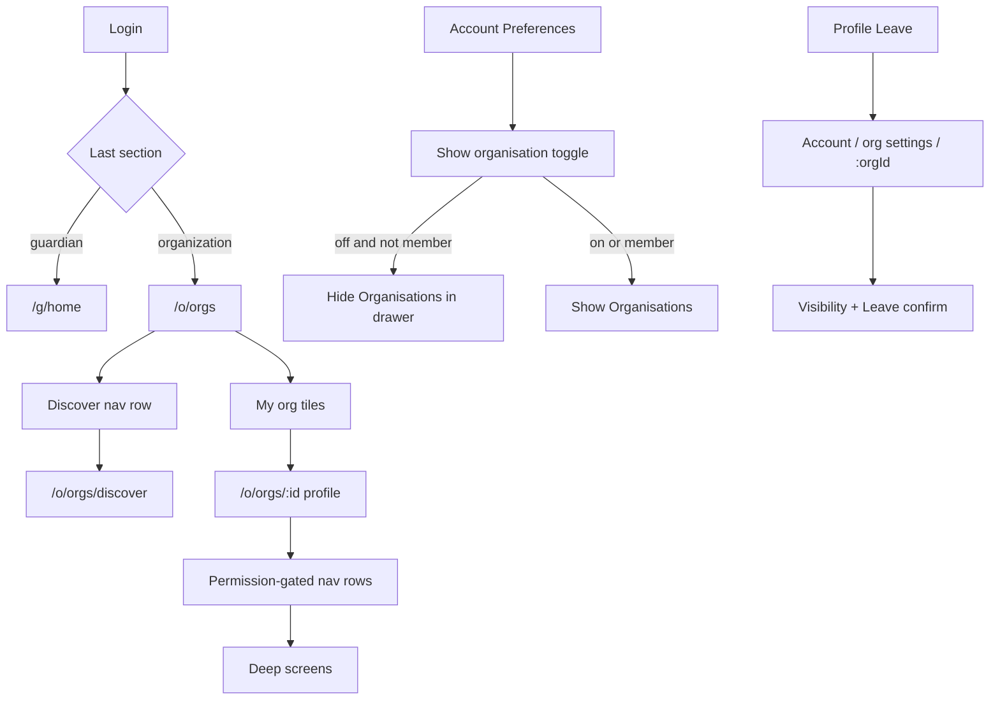

# Organisation UX v3 — delivery plan

**Status:** Locked for planning — awaiting `approve-autonomous` on execute-plan control issue  
**Parent:** [`organisation-v2-delivery-plan.md`](organisation-v2-delivery-plan.md) · [`decisions-log.md`](decisions-log.md)  
**Execute-plan:** `.agents/plans/organisation-ux-v3-badd.md` (chained slices `v3a` / `v3b` if 48h window requires split)  
**Created:** 2026-08-04  
**Last updated:** 2026-08-04

---

## Purpose

Evolve the Organisation area after v2’s profile composer: opt-in org visibility, simplified login routing, consistent teal chrome, dashboard/discover tile IA, profile as **nav-row composer** (no section previews), people directories as pet-style tiles, Account-owned per-org privacy settings, and a P0 fix for org cover/logo upload on UAT.

**Non-goals (deferred — debt issues at plan start):**

| ID | Deferred topic | Issue |
|----|----------------|-------|
| **DEF-NOTIF** | Full org-admin actionable notification system (deep links, resolved-after-act, per-section queues) | #568 |
| **DEF-MSG** | Org messaging inbox (admins follow messages to/from the org); in-app DM transport | #569 |
| **DEF-NOTIF-COUNTS** | Badge counts on profile nav rows for pending work | #570 |

This plan may show **message** affordances and **count placeholders** only where UI requires them; transport and org-notification product remain deferred.

---

## Locked decisions (v3)

Append to `decisions-log.md` in Phase 0.

| ID | Decision |
|----|----------|
| **D-v3-VIS-1** | Organisation drawer item is **hidden by default**. Shown when (a) user enables “Show organisation section”, or (b) user is a member of ≥1 org (toggle **forced on + disabled** with explanation). |
| **D-v3-VIS-2** | Default-experience **radios removed** everywhere (Account + My Details). Login restores **last active section** (guardian home vs org dashboard). |
| **D-v3-IA-1** | Org profile member sections are **nav rows only** (pet-profile Timeline style) — **no previews**. Optional **counts** on rows (pets, people, connections). Supersedes **D-v2-IA-4** pet preview as primary IA. |
| **D-v3-IA-2** | Discover is a **dedicated screen**; dashboard shows a single Discover nav row. |
| **D-v3-IA-3** | “Organisation Administration” (renamed customisations) is a **profile nav row only** (same privileges as today). Supersedes **D25** entry-point rule. Edit screen no longer links to it. |
| **D-v3-IA-4** | Delete organisation lives on **Edit** only; profile `…` menu keeps Invite / Members / Leave (Leave **redirects** to Account per-org settings). |
| **D-v3-NAV-1** | Org-area scaffold: light teal background (`organizationLight`). Dashboard nav: Agatha logo + title + unified bell + contextual `+`. In-org screens: org logo (thumbnail) + adaptive title + bell — **no** Agatha logo except dashboard; **no** org logo on profile (already in hero). |
| **D-v3-NAV-2** | Title typography: start `titleMedium`; wrap ≤2 lines; scale down to ≥12sp; then ellipsis. |
| **D-v3-DISC-1** | Discover search = server `GET /organizations/discover?q=` (name), debounced; pagination preserved. |
| **D-v3-DISC-2** | Discover back + banner: remember entry context — dashboard → “browsing as {user display name}”; from org connected-orgs → “browsing as {org name}”. Reuse stack/`extra` return pattern. |
| **D-v3-TILE-1** | My Orgs tiles: pet-card chrome; no hero → solid teal. Prefer full-bleed top hero + meta (align Discover) over awkward left 1/6 on mobile. |
| **D-v3-TILE-2** | Discover / people tiles: top 2/3 media, bottom 1/3 meta. Role separator: Super Admin black / Admin teal / Foster light teal / Associate white / pending grey / external foster = foster. Colour **plus** role label (a11y). |
| **D-v3-MSG-1** | People tiles: **in-app message** affordance only (no mailto). Phone if visibility allows. Full messaging = **DEF-MSG**. Until messaging ships: affordance opens a clear “coming soon” / debt stub **or** is hidden behind feature flag — prefer **visible disabled with tooltip** only if product insists; default **hide until DEF-MSG**. |
| **D-v3-PRIV-1** | All per-org privacy + Leave live under **Account → Organisation settings → {org}** (one screen per org). Self-edit on people directories removed. Supersedes **D26** entry point. |
| **D-v3-PRIV-2** | Visibility matrix (defaults): see §Privacy model. Super Admin always sees member **name** and may message (when messaging exists). |
| **D-v3-EDIT-1** | Edit layout unboxed; cover CTA = “Upload cover”; logo CTA = “Upload logo”; name editable in display position. Hero logo ~96px overlapping cover; name in band to the right of logo. |
| **D-v3-UPLOAD-1** | Logo/cover upload must succeed for valid JPG/PNG/WebP ≤2MB; UI surfaces **server error text** clearly. |
| **D-v3-NOTIF-1** | No new org-notification profile section this plan (**DEF-NOTIF**). Unified bell unchanged. |

---

## Privacy model (Account per-org)

One screen per org membership. Confirm dialog for Leave.

| Setting | All members / Associate | Admin / Super Admin | Foster |
|---------|-------------------------|---------------------|--------|
| Leave organisation | ✓ | ✓ | ✓ |
| Who can see member card | Default **all**; floor: Super Admin always sees name | Default **all**; floor: **admins** minimum | Default **all**; floor: Super Admin always sees name |
| Who can see phone | Default: **admins** OR **named people** | Same | Default: **admins + foster managers** (`manage_fosters`) OR **named** |
| Who can see email | Default: **admins** OR **named** | Same | Default: **admins + foster managers** OR **named** |
| Who can see address | **Admins** + **named** | Same | Same |

**Named people:** allowlist of org members chosen by the subject. Server enforces; UI picker lists active members of that org.

**Data model (Phase 8):**

- Columns on `organization_users` (and foster parent row where needed): `card_visibility`, `phone_visibility`, `email_visibility`, `address_visibility` (enum set TBD in Phase 0 design note).
- Table `organization_visibility_grants (organization_id, subject_user_id, grantee_user_id, field)` unique on tuple.
- Migrate / map existing foster + admin self-prefs into the unified model; remove duplicate edit UIs from org directories.
- Audit: `member_visibility_changed` (extend program-contract catalog).

---

## Architecture overview



### Chrome rules

| Screen class | Background | Leading / title | Trailing |
|--------------|------------|-----------------|----------|
| Org dashboard | teal light | Agatha logo + “Organisations dashboard” | `+` create, bell |
| Discover | teal light | Back (context) + title | bell |
| Org profile | teal light | Back + multi-line title (no logos in nav) | Edit (if permitted), `…`, bell |
| Other in-org | teal light | Org logo thumbnail + adaptive title | contextual actions, bell |

### Profile nav rows (member tier, permission-gated)

Order:

1. Admin contacts → `/admin-contacts` (+ count)
2. Foster parents → `/fosters` (+ count)
3. Fostering sessions → `/sessions`
4. Pets → `/pets` (+ count)
5. Connected organisations → `/connections` (+ count)
6. Organisation Administration → `/customisations` (rename title; `manage_permissions` / current gate)

Public tier unchanged (hero, legal, contact). No org-notifications row (**DEF-NOTIF**).

---

## Testing strategy (every phase)

| Layer | Requirement |
|-------|-------------|
| Pure / unit | Visibility resolution, discover `q` matching, toggle eligibility, last-section persistence, upload MIME helpers |
| Jest | New/changed routes; permission + privacy enforcement; discover `?q=`; upload 400 body contract |
| Flutter widget | New tiles, nav chrome, Account org settings, profile nav rows, edit CTAs |
| BDD Gherkin | New/extend features listed per phase; `@legacy` on superseded scenarios |
| Playwright | `@bdd` exact title match; page objects updated; synthetic seed data in `e2e/playwright/support` |
| Gates | `check_file_size.js`; `pre-push-changed.sh` per PR; `pre-push.sh` before integration→main; BDD coverage ratchet in hardening |

**TDD order:** failing test → implementation → green → babysit+.

---

## Delivery phases

Phases map 1:1 to execute-plan snapshot IDs. Integration branch:

`cursor/organisation-ux-v3-integration-badd`

Phase PRs → integration. **One** PR integration → `main`. Then **pre-UAT monitor loop** (Phase INT+).

If autonomy window &lt; remaining work: split execute-plan at Phase 7 boundary into `organisation-ux-v3a-badd` / `organisation-ux-v3b-badd` and chain via execute-plan roadmap chaining.

---

### Phase 0 — Decisions, docs, debt issues

| Field | Value |
|-------|-------|
| **id** | `0` |
| **branch** | `cursor/org-ux-v3-0-docs-badd` |
| **exit_checklist** | `governance` |
| **spawn_allowed** | `false` |

**Scope:**

- Append D-v3-* to `decisions-log.md`; header-note supersessions (D25, D26, D-v2-IA-4, default-experience radios).
- Mark this delivery plan as source of truth for v3 IA.
- Update `docs/architecture/index.md` pointer; `docs/refactoring-log.md` ownership map for spawn phases.
- Open debt issues: **DEF-NOTIF**, **DEF-MSG**, **DEF-NOTIF-COUNTS** (labels `tech-debt`, `plan:organisation-ux-v3-badd`).
- Privacy enum design note in this doc or `docs/architecture/org-member-privacy.md` (short).

**Tests:** none (docs).

**Exit:**

- [ ] Decisions log updated
- [ ] Three debt issues opened and linked from plan
- [ ] Ownership map published for later spawn phases

---

### Phase 1 — Org image upload P0 (UAT 400)

| Field | Value |
|-------|-------|
| **id** | `1` |
| **branch** | `cursor/org-ux-v3-1-upload-badd` |
| **exit_checklist** | `single-backend-route` |
| **spawn_allowed** | `false` |

**Why first:** Blocks branding; independent; reduces UAT noise while UI work proceeds.

**Scope:**

- Reproduce JPEG multipart → 400 (`content-length: 54` ≈ MIME reject). Fix client field name / MIME, and/or server `fileFilter` / `extensionForMime` for browser `image/jpg` / empty type with sniffing.
- Ensure both `/logo` and `/photo` (cover) paths covered.
- Flutter: surface `error` JSON to SnackBar / inline error (never silent fail).
- Jest: multipart fixtures for jpg/png/webp success; rejected type returns stable message; Flutter widget/datasource test for error display.

**BDD:** extend `organisation_edit.feature` — “Super admin uploads organisation logo” / cover scenarios → `organisation.edit.spec.ts`.

**Exit:**

- [ ] Jest green for upload success + rejection
- [ ] Widget/datasource shows server message
- [ ] Manual/UAT-repro checklist in PR body

---

### Phase 2 — Show-org toggle + last section + remove experience radios

| Field | Value |
|-------|-------|
| **id** | `2` |
| **branch** | `cursor/org-ux-v3-2-visibility-badd` |
| **exit_checklist** | `bdd-journey` |
| **spawn_allowed** | `false` |

**Scope:**

- Preferences store: `show_organisation_section` (bool); `last_app_section` (`guardian` \| `organization`).
- Account Preferences: Show organisation toggle + copy; when member → disabled + explanation.
- Remove `ExperienceSettingsSection` radios from Account and My Details; delete/legacy chooser paths that force default-experience UI.
- Drawer: filter Organisation entry per D-v3-VIS-1.
- Login / experience resolve: route to last section (fallback guardian); on drawer switch update `last_app_section`.
- When membership becomes &gt;0 (join/create): force show-org on.
- Unit tests: eligibility matrix (non-member off/on; member locked on).
- BDD: `account_area.feature` / `experience_navigation.feature` — update scenarios; `@legacy` radio scenarios.

**Exit:**

- [ ] Pure guardian can enable toggle → see org dashboard → create org
- [ ] Member cannot disable toggle
- [ ] Relogin restores last section
- [ ] BDD + Playwright mapped for critical paths

---

### Phase 3 — Org-area chrome

| Field | Value |
|-------|-------|
| **id** | `3` |
| **branch** | `cursor/org-ux-v3-3-chrome-badd` |
| **exit_checklist** | `flutter-screen-split` |
| **spawn_allowed** | `false` |

**Scope:**

- Shared `OrgShellAppBar` / theme helpers: teal scaffold, bell, title scaling (D-v3-NAV-1/2).
- Apply across `/o/*` list, profile, deep screens (incremental but complete within phase).
- Dashboard: Agatha logo + “Organisations dashboard” + `+` create.
- Widget tests for title overflow behaviour.

**Exit:**

- [ ] Spot-check matrix of org routes uses teal + correct nav variant
- [ ] Analyze + widget tests green

---

### Phase 4 — Dashboard My Orgs tiles + Discover entry

| Field | Value |
|-------|-------|
| **id** | `4` |
| **branch** | `cursor/org-ux-v3-4-dashboard-badd` |
| **exit_checklist** | `bdd-journey` |
| **spawn_allowed** | `false` |

**Scope:**

- My Orgs: pet-style tiles; hero or solid teal; logo overlay; tap → profile.
- Replace inline Discover section with nav row → `/o/orgs/discover`.
- Pending invites remain on dashboard.
- BDD: `organisation_management.feature` / discovery entry scenarios.

**Exit:**

- [ ] Dashboard no longer embeds discover grid
- [ ] Tile empty-hero = solid teal
- [ ] E2E: open dashboard → Discover row → discover screen

---

### Phase 5 — Discover screen + search + browse-as

| Field | Value |
|-------|-------|
| **id** | `5` |
| **branch** | `cursor/org-ux-v3-5-discover-badd` |
| **exit_checklist** | `bdd-journey` |
| **spawn_allowed** | `true` (optional: node discover vs flutter discover if split) |

**Scope:**

- Server: `GET /organizations/discover?q=&page=&page_size=` — name `ILIKE` when `q` non-empty; Jest table tests.
- Flutter Discover screen: pet-size tiles (2/3 hero, centred logo, name + postcode/town + type); search field debounced.
- Return context via route `extra` / query (`from=dashboard|org&orgId=`); back pops correctly.
- Banner: “You are browsing as {user|org name}”.
- Entry from Connected Orgs CTA uses same screen with org context.
- Synthetic data: discoverable orgs with/without photos for E2E.
- BDD: extend `organisation_discovery.feature`.

**Exit:**

- [ ] Search finds org beyond first page
- [ ] Back from dashboard vs from org connections both correct
- [ ] Banner copy correct for both contexts

---

### Phase 6 — Profile chrome, actions, header layout, edit shell

| Field | Value |
|-------|-------|
| **id** | `6` |
| **branch** | `cursor/org-ux-v3-6-profile-header-badd` |
| **exit_checklist** | `bdd-journey` |
| **spawn_allowed** | `false` |

**Scope:**

- Edit icon (not cog) → edit; Delete only on edit; `…` = Invite / Members / Leave→Account org settings.
- Hero: ~96px logo; name in band right of logo; type; description raised.
- Edit: unboxed; Upload cover / Upload logo CTAs + helper copy; editable name.
- BDD: `organisation_profile.feature`, `organisation_edit.feature`.

**Exit:**

- [ ] Widget tests for header geometry + menu items by role
- [ ] E2E: edit icon, delete on edit only

---

### Phase 7 — Profile nav rows (no previews) + Administration

| Field | Value |
|-------|-------|
| **id** | `7` |
| **branch** | `cursor/org-ux-v3-7-profile-nav-badd` |
| **exit_checklist** | `bdd-journey` |
| **spawn_allowed** | `false` |

**Scope:**

- Replace member section previews with `PetProfileSectionNav`-style rows + optional counts.
- Remove manage-link typo “Manage members” on connections.
- Administration row → customisations hub; rename screen title to “Organisation Administration”.
- Permission gates unchanged (`view_*` / manage keys).
- `@legacy` any Gherkin asserting inline pet/admin previews on profile.
- Widget tests per permission matrix (visible / hidden rows).

**Exit:**

- [ ] No pet/admin/connection preview widgets on profile
- [ ] Counts accurate for permitted viewers
- [ ] BDD updated

---

### Phase 8 — Account per-org privacy + Leave

| Field | Value |
|-------|-------|
| **id** | `8` |
| **branch** | `cursor/org-ux-v3-8-account-privacy-badd` |
| **exit_checklist** | `bdd-journey` |
| **spawn_allowed** | `false` |

**Scope:**

- Migration + Node APIs for unified visibility + named grants; Jest enforcement matrix (viewer role × field × named grant).
- Account: section listing orgs → one settings screen per org (D-v3-PRIV-*).
- Remove self-prefs editors from admin contacts / foster directory UIs (read-only display respects new rules).
- Profile Leave → `push` Account org settings (scroll/highlight Leave).
- Flutter unit tests for visibility pure functions.
- BDD: new `organisation_member_privacy.feature` (+ map Playwright).
- Synthetic users for named-grant E2E.

**Exit:**

- [ ] Server denies phone/email/address when not allowed
- [ ] Super Admin still sees names
- [ ] Leave confirm works from Account; profile Leave redirects
- [ ] Old self-prefs UI removed from org directories

---

### Phase 9 — People directory tiles (Admin + Foster)

| Field | Value |
|-------|-------|
| **id** | `9` |
| **branch** | `cursor/org-ux-v3-9-people-tiles-badd` |
| **exit_checklist** | `bdd-journey` |
| **spawn_allowed** | `true` (admin-contacts vs fosters widgets if disjoint) |

**Scope:**

- Shared `OrgPersonTile` (pet grid sizing): photo/smiley top 2/3; role colour bar + label; name; phone if allowed; message affordance per D-v3-MSG-1.
- Admin contacts + Foster parents screens use tile grid.
- Tap → person display profile; nav title “{Name} - Profile”.
- No inline Edit on self tile (settings via Account).
- BDD: extend `admin_contacts.feature`; foster directory scenarios.

**Exit:**

- [ ] Grid matches manage-pets sizing helpers
- [ ] Role bar + label for all roles including pending/associate
- [ ] Permissions hide message/phone correctly

---

### Phase 10 — Connected orgs + Pets deep-screen entry polish

| Field | Value |
|-------|-------|
| **id** | `10` |
| **branch** | `cursor/org-ux-v3-10-deep-screens-badd` |
| **exit_checklist** | `bdd-journey` |
| **spawn_allowed** | `false` |

**Scope:**

- Connections screen: uncollapse content; remove bottom Connect + mistaken Manage members; CTA → Discover with org browse-as context; back → profile.
- Pets: ensure profile button opens existing pets screen (guardian manage-pets layout parity; keep org filters).
- BDD/E2E updates for connections flow.

**Exit:**

- [ ] No connect button at bottom of connections
- [ ] Discover opened from connections returns to connections/profile path as specified
- [ ] Pets filters unchanged

---

### Phase 11 — Hardening: l10n, synthetic data, BDD gate, docs

| Field | Value |
|-------|-------|
| **id** | `11` |
| **branch** | `cursor/org-ux-v3-11-hardening-badd` |
| **exit_checklist** | `bdd-journey` |
| **spawn_allowed** | `false` |

**Scope:**

- EN + FR ARB for all new strings; gen-l10n.
- E2E fixtures/seeds for show-org, discover search, privacy grants, tiles without photos.
- Ratchet `check_bdd_coverage.js` if scenario count grew; update scorecard / journey matrix / refactoring-log.
- `/ui-check` pass on touched screens; file-size splits if needed.
- Full `./scripts/pre-push.sh` on integration tip.

**Exit:**

- [ ] FR+EN complete for v3 strings
- [ ] BDD gate green at new threshold
- [ ] pre-push.sh green on integration

---

### Phase 12 — Integration → main + pre-UAT monitor loop

| Field | Value |
|-------|-------|
| **id** | `12` |
| **branch** | `cursor/organisation-ux-v3-integration-badd` (PR head) |
| **exit_checklist** | `default` |
| **merge_mode** | `auto` (after green CI) |
| **spawn_allowed** | `false` |

**Scope:**

1. Single PR integration → `main`; babysit+; merge when green.
2. **Monitor** GitHub Actions **pre-uat-e2e** for that main SHA.
3. On failure: locally run **full** Playwright suite (`e2e` full org+guardian as in CI), fix every failure on a hotfix branch `cursor/org-ux-v3-preuat-fix-badd`, push to `main` via babysit+, re-watch next pre-uat-e2e.
4. Repeat until pre-uat-e2e **green**.
5. Do **not** poll deploy-uat / prod for this plan (CI-owned promotion). Document loop outcomes on control issue.

**Exit:**

- [ ] Integration merged to main
- [ ] pre-uat-e2e green for the landing SHA (or subsequent fix SHA)
- [ ] Control issue closed / plan autonomy `completed`

---

## Parallelism map (`/spawn-sprint-agents`)

Publish in `docs/refactoring-log.md` before spawn.

| When | Agents | Owns | Avoid |
|------|--------|------|-------|
| After Phase 0 | — | — | — |
| Phase 5 (optional) | `discover-api` \| `discover-ui` | `server/routes/organizations/discover*` + Jest \| Flutter discover screen + widgets + E2E discovery | Shared `api.ts` after foundation touch |
| Phase 9 (optional) | `admin-tiles` \| `foster-tiles` | `admin_contacts/**` \| `manage_fosters/**` + shared `OrgPersonTile` **only if extracted in foundation micro-PR first** | Same shared tile file concurrently |

**Default:** sequential phases on integration — safer for overlapping org presentation files. Enable spawn only when ownership map is disjoint.

---

## BDD / feature file matrix

| Feature file | Action |
|--------------|--------|
| `account_area.feature` | Extend: show-org toggle; last section; org settings entry |
| `experience_navigation.feature` | `@legacy` default-experience radio scenarios; add last-section login |
| `organisation_management.feature` | Dashboard tiles; Discover row; create `+` |
| `organisation_discovery.feature` | Dedicated screen; search; browse-as; back contexts |
| `organisation_profile.feature` | Nav rows; no previews; edit icon; Administration row |
| `organisation_edit.feature` | Unboxed edit; upload cover/logo; delete on edit; upload errors |
| `admin_contacts.feature` | People tiles; privacy display; no self-prefs editor |
| `organisation_customisations.feature` | Renamed Administration; entry from profile only |
| `organisation_member_privacy.feature` | **New** — Account per-org settings + Leave |
| Foster directory / manage fosters feature | Tile grid scenarios |
| Notifications features | **No change** this plan (DEF-NOTIF) |

Playwright specs mirror under `e2e/playwright/tests/organisation*.spec.ts` + `account*.spec.ts`.

---

## Localization

- All user-facing strings via ARB (`app_en.arb` / `app_fr.arb`).
- Key areas: show-org copy + disabled explanation; browse-as banner; upload CTAs/errors; Administration title; privacy field labels; role bar semantics; Discover search empty state.

---

## Synthetic / E2E data

| Seed | Purpose |
|------|---------|
| Guardian-only user | Toggle off by default; enable → create org |
| Dual-role user | Locked toggle; last-section login |
| Orgs with/without photo & logo | Tile fallbacks |
| Named discover orgs | Search `q=` hits beyond page 1 |
| Member A grants phone to member B | Privacy E2E |
| Pending invite + associate + foster | Role bar colours |

Prefer extending existing `e2e/playwright/support/api.ts` helpers in a **foundation** commit before parallel E2E work.

---

## Risks & mitigations

| Risk | Mitigation |
|------|------------|
| Privacy model larger than UI polish | Phase 8 isolated; enums documented in Phase 0; TDD matrix first |
| Messaging expected but deferred | D-v3-MSG-1 hide affordance; DEF-MSG debt |
| Overlap with unfinished org-v2 | Rebase integration on latest `main`; do not reopen closed v2 IA without decision log |
| File-size gate on profile/shell | `/split-flutter-screen` early in Phases 3/6/7 |
| pre-uat flaky WAF | Follow `docs/e2e/uat-waf-queue-lessons.md`; fix real failures only |
| 48h autonomy window | Split plan at Phase 7 if needed; re-approve chain |

---

## Sanity check

| Check | Result |
|-------|--------|
| Domains | Flutter experience + organization + Account; Node organizations + uploads + privacy; E2E; docs; l10n |
| Migrations | Yes (Phase 8) — no `Fixes #N` alone on migration PRs |
| Auth/security | Upload MIME; privacy enforcement server-side |
| Estimate vs 48h | **proceed-high-risk** as single approval — prefer **two** execute-plan IDs (`v3a` phases 0–6, `v3b` phases 7–12) or mid-run re-approve |
| Duplication | Reuses org theme, pet tiles, discover API, customisations hub |

**Verdict:** `proceed-high-risk` — approve with integration branch + babysit+ `auto` + explicit pre-UAT loop in Phase 12.

---

## Invocation

```bash
# After human review of this doc:
# 1. Author snapshot(s) from .agents/plans/organisation-ux-v3-badd.md
# 2. node scripts/validate_execute_plan_snapshot.js .agents/plans/organisation-ux-v3-badd.snapshot.json
# 3. node scripts/execute_plan_runtime.js init-control-issue organisation-ux-v3-badd
# 4. Human: approve-autonomous organisation-ux-v3-badd
# 5. /execute-plan organisation-ux-v3-badd
```

Babysit: **`/babysit-plus`** only, model **`composer-2.5`**.  
Workers: pre-PR critical self-review + `./scripts/pre-push-changed.sh`.
