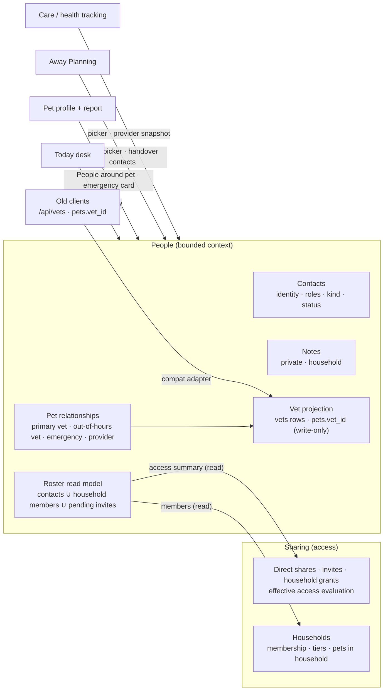

# People domain refactor — target model, gap analysis and delivery plan

**Status:** proposed 2026-09-29. **Execute-plan:** [`people-domain-refactor-7f3b`](/.agents/plans/people-domain-refactor-7f3b.md) (one integration branch, 18 phases, final PR to `main`).
**Canonical product spec (unchanged):** [people-care-team.md](/docs/domains/people/features/people-care-team.md) (D1–D28) · wording: [vocabulary.md](/docs/domains/people/features/vocabulary.md).

This document is the **engineering and UX target** for the People domain (UI label *Contacts* in English, *Autour de vos animaux* in French). It does not change product decisions D1–D28. Where it adds decisions, they are listed in §6 (R-01 … R-14) and apply only to *how* the spec is built.

---

## 1. Why

A review on 2026-09-29 found that the People data model and spec are sound, but the implementation is thin and leaky:

- **Two sources of truth for vets.** `vets` / `pets.vet_id` and `people_contacts` / `pet_contact_relationships` sync both ways, outside transactions, with a repair script (`server/scripts/reconcilePeopleVets.js`) to fix drift. The Flutter domain entity carries `legacyVetId`, and "linked pets" are derived from it.
- **No single owner of People rules.** Contacts are inserted in five server modules with different defaults. "Who can see or use this contact" is answered five different ways. Kind inference and carer/professional grouping are duplicated between the Flutter app and the server, and the two copies have drifted apart.
- **Four contact pickers with four filter rules** (pet vet, care provider, absence carer, works-at).
- **About half of the hub-remodel spec is missing:** no detail tabs or Related care, no household members or invites in the roster, no pet relationships UI (out-of-hours vet, emergency contacts), a partial add flow, and edit can't change roles.
- **Real bugs** (referenced as B1–B13 in the plan):

| # | Bug | Where (at `a780e19`) | Fixed in |
|---|---|---|---|
| B1 | Detail provider refetches in a loop until rate-limited (`PeopleContact` has no equality, `mergeLocal` re-triggers the watcher) | `flutter_app/lib/features/people/presentation/providers/people_providers.dart:92-96` | p6 |
| B2 | Renaming a contact without sending `kind` re-infers kind (clinic becomes a person) | `server/lib/people/contactMutations.js:121` | p1 |
| B3 | Vet-linked contacts can never be deleted (always 400) | `server/routes/people/contactsRouter.js:69` | p1 |
| B4 | Desktop master–detail nests the app shell in the left pane; selection resets search and filter | `.../people/presentation/screens/people_hub_screen.dart:23` | p9 |
| B5 | Today desk shows raw role codes and kind values | `.../pet_care_people_desk_module.dart:232` | p9 |
| B6 | Provider dropped from an occurrence when a co-parent or carer completes it | `server/lib/care/providerUsed.js:47` | p1 |
| B7 | PDF report vet block lost phone, email and address | `.../pet_profile/presentation/controllers/download_report_controller.dart:49` | p8 |
| B8 | Care provider picker lists inactive contacts and asserts on unknown values | `.../health_tracking/presentation/widgets/care_provider_field.dart:89` | p8 |
| B9 | Add screen: no error handling, "Change kind" toggle stuck, default role "Pet sitter" | `.../people/presentation/screens/people_add_person_screen.dart:125,171,45` | p12 |
| B10 | Deleting a contact silently clears care-item providers (`ON DELETE SET NULL`, no usage check) | contacts delete + migrations 074/080 | p1 |
| B11 | `PUT people-relationships` deletes all rows including the synced primary vet | `server/routes/pets/peopleRelationshipsRouter.js:110` | p2 |
| B12 | Care item `provider_contact_id` saved without an ownership check | `server/routes/healthEntries/crudRouter.js` | p1 |
| B13 | Edit shows raw API errors; delete errors classified by string-matching "400" | `.../people/presentation/screens/people_edit_screen.dart:98,180` | p11 |

The goal is a **robust, maintainable, elegant People component**. The backend is authoritative and one module owns the rules. The Flutter feature is typed and layered, and other features reach it through one façade. The UI is rich and calm, and matches the spec and the design system.

---

## 2. Design principles

1. **People is a bounded context.** It owns identity (contacts), pet relationships, notes, the roster read model and all People presentation. Other domains call it through a façade and never touch its tables or internals.
2. **The backend decides; clients render.** Group, status, usages, access summaries, "next up" facts and inference all come from the server. Flutter never re-derives business facts.
3. **One writer per fact.** Each table has exactly one module that writes it. Legacy shapes such as `vets` and `pets.vet_id` are *projections* written only by People.
4. **Access is evaluated in one place, at read time.** `server/lib/people/access.js` answers can-view, can-edit and can-attach. Nothing caches effective visibility.
5. **Additive API evolution.** Installed mobile clients keep working. Compat endpoints stay, backed by the new services.
6. **Typed at the edge, typed inside.** Wire strings stop at the DTO. Inside the app, kinds, roles, relationship kinds and statuses are enums with localized labels. Entities are immutable with value equality.
7. **One component per job.** One avatar, one person card, one status chip, one action bar, one picker, used on every surface: hub, desk, pet profile, care, Away Planning.
8. **Rows navigate, detail explains, edit changes, and only edit destroys.** Destructive actions live only in Edit → danger zone. Every removal lists what remains (D16).
9. **Calm by default.** *Inactive* is neutral, not red. *Needs review* is a warning chip with text. Errors never show raw backend output. Labels are not nudges ([copy-tone.md](/docs/design/copy-tone.md)).
10. **Guarded by tests, not by memory.** Architecture tests fail when a boundary is crossed (table writes outside `lib/people`, imports of People internals from other features). Regression tests pin every bug listed in §1.

---

## 3. Target model

### 3.1 Context map and ownership



| Concern | Owner | Others may |
|---|---|---|
| Contact identity, roles, kind, status, notes | People | Call façade functions; read DTOs |
| Pet ↔ contact relationships | People | Read via `GET /api/pets/:id/people`; change via People endpoints |
| Household membership, tiers, pets-in-household | Sharing / households (`server/lib/households`) | People reads through exported functions only |
| Household **directory** contacts and household notes | People | — |
| Effective pet access (who can see a pet) | Sharing (`server/lib/petAccess.js`) | People reads an access summary |
| Household **UI** (create, rename, members, pets) | People presentation (R-05) | Sharing keeps the grant APIs |
| `vets` table, `pets.vet_id` | People vet projection (write-only) | `/api/vets` compat adapter reads; nothing else |

### 3.2 Vocabulary (code)

| Term | Meaning | Notes |
|---|---|---|
| **Person** | One roster row: a contact, a household member, or a pending invite | Sealed type in Flutter (`Person`) |
| **Contact** | A directory record (identity layer, D11) | Lives in exactly one directory |
| **Directory** | Personal (one per user) or household (one per household) | Already in schema (072, 076) |
| **Kind** | `person` \| `organisation` | Set explicitly (R-03) |
| **Role** | sitter, walker, vet, vet_nurse, groomer, trainer, behaviourist, boarding, emergency_contact, other | Several per contact |
| **Group** | `carer` \| `professional`, derived from roles and kind on the server | Drives sections and pickers |
| **Relationship** | Pet ↔ contact with kind `primary_vet`, `out_of_hours_vet`, `emergency_contact`, `care_provider`, `other` | Slots: `primary_vet`, `out_of_hours_vet` (max one active each) |
| **Status** | `active` \| `inactive` | *Needs review* is a derived fact on plans/occurrences, not a contact status |
| **Usage** | Anything that references a contact: relationships, absence carers, care-item providers, carer invites, works-at | History snapshots are *not* usages |

Naming: domain and code say **People**. The EN UI label is **Contacts** and FR is **Autour de vos animaux** (vocabulary, 2026-09-29). Use *Person* for roster rows and *Contact* for directory records. Don't reuse `organizations` (frozen Shelter) or `care_holder_*` (custody).

### 3.3 Data model and invariants

**Authoritative tables** (People-owned): `people_directories`, `people_contacts`, `people_contact_roles`, `people_contact_private_notes`, `people_contact_household_notes` *(new, 084)*, `pet_contact_relationships` (+ `sort_order`, 083).

**Projections** (written only by `server/lib/people/vetProjection.js`): `vets` rows linked by `people_contacts.legacy_vet_id`, and `pets.vet_id`.

**Referencing tables** (other domains hold a `contact_id`, People decides usage rules): `planned_absence_pets.contact_id`, `health_entries.provider_contact_id`, `health_occurrences.provider_contact_id` (+ snapshot), `planned_absence_carer_invites.contact_id`, `planned_absence_guest_grants.contact_id`, `pet_share_invites.contact_id` *(new, 085)*.

| # | Invariant | Enforced by |
|---|---|---|
| I1 | A contact lives in exactly one directory; a directory is personal XOR household | Schema (072/076) |
| I2 | Only `server/lib/people/**` writes People tables and projections (migrations, seeds and migration scripts excepted) | `server/test/people/boundaries.test.js` |
| I3 | Kind changes only when a user sets it. It's inferred once at creation when omitted and never re-inferred | `contactsRepo` + regression test |
| I4 | At most one **active** relationship per pet for `primary_vet` and for `out_of_hours_vet` | Partial unique index (083) + service |
| I5 | `pets.vet_id` equals the `legacy_vet_id` of the pet's active `primary_vet` contact, or `NULL` | `vetProjection` + invariant test |
| I6 | `vets` rows are never read by product code; only the `/api/vets` compat adapter reads them | Boundary test |
| I7 | A contact with active usages can't be hard-deleted: `409 contact_in_use` with the usage list. History references are snapshots and never block | `usages.js` + tests |
| I8 | Inactive contacts are never offered as new picker choices, but stay visible where already used, marked Inactive (D18) | `PeopleQuery` + widget tests |
| I9 | Group is derived on the server only; clients never re-derive it | DTO `group` field; Flutter architecture test forbids role→group maps outside `domain/` enum mapping of the wire value |
| I10 | Private notes are visible only to their author. Household notes are visible only to that household's members. Neither is shown to the linked person | `access.js` + tests |
| I11 | Once an account is linked, name and email come from that account and are read-only for others (D9) | Server PATCH rejects; UI read-only |
| I12 | Occurrence history records the provider snapshot of the contact attached to the care item. The write is authorised by pet access, not by the completer's own directory | `snapshotForAuthorisedWrite()` + test |
| I13 | Effective visibility is computed at read time; nothing caches it | Code review + access tests |

**Pre-approved schema changes** (the only ones in this plan):

| Migration | Change | Data effect |
|---|---|---|
| `083_people_relationship_slots.sql` | `pet_contact_relationships.sort_order SMALLINT NOT NULL DEFAULT 0`; partial unique indexes `(pet_id) WHERE active AND relationship_kind = 'primary_vet'` and the same for `out_of_hours_vet` | Before creating the indexes, deactivate duplicate active slot rows, keeping the most recently updated one. Idempotent; logs the count |
| `084_people_household_notes.sql` | `people_contact_household_notes (contact_id, household_id, note, updated_by_user_id, updated_at, PK(contact_id, household_id))`, cascades from contacts and households; `updated_by_user_id` is `ON DELETE SET NULL` | None |
| `085_share_invite_contact_link.sql` | `pet_share_invites.contact_id UUID NULL REFERENCES people_contacts(id) ON DELETE SET NULL` + index | None |
| `086_household_invites.sql` | `household_invites (id, household_id, inviter_user_id, invitee_email, invitee_user_id, access_tier, is_organiser, contact_id, code UNIQUE, status CHECK (pending/accepted/declined/revoked/expired), created_at, responded_at, expires_at)` + indexes, following the `planned_absence_carer_invites` pattern (077) | None |

Anything else → halt (`escalation`).

### 3.4 Server architecture

```
server/lib/people/
  index.js              # façade — the only import other domains may use
  constants.js          # kinds, roles, ROLE_GROUP map, relationship kinds, slot kinds
  contactsRepo.js       # the single writer: create/update/setActive/delete/copy (+ roles, notes)
  access.js             # visibleDirectoryIds, canViewContact, canEditContact, canAttachContactToPet, careHandoverScope
  usages.js             # listUsages(contactId) → [{kind, id, label, pet_id?, active}]
  relationships.js      # listForPet, setSlot, add, remove, reorder — each re-projects legacy vet
  vetProjection.js      # project(petId) / projectContact(contactId) / rebuildAll() — writes vets + pets.vet_id
  roster.js             # buildRoster(userId) — contacts ∪ household members ∪ pending invites
  detail.js             # contactDetail(userId, id), relatedCare(userId, id), petPeople(userId, petId)
  inference.js          # inferContactKind (server-only), contactGroup(roles, kind)
  snapshots.js          # snapshotForAuthorisedWrite(contactId), userSnapshot
  errors.js             # PeopleError(code, status, details) → { error, code, details }
  absenceCarer*.js, contactCopyOnPetLeave.js   # keep; call contactsRepo/access, no raw inserts
server/routes/people/   # contacts, roster, related, by-legacy-vet
server/routes/pets/peopleRelationshipsRouter.js   # thin — delegates to relationships.js
server/routes/vets.js   # compat adapter → contactsRepo + vetProjection (response shape unchanged)
```

Rules:

- Routes stay thin: validate, authorise via `access.js`, call one service, map errors.
- Other domains (care, Away Planning, households, sharing, vets compat) import **only** `server/lib/people/index.js`.
- Errors are additive: `{ error: <public message>, code: <stable snake_case>, details?: {...} }`. Codes: `validation_failed`, `contact_not_found`, `forbidden`, `contact_in_use` (`details.usages[]`), `slot_conflict`, `linked_identity_read_only`.

### 3.5 Access policy

| Actor ↓ / contact → | In own personal directory | In household directory (member) | Related to a pet the actor can access |
|---|---|---|---|
| Directory owner | view · edit · delete · attach | — | — |
| Household **Full access** / organiser | — | view · edit · create · attach | view |
| Household **Can log care** | — | no directory view | view **only** within the care handover scope (primary vet, out-of-hours vet, emergency contacts, providers for care in the window) |
| Direct **co-parent** | own directory | — | view; attach own contacts; set slots (`userCanManageProfile`) |
| Absence **guest** | — | — | handover scope for the absence's pets and dates |
| Anyone else | — | — | nothing |

`canAttachContactToPet(user, contact, pet)` = user can manage the pet's profile **and** the contact is in one of: the user's editable directories, the pet owner's personal directory, or the pet's household directory.

### 3.6 API contract (target, additive)

| Method | Path | Purpose | Phase |
|---|---|---|---|
| GET | `/api/people/roster` | Hub + desk read model | p3 |
| GET | `/api/people/contacts` | Compat list; adds `group`, `status`, `directory` | p3 |
| POST | `/api/people/contacts` | Create; optional `pet_links[]` (p2) and `household_id` (p4) in the same transaction | p1 / p2 / p4 |
| GET | `/api/people/contacts/:id` | Detail: + `works_at`, `staff[]`, `usage_counts`, `household_note`, `linked_account` | p3 |
| PATCH | `/api/people/contacts/:id` | Update; + `active`, `household_note`; kind never re-inferred | p1 / p4 |
| DELETE | `/api/people/contacts/:id` | `200` or `409 contact_in_use` with usages; vet-linked allowed when unused | p1 |
| GET | `/api/people/contacts/:id/related` | Related care: pets, care items as provider, absences as carer, history count | p3 |
| GET | `/api/people/contacts/by-legacy-vet/:vetId` | `{ id }` for legacy deep links | p3 |
| GET | `/api/pets/:petId/people` | "People around {pet}": household members, carers, professionals, slots; scope-aware | p3 |
| PUT | `/api/pets/:petId/people-relationships/slots/:kind` | Set or clear `primary_vet` / `out_of_hours_vet` | p2 |
| POST | `/api/pets/:petId/people-relationships` | Add `emergency_contact` / `care_provider` / `other` | p2 |
| DELETE | `/api/pets/:petId/people-relationships/:relationshipId` | Remove one | p2 |
| GET/PUT | `/api/pets/:petId/people-relationships` | Compat; PUT routed through service and re-projects | p2 |
| GET | `/api/households/:id/members/:userId/removal-preview` | Access the member keeps after removal, per pet and source (D16) | p4 |
| POST | `/api/households/:id/invites` | Invite by email with tier (+ optional `contact_id`); organisers only (D3) | p5 |
| GET/POST | `/api/households/invites/code/:code` (+ `/accept`, `/decline`) | Invite landing, accept, decline | p5 |
| DELETE | `/api/households/:id/invites/:inviteId` | Revoke a pending invite | p5 |
| POST | pet share invite create (existing route) | Accepts optional `contact_id`; accept links `linked_user_id` | p5 |
| * | `/api/vets` | Compat adapter; unchanged shapes; documented as deprecated | p2 |

**DTO sketch** (wire, snake_case; dates `YYYY-MM-DD`):

```jsonc
// ContactSummary (roster, lists, pickers)
{ "id": "…", "directory": { "type": "personal" | "household", "household_id": null },
  "kind": "person", "name": "Jamie Taylor", "roles": ["sitter"], "group": "carer",
  "status": "active", "linked_user_id": null, "works_at": { "id": "…", "name": "…" },
  "pets": [{ "pet_id": "…", "pet_name": "Buddy", "relationship_kind": "emergency_contact", "is_primary": false }],
  "next_absence": { "absence_id": "…", "starts_on": "2026-10-10", "ends_on": "2026-10-14", "pet_ids": ["…"] },
  "access": { "level": "carer" | "co_parent" | "absence", "until": "2026-10-14" } }

// Roster
{ "households": [{ "id": "…", "name": "Morgan household", "my_tier": "full_access", "my_is_organiser": true,
    "members": [{ "user_id": "…", "display_name": "Sam Morgan", "first_name": "Sam", "tier": "can_log_care",
                  "is_organiser": false, "is_you": false, "owns_pet_ids": [], "shares_pet_ids": ["…"] }] }],
  "contacts": [ /* ContactSummary */ ],
  "pending_invites": [{ "id": "…", "source": "pet_share" | "household" | "absence_carer",
                        "email": "pat@example.com", "contact_id": null, "pet_ids": ["…"], "created_at": "…" }] }
```

### 3.7 Flutter architecture

```
flutter_app/lib/features/people/
  people.dart                         # PUBLIC FAÇADE — the only file other features import
  domain/
    entities/                         # Contact, ContactSummary, ContactDetail, Person (sealed), HouseholdMember,
                                      # PendingInvite, PetRelationship, RelatedCare, ContactUsage, Roster, PetPeople
    enums/                            # ContactKind, ContactRole(+group), ContactGroup, RelationshipKind, ContactStatus
    repositories/people_repository.dart
    services/                         # pure: roster_sections.dart, roster_search.dart, desk_ranking.dart, people_query.dart
  data/
    dto/                              # JSON ↔ entities (only place wire strings exist)
    people_api.dart                   # authHttpClient; throws PeopleApiException(code, status, usages)
    people_repository_impl.dart
  application/
    people_providers.dart             # repository, roster, personDetail(id), relatedCare(id), petPeople(petId)
    people_commands.dart              # create/update/setActive/delete/linkPet/setSlot → targeted invalidation
    person_form_controller.dart       # add + edit form state, validation, submit, error mapping
  presentation/
    labels/                           # enum → l10n label extensions
    widgets/                          # PersonAvatar, PersonCard, PersonStatusChip, RoleChips, ContactActionBar, PersonSkeleton
    picker/                           # PeoplePickerField, PeoplePickerSheet, QuickAddPersonSheet
    hub/                              # PeopleHubLayout (adaptive), RosterList, RosterSection, HubSearchField, empty/error
    detail/                           # PersonDetailPage, PersonHeader, tabs/{overview,pets_access,related_care,notes}
    edit/                             # PersonEditPage, sections/*, DangerZone, UsagesDialog
    add/                              # AddPersonFlow, steps/{who,identity,roles,pets,app_access,review}
    pet/                              # PetPeopleSection ("People around Buddy"), PetEmergencyCard, SlotPickerRow
    households/                       # HouseholdsPage, HouseholdDetailPage, member tiles, invite/remove flows (R-05)
    desk/                             # PeopleDeskModule (used by experience Today screen)
    routes/people_routes.dart         # feature-owned GoRoutes (ShellRoute for master–detail)
```

Rules:

- `presentation → application → domain`. `data` implements `domain`. `presentation` never imports `data`.
- Other features import **only** `features/people/people.dart`. `flutter_app/test/features/people/architecture_test.dart` scans imports and fails otherwise.
- Entities are immutable with hand-written `==`/`hashCode` (R-07: no new dependencies). This is what prevents rebuild loops like bug #1.
- **Providers:**
  - `personDetailProvider(id)` is `FutureProvider.autoDispose.family`. It is seeded by `personSummaryProvider(id)`, which is selected from the roster, so the header renders instantly.
  - It never writes back into other providers.
  - Commands invalidate exactly: the roster, `personDetail(id)`, `relatedCare(id)`, and `petPeople(petId)` for affected pets.
- **Routing:**
  - `/pc/people` is a `ShellRoute` whose builder is `PeopleHubLayout`. On compact it shows the child route; at ≥840px it shows the list plus the child, or a placeholder when nothing is selected.
  - Selection uses `context.go('/pc/people/<id>?q=…&filter=…')`, so search and filters survive selection and back navigation.
  - The experience shell wraps the layout. It is never nested inside a pane.
- **Files:** under 300 lines ideally, never over 500 ([modularity](/docs/architecture/modularity.md)). No private widget over 80 lines inside a page file.

### 3.8 UI/UX target

All surfaces use `Theme.of(context)` tokens and the [design system](/docs/design/system.md): operational rows (§6.5), status chips (§6.8), states (§6.10), breakpoints (§7.2). Touch targets are at least 48px, and state is never shown by colour alone.

#### Shared components

| Component | Spec |
|---|---|
| `PersonAvatar` | 40 (row) / 64 (header) px; linked-account photo when available, else monogram on a stable accent derived from id; organisation shows a building glyph badge; semantics = name |
| `PersonCard` | Operational row: avatar · **name** (600) · role line (localized roles, or tier line for members) · pets line ("Buddy (primary vet), Luna") · optional context line ("Looking after Buddy · 10–14 Oct") · trailing status chip or chevron. Whole row is one semantic button; minimum height 56px |
| `PersonStatusChip` | `Inactive` → neutral surface chip + pause icon; `Needs review` → warning chip + text; `Invited` → info chip; `Access until 10 Oct` → info chip |
| `ContactActionBar` | Up to four labelled 48px actions: **Call · Message · Email · Directions** (Website in overflow). Actions without data are hidden, not disabled. Long-press copies with a snackbar confirmation |
| `PeoplePickerField` / `PeoplePickerSheet` | Field shows the selected person (avatar, name, role) or a placeholder. Sheet (compact: full-height bottom sheet; wide: 480px dialog) has search, sections per query, current selection pinned (with Inactive chip if inactive), **Add "{query}"** → `QuickAddPersonSheet` (name, role preset from the query, optional phone), and optional **None**. Care provider also offers **Use "{query}" without saving** (D-CIE-016) |

#### Hub — `/pc/people`

```
Contacts                                   [Add person]
[ Search people, roles, pets…                         ]
[ Filters ▾ ]  (Professionals ×)
MORGAN HOUSEHOLD
  (A) Alex Morgan · You                    Organiser
      Owns Buddy · Shares Luna
  (S) Sam Morgan                            Can log care
      Shares Buddy
TRUSTED CARERS
  (J) Jamie Taylor                  [Access until 10 Oct]
      Pet sitting · Buddy, Luna
      Looking after Buddy · 10–14 Oct
PET PROFESSIONALS
  (G) Greenhill Veterinary Clinic
      Vet · Buddy (primary vet), Luna
PENDING INVITES
  (✉) pat@example.com · Invited to share Buddy
Inactive (2) ▸
```

- **Sections:** one per household (members; headed by the household name, D-grouping), Trusted carers, Pet professionals, Pending invites, then a collapsed **Inactive (n)** group. A section with no rows is omitted, not shown as an empty placeholder.
- **Search** matches name, localized role, organisation, email, phone digits and pet names. Matches are highlighted in the row.
- **Filters** use the canonical [collection filter](/docs/design/collection-filter.md): Group (Household · Carers · Professionals), Kind (Person · Organisation), Pet, Status (Active · Inactive). State lives in the URL (`?filter=professionals` stays valid for `/pc/vets` redirects).
- **Compact** uses an extended FAB, "Add person". **Expanded** puts the button in the list header, with a 380–420px list and the detail pane on the right. With nothing selected, the pane shows a calm placeholder ("Select someone to see their details").
- **States:** skeleton rows while loading. Illustrated empty state with one action. Error with Retry and no raw text.

#### Person detail — `/pc/people/:id`

- **Header:** 64px avatar, name (headline), subtitle ("Organisation · Vet" or "Works at Greenhill →"), role chips, status chip, "Has an AgathaTrack account" badge when linked. App bar action: **Edit**. There are no destructive actions here.
- **Action bar:** `ContactActionBar`.
- **Tabs** (keyboard- and screen-reader-navigable):
  - **Overview:**
    - contact details (label/value rows, tap to act, copy affordance);
    - **Next up** card (upcoming absence as carer; next care due where this contact is the provider);
    - for organisations, **People at Greenhill** (staff contacts);
    - notes preview.
  - **Pets & access:**
    - one row per pet: pet avatar, relationship chips (Primary vet, Emergency contact…), and an access line for accounts ("Can log care until 14 Oct", "Co-parent");
    - **Link to a pet** opens the pet picker, then the relationship kind.
  - **Related care** (professionals and carers): care items where they are the provider (name, pet, next due), absences as carer (dates), and a count of past visits. There is no activity feed (spec).
  - **Notes:** private note ("Only you can see this") and household note ("Visible to Morgan household"), each editable inline with an explicit Save.
- **Variants:**
  - *Household member*: header shows tier and organiser; the tabs are Pets & access and Notes.
  - *Pending invite*: a single page with status and pets; Revoke is in Edit.

#### Person edit — `/pc/people/:id/edit`

- Built with the `AppFormSection` stack. Sticky `AppFormActionsBar` (Cancel · Save). Discard dialog when there are changes.
- **Identity:**
  - name;
  - kind as a segmented control (Person · Organisation);
  - roles as grouped filter chips (Carers: pet sitter, dog walker, emergency contact · Professionals: vet, vet nurse, groomer, trainer, behaviourist, boarding · Other).
  - Read-only with an explanation when an account is linked (I11).
- **Works at:** a `PeoplePickerField` limited to organisations, shown for people.
- **Contact details:** phone, email, address, website, with inline validation messages.
- **Notes:** private and household (household note only when the contact is in a household directory and the user has Full access).
- **Pets:** relationship editor. Add or remove pet links, set primary vet or out-of-hours vet (slot conflict offers "Replace Greenhill as Buddy's primary vet?"), reorder emergency contacts.
- **Danger zone:**
  - **Mark inactive / Reactivate**.
  - **Remove contact** → on `409`, `UsagesDialog` lists each usage with a "Replace…" link and offers "Mark inactive instead".
  - For household members: **Remove from household** (lists remaining access, offers "Remove from household only" or "Remove all access to my pets", per spec).
  - For invites: **Revoke invite**.

#### Add person — `/pc/people/new`

Five short steps. Compact: full-screen with a "Step 2 of 5" progress indicator. Expanded: a 560px dialog.

1. **Who would you like to add?** The four tiles from the vocabulary (Someone at home · A trusted carer · A pet professional · An organisation). This sets the kind, suggested roles and later steps. No invite-vs-contact fork (spec).
2. **About them:** name (+ phone and email). A live duplicate card ("Already in your contacts? Jamie Taylor · Pet sitting [Open]") that never auto-merges.
3. **How do they help?** Grouped role chips. The tile preselects nothing, except *organisation* → kind. At least one role for carers and professionals. Works-at for people.
4. **Which pets?** Pet checklist. Per pet, for professionals: Primary vet / Out-of-hours vet / Provides care. For carers: Emergency contact toggle.
5. **App access (optional):**
   - *Someone at home* → invite to a household (tier; create a household inline with the review step when there is none).
   - *Trusted carer* → share pets with Can log care, or "Invite for an absence".
   - *Professional / organisation* → skipped.
   - The sharing flow opens prefilled with the email and `contact_id`, so acceptance links the account (D9).

Opened from a picker, the flow is replaced by `QuickAddPersonSheet` and returns the created person to the caller.

#### People around {pet} — pet profile section

- **Emergency card** (top): Primary vet, Out-of-hours vet, Emergency contacts, each with one-tap Call. **Manage** opens slot pickers. Empty slots read "Add Buddy's vet" (a label, not a nudge).
- **Groups:** At home (household members) · Trusted carers · Pet professionals (vocabulary). The owner is shown quietly ("Buddy · Alex's dog").
- The same data feeds the PDF report and the Away Planning handover, so both show full vet details and emergency contacts.

#### Today desk module

- Eyebrow **Contacts**, link **See all**.
- **Vet team** (max 2): contacts in a vet slot for any pet or with the vet or vet nurse role. Ranked by linked pets, then primary slot, then name (ui-hub-navigation).
- **Trusted carers** (max 2): upcoming absence carer first, then most pets linked, then name.
- **Household rail:** member chips (avatar and first name) → person detail.
- Uses `PersonCard` (compact variant). Labels are always localized.

#### Households — `/pc/people/households`, `/pc/people/households/:id`

- List of households with tier and organiser.
- Detail:
  - name (organisers can rename);
  - members with tier chips;
  - **Invite member** (email, tier, 18+ confirmation, D14);
  - pets in the household (only the record owner can move their own pets, D1);
  - **Leave household** and **Remove member**, both listing the access that remains (D16).
- Creating a household includes the pet review step (spec).
- `/pc/pets/households` redirects here.

#### Accessibility and copy

- Each card has a single semantics label (name, role, pets, status). Tabs and the action bar are labelled. Focus order follows visual order. Error text is announced.
- All strings live in the ARB files. Enum labels use extensions (`.agents/memory/localization-enum-labels.md`). Vocabulary rows move to [terminology.md](/docs/design/terminology.md) when this ships (vocabulary ship checklist).

### 3.9 Patterns adopted from best-in-class apps

| Reference | Pattern | Where here |
|---|---|---|
| Apple / Google Contacts | Header + quick-action bar, tap-to-copy, search every field, never auto-merge duplicates | Detail header, `ContactActionBar`, hub search, add-flow duplicate card |
| HubSpot / Attio | Record = identity + associations in tabs; one "associate" picker with search + create | Detail tabs; `PeoplePicker` with inline quick-add |
| Linear / Notion | Type-ahead people picker, current selection pinned, "Create 'X'" | `PeoplePickerSheet` |
| Rover / Wag "Your sitters" | Carers ranked by next and last stay | Carer context line, desk ranking |
| Vet apps / Apple Medical ID | One-tap emergency card per pet | `PetEmergencyCard`, PDF |
| Apple Home / Family Sharing | Residents vs scheduled guests; one line of what someone can do | Access chip "Can log care · until 14 Oct"; Pets & access tab |
| Material 3 list–detail | Adaptive list–detail pane, selection in URL | `PeopleHubLayout` |

---

## 4. Gap analysis (current → target)

| Area | Current (2026-09-29, `main` @ `a780e19`) | Target | Phase |
|---|---|---|---|
| Plan hygiene | `people-vet-unify-a58d` and `contacts-detail-parity-fcd9` still `active`; README status stale | Closed; README truthful; this doc linked | p0 |
| Contact writes | Raw inserts in 5 modules with different defaults | `contactsRepo` single writer + boundary test | p1 |
| Access | 5 different visibility rules; care provider unchecked | `access.js` everywhere; access-matrix tests | p1 |
| Kind | Re-inferred on rename (`contactMutations.js:121`); client and server inference differ | Explicit (add-flow tiles), server-only inference at create, never re-inferred | p1, p12 |
| Delete | Vet-linked always 400; care-item providers silently nulled | Usage-aware delete; `409 contact_in_use` with usages; vet-linked deletable when unused | p1 |
| Provider snapshot | Dropped when the completer isn't the owner (`providerUsed.js:47`) | `snapshotForAuthorisedWrite` | p1 |
| Errors | Free-text; client string-matches "400" | `{error, code, details}`; typed client exception | p1, p6 |
| Vets | Two-way dual write + reconcile script | Relationships authoritative; `vets` / `pets.vet_id` projection; `/api/vets` adapter | p2 |
| Relationships API | PUT replaces everything (drops synced primary vet) | Slot/add/remove endpoints; PUT through service; unique active slot index | p2 |
| Read models | Client derives groups, counts, "linked pets" from `legacyVetId` | `roster`, contact detail, `related`, `pets/:id/people` from server | p3 |
| Household directory | Schema only; hub shows empty placeholders | Household contacts visible and creatable per access policy; household notes | p4 |
| Household membership rules | Removal not transactional; last organiser can leave with members remaining (spec: must name a successor); no remaining-access preview (D16) | Transactional removal, successor rule, removal preview endpoint | p4 |
| Household invites | Members added by `user_id` only ("invite tokens ship in a later phase") | Email invites with code, accept and decline, revoke; roster shows them as pending | p5 |
| Invite ↔ contact | Add flow jumps to generic `/pc/invite`, no link | Share and household invites carry `contact_id`; acceptance links the account | p5, p12 |
| Flutter layering | Datasource called from notifier; strings everywhere; no equality; People imports Vet widgets | Typed domain, repository, application layer, façade, architecture test | p6 |
| Detail refetch loop | `people_providers.dart:92-96` loops until rate-limited | Single fetch per open; regression test | p6 |
| Components | Vet widgets reused; red "Inactive"; no action bar | `PersonAvatar/Card/StatusChip/ContactActionBar` | p7 |
| Pickers | 4 pickers, 4 rules; inactive offered; dropdown assert on unknown value | One `PeoplePicker` + `PeopleQuery`; quick add | p7, p8 |
| Consumers | Pet form writes `vet_id`; report gets name only; provider name from viewer's list | Façade + slots API; report and handover from `petPeople` | p8 |
| Hub | Name-only search; chips reset; household sections always empty; no invites | Roster sections, full search, collection filter, URL state | p9 |
| Desktop | Shell nested in left pane; each tap pushes a route | ShellRoute list–detail; placeholder; selection via `go` | p9 |
| Desk | Raw role codes; "Vet team" includes groomers; household names not members | Localized; ranking per spec; member rail | p9 |
| Detail | One scroll; linked pets vets-only; no Related care | Header + action bar + 4 tabs; variants | p10 |
| Edit | Roles/kind not editable; no reactivate; raw error text | Full form, relationship editor, danger zone with usages | p11 |
| Add | Name + 4 roles, default Sitter; no pets; silent failure; kind toggle bug | 5-step flow; picker quick add; sharing and household-invite handoff | p12 |
| Pet profile | Vet dropdown only | People around {pet} + emergency card | p13 |
| Households UI | `/pc/pets/households` list + create only (Sharing) | Full household management inside People | p14 |
| Legacy | Dead vet feature (~2.4k lines), `PetCareMyVetsSection`, `PersonRosterEntry`, client kind inference | Deleted; boundary tests strict | p15 |
| Tests | 3 small People test files; 3 BDD scenarios | Unit + widget + architecture + BDD/Playwright journeys | every phase, p16 |

---

## 5. Migration strategy

1. **Strangle the vets dual write (p2).**
   - Flip the direction: People commands update the relationship, then `vetProjection` writes `vets` and `pets.vet_id`.
   - `/api/vets` and a pet PATCH with `vet_id` become adapters that translate into People commands. Response shapes are unchanged, so installed clients keep working.
   - `reconcilePeopleVets.js` becomes `rebuildAll()` from People. It's idempotent and safe to run after deploy.
2. **Keep the app green between phases.** p6 re-implements the old `peopleContactsProvider` as a deprecated adapter over the new repository, so existing screens keep working while p7–p14 replace them. p15 deletes the adapters.
3. **Compat routes stay.** `/pc/vets/*` and `/account/people` keep redirecting. Legacy vet deep links resolve through `GET /api/people/contacts/by-legacy-vet/:vetId`.
4. **Sunset (after this plan).** Dropping `vets` and `pets.vet_id` needs a minimum-client-version gate. p15 opens a tracked debt issue for it.

---

## 6. Decisions (engineering; do not change D1–D28)

| # | Decision |
|---|---|
| R-01 | People is authoritative for professional identity and pet relationships. `vets` and `pets.vet_id` are write-only projections until old clients are retired |
| R-02 | The server computes group, status, usages, access summary and next-up facts; clients render them |
| R-03 | Kind comes from the add-flow tile or an explicit edit. The server infers only when kind is omitted on create and never re-infers on update |
| R-04 | Delete is blocked by active usages (`409 contact_in_use` with the list). History uses snapshots. Vet-linked contacts are deletable when unused |
| R-05 | Household UI moves into People (`/pc/people/households`). Sharing keeps grant evaluation and invite APIs. `features/sharing` keeps its household *repository* until p14 moves it |
| R-06 | One `PeoplePicker` for every contact choice. The typed-name fallback is kept only for care provider (D-CIE-016) |
| R-07 | No new Flutter or Node dependencies in this plan (hand-written value equality; no device-contacts import) |
| R-08 | Desktop list–detail uses a `ShellRoute`, with selection and list state in the URL |
| R-09 | *Inactive* is a neutral chip, *Needs review* a warning chip, and errors are never raw |
| R-10 | Code and domain say People; EN UI says Contacts, FR says *Autour de vos animaux*; *Person* = roster row, *Contact* = directory record |
| R-11 | API changes are additive only, with compat endpoints kept. Errors gain a `code` field |
| R-12 | Only migrations 083–086 (§3.3) are pre-approved. Any other schema or data change halts the plan (`escalation`) |
| R-13 | Architecture tests (server and Flutter) are merge-blocking guards for I2, I6 and the Flutter façade rule |
| R-14 | Contact photo upload is out of scope. Avatars use the linked-account photo when available, otherwise a monogram |

---

## 7. Testing strategy and quality gates

| Layer | What | Where |
|---|---|---|
| Server unit/integration | Access matrix (owner, co-parent, Full access, Can log care, guest, stranger); writer invariants; usages and `409`; projection invariant I5; compat contracts for `/api/vets` and pet `vet_id`; roster and detail DTO shapes; household invites; migrations 083–086 | `server/test/people/**`, `server/test/households/**`, `server/test/sharing/**`, `server/test/vets.test.js`, `server/test/pets/**`, `server/test/migrations/083_*` … `086_*` |
| Server architecture | No People table writes outside `server/lib/people/`; no `vets` reads outside the adapter; other domains import only `lib/people/index.js` | `server/test/people/boundaries.test.js` |
| Flutter unit | DTO mapping, equality, enums and labels, roster sections, search, desk ranking, `PeopleQuery` | `flutter_app/test/features/people/domain/**`, `data/**` |
| Flutter application | Fake repository: one fetch per detail open (bug #1 regression), targeted invalidation after each command | `flutter_app/test/features/people/application/**` |
| Flutter widget | `PersonCard`, status chip, action bar, picker (inactive pinned, quick add, none), hub sections and filters, list–detail at 1280px, detail tabs and variants, edit validation and danger zone, add-flow steps, pet section, households | `flutter_app/test/features/people/presentation/**` |
| Flutter architecture | Other features import only `people.dart`; `presentation` never imports `data` | `flutter_app/test/features/people/architecture_test.dart` |
| BDD + Playwright | Journeys in §8 p15 | `flutter_app/test/bdd/features/people.feature`, `e2e/playwright/tests/people-*.spec.ts`, `e2e/playwright/pages/people.page.ts` |

**Every phase:** `./scripts/pre-push-changed.sh`; `node scripts/check_file_size.js` (no new allowlist entries); `flutter analyze --no-fatal-warnings --no-fatal-infos`; Jest for touched server domains; `node e2e/scripts/check_bdd_coverage.js --report-only` never decreases. **Final:** `./scripts/pre-push.sh` and pre-UAT E2E green.

---

## 8. Delivery plan (summary)

The full execute-plan contract (paths, exit criteria, runtime) is in [`.agents/plans/people-domain-refactor-7f3b.md`](/.agents/plans/people-domain-refactor-7f3b.md). All phase PRs target `cursor/people-domain-refactor-integration-7f3b`. One final PR goes to `main`.

| # | Phase id | Outcome | Wave |
|---|---|---|---|
| 1 | `p0-hygiene` | Stale plans closed; People docs truthful and linked to this target | A — server foundation |
| 2 | `p1-server-core` | People data has one writer, one access policy and typed errors (B2, B3, B6, B10, B12) | A |
| 3 | `p2-relationships` | Pet relationships are the source of truth; vets become a projection behind compat adapters (B11) | A |
| 4 | `p3-read-models` | Server serves roster, contact detail, related care and pet-people read models | A |
| 5 | `p4-households-api` | Household directory contacts, household notes, safe member removal with preview | A |
| 6 | `p5-invites-api` | Household email invites; share and household invites link to People contacts | A |
| 7 | `p6-flutter-core` | Typed People domain, repository, application layer and façade (B1) | B — client core |
| 8 | `p7-components` | Person components and the one `PeoplePicker` | B |
| 9 | `p8-consumers` | Pet profile, care, Away Planning and report use the façade and picker (B7, B8) | B |
| 10 | `p9-hub` | Roster hub, search and filters, list–detail, Today desk (B4, B5) | C — surfaces |
| 11 | `p10-detail` | Person detail with header, action bar and tabs | C |
| 12 | `p11-edit` | Person edit with relationship editor and danger zone (B13) | C |
| 13 | `p12-add` | Unified five-step add flow with sharing and household-invite handoff (B9) | C |
| 14 | `p13-pet-people` | People around {pet} and the emergency card | C |
| 15 | `p14-households-ui` | Household management inside People | C |
| 16 | `p15-retire-legacy` | Legacy People/vet client code deleted; guards strict | D — finish |
| 17 | `p16-tests-e2e` | BDD and Playwright journeys for the whole domain | D |
| 18 | `p17-ship-main` | Integration → `main` with pre-UAT green | D |

---

## 9. Out of scope (follow-up debt issues)

- Import from device contacts and vCard share (new native dependency, permissions, privacy review; the web is the primary platform).
- Contact merge or dedupe across directories (spec: out of v1).
- Professional accounts and permissions (D9 later), child profiles (D14).
- Dropping `vets` and `pets.vet_id` (needs a minimum-client-version gate).
- Notification routing changes (D21, D25) and backup carers or date ranges in the UI (spec phase 5).
- Contact photo upload (private-files work).

---

## 10. Risks

| Risk | Mitigation |
|---|---|
| Plan length vs the 48h approval window | Waves are independently mergeable into integration. On expiry the orchestrator halts `revoked`/`expired`; the human re-approves with a refreshed window (no scope change) |
| Authorization regressions (household visibility) | One `access.js`; matrix tests; Router R3 with `authorization` + `security` protocols on p1, p3, p4, p5 |
| Old mobile clients | Compat adapters with contract tests; additive fields only |
| E2E churn (the previous remodel needed ~15 fix PRs) | Stable `Key`s / semantics identifiers defined in p7 and documented; page object `people.page.ts` in p16; locator hygiene per [testing rule](/.cursor/rules/testing.mdc) |
| Data migration 083 dedupe | Idempotent, keeps the newest row, logs count, migration test with duplicates fixture |
| File-size gate on big screens | Pages split into section widgets from the start (≤300 lines) |
