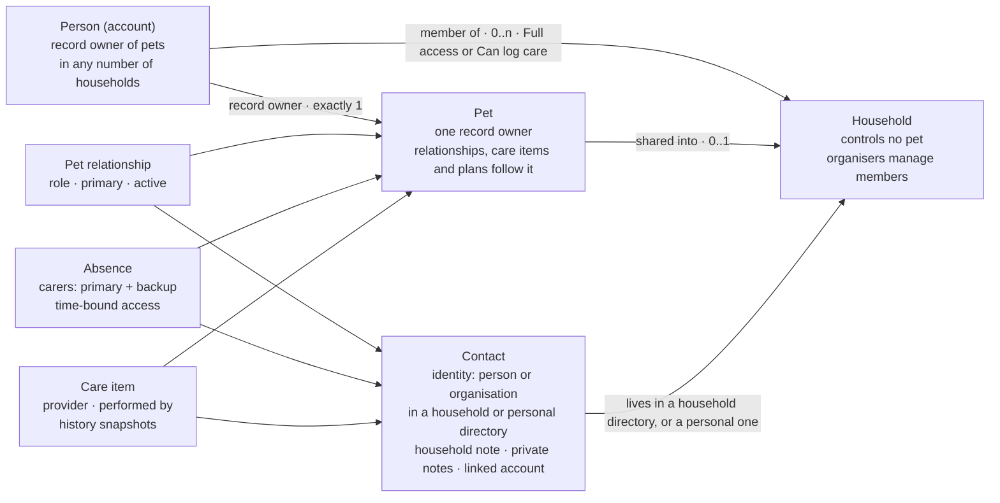

# People & Care Team — functional spec

**Status:** the functional spec was agreed on 2026-09-27. **Backend and initial People screens shipped** in execute-plan `people-care-team-a58d`; **navigation and desk UX** ship in `people-ui-hub-a58d` ([ui-hub-navigation.md](/docs/domains/people/changes/ui-hub-navigation.md)). UI wording is in [vocabulary.md](/docs/domains/people/features/vocabulary.md).

## Verdict

AgathaTrack gets one People directory. Each person or organisation is stored once and described in separate layers:

- who they are
- how each household and pet relates to them
- whether they have an account
- what each user privately notes about them

Three principles shape the spec:

1. **Every pet has one record owner. A household is a shared space that never controls a pet.** When a household changes, nobody has to decide whose pet it is. This works like Apple Family Sharing, not Google Home.
2. **People data is layered, not owned by whoever typed it in.** "Greenhill is Buddy's primary vet" is part of Buddy's care setup and goes wherever Buddy goes. It never depends on which partner happened to add Greenhill first.
3. **The UI shows at most two dimensions, and access never widens silently.** The group is worked out automatically. Access is shown only when it isn't the default. Anything that would widen access asks for confirmation.

The payoff is in Away Planning. You're not sharing an account with a sitter. You're giving a trusted person the access they need, for one trip.

**Settled foundations:**

- one pet record owner
- household membership separate from pet ownership
- relationship separate from permission
- persistent members separate from temporary carers
- contacts without accounts
- linked accounts never replace local notes or relationships
- time-bound absence access
- no activity feed of what a partner did

## Decisions

There are 28 decisions. D1, D4, D7 and D10 were revised after an external review. D11–D18 came from that review, D19–D23 from the detailed-design questions, and D24–D28 from the implementation review. D12 was revised in that same round.

| # | Decision | Consequence |
| --- | --- | --- |
| D1 | Every pet has exactly one **record owner**: the user with final control of its AgathaTrack record. A household never controls a pet | Only the record owner can transfer the pet, delete it, or move it into or out of a household. Long-term sharing with someone new is for the record owner and direct co-parents (D26). The UI says "Owner" or "Pet parent". This is about the record, not legal ownership |
| D2 | A person can be in several households | Pets and People are grouped by household. There's no switcher |
| D3 | Only organisers invite or remove members | Organisers still can't touch pets they don't own |
| D4 | Households have two tiers: Full access and Can log care. Membership means a lasting relationship with the household | Can log care suits flatmates or other adults in the home. Children will use future child profiles (D14). Occasional helpers are carers with access for an absence |
| D5 | A pet is shared with the whole household, or kept out of it | To exclude one person, take the pet out of the household and share it pet by pet. This is deliberate: it keeps "household" meaning one thing |
| D6 | A pet is in at most one household | Sharing beyond that household is pet by pet |
| D7 | Can log care sees a **care handover scope**, not a set of content types | They see what the care needs, plus documents attached to the absence. Other documents stay private |
| D8 | Sitters sign up to get app access | There's no link that works without an account. The PDF handover is the fallback |
| D9 | Professionals may become AgathaTrack users later | Contacts can be linked to an account from day one |
| D10 | A care item has no permanent responsible person. An occurrence or absence plan can optionally say who is **looking after** it | The default is "Anyone in the household", or "You" when the pet isn't in a household. There's no dashboard of what each person is doing |
| D11 | People data has five layers: identity, relationship, account link, private note, historical snapshot | Nothing is lost when the person who added a contact leaves |
| D12 | Household Full access manages care but can't give anyone new long-term access | The record owner can share long-term, and so can direct co-parents, as today (D26). Absence access follows D19 |
| D13 | Being an organiser implies Full access | An organiser can never be on the Can log care tier |
| D14 | Account holders are 18 or over in v1 | Sign-up asks people to confirm they're 18 or over. No date of birth is collected. Child profiles managed by a parent are a separate, future design |
| D15 | "Logged by" and "Performed by" are separate facts | Performed by defaults to whoever is logging. It's never pre-filled with the person named in "Looked after by" |
| D16 | Access never widens without the person granting it seeing | Extending an absence or adding pets to it needs confirmation. Removal flows list the access the person still has |
| D17 | Care items, schedules and absence plans belong to the pet or plan, not to whoever wrote them | "Created by" stays in the audit trail |
| D18 | A plan that relies on a person who is no longer available is flagged as **needing review** | This is worked out from current facts, never stored as a status and never resolved silently (D-AWAY-002). The wire shape is under Needs review |
| D19 | Anyone with Full access to a pet can grant access to it for one absence | The record owner is notified and can revoke it |
| D20 | No buffer day by default | One can be added per absence |
| D21 | When someone is named on an occurrence, only they get its reminder | Occurrences with nobody named remind the owner and Full access members (D25). Pet parents can turn on notifications for all events on their pets in Settings |
| D22 | Removing a pet from a household sends the other members a neutral notice, with no reason given | This protects the safety case |
| D23 | When a pet leaves, the household keeps its own copy of any contact that other relationships still use | The leaving pet's relationships point to the record owner's copies. Merging duplicate contacts is out of scope for v1 |
| D24 | Each account has a timezone. It's captured from the device at sign-in, can be changed in Settings, and is copied onto each absence when the absence is created | Changing the account timezone later doesn't shift an existing absence's access window. This unblocks phase 4 |
| D25 | Occurrences with nobody named remind the record owner and Full access members only | Can log care members get reminders only for occurrences they're named on, unless they opt in |
| D26 | Direct co-parent shares keep onward sharing, as today (`userCanSharePet`) | There are four access levels: Owner, Co-parent, Full access and Can log care. Shares a co-parent makes appear in the owner's Who has access view, and the owner can revoke them |
| D27 | "Stop following" applies to direct shares only | A household member can't stop following one household pet. They can mute its notifications or leave the household |
| D28 | Until phase 4, a contact with no linked account behaves exactly like today's `note_only` carer | The PDF handover is its only channel. A contact whose linked account already has access to the pet behaves like today's `shared_user` |

## Where we start

Ownership already matches D1. Three current behaviours contradict this spec and must change:

- deleting an account deletes that person's pets without warning
- a deleted user's name disappears from care history
- absences can't be edited once saved

| Concept | Today | Implication |
| --- | --- | --- |
| Pet record owner | One user per pet (`pets.user_id`) | Keep as is |
| Account deletion | `pets.user_id` is `ON DELETE CASCADE`: deleting an account deletes the owner's pets without warning | Becomes a guarded flow: transfer each pet or confirm deleting it (see Data lifecycle) |
| Household | None. Sharing is set pet by pet (`pet_access`) | New sharing layer. Don't reuse `pets.care_holder_*`, which belongs to the frozen custody model |
| Access levels | Owner (implicit), `co_parent`, `carer`, `foster` (frozen) | User-facing labels that describe what the person can do. Wire values stay `co_parent` and `carer` |
| Leaving a share | "Stop following" sets `pet_access.hidden`. Hidden rows are excluded from every access check, so this revokes access entirely | Keep for direct shares only (D27) |
| Foster | The `foster` role (frozen) can share with a link (`userCanSharePet`) | Unchanged and out of scope. Household logic ignores foster rows |
| Professionals | `vets` only. Private to one user (`vets.user_id`, `ON DELETE CASCADE`), one vet per pet (`pets.vet_id`) | Split into identity and pet relationship **before** migrating |
| Carer without an account | `note_only`: a name typed into each absence. D-AWAY-004 says this never implies access | Becomes a reusable contact. D-AWAY-004 still applies |
| Carers per absence | One per pet (D-AWAY-003) | Amended: the model allows backup carers and date ranges. The v1 UI still shows one carer |
| Absence editing | Only the handover note can be edited after saving, or the absence cancelled. Dates and pets are fixed | D16's change rules apply once date and pet editing ships. Cancelling ends access straight away |
| Readiness | Two derived facts, never a stored verdict (D-AWAY-002) | "Needs review" is expressed as a carer fact, not a new status |
| Who logged an occurrence | `health_occurrences.marked_by_user_id`, `ON DELETE SET NULL` | This is "Logged by", and the name is lost when the account is deleted. Add "Performed by" and a snapshot of the name |
| Care setting | `care_setting`: `home` / `vet` / `other` | Add an optional provider alongside it |
| Notifications | Per-user key/value store (`notification_preferences`) | Where D21's "all events" setting lives |
| Data export | GDPR export (`server/lib/gdprUserExport.js`) and account deletion (`DELETE /me`) exist | Extend both to cover contacts, notes and household data |
| The word "carer" | Both a permission level and the Away Planning "care team" | Use it for the relationship only. Update `terminology.md` when this ships |

## Domain model

Each pet has one record owner. Relationships with contacts live on the pet and move with it. Private notes stay with the user who wrote them.

Each arrow points from a concept to the one it refers to. When a pet leaves a household, its record owner stays the same. It keeps its relationships, care items and plans.

## Ownership and households

Only a pet's record owner decides which household a pet is in, and they can always take it back straight away. They can also revoke any share, including shares made by a co-parent.

### Pets

- Every pet has exactly one **record owner**: the user with final control of its AgathaTrack record. This isn't a statement of legal ownership. The UI says "Owner" or "Pet parent" wherever that reads naturally.
- Only the record owner can:
    - transfer the pet
    - delete it
    - move it into or out of a household
- A pet is in at most one household, where it lives (D6). Anyone beyond that household gets access pet by pet.
- Within its household, a pet is shared with every member (D5).
- **The record owner can take a pet out of the household at any time, without anyone else agreeing.** Other members lose access straight away. This is a safety requirement.
- A pet changes owner only through a transfer that both people agree to.
- Long-term sharing with someone new is open to the record owner and direct co-parents, as today (D26). Household Full access can't do it (D12).

### What follows the pet

Care items, schedules, absence plans and relationships with contacts belong to the pet or the plan, not to whoever created them (D17).

- "Created by Sam" stays in the audit trail. Sam leaving doesn't remove or orphan anything.
- Care history stays with the pet. Entries by a former member keep their name and a "former member" label.

### Creating and joining

- **Creating a household** includes a review step. It lists your pets, all pre-selected, under "These pets will be shared with household members". Nothing is visible to anyone until you confirm and your first invite is accepted.
- **Joining another household** shares none of your pets. You're asked "Share any of your pets with *Mum & Dad*?", with nothing pre-selected.
- Each household has a name, which organisers can edit.

### Tiers and organisers (D3, D4, D13)

- Household membership means a lasting relationship with that household. An occasional helper is a carer with access for an absence.
- **Full access** manages care for shared pets: profile, schedules, providers and absence plans. It can't give anyone new long-term access (D12).
- **Can log care** suits flatmates or other adults in the home. Children will use future child profiles (D14). What this tier can see is under Access and visibility.
- **Organisers** invite and remove members, set tiers, rename the household and appoint other organisers. Being an organiser always includes Full access.
- Organisers can't change pets they don't own.
- The last organiser must name a successor before leaving. If nobody is left, the household closes and each person keeps what they own.

### Leaving and removal

- Anyone can leave at any time.
- Leaving, or being removed, shows a screen explaining what the person keeps and what they lose.
- **Every removal lists the access the person will still have.** For example: "Sam will leave Morgan household, but still has Full access to Buddy through a direct share."
- The record owner can choose between **Remove from household only** and **Remove all access to my pets**.
- If the leaving person was an absence carer, or was named on an occurrence, that plan **needs review** (D18).

## Access and visibility

Labels say what a person can do, not who they are. Managing care and giving other people access are separate powers.

| Label | Can do | Granted by |
| --- | --- | --- |
| Owner | Everything, including transfer, delete, long-term sharing with someone new, and moving the pet into or out of a household | Being the pet's record owner (`pets.user_id`) |
| Co-parent | Everything Full access can do, plus sharing the pet with new people, as today (D26). No transfer, delete, or moving the pet between households | A direct co-parent share (`pet_access.role = co_parent`) |
| Full access | Manage care: profile, schedules, providers, contact relationships, absence plans. No transfer, delete or long-term sharing | Full household membership |
| Can log care | See the pet, mark care done, add notes and photos, and log weight, all within the care handover scope | Can log care membership, a care-only share (`pet_access.role = carer`), or access for an absence |
| No app access | Nothing in the app. They exist as a contact only | The default for contacts |

Wire values stay `co_parent` and `carer` in the API, the database and logs. Only the UI labels change, so don't rename the enums. The frozen `foster` role is unchanged and outside this model.

### How grants combine

- **Evaluation:** a person's effective access is the **highest** of three sources. These are household membership (if the pet is in that household), a direct share on that pet, and access for an absence.
- **In the UI:** every screen that removes a grant lists the grants that remain (D16). Removing one grant never looks like removing all access.
- **Evaluated when read, never copied.** Effective access is computed from the current grants on every check. When a pet leaves a household, a member who also has a direct co-parent share falls back to that share on their next request. There's no stored copy of the combined access, so the two can't race.
- **Hidden direct shares count as no grant.** Household membership is unaffected by a hidden direct share. Members can't hide a single household pet (D27).

### Who can grant what

| Grant | Record owner | Co-parent | Full access | Can log care |
| --- | --- | --- | --- | --- |
| Share long-term with someone new | Yes | Yes, as today (D26) | No | No |
| Move the pet into or out of a household | Yes | No | No | No |
| Access for one absence (D19) | Yes | Yes | Yes, for pets they have Full access to. The record owner is notified and can revoke | No |
| Invite or remove household members | Organisers only (D3) | Organisers only (D3) | Organisers only (D3) | No |

### Who has access, and history

- Each pet has a **Who has access** view for its record owner. It lists every person and the source of their access: household, direct share, or absence.
- Every grant, change and revocation is recorded with who did it and when, and the record owner can see this history. Audit logging for sharing is already listed as deferred in the [sharing specs](/docs/domains/sharing/features/specs.md), and this feature closes that item.
- **Scope cap for v1:** the in-app history shows the most recent 100 events per pet, with no export. It's a separate deliverable within phase 3, so it doesn't grow the household work.
- Anyone can leave a direct share themselves. This exists today as "Stop following".

### Care handover scope (D7)

What Can log care people see depends on what the care needs, not on the type of content. Each item maps to data, so the scope isn't reargued in every PR:

| Included | Source |
| --- | --- |
| Pet basics: name, species, breed, photo, identification (for a lost-pet emergency) | `pets` (`name`, `species`, `breed`, `photo_path`, `chip_id`, `identification`) |
| Active health conditions, including allergies where they're recorded | Active `health_issues` |
| Current medication and care during the relevant window | Active `health_entries` and their occurrences in that window |
| Trip and pet notes | `planned_absences.handover_note`, `planned_absence_pets.pet_note` |
| Emergency contacts, the primary vet and the out-of-hours vet | New pet relationships (People data) |
| Provider details for care in the window | New provider relationship |
| Documents **explicitly attached** to the absence | New attachment on the absence, served through the existing private-file access path with access scoped to the absence |

**Excluded:** insurance, every document not attached to the absence, weight history (carers still see what they log themselves), the timeline and custody records, sharing and household details, other pets, private notes, and household notes. This follows the private-files rules in `.cursor/agent-kernel/protocols/private-files.md`.

**Can log care can't:**

- edit profiles or recurring schedules
- create absences
- manage people
- share pets

### Visibility of contacts

- **Full access** sees the household directory, plus every contact related to a pet they can access.
- **Can log care** sees only the contacts within the care handover scope for their pets.
- **Private notes** are visible only to the user who wrote them.
- **Household notes** are visible only to members of that household.
- Notes about a person are **not shown to that person in the app** when their account is linked. This is a UI rule, not a legal promise, because data-subject rights may still apply.

## People data

Contacts have five layers (D11). This means no shared fact depends on whoever typed it in, and departures need no manual copying. Household members aren't contacts: they're accounts.

| Layer | Holds | Lives with | Who can edit |
| --- | --- | --- | --- |
| Identity | Kind (person or organisation), name, phone, email, address, website, works at | A household directory or a personal directory | Full access members of that household, or the owner of the personal directory |
| Relationship | Pet: role, primary, active (e.g. "Greenhill · Buddy's primary vet"). Household: household note, active in that household | The pet's care setup, or the household | Anyone with Full access to that pet or household |
| Account link | The linked AgathaTrack user | The identity | Set when an invite is accepted |
| Private note | Free text about the contact | The user who wrote it | That user only |
| Historical snapshot | Name and role as recorded on an occurrence, absence or completion | That record | Nobody. It's fixed |

### Identity rules

- **Group** (Carer or Professional) is worked out from the contact's roles.
- **Kind** (person or organisation) only changes the avatar and allows "works at".
- Roles: sitter, walker, vet, vet nurse, groomer, trainer, behaviourist, boarding, emergency contact, other. A contact can have several.
- A groomer used by two households exists once in each household directory, each copy with its own household note. Context never crosses between households.
- Duplicates across directories are expected. Merging or deduplicating them is **out of scope for v1**. "Add person" can suggest an existing contact from the user's own directories, but it never merges automatically.
- When a pet leaves a household, the contacts its relationships use are **copied automatically** into the record owner's personal directory. The relationships then point at those copies, with no prompt. The household keeps its own copy while other relationships still use it (D23). Automatic copies are the record owner's data: they're deleted with that account and included in its GDPR export.

**Naming constraint:** the codebase already uses `organizations` for the frozen Shelter and Fostering domain, and `care_holder_*` for custody. The new model must not reuse either name internally. In the UI, the organisation kind is labelled *Établissement* in French.

### Account links (D9)

- A contact is always created first. Inviting the person later links their account to it and never replaces it.
- Once linked, profile fields (name, photo, email) come from the linked account and are read-only for everyone else. Relationships and notes stay as they were.
- If professionals become users later, they get their own permission level. They never reuse Full access or Can log care.

### Pet relationships

- The primary-vet relationship replaces today's `pets.vet_id`. It feeds the vet section and the handover.
- Each pet has an **out-of-hours vet** and **emergency contacts**.
- **An inactive contact that is still in use stays visible.** It's marked "Inactive" and the screen suggests choosing a replacement. It's never silently cleared or swapped (D18).
- Inactive contacts don't appear in pickers.

## Absences and guest access

A sitter gets Can log care on the absence's pets, for the absence's dates, through their own account. Access never widens silently. If they don't sign up, they get the PDF handover (D8).

### Carers

- The model allows each pet on an absence a **primary carer**, optional **backup or additional carers**, and optional **date ranges** within the absence. This amends D-AWAY-003. The v1 UI still shows one carer per pet.
- Carers are picked from contacts, which replaces the free-text `note_only`. Household members can be carers, including on Can log care.
- **Assigning a carer never grants app access.** D-AWAY-004 is unchanged.
- **Phases 2 and 3 (D28):**
    - A contact with no linked account works exactly like today's `note_only`. The PDF handover is its only channel.
    - A contact whose linked account already has access to the pet works like today's `shared_user`.
    - No partial app flows appear before phase 4.
    - Migrating existing carer rows is covered in [amends-away-planning.md](/docs/domains/people/changes/amends-away-planning.md).

### Invite for this absence

1. The record owner, or anyone with Full access to the pet (D19), chooses "Invite for this absence" on the carer's contact.
2. The carer signs up or signs in, and their account is linked to the contact.
3. They get Can log care for this absence's pets and dates, within the care handover scope.
4. If someone other than the record owner granted access, the record owner is notified and can revoke it.

### Access window

- Access covers **whole calendar days from the start date to the end date, inclusive, in the timezone saved on the absence (D24).** That timezone is copied from the creator's account when the absence is created. Dates on the wire stay `YYYY-MM-DD` ([calendar-dates.md](/docs/architecture/calendar-dates.md)).
- There's no buffer day by default. One can be added at either end, per absence (D20).
- Access starts and ends automatically. The record owner, or whoever granted it, can revoke it early.
- **Cancelling the absence** ends access straight away.
- Care the carer logs stays in the pet's history. When they next sign in after access has ended, the pets are no longer shown and a calm explanation says why. Their own history stays with them.

### Changes to the absence (D16)

Today an absence's dates and pets can't be edited after saving. These rules apply once that editing ships:

- **Shortened:** access shrinks automatically.
- **Extended:** a confirmation shows that the carer's access extends too. Nothing changes until someone confirms.
- **Pet added:** confirmation is required before the carer can see that pet.
- **Pet removed:** the carer loses access to that pet straight away.

### Needs review (D18)

- "Needs review" is part of the **carer coverage** fact, not a new status (D-AWAY-002). Alongside "has a carer" and "no carer", a pet can show "**carer no longer available**". That happens when the carer:
    - leaves the household
    - loses access they relied on
    - has their contact made inactive or deleted
- **Wire shape:** the per-pet carer fact becomes `unset | set | unavailable`. The absence-level `carer_coverage` counts `unavailable` as uncovered, so `all_have_carers` can't be true while one exists, and it returns the affected pet ids. Tile and plan copy key off these values. No new tile vocabulary.
- The dashboard tile's existing rule of showing the carer gap first covers this without changes.
- The copy is calm and practical. For example: "Jamie can no longer see Buddy's plan. Choose someone else?"

### PDF handover

- The PDF includes emergency contacts, the primary vet and the out-of-hours vet.
- It includes documents attached to the absence.
- It must work on its own, without the app.

## Care items and attribution

Four separate facts cover four questions: who provides the care, who is looking after an occurrence, who logged it, and who actually did it. None of this turns the app into a project-management tool.

| Field | On | Default | Purpose |
| --- | --- | --- | --- |
| Provider | Care item | None | Who delivers this care, e.g. "Vaccination · Greenhill". Sits alongside `care_setting` (`home` / `vet` / `other`) |
| Looked after by | One occurrence, or an absence plan | Anyone in the household, or You when the pet isn't in a household | Avoids missed or doubled care, e.g. medication given twice (D10) |
| Logged by | Completion | The current user | The audit fact. Today this is `marked_by_user_id` |
| Performed by | Completion | The current user | Who actually did it: a member, a carer or a provider (D15) |

### Rules

- There's **no permanent assignee**. "Looked after by" is set per occurrence, or for an absence plan.
- **Reminders (D21):**
    - When someone is named, only that person gets the reminder.
    - When nobody is named, the record owner and Full access members get it (D25). Can log care members get it only if they opt in.
    - Pet parents can opt in, in Settings, to notifications for all events on their pets.
- **Copy:** the field is a label, never a nudge. [copy-tone.md](/docs/design/copy-tone.md) explicitly avoids "Who'll be handling Luna's tablets?", so no empty state asks who is doing something.
- Performed by is never pre-filled from "Looked after by". Recording that someone else did the care is always an explicit choice (D15).
- When Performed by and Logged by differ, history shows both, e.g. "Given by Jamie · logged by Alex". When they match, it shows one name.
- History keeps a **snapshot** of each name and role at the time. Today a deleted user's name is lost, because `marked_by_user_id` is set to null.
- If the named person leaves or loses access, the occurrence **needs review** (D18). It never falls back to someone else silently.
- A contact's detail page shows **Related care**: the care items where that contact is the provider.
- There's **no activity feed per person**.

## UI and navigation

The screen is called "People". **Compact navigation:** fifth primary bottom-tab destination (`/pc/people`) per [ui-hub-navigation.md](/docs/domains/people/changes/ui-hub-navigation.md). Most in-context entry points remain. All wording is in [vocabulary.md](/docs/domains/people/features/vocabulary.md).

### Placement

- **Mobile:** primary **People** tab; also Account (legacy redirect), and from the places where people are needed:
    - the pet profile's People section
    - the absence carer picker
    - the care item provider picker
    - the "Looked after by" picker
- **Desktop:** a sidebar entry.

### Grouping

- **People:** one section per household, headed by the household's name, then carers, then professionals.
- **Pets:** your pets first, then one group per household. The group headers appear only when someone is in more than one household.
- **Pet profile:** "People around Buddy", with the groups At home, Trusted carers and Pet professionals. "At home" is used only here, because a pet has at most one household.
- There's no household switcher.

### Labels on a row

- **Household member:** "Owns Buddy · Shares Luna", plus "Organiser" or "Can log care" where either applies.
- **Everyone else:** role · pets, plus access while it's active. For example: "Pet sitter · Buddy, Luna · Access until 10 Oct".
- The group heading carries the relationship and the row carries the role. Don't repeat "Household member" under a household heading.
- A status is shown only for exceptions: **Inactive**, or **Needs review** on the affected plan or occurrence.

### Flows

- **Adding someone** starts with "Who would you like to add?" and offers someone at home (which sends an invite), a trusted carer, a pet professional, or an organisation. The form adapts to the choice.
- **Creating a household** includes the review step for which pets will be shared.
- **Removing someone** lists the access they'll still have and offers two choices: remove from the household only, or remove all access to my pets.
- **Changing an absence** asks for confirmation whenever the change would widen access.

### Mockup corrections

- **Filter sheet:** "Organisation" is a Kind, not a Relationship.
- **Jamie's labels:** the mockups describe Jamie in three different ways. Use one line format everywhere.
- **Desktop:**
    - Show household members as cards above the table.
    - Drop "Owner / primary carer" and "Everyday carer" as care roles.
- **Alex's detail:**
    - Replace "Admin" with what Alex owns and shares, and their role in each household.
    - Remove "Care responsibilities" and the Activity tab.
- **Edit person:**
    - Make name and photo read-only once an account is linked.
    - Use separate fields for the private note and the household note.
- **Pet profile:**
    - Show the owner quietly, e.g. "Buddy · Alex's dog".
    - Add emergency contacts, the primary vet and the out-of-hours vet.
- **Keep:** Related care on Greenhill's detail page.
- **Missing screens:**
    - emergency contacts
    - "Invite for this absence"
    - leave household
    - remove pet from household
    - remove person, listing the access that remains
    - needs-review states

## Data lifecycle and privacy

Lifecycle follows the pet and the plan, not whoever created them. Nothing depends on someone answering a prompt before data is lost.

| Event | Pets, care items, plans | Contacts | History | Plans that depend on the person |
| --- | --- | --- | --- | --- |
| Member leaves or is removed | Their own pets leave with everything attached. They lose access to other people's pets, and the remaining grants are listed | Their pets' contacts are copied automatically. Private notes go with them. Household notes stay | Stays with each pet, labelled "former member" | Needs review |
| Record owner removes a pet from the household | The pet keeps its care items, plans and relationships. Members lose access straight away and get a neutral notice (D22) | Copied automatically to the record owner (D23) | Stays with the pet | Needs review where a member was named |
| Ownership transfer | Needs both people to agree. Everything attached moves with the pet | Copied automatically to the new record owner | Moves with the pet | Unchanged |
| Household closes | Each record owner keeps their pets | Automatic copies of each pet's contacts | Stays with each pet | Needs review |
| Contact made inactive | No change | Stays visible where used, marked Inactive, with a prompt to replace it | Snapshots unchanged | Needs review |
| Contact deleted | No change | Relationships show "Contact unavailable — choose replacement" | Snapshots unchanged | Needs review |
| Account deleted | A guarded step: transfer each pet (e.g. to a household member) or confirm deleting it. Today deletion removes their pets without warning | Their private notes are deleted. Shared identities stay while relationships use them | The name stays in the snapshot, and the link to their profile is removed | Needs review |
| Export | Pets you own, with their care and plans | Your pets' contacts and your private notes | Included | — |

### Privacy

- Contacts contain personal data about other people. UK and French users are covered by GDPR.
- Private notes and household notes are separate, so commentary written in one context never leaks into another.
- "Not shown to the linked person in the app" is a UI rule. Data-subject rights may still give the person access to notes about them.

### Age (D14)

- In v1, accounts are for people aged **18 or over**. Sign-up and the household invite flow ask people to confirm this. No date of birth is collected.
- The ages of 13 (UK) and 15 (France) only matter when a service relies on a child's own consent as its lawful basis. Supporting child accounts would also bring age-assurance duties and a DPIA.
- Child profiles managed by a parent are a separate, future design.

## Phasing

The people-data layers must be settled before vets are migrated, so the data is only migrated once. Each phase builds on the previous one.

| Phase | Scope |
| --- | --- |
| 0. Model settled | Finalise identity, relationship, private note and snapshot (D11) before any migration. Define the carer-coverage "no longer available" fact |
| 1. Contacts v1 | **Interim rule:** until the phase 3 deletion guard ships, add no new `ON DELETE CASCADE` from `users` to shared data. New user foreign keys use `SET NULL` plus a snapshot. People screen for carers and professionals. Migrate `vets` into an identity plus a primary-vet pet relationship. Add the out-of-hours vet and emergency contacts. Provider on care items. Logged by, Performed by and history snapshots. The model supports linking an account, but this phase doesn't use it |
| 2. Absence integration | Primary carer chosen from contacts, replacing `note_only`, with the model allowing backup carers and date ranges. "Looked after by" on the absence plan. "Carer no longer available" as a carer-coverage fact. PDF with emergency contacts, vets and attached documents |
| 3. Households | Named households, organisers (always Full access), two tiers, one household per pet, grouping by household. The creation review step. Removal flows that show remaining grants. Automatic contact copies and needs-review states. A Who has access view with access history (a separate deliverable, capped as above). Guarded account deletion for pets other people rely on |
| 4. Absence guest access | Invite via sign-up. Access limited to the absence's dates and pets, within the care handover scope. Confirmation before access widens. Automatic expiry and early revocation. Full access can grant it, and the record owner is notified. Local-day access windows, using the account timezone from D24. That timezone can ship earlier, on its own |
| 5. Later | Backup carers and date ranges in the UI. People linked to organisations. Features for professionals (D9). Child profiles (D14) |

## Still open

No product decisions are open. When implementation starts, the delivery plan goes in `docs/domains/people/changes/`: file ownership, API milestones and BDD scenarios for each phase.

## Related

| Kind | Link |
| --- | --- |
| Vocabulary (EN/FR) | [vocabulary.md](/docs/domains/people/features/vocabulary.md) |
| Away Planning carer model | [away-planning-carer-model.md](/docs/domains/pet_care/features/away-planning-carer-model.md) |
| Away Planning decisions (D-AWAY-002/003/004) | [away-planning-decisions.md](/docs/domains/pet_care/changes/away-planning-decisions.md) |
| Planned amendments to Away Planning | [amends-away-planning.md](/docs/domains/people/changes/amends-away-planning.md) |
| Notifications (D21, D25) | [notification specs](/docs/domains/notifications/features/specs.md) |
| BDD, existing features that will change | `away_planning.feature`, `away_plan_detail_v2.feature`, `sharing.feature`, `veterinarian_management.feature`, `notifications.feature`. Planned: `people.feature` |
| Sharing roles and API | [sharing specs](/docs/domains/sharing/features/specs.md) |
| Vets today | [vet specs](/docs/domains/vet/features/specs.md) |
| Care setting taxonomy | [care-classification-taxonomy-spec.md](/docs/domains/pet_care/changes/care-classification-taxonomy-spec.md) |
| Terminology and tone | [terminology.md](/docs/design/terminology.md), [copy-tone.md](/docs/design/copy-tone.md) |

### References

These were cited in the external review and haven't been rechecked:

- [Apple Support](https://support.apple.com/en-euro/guide/iphone/iphcbaf7e8f3/ios): Home residents and scheduled guests
- [Google Home Help](https://support.google.com/googlehome/answer/9155535?hl=fr): Admin and Member roles
- [ICO](https://ico.org.uk/for-organisations/uk-gdpr-guidance-and-resources/childrens-information/children-and-the-uk-gdpr/what-are-the-rules-about-an-iss-and-consent/): children, consent and online services

Other patterns (Rover, Cozi, Splitwise) are described from memory.
