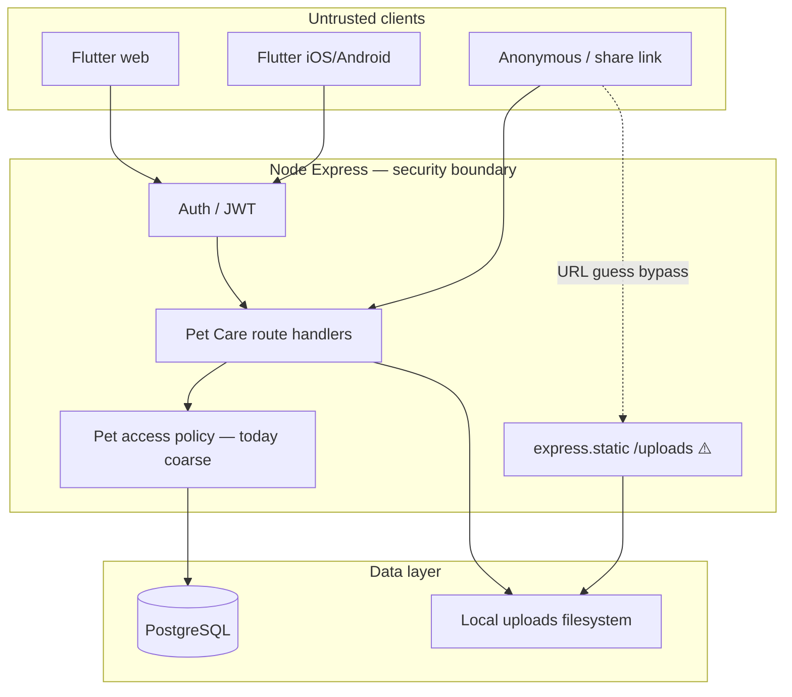

# Pet Care hardening — Phase A discovery report

**Plan:** `pet-care-hardening-discovery`  
**Scope:** Analysis only — no production code changes in this phase.  
**Method:** Repo inspection on `main` (2026-09-05); findings verified in source, not assumed from prior reviews.

## Executive summary

Pet Care has **working product features** and **some security primitives** (`publicError`, `safeUpload`, mobile `SecureTokenStore`, rate limiters on many API routers, BDD/E2E governance). It is **not yet at a gold-standard production baseline** for health data, sharing, or authorization granularity.

**Three P0 gaps** block a confident controlled live test with real health data:

1. **Health documents are publicly servable** if the URL/path is known (`express.static` + `/uploads/health_documents/`).
2. **`userCanManagePet` equals `userCanAccessPet`** — foster, org viewer, and collaborator read paths imply full write/manage for most routes.
3. **Share preview over-exposes** owner email, vet notes, and all health entries with no scope or expiry.

**Recommendation:** Merge this discovery report, then run implementation as **sequential execute-plans** (not one mega-programme). Target **live-test ready** after P0 + selected P1 (~4–6 PRs); **gold-standard complete** is a longer roadmap.

---

## Trust boundaries

| Boundary | Current enforcement | Gap |
|----------|---------------------|-----|
| Client → API | Bearer JWT in `Authorization` | Duplicated `extractUserId` in 8+ route modules |
| API → pet row | `userCanAccessPet` / `accessiblePetSql` | Manage ≡ access for most writes |
| API → health file bytes | Metadata routes check auth | **Static mount bypasses auth** |
| Share link → data | Code lookup + status | No expiry; preview returns full internal shapes |
| API → Shelter | Shared `petAccess`, org routes | Pet Care changes need Shelter regression subset |

---

## Pet Care API surface (inventory)

Mounted in `server/bin/server.js` (also under `/backend/api/*`):

| Mount | Module | Pet Care relevance |
|-------|--------|-------------------|
| `/api/auth` | `routes/auth/` | Session, profile, account deletion |
| `/api/pets` | `routes/pets/` | Profile, lifecycle, photos, transfer, access |
| `/api/vets` | `routes/vets.js` | Vet contacts per pet |
| `/api/weight-entries` | `routes/weightEntries.js` | Weight CRUD |
| `/api/health-entries` | `routes/healthEntries/` | Entries, completions, documents |
| `/api/health-issues` | `routes/healthIssues/` | Issues, documents |
| `/api/share` | `routes/sharing.js` | Share links, preview, accept |
| `/api/notifications` | `routes/notifications.js` | Reminders, mute, completion |
| `/api/foster-placements` | `routes/fosterPlacements.js` | Foster sessions (Pet Care + Shelter) |
| `/api/custody-transfers` | `routes/custodyTransfers.js` | Custody |
| `/uploads`, `/backend/uploads` | `express.static` | **Public file serving** |
| `/api/uploads` | `routes/uploads.js` | Public upload file router |

**Flutter domains (target map):** `pet_profile`, `health_tracking`, `weight_tracking`, `vet`, `fostering_session`, `sharing`, `notifications`, `experience` (Pet Care shell), `auth` (shared).

**Timeline:** `server/routes/timeline/index.js` — pet-scoped; uses `userCanAccessPet`.

---

## Actor matrix (authorization targets)

| Actor | Access path today | Intended future (capability model) |
|-------|-------------------|-------------------------------------|
| Anonymous | Share `GET /api/share/:code` only | Scoped preview DTO only |
| Pet owner | `pets.user_id` | Full capabilities except where delegated |
| Shared carer (`shared`/`guardian` role) | `pet_access` | Configurable: view care, edit entries, no delete pet |
| Foster (`foster` role) | `pet_access` + `foster_placements` | View/edit per session policy; no ownership |
| Org member (viewer roles) | `organization_users` + org pet | View org pets; **no write today but manage≡access bug affects if they gain access** |
| Org admin | Same SQL viewer set in `accessiblePetSql` | Shelter ops; Pet Care write must be explicit |
| Unrelated authenticated user | Denied by policy queries | Must fail all pet/health/file endpoints |
| Revoked collaborator | `pet_access` removed or `hidden` | Immediate 403/404 on subsequent calls |
| Deleted user | Rows cascade / orphan risk | Sessions invalidated; files removed per policy |

---

## Data classification (initial)

| Class | Examples | Current exposure risk |
|-------|----------|---------------------|
| **Public / intentional** | Pet name on active share (if scoped) | Share preview returns full profile + health |
| **Private** | Pet bio, weight history, care schedule | API returns full maps in many routes |
| **Sensitive** | Health entries, documents, vet notes, chip/insurance, owner email | Documents via static URL; share preview leaks |

---

## Test coverage snapshot

| Area | Backend tests | Notes |
|------|---------------|-------|
| Pets CRUD | `server/test/pets/*` | Mock pool; ownership scoping tests exist |
| Weight | `server/test/weightEntries.test.js` | No audit assertions found |
| Health | `server/test/healthEntries.test.js`, `healthIssues.test.js` | Upload dir tests; no auth bypass tests for static files |
| Sharing | `server/test/sharing.test.js` | Does not assert preview field minimization |
| Auth | `server/test/auth/*` | Refresh/logout; **no rotation/revocation store** |
| Foster (Pet Care API) | `server/test/fosterPlacements.test.js` | Thin vs org foster suite |
| Real PostgreSQL integration | **None in CI** | All Jest uses mock pool |
| Flutter Pet Care | Feature tests under `flutter_app/test/features/` | Presentation calls stub lifecycle URLs directly |
| E2E / BDD | Guardian/Pet Care specs + BDD gate | Known gaps in notifications, health attachments (see BDD report) |

**Shelter regression subset (recommended on every Pet Care security PR):**

- `server/test/organizations/fosterOnboarding.test.js`
- `server/test/organizations/fosterVisibility.test.js`
- `server/test/organizations/pets.test.js`
- `server/test/sharedPetAccess.test.js`
- E2E: org/shelter smoke specs in `@smoke-ci` shard (per `scripts/bdd-priority-tag-map.json`)

---

## Findings table

Evidence column cites file paths inspected 2026-09-05. Severity: **P0** release blocker for live test with health data; **P1** before mobile beta; **P2** gold-standard; **P3** hygiene.

| ID | Sev | Component | Finding | Evidence | Recommended resolution | Tests to add |
|----|-----|-----------|---------|----------|------------------------|--------------|
| F-01 | P0 | Health files | Health documents stored under public `/uploads/health_documents/` and served via `express.static` without auth | `server/routes/healthEntries/shared.js` `saveHealthDocument` returns `/uploads/health_documents/...`; `server/bin/server.js` lines 64–65 static mount; `server/routes/uploads.js` unauthenticated GET | Private object store + authorized byte endpoint or short-lived signed URL; migrate existing files | Anonymous/unrelated/authorized/revoked byte access; URL guess does not bypass |
| F-02 | P0 | Authorization | `userCanManagePet` delegates entirely to `userCanAccessPet` — collaborators/fosters/org viewers with read access implied for manage paths | `server/lib/petAccess.js` L85–88 | Capability policy (`pet.view`, `pet.health.edit`, etc.); route handlers call policy | Negative matrix per endpoint × actor |
| F-03 | P0 | Sharing | Share preview returns full pet map, owner **email**, vet (incl. notes), all health entries — no scope | `server/routes/sharing.js` L255–294 | Scoped preview DTO; product sign-off on fields | Field leakage tests per scope |
| F-04 | P0 | Sharing | `pet_share_links` has no `expires_at` column | `db/schema/canonical.sql` L506–515 | Add expiry + enforce on preview/accept | Expired link → 410 |
| F-05 | P1 | Auth | Access and refresh JWTs share payload shape; no `typ`/purpose claim | `server/routes/auth/shared.js` L18–24 | Distinct claims + reject cross-use | Token type negative tests |
| F-06 | P1 | Auth | Refresh is stateless; logout does not invalidate refresh token | `sessionRouter.js` L112–154 logout logs only, no server session store | Server-side refresh sessions, rotation, reuse detection | Rotation reuse, logout invalidates refresh |
| F-07 | P1 | Auth | Web stores access+refresh in SharedPreferences (JS-readable) | `flutter_app/lib/features/auth/data/token_store.dart` L19–40 | HttpOnly cookie refresh + in-memory access (web); document native path | Web storage inspection / E2E |
| F-08 | P1 | Auth | `extractUserId` duplicated in 8+ route files (inconsistent auth) | `pets/shared.js`, `sharing.js`, `weightEntries.js`, `vets.js`, `notifications.js`, `healthEntries/shared.js`, `healthIssues/shared.js`, `organizations/shared.js` | Central `requireAuth` middleware + typed principal | Missing/malformed/expired token tests once |
| F-09 | P1 | Lifecycle | `DELETE /api/pets/:id/data` returns success without deleting data | `server/routes/pets/lifecycleRouter.js` L4–8 | Implement or remove; Flutter calls this URL | Integration test: data actually removed |
| F-10 | P1 | Lifecycle | `POST /api/pets/:id/passed-away` is documented stub (no side effects) | `lifecycleRouter.js` L10–17; `pets/README.md` | Implement notification side effects or deprecate route | Assert side effects or 410 removed |
| F-11 | P1 | Flutter | Presentation builds raw API URLs for lifecycle stubs | `pet_providers.dart` L169, L196 | Route through repository/use case; fix when API real | Widget/integration tests |
| F-12 | P1 | Data lifecycle | Account deletion `DELETE /api/auth/me` deletes DB user only — no file cleanup pass | `server/routes/auth/profileRouter.js` L199–200 | `StoredObject` service; delete user/pet files | Post-delete byte retrieval fails |
| F-13 | P1 | Validation | Weight accepts `parseFloat(missing) → 0` | `server/routes/weightEntries.js` L112, L134 | Explicit validation; reject invalid | 400 on missing/NaN/negative |
| F-14 | P1 | API contract | No OpenAPI spec; manual `api-reference.md` only | Repo search: no `openapi*` files | OpenAPI subset + CI validate | Contract tests on critical DTOs |
| F-15 | P2 | Security headers | No Helmet/CSP/HSTS configuration found | `server/bin/server.js`; grep helmet: none | Tune CSP for Flutter web + tests | Header assertion tests |
| F-16 | P2 | Rate limiting | Static `/uploads` has no rate limiter (unlike API routers using `createApiLimiter`) | `server/bin/server.js` vs `sharing.js` L110 | Rate limit or remove public health path | Abuse test optional |
| F-17 | P2 | Testing | No real PostgreSQL integration tests in CI | `server/test/helpers/petAccessMocks.js` pattern | Ephemeral PG for policy/constraints/share claim | CI job `integration` tag |
| F-18 | P2 | Audit | Weight CRUD has no `logAuditEventSafe` calls in route module | `grep audit weightEntries` empty | Audit policy for sensitive mutations | Assert audit rows in tests |
| F-19 | P2 | Coverage | Jest collects coverage but no enforced minimum thresholds | No `coverageThreshold` in server package | Ratchet on `petAccess.js`, policy modules | CI threshold |
| F-20 | P2 | Lint | No ESLint config in repository | Repo search | ESLint ratchet on `server/` | CI lint job |
| F-21 | P2 | Hygiene | Dead `.bak` route files remain | `server/routes/pets.js.bak`, `auth.js.bak` | Remove | N/A |
| F-22 | P2 | Terminology | Guardian → Pet Care rename in progress | `docs/domains/pet_care/README.md` | Separate plan; don't mix with security PRs | N/A |
| F-23 | P3 | Observability | `requestContextMiddleware` exists; no formal security-event taxonomy doc | `server/middleware/requestContext.js` | Document alert-worthy events | N/A |

### Security invariants mapping (programme §20)

| Invariant | Finding IDs | Status |
|-----------|-------------|--------|
| Health metadata denied without permission | F-02 | Fail — coarse manage |
| Health file bytes denied without permission | F-01 | **Fail — static bypass** |
| URL/key cannot bypass auth | F-01 | **Fail** |
| Revoke blocks subsequent access | F-02 | Partial — logic exists; manage bug |
| Attachment delete removes bytes | F-12 | Partial — `removeHealthDocumentFromDisk` exists; account/pet cascade unclear |
| Account deletion cleans data | F-12 | Fail |
| Foster cannot escalate to owner | F-02 | **Fail** — manage≡access |
| Share exposes only scope | F-03, F-04 | **Fail** |
| Expired/revoked shares blocked | F-04 | Revoked yes; expiry no |
| Refresh rotation / non-interchangeable tokens | F-05, F-06 | Fail |
| Logout invalidates session | F-06 | Fail |
| Cross-pet references rejected | — | Verify per route in Phase B rollout |
| Unrelated user cannot mutate by ID | F-02 | Partial — depends on endpoint |
| Invalid input → 4xx | F-13 | Partial |
| Lifecycle endpoints have real effects | F-09, F-10 | **Fail** — stubs |
| No sensitive fields in public DTOs | F-03 | **Fail** |

---

## Strengths (do not rewrite)

| Area | Evidence |
|------|----------|
| Mobile secure token storage | `SecureTokenStore` + migration from prefs (`token_store.dart`) |
| Production 5xx redaction | `publicError()` in `server/config/security.js` |
| Upload MIME/size guards | `safeUpload.js`, health document limits in `healthEntries/shared.js` |
| Rate limiting on API routers | `createApiLimiter()` on pets, share, weight, health, etc. |
| Calendar date wire format | `docs/architecture/calendar-dates.md` |
| BDD + pre-UAT CI governance | BDD gate, `pre-uat-e2e.yml` on `main` |
| Engineering Router / protocols | `docs/engineering/cursor-agent-framework.md` — use for implementation plans |
| Some auth hardening tests | `server/test/auth/hardening.test.js`, `session.test.js` |

---

## Milestones (recommended)

| Milestone | Findings addressed | Unblocks |
|-----------|-------------------|----------|
| **M1 — Live-test ready** | F-01, F-02 (critical capabilities), F-03, F-04, F-09, F-12 (minimal), F-13 | Controlled real-user test with health data |
| **M2 — Mobile beta ready** | F-05–F-08, F-14, networking/timeouts | App Store builds against stable API |
| **M3 — Gold standard** | F-15–F-23, full matrix, ESLint, real DB suite | Long-term maintainability |

---

## Product decisions (locked 2026-09-05)

Signed off via user chat + control issue [#993](https://github.com/KanopeeKa/AgathaCheck/issues/993). Findings table **accepted**. Architecture should stay **flexible** where noted (scopes/tiers may evolve).

### A. Share links

| ID | Decision |
|----|----------|
| **A1 Preview** (anonymous, before accept) | Pet name, species, breed, photo, age, **owner first name only** |
| **A2 After accept** | Full access to everything the collaborator policy allows |
| **A3 Scope model** | **One fixed policy** for now; design for per-link scopes later |
| **A4 Default expiry** | **7 days** |
| **A5 Max expiry** | **90 days** cap |
| **A6 Claim model** | **Keep current** (single-use / claimed link behaviour) |
| **A7 Legacy links** | **Revoke all unclaimed** links at security migration; owners must create new scoped, expiring links |

**Preview must NOT include:** owner email, insurance, microchip, health history, vet details, health documents.

### B. Collaborator (`shared` / `guardian`)

| Capability | Owner | Collaborator |
|------------|-------|--------------|
| All owner-only lifecycle (delete pet, transfer ownership, delete all data, passed-away) | Yes | No |
| View pet profile | Yes | Yes |
| Health entries — view / create / edit | Yes | Yes |
| Health documents — upload / view / delete | Yes | Yes |
| Weight — view / add / edit / delete | Yes | Yes |
| Vet — view | Yes | Yes |
| Share links — create / revoke | Yes | Yes |
| Notifications — complete / mute | Yes | Yes |
| Timeline / manual history notes | Yes | Add / edit / delete **own notes only** (not others') |

| ID | Decision |
|----|----------|
| **B1 Tiers** | **One collaborator tier** for now; keep policy model extensible |
| **B2 Revocation** | Owner removal is **immediate** on next API call |
| **B3 Offline copies** | Acceptable that revoked users may retain downloaded files |

### C. Foster carer

| ID | Decision |
|----|----------|
| **C1 vs collaborator** | **Same capabilities** as collaborator during active session (nothing extra) |
| **C2 Session end** | Access **lingers 7 days** then ends |
| **C3 Post-session** | Foster receives a **retained care report** (auto-generated download/archive for their records) |
| **C4 After session** | **Cannot** edit or delete entries they created once session + grace ended |
| **C5 Share links** | **Yes** — can create share links (during active access) |
| **C6 Ownership** | **No** transfer or delete; **may change vet** |
| **C7 Org vs personal** | **No difference** beyond rules above |

### D. Organisation members (Pet Care)

| ID | Decision |
|----|----------|
| **D1 Org viewers** | **Read-only always** in Pet Care workspace |
| **D2 Org admins** | Edit org pets via **Shelter tools only**, unless they are also the foster parent on that pet |

### E. Session & account

| ID | Decision |
|----|----------|
| **E1 Web auth migration** | **No dual-mode** — cut over when session-v2 ships |
| **E2 Password reset/change** | **Revoke all sessions** on all devices |
| **E3 Account deletion** | **Anonymize** retained rows for compliance/analytics; purge sensitive bytes |
| **E4 Logout** | **Revoke all devices** |

### Capability seeds (for `pet-care-auth-platform`)

Initial capability names derived from decisions above:

- `pet.view`, `pet.profile.edit`, `pet.delete`, `pet.lifecycle.manage`
- `pet.health.view`, `pet.health.edit`, `pet.health.documents.manage`
- `pet.weight.view`, `pet.weight.edit`
- `pet.vet.view`, `pet.vet.edit`
- `pet.sharing.manage`
- `pet.notifications.manage`
- `pet.timeline.own_notes` (own notes only)
- `pet.foster.report` (post-session report delivery)

---

## Recommended follow-on plans

| plan_id | Outcome | Depends on |
|---------|---------|------------|
| `pet-care-p0-private-files` | F-01 fixed + migration | Discovery merged |
| `pet-care-p0-share-minimization` | F-03, F-04 + product scopes | Discovery merged + product sign-off |
| `pet-care-auth-platform` | F-08, error/validation foundation, policy skeleton | P0 files merged or parallel after B agreed |
| `pet-care-capability-auth-rollout` | F-02 across routes + matrix tests | auth-platform |
| `pet-care-session-v2` | F-05–F-07 | auth-platform; own execute-plan |
| `pet-care-data-lifecycle` | F-09–F-12 | private-files storage abstraction |
| `pet-care-api-contract` | F-14 | Stable DTOs post-P0 |
| `pet-care-quality-ci` | F-17–F-20 | Platform patterns stable |

Use integration branch `cursor/pet-care-hardening-integration-75cb` for parallel domain work after `pet-care-auth-platform` lands.

---

## Phase A exit criteria

- [x] Endpoint and Flutter domain inventory
- [x] Actor matrix and data classification draft
- [x] Findings table with file evidence
- [x] Security invariant mapping
- [x] Shelter regression subset named
- [x] Follow-on plan slices and milestones
- [x] Human review: product decisions (share scopes) — locked 2026-09-05 on #993
- [x] `approve-autonomous pet-care-hardening-discovery` on control issue
