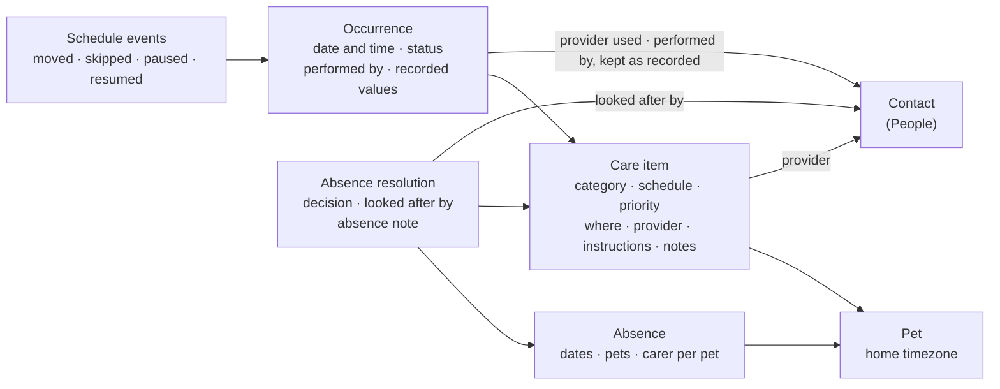
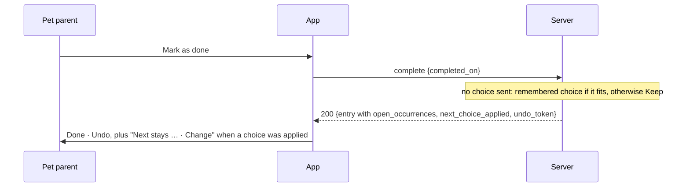

# Care Item — functional spec

**Status:** active target model, 2026-09-27; **amended 2026-09-29** by the care occurrences programme (D-CIE-024 … D-CIE-028 below, and 2026-10-01 D-CIE-029 … D-CIE-034, timing decisions D-CSM-019 … D-CSM-035, absences D-ACP-011). This document is the **single canonical product spec** for Care Items (series + occurrences + detail view + absence join-work). Execute-plans: [`care-item-evolution`](../../../.agents/plans/care-item-evolution.md), [`care-next-occurrence-c1a7`](../../../.agents/plans/care-next-occurrence-c1a7.md).

**Supersedes:** [care-item-model-delivery-plan.md](../changes/care-item-model-delivery-plan.md) (profile/list presentation roadmap — historical). The old execute-plan roadmap [`pet-care-item-model`](../../../.agents/plans/pet-care-item-model.md) is **superseded**; do not start new work from it.

**Depends on:** [People & Care Team](../../people/features/people-care-team.md) (D1–D23). "People Dn" below refers to it.

**Does not replace:** [care-schedule-management.md](./care-schedule-management.md) (timing authority), [care-progression.md](./care-progression.md) (establishment), or [care-context.md](./care-context.md) (absence invariants). Those specs stay authoritative for their domains; this spec owns Care Item UX and the new absence-resolution model.

## Verdict

The Care Item becomes the place where a pet parent sees and acts on one part of a pet's ongoing care. The View puts what needs attention first. It answers, in order: which pet, what care, what needs doing now, how the schedule works, whether an absence affects it, who is involved, and what happened before.

| Concept | What it is | Today |
|---|---|---|
| Care item | The lasting definition of care for one pet | `health_entries` |
| Occurrence | One scheduled or performed instance | `health_occurrences`, plus the `care_schedule_events` ledger |
| Contact | A person or organisation involved in care | People spec (replaces `vets`) |
| Absence | A period when normal care arrangements change | `planned_absences` |
| Absence resolution | What the user decided for one care item during one absence | New |

Four principles:

1. **Build on what works.** Care Schedule Management (CSM) keeps owning timing: recurrence, rollover, reschedule, pause, projection and flexibility. Requirements that describe existing behaviour are labelled **Preserve**. Where the care occurrences programme changed the timing itself (always a real next date, two schedule types, Postpone until), the row is labelled **Amends (timing)** and points to the CSM decision.
2. **Store decisions, work out statuses.** The app stores what a person decided. Whether something is reviewed, resolved or needs review is worked out when read, like readiness in Away Planning (D-AWAY-001/002) and "needs review" in People (D18).
3. **Calm by default.** Status answers "when?". Priority answers "how important?". The two signals never mix.
4. **Quick to complete, rich if wanted.** Marking care done never requires details, but it never guesses a date that changes the schedule.

## Decisions

| # | Decision | Status | Consequence |
|---|---|---|---|
| D-CIE-001 | "Occurrence" is an internal word | Agreed | The View never says "Current occurrence". Status and date speak for themselves: "Overdue · 11 Sep 2026" |
| D-CIE-002 | One word for late, unresolved care: **Overdue** | Agreed; amended by D-CIE-024 | "Missed" leaves the UI. Stored statuses stay `pending` / `completed` / `skipped`. There is no `cancelled`. D-CIE-024 adds **Not recorded** for Fixed-schedule doses whose next dose is already due |
| D-CIE-003 | Timed care: Coming up until its time, **Due until the planned time, then Overdue** | Agreed | Matches live `isOccurrenceMissed` / `isOccurrenceMissed` (server + client). Multi-dose days: each slot has its own status |
| D-CIE-004 | Status describes the schedule and what has been logged, not medical safety | Agreed | No wording implies that a late dose is safe or unsafe |
| D-CIE-005 | Care uses the pet's home timezone | Agreed | Occurrences, reminders, absence boundaries, "today" and status changes all use one timezone |
| D-CIE-006 | Overdue looks the same at every priority | Agreed | A small Overdue pill. Priority only changes ordering. Overdue items of every priority are listed and counted in Actions |
| D-CIE-007 | Reminders never change status | Agreed | "Remind me 7 days before" doesn't make care Due |
| D-CIE-008 | The attention area can hold several occurrences | Agreed | Twice-daily care shows today's doses, each with its own status and action |
| D-CIE-009 | Completing overdue care asks when it was done | Agreed | A correctness rule. For "after completion" schedules, that date sets every following date |
| D-CIE-010 | History lists resolved past occurrences | Agreed | Completed and skipped. An unresolved overdue occurrence stays in the attention area only |
| D-CIE-011 | Three text scopes: Instructions, Notes, Absence note | Agreed | No separate "default carer instructions" field. Instructions serve that purpose |
| D-CIE-012 | Absence handling is resolved per care item, per absence | Agreed | Amends D-AWAY-003 ("per-item assignment is out of scope") |
| D-CIE-013 | Store the resolution, work out the status | Agreed | No stored "plan needed", "confirmed" or "needs review" |
| D-CIE-014 | No permanent carer on a care item | Agreed | The pet's carer on the absence is the suggested "who". One occurrence can name someone else (People D10) |
| D-CIE-015 | Schedule flexibility stays worked out, not stored | Agreed | D-ACP-006 unchanged. A per-item override stays deferred |
| D-CIE-016 | A provider is a contact, or a typed name for now | *Proposed* | Typed names have limits (see Providers). Contacts remain the normal path |
| D-CIE-017 | Occurrence actions and care item actions live in separate menus | Agreed (amended 2026-09-29) | Makes "this time only" vs "the schedule" visible in the layout. Occurrence menu: Skip, Postpone, Plan another date, Add note, Looked after by. Care item menu: Edit, Pause or Resume, Archive or Restore, Delete. List rows carry one action only (D-CIE-026) |
| D-CIE-018 | Lifecycle: Active, Paused, Finished, Archived, Deleted | Agreed; amended by D-CSM-028 | "Close event" and "Reopen event" are retired. Pause and "pause until" are **Postpone until**; Resume asks the date, pre-filled with the date it would have had |
| D-CIE-019 | Category fields are built from shared blocks | Agreed | Categories choose blocks. Route or method is optional where useful |
| D-CIE-020 | Historical facts don't change when defaults change | Agreed | Occurrences keep the provider, dose and people recorded at the time |
| D-CIE-021 | Reminder delivery is a separate track | Agreed | It can start early and doesn't block the redesign |
| D-CIE-022 | Out of scope: cost, vaccination courses, stock and refills | Agreed | See Out of scope |
| D-CIE-024 | Status words: Coming up, Due, Overdue, **Not recorded**, Done, Skipped, Paused | Agreed 2026-09-29 | Not recorded = a Fixed-schedule dose still open when the next dose is due. Neutral info styling, not error: it assumes the care was given and only the record is missing. See Occurrence status |
| D-CIE-025 | One agenda: **Today** (Overdue first), **Due soon** (7 days), **Upcoming** (collapsed) | Agreed 2026-09-29 | Same component on the dashboard (all pets) and the pet profile (one pet). See Agenda |
| D-CIE-026 | One row, one action | Agreed 2026-09-29 | Rows show name, status and date, and one trailing action: **Mark as done**, or **Review** for doses not recorded. Other actions are on the Care Item view. The row changes only after the server confirms |
| D-CIE-027 | Create and Edit: main fields first, **Advanced settings** collapsed | Agreed 2026-09-29 | Plan something shows only **Due date**; Record something shows only **Completed on**. Advanced settings: Where, Priority, Schedule type, If done after the due date, Provider, Documents. See Edit |
| D-CIE-028 | The server supplies "today" | Agreed 2026-09-29 | Responses carry `as_of` and a status per open occurrence, in the pet's home timezone. The app refreshes on resume, every 15 minutes while care is on screen, and when the pet's day changes |
| D-CIE-029 | One **occurrence screen** per occurrence, for every status | Agreed 2026-10-01 | Rows open the occurrence; its header links to the Care Item view. Open: Done with any required input, Skip, Change date. Completed: change when it was done (D-CSM-034), notes, provider, documents, Undo. Server: `GET /:id/occurrences/:occId` |
| D-CIE-030 | **Done** follows one rule on every surface | Agreed 2026-10-01 | A stack, an earlier open After-it's-done date, or a required input opens a screen and saves nothing; an overdue After-it's-done date asks "When was this done?"; more than half an interval early asks to confirm; anything else completes today in one request. The app never sends `next_choice` on one tap |
| D-CIE-031 | Completion requirements per family, **required inputs only** | Agreed 2026-10-01 | Today only weight monitoring (a weight above 0, sent to `complete-weight`) |
| D-CIE-032 | Copy: no "dose" | Agreed 2026-10-01 | Buttons say **Done**; "Mark {name} as done"; confirmation "{name} done" |
| D-CIE-033 | Calendar: read-only projection, deferred | Agreed 2026-10-01 | Stored occurrences plus estimated dates; estimates carry no actions. Out of scope for the care occurrences programme |
| D-CIE-034 | **Stack** = two or more open slots of one Fixed-schedule item that have **started** | Agreed 2026-10-01 | Overdue, not recorded, or due with their time reached; a slot without a time has started from the beginning of its day. Coming-up slots and slots later today never count |
| D-CIE-023 | Pet **home timezone** on `pets.home_timezone` (IANA) | Agreed | Default at create: owner account TZ when People P4 exists, else `X-Client-Timezone` once, else `UTC`. Editable on pet profile. Care "today" and timed Overdue use this zone. **Absence guest access** keeps People **D24** (creator account TZ on the absence) — two fields, two jobs. Fallback chain: pet → owner account TZ → `UTC` |

## Where we start

Much of the target behaviour exists. This table maps each area to what is live.

| Area | Today | Type |
|---|---|---|
| Care item and occurrence | `health_entries`, `health_occurrences`, `care_schedule_events` (CSM v1) | Preserve |
| Occurrence status | Stored `pending` / `completed` / `skipped`. The detail screen groups open ones as Missed, Due today and Coming up. The event list, away plan and notifications say Overdue | UX change (Overdue everywhere). Timed rule unchanged (D-CIE-003 **Preserve**). **Amends (timing):** Not recorded for Fixed-schedule stacks (D-CIE-024, D-CSM-023) |
| "Today" | Occurrence status uses the device's calendar. The away plan and notifications use the server's calendar day. No timezone is stored | New rule (D-CIE-005); the server supplies it (D-CIE-028) |
| Plain-language schedule | "Every year", "Every 30 days" (`formatRecurrenceSummary`). The schedule type isn't in the summary | UX change |
| Schedule type explained | Toggle with an info sheet and a worked example | Preserve, with a copy fix (Schedule section). Labels **Fixed schedule** / **After it's done**, under Advanced settings → **Schedule type** |
| Category defaults for the schedule type | Vaccination and parasite prevention default to fixed; everything else after completion (D-CSM-001) | **Amends (timing):** medication → Fixed schedule; every other category → After it's done (D-CSM-020) |
| One-off change vs schedule change | Change date moves one occurrence; changing the cadence is separate (D-CSM-006, D-ACP-007) | Preserve the separation. **Amends (timing):** Fixed schedule asks **This date only** / **This and following** (D-CSM-027) |
| Several overdue occurrences | Triage sheet, "Skip all missed", "skip earlier missed doses" when completing | **Amends (timing):** only Fixed schedule stacks; one row "3 doses not recorded" → **Record earlier doses** (Given / Not given); older than three days → recordable from History (D-CSM-023) |
| Completion | "Mark Completed" opens a sheet with a date and a note. Weight care opens the weight sheet. Vet visits then offer a health-issue link | UX change (D-CIE-009) |
| Moves around an absence | "Suggested by Agatha", the change-date sheet with gap, preview and caution warnings, undo | Preserve |
| Flexibility | Worked out per item: fixed, earlier only, carer task, flexible, with a maximum shift (D-ACP-006) | Preserve |
| Absence notes | A note for the whole trip, and a note per pet per trip | Preserve. Per-item resolutions are new |
| Care setting | `care_setting`: home / vet / other, labelled "Where" | Preserve. Provider is new |
| Priority | `care_importance`: Essential / Recommended / Optional | Preserve |
| Treatment end, reason | "Repeats until" date; link to a health issue | Preserve |
| Weight | Completing a weight check writes a weight entry linked to the occurrence. The target weight is on the pet | Preserve. Body condition score is new |
| Documents | Care item documents, occurrence notes. No occurrence documents | Occurrence documents are new |
| Lifecycle | Close and Reopen. Pause and resume exist in the API only, with no UI | UX change, Pause UI. **Amends (timing):** pause is Postpone until; resume asks the date (D-CSM-028) |
| Future occurrences | Created by T−1 / rollover only; a next date more than a day away had no stored occurrence, so it could not be acted on (D-CSM-004, D-CSM-018) | **Amends (timing):** every active planned item always has a real open occurrence, created in the same request as the action that needs it (D-CSM-019). Fixed schedule also stores the next series date's doses (D-CSM-023) |
| Irregular dates, boosters | Not supported (one series date at a time) | **New:** Plan another date; "+ Add a booster date" for vaccines (D-CSM-025) |
| Lists | Several grouping rules (dashboard, profile, All care, pet list) with a reminder window that could hide care | **New:** one agenda (D-CIE-025) |
| Reminders | One reminder N days before, plus one overdue notice. In-app only, created when the app checks, calendar days only | Separate track (D-CIE-021) |

Phase 0 (a regression baseline) mostly exists: the CSM projection corpus and integration gate (CSM-17), and the Away Care Planning tests. New tests are needed only where status, timezone and completion change.

## Domain model

Each arrow points from a concept to the one it refers to. Recording an absence changes no care (Care Context's hard invariant). Only a person's explicit move changes a date.

## Occurrence status

### States

| Shown as | Date-only care | Timed care | Stored as |
|---|---|---|---|
| Coming up | Before the scheduled day | Before the scheduled time | `pending` |
| Due | On the scheduled day | From the scheduled time until that time has passed | `pending` |
| Overdue | From the next calendar day | From the scheduled time onward on the scheduled day | `pending` |
| Not recorded | Fixed schedule only: the next dose of the series is due. After three days it closes and stays recordable from History | same | `pending`, then `skipped` with `close_reason = not_recorded` |
| Done | — | — | `completed` |
| Skipped | — | — | `skipped` (`close_reason = user`) |
| Paused | The item is paused; its open occurrence is hidden from lists and reminders | same | item `status = paused` |

How long Overdue lasts depends on the schedule type (D-CSM-022, D-CSM-023):

- **After it's done:** Overdue until done, skipped or postponed. While overdue, the item shows "Estimated next: {today + interval}" — a display-only line, never a row, an action or a reminder.
- **Fixed schedule:** Overdue until the next dose of the series is due, then **Not recorded**. Several Not recorded doses are one **stack** row: "3 doses not recorded" (medication) or "3 not recorded" (other care), with **Review**.

| Word | Chip ([system.md](/docs/design/system.md) §6.8) |
|---|---|
| Coming up | Neutral text |
| Due | Warning tokens + text |
| Overdue | Error tokens + text + urgency icon, same at every priority (D-CIE-006) |
| Not recorded | Info tokens + text + icon (not error) |
| Done · Skipped · Paused | Success + check · neutral · neutral + pause icon |

### Rules

- **A person's action wins.** Care done late is Completed, not "Overdue and completed". History still shows both dates: "Done 15 Sep · due 11 Sep".
- **Several doses a day:** each dose has its own status. The 08:00 dose is Overdue from 08:01 until the 18:00 dose is due, then Not recorded; the 18:00 dose follows the same rule for its slot. Several times of day always use Fixed schedule (D-CSM-020).
- **List surfaces (profile, All Actions, All care):** when several open slots exist on one item, the row subtitle states the **worst** open slot (e.g. "Overdue · 08:00" or "Due · 18:00"), consistent with Needs attention's leading occurrence rule.
- **Not a safety statement (D-CIE-004).** Due and Overdue describe the schedule and what has been logged. They never say whether a late dose is safe. A future completion window, set by the pet parent or their vet, could replace these defaults for one item.
- **Reminders don't change status (D-CIE-007).**
- **Timezone (D-CIE-005, D-CIE-023):** every "today", status change, reminder and absence boundary uses the pet's home timezone (`pets.home_timezone`), not the device's. When the device is somewhere else, times show the zone: "18:00 · Paris time". Absence guest access windows stay on the creator account timezone (People D24), separate from pet home.
- **The server decides (D-CIE-028):** list and detail responses carry `as_of { date, time, timezone }` and a status for each open occurrence. The app may turn a timed Due into Overdue as minutes pass, and asks again on resume, every 15 minutes while care is on screen, and when the pet's day changes.

## Agenda (D-CIE-025, D-CIE-026)

The dashboard (all pets) and the pet profile (one pet) use the same agenda. All care uses the same groups.

1. **Today**
   - **Overdue** first, both schedule types. A Fixed-schedule stack is one row, "3 doses not recorded", with **Review**.
   - Then care due today, grouped **Morning** (before 12:00), **Afternoon** (12:00–17:59), **Evening** (from 18:00) and **Anytime** (no time). Group headings appear only when at least two groups have care; otherwise one heading, **Today's list**.
   - Care done today stays at the end, quiet (check and time), until the day ends.
2. **Due soon** — the next 7 days after today.
3. **Upcoming** — later dates, collapsed, with a count.

- Care that repeats daily or more often appears only in Today.
- The reminder window never hides care. A yearly vaccine in 200 days is in Upcoming.
- Dashboard orientation line: "2 overdue · 3 due today"; when both are zero, "Nothing due today", then Due soon and Upcoming.
- States: a loading skeleton (no empty copy while loading); an error with Retry; no care at all → the illustrated empty state and "Add care".
- No progress bars, rings, "3 of 5" or praise (True North #4).
- Time groups use each pet's local time.

**Row (D-CIE-026):** one composition everywhere (`CareActionRow` inside `CareCollectionInsetList`): pet avatar on the dashboard only, name, status chip and date or time, and **one trailing action** — **Mark as done**, or **Review** for a stack. Tapping the row opens the Care Item view. An item with several open doses acts on the most urgent one. The row changes only after the server confirms, then "Done · Undo".

Accessibility: section and group headings are headers; Upcoming exposes expanded or collapsed; rows are at least 56 high and fully tappable, the trailing button at least 48; the row reads as one label, e.g. "Buddy, Flea treatment, Overdue, 5 June"; moves respect reduced motion. Stable ids: `care_agenda_today`, `care_agenda_due_soon`, `care_agenda_upcoming`, `care_agenda_group_<morning|afternoon|evening|anytime>`, `care_agenda_stack_<entryId>`.

## Care item view

### Order on mobile

1. **Header:** pet avatar, the care item's name, and "Buddy · Dog" underneath. Tapping the pet opens its profile. The header stays visible while scrolling. Top right: Edit and the care item menu.
2. **Needs attention:** see below.
3. **Agatha:** a suggestion or safeguard for this item, only when there is one.
4. **Absence:** placed here when it needs a decision. Otherwise it sits after Schedule.
5. **Schedule**
6. **Details**
7. **History**

### Needs attention

The area at the top holds what needs doing now. For most items that's one occurrence.

| Situation | Shows | Actions |
|---|---|---|
| Coming up | "Coming up · 6 Oct · in 9 days" | Mark as done, Change date |
| Due | "Due today" or "Due · 08:00" | Mark as done, Change date |
| Overdue | "Overdue · 11 Sep 2026 · 16 days ago" | Mark as done, Change date |
| Several doses today | A **Today** list: "08:00 · Completed ✓", "18:00 · Due" | "Mark 18:00 as done" for the most recent open dose; each row has its own action |
| Doses not recorded (Fixed schedule) | "3 doses not recorded" | **Review** opens **Record earlier doses**: per dose **Given / Not given** (medication) or **Done / Not done** (other care); footer "All given" / "None given" |
| After it's done, overdue | "Overdue · 5 Jun · Estimated next: 7 Jul" | Mark as done (asks "When was this done?"), Change date |
| Looked after by someone | "Looked after by Jamie" on the occurrence | — |
| One-off record | "Recorded · 12 Sep 2026" | Add details |
| Finished | "Finished · 12 Sep 2026" | — |
| Paused | "Paused since 1 Sep" (or "Paused until 12 Oct"), plus "N doses not recorded · Review" when a stack remains | Resume (asks the date, D-CSM-028) |
| Archived | "Archived", muted | Restore |

- The leading occurrence is the most recent open one that is Due or Overdue. Without one, it's the next occurrence coming up. This matches today's "mark latest" rule.
- The Overdue pill is small, red and the same for every priority (D-CIE-006). Coming up is always neutral.
- **Menus (D-CIE-017):**
  - Needs attention keeps one primary button (**Mark as done**, or **Review** for a stack) and an outlined **Change date**.
  - The occurrence menu (in this area) has Skip, **Postpone**, **Plan another date**, Add note, Looked after by and View details.
  - The care item menu (top right) has Edit, Pause or Resume (both through Postpone until), Archive or Restore, and Delete.
- **Verbs:** "Mark as done" replaces "Mark Completed". "Change date" stays, because it is frozen Away Care Planning copy.

### Schedule

The app writes a summary from the schedule. Controls stay in Edit.

- **Rhythm:** "Every year · fixed schedule", "Every 30 days after it's done", "Twice a day · 08:00 and 18:00", "Once".
- **Next date,** using the away plan's date wording (D-ACP-002). There is always a real next date (D-CSM-019): "Next: 11 Sep 2027". While an After-it's-done item is overdue: "Estimated next: 7 Jul" (display only). Planned dates show as planned: "Booster · 1 Jul".
- **Reminder:** "Reminder 7 days before" or "No reminder".
- **Flexibility in words,** from the worked-out value: "Can move up to 3 days earlier", "Keep to the date" or "Can move up to 7 days either way". It is hidden for care more frequent than weekly.
- **Source,** when it isn't the pet parent: "Set by your vet".
- **End:** "Until 30 Sep" when there's an end date.
- **The Established marker,** once earned, as a quiet line.
- **Edit schedule** opens Edit at the Schedule section.

**Copy fix for the schedule type.** Moving one date of a fixed schedule asks **This date only** (the default; the other dates stay) or **This and following** (the schedule moves from that date) (D-CSM-027, amending D-ACP-007).

- **After it's done:** "The next date counts from the day you mark it done."
- **Fixed schedule:** "The next date counts from the due date, even if it's done early or late."

The Change date sheet previews the next two dates for the chosen scope (R-C3).

### Details

- **Where and who** on one row: "At the vet · Greenhill Veterinary Clinic"
- Priority
- Instructions
- Category fields that have a value. Empty ones appear only in Edit
- Documents. Upload limits are shown only while uploading
- Notes (Full access only)
- Health issue: "Related to Arthritis", linked to the issue

### History (D-CIE-010)

- Resolved past occurrences, newest first. Mobile shows 3, web shows 5, then "See full history".
- Each row shows:
  - the date and status (Done, Skipped, Not given or Not recorded)
  - the due date when it differs
  - one key recorded value, such as "12.4 kg"
  - both people when they differ (People D15), e.g. "Given by Jamie · logged by Alex"
- A row opens that occurrence's record, which can be edited.
- An unresolved overdue occurrence never appears here.
- A **Not recorded** dose offers **Record as given** (D-CSM-023). It becomes Done; nothing else changes.

### Access levels

People tiers decide what each person sees.

| | Owner or Full access | Can log care |
|---|---|---|
| Mark as done, Skip, Add note | Yes | Yes |
| Change date, Edit, Pause, Archive, Delete | Yes | No |
| Instructions, provider | Yes | Yes |
| Notes | Yes | No |
| Documents | Yes | Only those attached to the absence (People D7) |
| Absence resolution | Edit | Read, for care they're looking after |

### Web and desktop

- A breadcrumb shows the pet: "Pets › Buddy › Wellness review". The title is the care item's name, without "View".
- On wide screens there are two columns:
  - The main column holds Needs attention, Agatha and History. Needs attention stays visible while the page scrolls.
  - The side column holds Schedule, Absence and Details.
- Text and fields keep a comfortable reading width.
- Below the breakpoint, the page becomes one column in the mobile order, with the same components and words.
- On wide screens, Edit is one form column with a live summary beside it: the schedule sentence and the next dates.

## Completing care

| Situation | Mark as done | Then |
|---|---|---|
| Coming up or Due | Done today, straight away | "Done · Add details · Undo" |
| Overdue | Asks **When was this done?** Today · On the scheduled date (11 Sep) · Choose another date | "Done · Add details · Undo" |
| Weight monitoring | The existing weight sheet, because the value is the point | — |
| Well before its date (more than half an interval early) | Asks "Planned for 12 Mar. Mark it as done today?" (Cancel first) | "Done · Undo" (D-CSM-030) |
| Done after its due date while another date is already planned | Asks what to do with that date (below) | "Done · Undo" |

- **Why overdue care asks (D-CIE-009):** for "after completion" schedules, the done date sets every following date. One tap on 27 Sep for care done on 12 Sep would move the next date by 15 days. The question is asked for every overdue item, so the history stays accurate too.
- **The provider is kept whoever completes it (PEOPLE I12).** The occurrence records the provider of the contact attached to the care item, even when a co-parent or carer who can't see that contact completes it.
- **Add details** offers:
  - a note
  - who performed it (defaults to you)
  - the provider used (defaults to the item's provider)
  - photos and documents
  - the category's occurrence fields
- Vet visits still offer the link to a health issue afterwards (Preserve).
- **Next date from the vet:** after completing, "Next: 11 Sep 2027 · Change".
  - A date within one interval is a normal Change date.
  - A longer one, such as a 3-year rabies booster, asks "Change the interval from now on?" and changes the cadence. A single move can't go past where the next one would have been (D-ACP-009).
- **The next date is shown straight away.** The response carries the item with its new open occurrence; the row moves to its section without a reload (D-CSM-019).
- **Undo** reverses the whole action, including a new next date the app created and any choice below (D-CSM-029).

### Done after the due date, with another date waiting (D-CSM-026)

When care is done late, another planned or scheduled date is waiting, and the gap to it shrank by more than half, the app **does not ask** (revised 2026-10-01):

- The waiting date is **kept**, unless the care item remembers another choice in Advanced settings, **If done after the due date**: Keep · Skip the next date · Move this and following. A remembered choice that doesn't fit this completion falls back to Keep.
- The confirmation says so and offers a way to change it: "Apoquel done · Undo — Next stays 18:00 · Change". **Change** opens Change date on the waiting date (**This and following** moves the series).
- No wording about whether that is safe (D-CIE-004).

### Plan another date (D-CSM-025)

- **Change date** moves a date; **Plan another date** adds one (a booster, a booked visit, an extra dose).
- Planned dates come first: the schedule rule adds a date only when nothing is planned.
- A date within half an interval of another open date asks first: "Another date is already planned for 5 Jun. Add this one too?"
- Vaccines: "+ Add a booster date" under the first due date. First dose 1 Jun, booster 1 Jul, then yearly: the booster follows the first dose, and the yearly date counts from the booster.
- After it's done: when a later date is open together with an earlier one, the app opens the Care Item view so each date can be marked done, skipped or moved on its own. A completion request without `earlier_choice` keeps the earlier date open.

## Absences

### Where the user sees conflicts

Absence conflicts attach to **dates**, not abstract care items:

| Surface | Shows |
|---------|--------|
| **Needs attention** (each open occurrence row) | Short line when that occurrence's date intersects an upcoming absence |
| **Absence module** (care item) | Trip summary + two actions (below) for the primary upcoming absence |

Tone is **neutral** (not red "plan needed"). Copy names the **concrete date** where possible.

### Care item — two actions

When affected and not yet resolved:

| Action | Behaviour |
|--------|-----------|
| **Keep with {carer}** (or **Keep during absence** when no carer) | Saves resolution **`keep_date`** (+ optional **`looked_after_by`** from the pet's carer on the trip) |
| **Review date** | Opens the date directly (it is always a real occurrence, D-ACP-011) with **Change date**, **Skip** and **Postpone** |

**Move before / move after** are not separate buttons. After **Change date**, the server stores **`move_before`** or **`move_after`** when the new date falls outside the absence window (inferred from dates). **Move after return** is **Postpone until** the day after return (`reason: absence`, D-CSM-028) — the same command as Pause. Accepting an away-plan planner suggestion uses the same reschedule path and syncs the resolution.

**Nothing needed** (trip deferral without skipping) remains in the resolution enum for edge cases; primary UX for "drop this instance" is **Skip** on the occurrence.

### When a care item is affected

A care item is affected when the away plan lists it (R-A1):

- its open occurrence is overdue
- its open occurrence is due before you leave
- it has a scheduled, planned or estimated date inside the absence

The Care Item and the away plan use the same calculation, so they never disagree.

### What is stored: the resolution (D-CIE-012, D-CIE-013)

A resolution is stored only when someone makes a decision for one care item and one absence. It covers every date of that item inside the absence. A week of daily medication is one resolution, not seven.

| Field | Meaning |
|---|---|
| Decision | **Keep the date** · **Move before** · **Move after** · **Nothing needed** |
| Looked after by | Optional. A contact or household member. The suggestion is the pet's carer on the absence (D-CIE-014) |
| Absence note | Optional note for this item on this trip, e.g. "The tablets for this trip are in labelled bags" |
| Documents | Optional. They join the absence's handover scope (People D7) |
| Dates decided for | The item's dates inside the absence when the decision was made. Used to notice changes |

- **Keep the date** covers both "Jamie will do it" and "the vet does it at the booked appointment".
- **Move before** and **Move after** are stored **after** a successful **Change date** or **Postpone until** when the new date is before leave or after return (R-C2–R-C4, R-C8). **Review date** opens the real occurrence directly (D-ACP-011); nothing needs creating first.
- A date **planned** inside the trip (Plan another date) is a real occurrence and can be looked after by the pet's carer.
- **Nothing needed** records deliberate trip-level deferral; **Skip** on the occurrence is the usual way to drop one in-window instance.

### What is worked out when read

| Shown | When | Example |
|---|---|---|
| Nothing due | The pet has an upcoming absence, but this item isn't affected | "Away 3–10 Oct · nothing due while you're away" |
| Not reviewed yet | Affected, with no resolution | "Due 6 Oct, while you're away · Not reviewed yet", with **Keep with Jamie** and **Review date** |
| Resolved | A resolution exists and still matches the facts | "Jamie will handle this on 6 Oct" · "Moved to 2 Oct, before you leave" · "Nothing needed this time" |
| Needs review | A resolution exists, but a fact changed | "Jamie can no longer see Buddy's plan. Choose someone else?" · "This moved to 8 Oct since you reviewed it." |

"Needs review" appears when:

- the named person is no longer available (People D18)
- the item's dates inside the absence differ from the dates decided for (a move, a schedule change, or the absence changing once editing ships)
- the decision was Move before or Move after, but a date is still inside the absence, for example because the move was undone

Rules:

- Nothing here is ever red, and there is no "Plan needed" badge. "Not reviewed yet" is neutral (True North #2 and #9, the D-AWAY-002 copy rule).
- Saving an absence never requires resolutions (D-AWAY-010 unchanged).
- Resolved items no longer count as "items to review" in the absence's care coverage. Care coverage stays a worked-out fact (D-AWAY-002).
- One occurrence can still name a different person (People D10). That overrides the resolution for that day only.

### Suggestions and moves

- Care Planner suggestions stay stateless. Accepting one moves the date and saves the resolution as Move before. "Not now" hides it for the session, as today.
- Suggestions follow flexibility strictly (D-ACP-006, R-D4). Manual moves are never blocked (True North #10).
- For clinical care, the copy stays cautious: "This falls during your absence. Review its timing or choose who gives it."

### The carer's view and the handover

- The person looking after it sees, per item:
  - the dates
  - who is doing it
  - the item's Instructions
  - the item's absence note
  - the provider to contact
  - the attached documents
- The handover PDF shows the same, extending the per-pet handover (AW-11).
- Nothing is copied. Instructions, the item's absence note, the per-pet trip note and the whole-trip note each appear once.
- People D21: when someone is named, only they get the reminder. Reaching a carer outside the app needs the reminder track.

### Amendments

| Decision | Change |
|---|---|
| D-AWAY-003 | Amended: per-item resolutions are in scope. The carer per pet stays, and is the suggested "who" |
| D-ACP-010 | Superseded by D-ACP-011: every active item has a real open occurrence, so later dates can be planned and assigned directly |
| D-AWAY-001, D-AWAY-002, D-AWAY-010 | Unchanged: no stored status, facts not verdicts, saving never needs a complete plan |
| People D10 | "Absence plan" now includes per-item resolutions |

## Providers

- A care item can have a default provider (People: "Provider · on the care item").
- **The normal path is a contact.** The picker lists contacts whose role fits the care: vet roles for care at the vet, groomers for grooming. It also offers "Show everyone" and "Add new". Adding a contact needs only a name.
- **A typed name is allowed for now (D-CIE-016).** A typed name:
  - displays like a contact
  - has no phone or email, doesn't appear in a contact's Related care, and can't be chosen as a carer
  - offers "Save as contact"
  - when People ships, is offered for linking to a contact, never merged automatically
- Before People ships, care at the vet can prefill the pet's vet from the Veterinary team.
- The provider used on an occurrence defaults to the item's provider, and is kept as recorded (D-CIE-020).
- The UI label stays **Where** (*Proposed*; see Still open).

## Instructions, notes and documents (D-CIE-011)

| Scope | Holds | Example | Who sees it |
|---|---|---|---|
| **Instructions** (care item) | What's needed to do the care | "Give with food. The blue tablets are in the kitchen cupboard." | Everyone who can do it, including carers |
| **Notes** (care item) | Background for the household | "Ask the vet about changing product next time." | Full access only |
| **Occurrence note** | What happened this time | "Ate it in cheese. Slightly sleepy after." | As the occurrence |
| **Absence note** (per item, per absence) | Only for this trip | "For this trip, the tablets are already in labelled bags." | Everyone involved in the absence |

- The per-pet trip note and the whole-trip note already exist and stay.
- Documents follow the same scopes: care item (exists), occurrence (new), absence (People D7).
- Existing `notes` values stay as Notes. Nothing is parsed or moved automatically. Existing `dosage` values become the dose in the Product and dose block. Where that block doesn't apply, they are kept as Instructions.

## Category fields (D-CIE-019)

Categories choose from five shared blocks. Every block field is optional, and completing care never requires one.

| Block | On the care item | On the occurrence |
|---|---|---|
| **Product and dose** | Product name, form, strength, dose (amount and unit), route or method (medication and parasite prevention only) | Amount given (defaults to the dose), product used if different |
| **Visit** | Questions to ask (optional) | Summary, recommendations, follow-up date |
| **Measurement** | — (the target weight stays on the pet) | Weight, saved as a weight entry; body condition score, 1–9 |
| **Services** | Usual services (multi-select), style notes | Services done |
| **Common** (all categories) | Instructions, notes, provider, documents | Performed by, provider used, note, photos and documents |

| Category | Blocks | Also |
|---|---|---|
| Medication | Product and dose | End date is the existing "repeats until". Reason is the existing health-issue link. Optional skip reason: Refused, Unwell, Vet advised, Other. Optional reaction note |
| Vaccination | Visit | Vaccine name on the item. Brand, batch number (optional) and certificate photo on the occurrence. Next date from the vet (see Completing care). No "expiry": the vial's expiry isn't stored, and "valid until" is the next due date |
| Parasite prevention | Product and dose | Targets: fleas, ticks, worms (multi-select). Optional reaction note |
| Wellness review | Visit, Measurement | — |
| Dental care | Product and dose (home care) or Visit (professional care) | Type: brushing, chew or product, professional check, professional clean |
| Weight monitoring | Measurement | The target is the pet's weight reference |
| Grooming | Services | — |
| Nail care | Services, with fewer options | Method; issue noticed (optional) |
| Other care | Common only | — |

- The View shows only fields with a value.
- Changing category keeps the common fields. Block fields that no longer apply are removed on save, after a confirmation.
- Delivery order: Medication, Measurement and Vaccination first; then Parasite prevention, Wellness review and Dental care; then Grooming and Nail care.

## Lifecycle (D-CIE-018)

| State | Meaning | How it starts | Shown |
|---|---|---|---|
| Active | Normal scheduling | Default | — |
| Paused | No new dates or reminders; hidden from lists; history kept | **Postpone until** without a date (Pause), or with one (resumes by itself on that date) (D-CSM-028) | "Paused since 1 Sep" or "Paused until 12 Oct", and Resume |
| Finished | Nothing more is planned | Worked out: one-off care done, or the end date passed | "Finished · 12 Sep" |
| Archived | No longer tracked | Archive, which replaces "Close event" and closes open occurrences, as Close does today | Muted, with Restore |
| Deleted | Removed | Delete, after a confirmation that suggests Archive when history exists | — |

- Paused items leave Actions. The away plan shows them as "Paused" (R-A9).
- **Resume asks the date (Amends (timing), D-CSM-028):** pre-filled with the date the item would have had without the pause ("This is when it would have been"). After it's done: step from the open date by the interval until on or after today. Fixed schedule: the first series dose on or after now. Resuming never adds the dates that fell during the pause (D-CSM-005).
- A paused Fixed-schedule item keeps its stack: doses older than three days still close as Not recorded and stay recordable from History.

## Edit

Create and Edit use the same form (D-CIE-027). The category sets defaults for where, priority and schedule type (taxonomy §4.3, D-CSM-020); the pet parent can change them. Changing category updates only the Advanced settings the user has not touched.

| Section | Holds |
|---|---|
| Main | Pet(s) · **Plan something / Record something** · category · name · **dosage (medication only)** · repeat (frequency, times of day) · **Plan → Due date only (required)** / **Record → Completed on only (required)** · vaccination: **+ Add a booster date** · reminder · notes · related health issue |
| **Advanced settings** (collapsed, one-line summary, e.g. "At home · Essential · After it's done · Ask me") | Where · Priority · **Schedule type** (Fixed schedule / After it's done, with the info sheet) · **If done after the due date** (Ask me / Keep the next date / Skip the next date / Move this and following) · Provider · Documents |

- **Plan / Record** is a segmented control; switching hides and clears the other date. The server rejects a planned create with `completed_on`, and a record without it (400).
- Advanced settings: header at least 48 high, the summary is its subtitle and part of its label; it opens and focuses the first error when validation fails.
- Several times of day: After it's done is not offered (D-CSM-020).
- Booster dates show as removable chips ("Remove booster date 1 Jul").
- Schedule edits are applied as actions (D-CSM-032): a new next date is a Change date; a new frequency applies from today; switching schedule type asks for confirmation.
- Category blocks appear after the category is chosen. Empty optional blocks stay collapsed, e.g. "Add dose details".
- "Record what happened" keeps its shorter form (taxonomy §7.2).
- Lifecycle actions live in the View's care item menu, not in Edit.

- Category blocks appear after the category is chosen. Empty optional blocks stay collapsed, e.g. "Add dose details".
- "Record what happened" keeps its shorter form (taxonomy §7.2).
- Lifecycle actions live in the View's care item menu, not in Edit.

## Reminders (D-CIE-021)

Today reminders appear only inside the app, only when the app checks, and only by calendar day. The separate track covers, in order:

1. Delivery outside the app (push or email).
2. Reminders at the time of timed care.
3. A follow-up when care isn't done.
4. More than one reminder per item.

Reminders use the pet's home timezone (D-CIE-005). Who gets them follows People D21.

## Vocabulary (EN / FR)

New FR wording is proposed and needs the FR copy pass.

| Concept | EN | FR | Source |
|---|---|---|---|
| Overdue | Overdue | En retard | Existing |
| Due | Due today · Due | Aujourd'hui · À faire | Existing / new |
| Coming up | Coming up | À venir | Existing |
| Not recorded | Not recorded · 3 doses not recorded | Non noté · 3 doses non notées | New (D-CIE-024) |
| Done | Done | Fait | New, replaces "Completed" in status chips |
| Skipped | Skipped | Ignoré | Existing |
| Fixed schedule | Fixed schedule | Calendrier fixe | Existing ARB |
| After it's done | After it's done | Après l'avoir fait | New, replaces "From completion" |
| Schedule type | Schedule type | Type de calendrier | New |
| If done after the due date | If done after the due date | Si c'est fait après la date prévue | New |
| Today · Due soon · Upcoming | Today · Due soon · Upcoming | Aujourd'hui · Bientôt · À venir plus tard | New (D-CIE-025) |
| Today's list | Today's list | La liste du jour | New |
| Morning · Afternoon · Evening · Anytime | Morning · Afternoon · Evening · Anytime | Matin · Après-midi · Soir · À tout moment | New |
| Nothing due today | Nothing due today | Rien à faire aujourd'hui | New |
| Plan another date | Plan another date | Prévoir une autre date | New (D-CSM-025) |
| Add a booster date | + Add a booster date | + Ajouter une date de rappel | New |
| Postpone | Postpone until | Reporter au | New (D-CSM-028) |
| Record earlier doses | Record earlier doses · Given · Not given | Noter les doses précédentes · Donnée · Pas donnée | New |
| Record as given | Record as given | Noter comme donnée | New |
| Estimated next | Estimated next | Prochaine date estimée | New |
| Advanced settings | Advanced settings | Paramètres avancés | New |
| Mark as done | Mark as done | Marquer comme fait | New, replaces "Mark Completed" |
| Change date | Change date | Changer la date | Existing |
| Pause, Resume | Pause, Resume | Mettre en pause, Reprendre | New |
| Archive, Restore | Archive, Restore | Archiver, Restaurer | New, replaces "Close event" |
| Finished | Finished | Fini | New |
| Instructions | Instructions | Consignes | New |
| Not reviewed yet | Not reviewed yet | Pas encore vu | New |
| Keep the date | Keep during absence · Keep with {carer} | Garder pendant l'absence · Garder avec {carer} | New |
| Review date | Review date | Voir la date | New |
| Looked after by | Looked after by | See the People vocabulary | People |

## Mockup corrections

- **Title:** use the care item's name, not "View …". Show the pet in the header or breadcrumb, and remove the header history icon.
- **Labels:** remove "Current occurrence".
- **Overdue:** a small red pill, the same at every priority. No large red block.
- **"DUE IN 2 DAYS":** neutral "Coming up · 6 Oct · in 2 days". It is not Due yet (D-CIE-007).
- **"PLAN NEEDED":** neutral "Not reviewed yet".
- **Flea treatment:**
  - "Move to 2 Oct" can't be suggested: monthly parasite prevention moves earlier only, by at most 3 days, and 3 Oct is inside the absence. Offer "Keep the date · Jamie", or a manual Change date with its caution.
  - Parasite prevention now defaults to **After it's done** (D-CSM-020), so "After it's done" is correct; the mockup label "After completion" becomes "After it's done".
  - "Assign to Jamie" becomes "Keep the date · Jamie".
- **Wellness review:** "No impact" is wrong, because the overdue review is on the away plan.
- **History:** 11 Sep 2026 appears only in Needs attention.
- **Web "No upcoming conflicts":** hide the section when the pet has no upcoming absence (Still open item 4).

## Phasing

Two streams run in parallel, then join.

| Phase | Stream | Scope | Depends on |
|---|---|---|---|
| A0. Vocabulary | Care | Overdue everywhere (retire "Missed" in UI), priority ordering, list subtitle for multi-dose | — |
| A1. Timezone | Care | Pet home timezone for today, status, reminders, absence boundaries (schema + API + client) | A0 |
| B. View and Edit | Care | Header, Needs attention (several occurrences), menus, schedule summary, Details, Instructions and Notes, History, Pause UI, access levels, web layout | A0 (A1 need not block layout-only work) |
| C. Completing care | Care | The "when was this done?" question, Add details, occurrence documents, next date from the vet | B |
| P1. People directory | People | People phase 1: contacts, provider foundations | — |
| D. Providers and people | Join | Provider (typed names as an interim), provider used, performed by, names kept in history | C, P1 |
| E. Absence resolutions | Join | Resolutions, worked-out states, the Care Item's Absence section, away-plan rows, handover PDF | B, and People phase 2 for carers from contacts. It can start with today's carers |
| F. Category blocks | Care | In the order above | C |
| R. Reminders | Own track | Delivery, at-time reminders, follow-ups, several reminders | Can start any time; blocks nothing |
| O. Care occurrences | Care | Always a real next date, two schedule types, care tick, one agenda, Advanced settings, Plan another date, Postpone until, absences on real occurrences, Care Item module ([`care-next-occurrence-c1a7`](../../../.agents/plans/care-next-occurrence-c1a7.md)) | A1 |

## Out of scope

- Cost
- Vaccination courses (a primary series, then boosters)
- Stock, refills, product expiry
- Tooth charting
- Completion windows, until an owner or vet has a real need for one
- Custom fields (later, reusing the blocks)
- Checking a product's weight range against the pet's weight (a clinical inference, under CIM rules)
- A per-item flexibility override (deferred, per the Away Care Planning plan §8)

## Still open

- [x] **1. Resume on a date.** Resolved 2026-09-29 (D-CSM-028): Resume asks the date, pre-filled with the date it would have had without the pause.
- [ ] **2. A shortcut on the away plan.** A single, confirmed action: "Jamie handles the rest as scheduled". It would record Keep the date · Jamie for every **affected** item not yet reviewed for that pet (never auto-move).
- [ ] **3. No upcoming absence.** Hide the Absence section (*proposed* in mockups), or show one quiet line?
- [ ] **4. The "Where" label.** Keep "Where" (*proposed*), or rename to "Care setting"?

## Related

| Kind | Link |
|---|---|
| Scheduling (CSM) | [care-schedule-management.md](/docs/domains/pet_care/features/care-schedule-management.md) |
| CSM decisions | [care-schedule-management-decisions.md](/docs/domains/pet_care/changes/care-schedule-management-decisions.md) |
| Occurrences, agenda, case matrix | [occurrence-scheduling.md](/docs/domains/health_tracking/changes/occurrence-scheduling.md) |
| UI spec for the Care Item view and agenda | [care-item-view-ui.md](/docs/design/care-item-view-ui.md) |
| Away Planning decisions (D-AWAY) | [away-planning-decisions.md](/docs/domains/pet_care/changes/away-planning-decisions.md) |
| Away Care Planning decisions (D-ACP) | [away-care-planning-decisions.md](/docs/domains/pet_care/changes/away-care-planning-decisions.md) |
| Away Care Planning requirements (R-A, R-C, R-D) | [away-care-planning-delivery-plan.md](/docs/domains/pet_care/changes/away-care-planning-delivery-plan.md) |
| Carer model and handover | [away-planning-carer-model.md](/docs/domains/pet_care/features/away-planning-carer-model.md), [away-planning-per-pet-handover-spec.md](/docs/domains/pet_care/changes/away-planning-per-pet-handover-spec.md) |
| Care Context | [care-context.md](/docs/domains/pet_care/features/care-context.md) |
| Categories, where, priority | [care-classification-taxonomy-spec.md](/docs/domains/pet_care/changes/care-classification-taxonomy-spec.md) |
| Weight | [weight tracking specs](/docs/domains/weight_tracking/features/specs.md) |
| Dates on the wire | [calendar-dates.md](/docs/architecture/calendar-dates.md) |
| Values, tone, terms | [true-north.md](/docs/design/true-north.md), [copy-tone.md](/docs/design/copy-tone.md), [terminology.md](/docs/design/terminology.md) |
| People & Care Team | [people-care-team.md](/docs/domains/people/features/people-care-team.md) |
| Historical profile refactor plan | [care-item-model-delivery-plan.md](../changes/care-item-model-delivery-plan.md) (superseded) |
