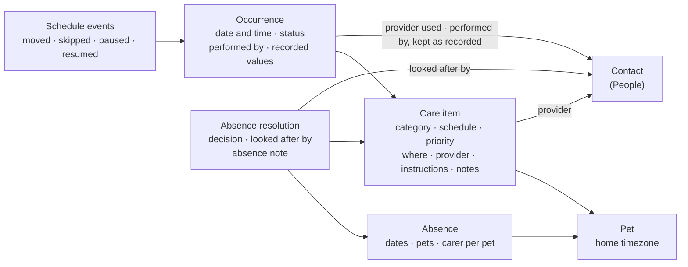

# Care Item evolution — functional spec

**Status:** draft, 2026-09-27. Product answers were given in chat on 2026-09-27, then refined by two external reviews. *Proposed* decisions and the items under **Still open** need confirmation. **Nothing is implemented yet.** Implementation planning comes later.

**Depends on:** the People & Care Team spec (`docs/domains/people/features/people-care-team.md`, decisions D1–D23). It is on branch `claude/friendly-hopper-la0gx7` until it merges. "People Dn" below refers to it.

## Verdict

The Care Item becomes the place where a pet parent sees and acts on one part of a pet's ongoing care. The View puts what needs attention first. It answers, in order: which pet, what care, what needs doing now, how the schedule works, whether an absence affects it, who is involved, and what happened before.

| Concept | What it is | Today |
|---|---|---|
| Care item | The lasting definition of care for one pet | `health_entries` |
| Occurrence | One scheduled or performed instance | `health_occurrences`, plus the `care_schedule_events` ledger |
| Contact | A person or organisation involved in care | People spec (replaces `vets`) |
| Absence | A period when normal care arrangements change | `planned_absences` |
| Absence resolution | What someone decided for one care item during one absence | New |

Four principles:

1. **Build on what works.** Care Schedule Management (CSM) keeps owning timing: recurrence, rollover, reschedule, pause, projection and flexibility. This spec changes how they're presented, not how they calculate. Requirements that describe existing behaviour are labelled **Preserve**.
2. **Store decisions, work out statuses.** The app stores what a person decided. Whether something is reviewed, resolved or needs review is worked out when read, like readiness in Away Planning (D-AWAY-001/002) and "needs review" in People (D18).
3. **Calm by default.** Status answers "when?". Priority answers "how important?". The two signals never mix.
4. **Quick to complete, rich if wanted.** Marking care done never requires details, but it never guesses a date that changes the schedule.

## How this spec relates to other documents

| Document | Owns | Where it overlaps with this spec |
|---|---|---|
| [care-item-model-delivery-plan.md](/docs/domains/pet_care/changes/care-item-model-delivery-plan.md) | The pet profile's care section, the All care list, shared temporal grouping (Child A), the four presentation roles (Child B), global navigation strings (D38) | Its hard rule stands: no new care item entity. This spec adds fields and one new record (absence resolutions). **This spec wins** for Care Item detail, completion and absences. **The delivery plan wins** for list surfaces and global strings. Its §4.3 "missed" wording is replaced by D-CIE-002 once this spec is accepted |
| [care-schedule-management.md](/docs/domains/pet_care/features/care-schedule-management.md) | Timing: recurrence, rollover, reschedule, pause, projection, flexibility | This spec presents CSM facts. It changes no calculation except the timezone (D-CIE-005) |
| [away-planning-decisions.md](/docs/domains/pet_care/changes/away-planning-decisions.md), [away-care-planning-decisions.md](/docs/domains/pet_care/changes/away-care-planning-decisions.md) | Frozen Away Planning and Away Care Planning rules | D-AWAY-003 carries a pending amendment for D-CIE-012. Everything else stands |
| People & Care Team spec | Contacts, households, access tiers, "looked after by", performed by | This spec consumes those concepts. It doesn't redefine them |

This spec takes precedence only once it is accepted. Until then, frozen decisions stand as written.

## Decisions

| # | Decision | Status | Consequence |
|---|---|---|---|
| D-CIE-001 | "Occurrence" is an internal word | Agreed | The View never says "Current occurrence". Status and date speak for themselves: "Overdue · 11 Sep 2026" |
| D-CIE-002 | One word for late, unresolved care: **Overdue** | Agreed | "Missed" leaves the UI. Stored statuses stay `pending` / `completed` / `skipped`. There is no `cancelled` |
| D-CIE-003 | Timed care is Due on its day until its time, then Overdue. Each dose on its own | Agreed | The same instant as today's rule, on both client and server. Only the word changes |
| D-CIE-004 | Status describes the schedule and what has been logged, not medical safety | Agreed | No wording implies that a late dose is safe or unsafe |
| D-CIE-005 | Care uses the pet's home timezone | Agreed (direction) | Occurrences, reminders, absence boundaries, "today" and status changes all use one timezone. Storage is Still open item 3. It ships as its own phase (A1) |
| D-CIE-006 | Overdue looks the same at every priority | Agreed | A small Overdue pill. Priority only orders items within a group. Overdue items of every priority are listed and counted in Actions |
| D-CIE-007 | Reminders never change status | Agreed | "Remind me 7 days before" doesn't make care Due |
| D-CIE-008 | The attention area can hold several occurrences | Agreed | Twice-daily care shows today's doses, each with its own status and action |
| D-CIE-009 | Completing overdue care asks when it was done | Agreed | A correctness rule. For "after completion" schedules, that date sets every following date |
| D-CIE-010 | History lists resolved past occurrences | Agreed | Completed and skipped. An unresolved overdue occurrence stays in the attention area only |
| D-CIE-011 | Three text scopes: Instructions, Notes, Absence note | Agreed | No separate "default carer instructions" field. Instructions serve that purpose |
| D-CIE-012 | Absence handling is resolved per care item, per absence | Agreed | Amends D-AWAY-003 (a pending amendment is recorded there) |
| D-CIE-013 | Store the resolution, work out the status | Agreed | No stored "plan needed", "confirmed" or "needs review" |
| D-CIE-014 | No permanent carer on a care item | Agreed | The pet's carer on the absence is the suggested "who". One occurrence can name someone else (People D10) |
| D-CIE-015 | Schedule flexibility stays worked out, not stored | Agreed | D-ACP-006 unchanged. A per-item override stays deferred |
| D-CIE-016 | A provider is a contact, or a typed name for now | *Proposed* | Typed names have limits (see Providers). Contacts remain the normal path |
| D-CIE-017 | Occurrence actions and care item actions live in separate menus | *Proposed* | Makes "this time only" vs "the schedule" visible in the layout |
| D-CIE-018 | Lifecycle: Active, Paused, Finished, Archived, Deleted | Agreed | "Close event" and "Reopen event" are retired. The Pause UI waits on Still open item 1 |
| D-CIE-019 | Category fields are built from shared blocks | Agreed | Categories choose blocks. Route or method is optional where useful |
| D-CIE-020 | Historical facts don't change when defaults change | Agreed | Occurrences keep the provider, dose and people recorded at the time |
| D-CIE-021 | Reminder delivery is a separate track | Agreed | It can start early and doesn't block the redesign |
| D-CIE-022 | Out of scope: cost, vaccination courses, stock and refills | Agreed | See Out of scope |
| D-CIE-023 | Lists and detail use the same per-dose status | *Proposed* | A list row's group and status line come from its most urgent open occurrence, not from the item's next due day |
| D-CIE-024 | "Nothing needed" on Essential care asks once | *Proposed* | A factual confirmation, not a warning. No note is required |

## Where we start

Much of the target behaviour exists. This table maps each area to what is live.

| Area | Today | Type |
|---|---|---|
| Care item and occurrence | `health_entries`, `health_occurrences`, `care_schedule_events` (CSM v1) | Preserve |
| Occurrence status | Stored `pending` / `completed` / `skipped`. A timed dose is late one minute after its time (`isOccurrenceMissed`, client and server). The detail screen groups open ones as Missed, Due today and Coming up. The event list, away plan and notifications say Overdue | Preserve the rule. Change the word |
| Lists vs detail | The shared grouping service (`CareTemporalGroupingService`) puts list rows in groups by the item's next due **day**. The detail screen uses each dose's **time**. A dose past its time shows as "today" in lists but as late on the detail screen | Behaviour change (D-CIE-023) |
| "Today" | Occurrence status uses the device's calendar. The away plan and notifications use the server's calendar day. No timezone is stored | New rule (D-CIE-005) |
| Plain-language schedule | "Every year", "Every 30 days" (`formatRecurrenceSummary`). The schedule type isn't in the summary | UX change |
| Schedule type explained | Toggle with an info sheet and a worked example | Preserve, with a copy fix (Schedule section) |
| One-off change vs schedule change | Change date moves one occurrence; changing the cadence is separate (D-CSM-006, D-ACP-007) | Preserve |
| Several overdue occurrences | Triage sheet, "Skip all missed", "skip earlier missed doses" when completing | Preserve, reworded |
| Completion | Every completion opens a sheet with a date and a note. Weight care opens the weight sheet. Vet visits then offer a health-issue link | Behaviour change (Completing care) |
| Moves around an absence | "Suggested by Agatha", the change-date sheet with gap, preview and caution warnings, undo | Preserve |
| Flexibility | Worked out per item: fixed, earlier only, carer task, flexible, with a maximum shift (D-ACP-006) | Preserve |
| Absence notes | A note for the whole trip, and a note per pet per trip | Preserve. Per-item resolutions are new |
| Care setting | `care_setting`: home / vet / other, labelled "Where" | Preserve. Provider is new |
| Priority | `care_importance`: Essential / Recommended / Optional | Preserve |
| Treatment end, reason | "Repeats until" date; link to a health issue | Preserve |
| Weight | Completing a weight check writes a weight entry linked to the occurrence. The target weight is on the pet | Preserve. Body condition score is new |
| Documents | Care item documents, occurrence notes. No occurrence documents | Occurrence documents are new |
| Lifecycle | Close and Reopen. Pause and resume exist in the API only, with no UI | UX change, Pause UI |
| Future occurrences | Never pre-generated (D-CSM-004, D-ACP-010) | Preserve |
| Reminders | One reminder N days before, plus one overdue notice. In-app only, created when the app checks, calendar days only | Separate track (D-CIE-021) |

Phase 0 (a regression baseline) mostly exists: the CSM projection corpus and integration gate (CSM-17), the grouping agreement tests, and the Away Care Planning tests. New tests are needed where list grouping, timezone and completion change.

## Domain model

Each arrow points from a concept to the one it refers to. Recording an absence changes no care (Care Context's hard invariant). Only a person's explicit move changes a date.

## Occurrence status

### States

| Shown as | Date-only care | Timed care | Stored as |
|---|---|---|---|
| Coming up | Before the scheduled day | Before the scheduled day | `pending` |
| Due | On the scheduled day | On the scheduled day, until the scheduled time | `pending` |
| Overdue | From the next day | Once the scheduled time has passed | `pending` |
| Completed | — | — | `completed` |
| Skipped | — | — | `skipped` |

### Rules

- **A person's action wins.** Care done late is Completed, not "Overdue and completed". History still shows both dates: "Done 15 Sep · due 11 Sep".
- **Each dose on its own (D-CIE-003).** With doses at 08:00 and 18:00, at 12:00 the 08:00 dose is Overdue and the 18:00 dose is Due. Completing a dose still offers to skip earlier overdue doses (Preserve).
- **Not a safety statement (D-CIE-004).** Due and Overdue describe the schedule and what has been logged. They never say whether a late dose is safe. A future completion window, set by the pet parent or their vet, could replace these defaults for one item.
- **Reminders don't change status (D-CIE-007).** The reminder window still decides when coming-up care appears in lists (Preserve). It never makes that care Due.
- **Timezone (D-CIE-005):** every "today", status change, reminder and absence boundary uses the pet's home timezone, not the device's. When the device is somewhere else, times show the zone: "18:00 · Paris time". Until phase A1 ships, today's behaviour stays: the device's calendar for occurrences, the server's for the away plan and notifications.
- **Rejected alternative:** "Due until the next dose or the end of the day, then Overdue". It was gentler for a single evening dose. It was dropped because it changes today's rule on client and server, and makes an 08:00 dose look on time until 18:00.

### Lists and detail agree (D-CIE-023)

- Lists keep one row per care item (Preserve).
- The row's group and status line come from the item's **most urgent open occurrence**: Overdue first (the most recent), then Due, then Coming up. When several doses are open, the status line adds a count: "Overdue · 08:00 · 2 open".
- Tapping Done on a row with more than one open dose opens the triage sheet, as today.
- The shared grouping service must use the per-occurrence rule above for all three groups. The agreement tests (profile, All care, dashboard) gain a case for a timed dose past its time.
- Within a group, items are ordered by priority (Essential, Recommended, Optional), then by date (D-CIE-006).

## Care item view

### Order on mobile

1. **Header:** pet avatar, the care item's name, and "Buddy · Dog" underneath. Tapping the pet opens its profile. The header stays visible while scrolling. Top right: Edit and the care item menu.
2. **Needs attention:** see below.
3. **Agatha:** a suggestion or safeguard for this item, only when there is one.
4. **Absence:** placed here when it needs a decision. Otherwise it sits after Schedule.
5. **Schedule**
6. **Details**
7. **History**

Sections use the care-item-model plan's shared presentation roles (Attention, Action, Insight, Destination) rather than new card styles.

### Needs attention

The area at the top holds what needs doing now. For most items that's one occurrence.

| Situation | Shows | Actions |
|---|---|---|
| Coming up | "Coming up · 6 Oct · in 9 days" | Mark as done, Change date |
| Due | "Due today" or "Due today · 18:00" | Mark as done, Change date |
| Overdue | "Overdue · 11 Sep 2026 · 16 days ago" | Mark as done, Change date |
| Several doses today | A **Today** list: "08:00 · Overdue", "18:00 · Due" | "Mark 08:00 as done" on the most recent late dose; each row has its own action |
| Several overdue days | "3 overdue · most recent 11 Sep" | Mark as done (most recent), Review. "Skip all overdue" is inside Review |
| Looked after by someone | "Looked after by Jamie" on the occurrence | — |
| One-off record | "Recorded · 12 Sep 2026" | Add details |
| Finished | "Finished · 12 Sep 2026" | — |
| Paused | "Paused since 1 Sep" | Resume |
| Archived | "Archived", muted | Restore |

- The leading occurrence is the most recent Overdue one. Without one, it's the earliest Due one, then the next one coming up. This matches today's "mark latest" rule.
- The Overdue pill is small, red and the same for every priority (D-CIE-006). Coming up is always neutral.
- **Menus (D-CIE-017):**
  - The occurrence menu (in this area) has Skip, Add note, Looked after by and View details. Change date is a visible button.
  - The care item menu (top right) has Edit, Pause or Resume, Archive or Restore, and Delete.
- **Verbs:** "Mark as done" replaces "Mark Completed". "Change date" stays, because it is frozen Away Care Planning copy.

### Schedule

The app writes a summary from the schedule. Controls stay in Edit.

- **Rhythm:** "Every year · fixed schedule", "Every 30 days after it's done", "Twice a day · 08:00 and 18:00", "Once".
- **Next date,** using the away plan's date wording (D-ACP-002). A fixed schedule shows "Next: 11 Sep 2027". An "after completion" schedule shows "30 days after it's done", or "Estimated 27 Oct" once the open one is done or due.
- **Reminder:** "Reminder 7 days before" or "No reminder".
- **Flexibility in words,** from the worked-out value: "Can move up to 3 days earlier", "Keep to the date" or "Can move up to 7 days either way". It is hidden for care more frequent than weekly.
- **Source,** when it isn't the pet parent: "Set by your vet".
- **End:** "Until 30 Sep" when there's an end date.
- **The Established marker,** once earned, as a quiet line.
- **Edit schedule** opens Edit at the Schedule section.

**Copy fix for the schedule type.** Moving one occurrence of a fixed schedule shifts the following dates (D-ACP-007), so "future dates stay on their original schedule" would be wrong.

- **After it's done:** "The next date counts from the day you mark it done."
- **Fixed schedule:** "The next date counts from the due date, even if it's done early or late."

The Change date sheet already previews what follows a move (R-C3).

### Details

- **Where and who** on one row: "At the vet · Greenhill Veterinary Clinic"
- Priority
- Instructions
- Category fields that have a value. Empty ones appear only in Edit
- Documents. Upload limits are shown only while uploading
- Notes (Full access only)
- Health issue: "Related to Arthritis", linked to the issue

### History (D-CIE-010)

- Resolved past occurrences, newest first. Mobile shows 3, web shows 5, then "See full history".
- Each row shows:
  - the date and status (Completed or Skipped)
  - the due date when it differs
  - one key recorded value, such as "12.4 kg"
  - both people when they differ (People D15), e.g. "Given by Jamie · logged by Alex"
- A row opens that occurrence's record, which can be edited.
- An unresolved overdue occurrence never appears here.
- Removing the header history icon changes nothing else: "See full history", the pet's timeline and Health & history links stay.

### Access levels

People tiers decide what each person sees.

| | Owner or Full access | Can log care |
|---|---|---|
| Mark as done, Skip, Add note | Yes | Yes |
| Change date, Edit, Pause, Archive, Delete | Yes | No |
| Instructions, provider | Yes | Yes |
| Notes | Yes | No |
| Documents | Yes | Only those attached to the absence (People D7) |
| Absence resolution | Edit | Read, for care they're looking after |

### Web and desktop

- A breadcrumb shows the pet: "Pets › Buddy › Wellness review". The title is the care item's name, without "View".
- On wide screens there are two columns:
  - The main column holds Needs attention, Agatha and History. Needs attention stays visible while the page scrolls.
  - The side column holds Schedule, Absence and Details.
- Text and fields keep a comfortable reading width.
- Below the breakpoint, the page becomes one column in the mobile order, with the same components and words.
- On wide screens, Edit is one form column with a live summary beside it: the schedule sentence and the next dates.

## Completing care

**This is a behaviour change.** Today every completion opens a sheet. This spec makes Coming up and Due care one tap, and gives Overdue care fixed date choices.

| Situation | Mark as done | Then |
|---|---|---|
| Coming up or Due | Done today, straight away | "Done · Add details · Undo" |
| Overdue | Asks **When was this done?** Today · On the scheduled date (11 Sep) · Choose another date | "Done · Add details · Undo" |
| Weight monitoring | The existing weight sheet, because the value is the point | — |

- **Why overdue care asks (D-CIE-009):** for "after completion" schedules, the done date sets every following date. One tap on 27 Sep for care done on 12 Sep would move the next date by 15 days. The question is asked for every overdue item, so the history stays accurate too.
- **Add details** offers:
  - a note
  - who performed it (defaults to you)
  - the provider used (defaults to the item's provider)
  - photos and documents
  - the category's occurrence fields
- Vet visits still offer the link to a health issue afterwards (Preserve).
- **Next date from the vet:** after completing, "Next: 11 Sep 2027 · Change".
  - A date within one interval is a normal Change date.
  - A longer one, such as a 3-year rabies booster, asks "Change the interval from now on?" and changes the cadence. A single move can't go past where the next one would have been (D-ACP-009).
- **Immediate feedback:** the item leaves Needs attention straight away and settles when the server confirms. This is the same rule the lists follow (care-item-model plan §6.5).
- **If saving fails,** the item returns to its previous state with a short message. Nothing is half-saved.
- Undo works as today.

## Absences

### When a care item is affected

A care item is affected when the away plan lists it (R-A1):

- its open occurrence is overdue
- its open occurrence is due before you leave
- it has a scheduled, planned or estimated date inside the absence

The Care Item and the away plan use the same calculation, so they never disagree.

### What is stored: the resolution (D-CIE-012, D-CIE-013)

A resolution is stored only when someone makes a decision for one care item and one absence. It covers every date of that item inside the absence. A week of daily medication is one resolution, not seven.

| Field | Meaning |
|---|---|
| Decision | **Keep the date** · **Move before** · **Move after** · **Nothing needed** |
| Looked after by | Optional. A contact or household member. The suggestion is the pet's carer on the absence (D-CIE-014) |
| Absence note | Optional note for this item on this trip, e.g. "The tablets for this trip are in labelled bags" |
| Documents | Optional. They join the absence's handover scope (People D7) |
| Dates decided for | The item's dates inside the absence when the decision was made. Used to notice changes |

- **Keep the date** covers a person doing it and an appointment the provider handles. The copy depends on who (see below).
- **Move before** and **Move after** open the existing Change date sheet, with its gap, preview and caution warnings (R-C2–R-C4, R-C8). The resolution is saved when the move is confirmed. Moves apply to the open occurrence only: planned and estimated dates can't be moved in advance (D-ACP-010).
- **Nothing needed** records that the person decided it can wait or doesn't apply this time.
  - For Essential care, choosing it asks once (D-CIE-024): "Buddy's heart tablets won't be given between 3 and 10 Oct. Keep this decision?" The wording states the fact, without warning or blame. No note is required.
- **Saving is all or nothing.** If a resolution fails to save, the previous state stays and a short message says so.

### What is worked out when read

| Shown | When | Example |
|---|---|---|
| Nothing due | The pet has an upcoming absence, but this item isn't affected | "Away 3–10 Oct · nothing due while you're away" |
| Not reviewed yet | Affected, with no resolution | "Due 6 Oct, while you're away · Not reviewed yet", with a suggested "Keep the date · Jamie" |
| Resolved | A resolution exists and still matches the facts | See the copy table below |
| Needs review | A resolution exists, but a fact changed | "Jamie can no longer see Buddy's plan. Choose someone else?" · "This moved to 8 Oct since you reviewed it." |

Copy for Resolved:

| Decision | Looked after by | Copy |
|---|---|---|
| Keep the date | A person | "Jamie will handle this on 6 Oct" |
| Keep the date | Nobody named, provider set | "At Greenhill Veterinary Clinic on 6 Oct" |
| Keep the date | Nobody named, no provider | "Kept on 6 Oct" |
| Move before | — | "Moved to 2 Oct, before you leave" |
| Move after | — | "Moved to 12 Oct, after you're back" |
| Nothing needed | — | "Nothing needed this time" |

"Needs review" appears when:

- the named person is no longer available (People D18)
- the item's dates inside the absence differ from the dates decided for (a move, a schedule change, or the absence changing once editing ships)
- the decision was Move before or Move after, but a date is still inside the absence. **Undoing the move always triggers this**

Rules:

- Nothing here is ever red, and there is no "Plan needed" badge. "Not reviewed yet" is neutral (True North #2 and #9, the D-AWAY-002 copy rule).
- Saving an absence never requires resolutions (D-AWAY-010 unchanged).
- Resolved items no longer count as "items to review" in the absence's care coverage. Care coverage stays a worked-out fact (D-AWAY-002).
- One occurrence can still name a different person (People D10). That overrides the resolution for that day only.
- **Carers without app access** (today's `note_only`, later a contact with no account) can be named. They get no reminders and no access, and keep the existing "No AgathaTrack access" copy (D-AWAY-004).

### Suggestions and moves

- Care Planner suggestions stay stateless. Accepting one moves the date and saves the resolution as Move before. "Not now" hides it for the session, as today.
- Suggestions follow flexibility strictly (D-ACP-006, R-D4). Manual moves are never blocked (True North #10).
- For clinical care, the copy stays cautious: "This falls during your absence. Review its timing or choose who gives it."

### The carer's view and the handover

- The person looking after it sees, per item:
  - the dates
  - who is doing it
  - the item's Instructions
  - the item's absence note
  - the provider to contact
  - the attached documents
- The handover PDF shows the same, extending the per-pet handover (AW-11).
- Nothing is copied. Instructions, the item's absence note, the per-pet trip note and the whole-trip note each appear once.
- People D21: when someone is named, only they get the reminder. Reaching a carer outside the app needs the reminder track.

### Amendments

| Decision | Change |
|---|---|
| D-AWAY-003 | Amended (pending note recorded in the decisions doc): per-item resolutions are in scope. The carer per pet stays, and is the suggested "who" |
| D-AWAY-001, D-AWAY-002, D-AWAY-004, D-AWAY-010 | Unchanged: no stored status, facts not verdicts, no access for note-only carers, saving never needs a complete plan |
| People D10 | "Absence plan" now includes per-item resolutions |

## Providers

- A care item can have a default provider (People: "Provider · on the care item").
- **The normal path is a contact.** The picker lists contacts whose role fits the care: vet roles for care at the vet, groomers for grooming. It also offers "Show everyone" and "Add new". Adding a contact needs only a name.
- **A typed name is allowed for now (D-CIE-016).** A typed name:
  - displays like a contact
  - never sits alongside contacts in a picker as an equal choice
  - has no phone or email, doesn't appear in a contact's Related care, and can't be chosen as a carer
  - offers "Save as contact"
  - when People ships, is offered for linking to a contact, never merged automatically
- Every surface that shows a provider handles both kinds the same way. A provider is always either a contact or a typed name, and always has a display name.
- Before People ships, care at the vet can prefill the pet's vet from the Veterinary team.
- The provider used on an occurrence defaults to the item's provider, and is kept as recorded (D-CIE-020).
- The UI label stays **Where**, with the provider on the same row (*Proposed*; the Cursor review agrees). `care_setting` stays the internal name.

## Instructions, notes and documents (D-CIE-011)

| Scope | Holds | Example | Who sees it |
|---|---|---|---|
| **Instructions** (care item) | What's needed to do the care | "Give with food. The blue tablets are in the kitchen cupboard." | Everyone who can do it, including carers |
| **Notes** (care item) | Background for the household | "Ask the vet about changing product next time." | Full access only |
| **Occurrence note** | What happened this time | "Ate it in cheese. Slightly sleepy after." | As the occurrence |
| **Absence note** (per item, per absence) | Only for this trip | "For this trip, the tablets are already in labelled bags." | Everyone involved in the absence |

- The per-pet trip note and the whole-trip note already exist and stay.
- Documents follow the same scopes: care item (exists), occurrence (new), absence (People D7).
- Existing `notes` values stay as Notes. Nothing is parsed or moved automatically. Existing `dosage` values become the dose in the Product and dose block. Where that block doesn't apply, they are kept as Instructions.

## Category fields (D-CIE-019)

Categories choose from five shared blocks. Every block field is optional, and completing care never requires one.

| Block | On the care item | On the occurrence |
|---|---|---|
| **Product and dose** | Product name, form, strength, dose (amount and unit), route or method (medication and parasite prevention only) | Amount given (defaults to the dose), product used if different |
| **Visit** | Questions to ask (optional) | Summary, recommendations, follow-up date |
| **Measurement** | — (the target weight stays on the pet) | Weight, saved as a weight entry; body condition score, 1–9 |
| **Services** | Usual services (multi-select), style notes | Services done |
| **Common** (all categories) | Instructions, notes, provider, documents | Performed by, provider used, note, photos and documents |

| Category | Blocks | Also |
|---|---|---|
| Medication | Product and dose | End date is the existing "repeats until". Reason is the existing health-issue link. Optional skip reason: Refused, Unwell, Vet advised, Other. Optional reaction note |
| Vaccination | Visit | Vaccine name on the item. Brand, batch number (optional) and certificate photo on the occurrence. Next date from the vet (see Completing care). No "expiry": the vial's expiry isn't stored, and "valid until" is the next due date |
| Parasite prevention | Product and dose | Targets: fleas, ticks, worms (multi-select). Optional reaction note |
| Wellness review | Visit, Measurement | — |
| Dental care | Product and dose (home care) or Visit (professional care) | Type: brushing, chew or product, professional check, professional clean |
| Weight monitoring | Measurement | The target is the pet's weight reference |
| Grooming | Services | — |
| Nail care | Services, with fewer options | Method; issue noticed (optional) |
| Other care | Common only | — |

- The View shows only fields with a value.
- Changing category keeps the common fields. The care item's block fields that no longer apply are removed on save, after a confirmation. Values already recorded on past occurrences stay (D-CIE-020).
- Delivery order: Medication, Measurement and Vaccination first; then Parasite prevention, Wellness review and Dental care; then Grooming and Nail care.

## Lifecycle (D-CIE-018)

| State | Meaning | How it starts | Shown |
|---|---|---|---|
| Active | Normal scheduling | Default | — |
| Paused | No new dates or reminders; history kept | Pause, from today or a chosen date | "Paused since 1 Sep" and Resume |
| Finished | Nothing more is planned | Worked out: one-off care done, or the end date passed | "Finished · 12 Sep" |
| Archived | No longer tracked | Archive, which replaces "Close event" and closes open occurrences, as Close does today | Muted, with Restore |
| Deleted | Removed | Delete, after a confirmation that suggests Archive when history exists | — |

- Paused items leave Actions. The away plan shows them as "Paused" (R-A9).
- **Resume today (Preserve):** resuming never adds the dates that fell during the pause (D-CSM-005). The open occurrence keeps its date. An item paused past its due date therefore comes back Overdue, with one occurrence.
- **The Pause UI doesn't ship until Still open item 1 is decided.** That means either accepting today's resume behaviour as the product rule, or choosing resume rules per schedule type.
- Renaming Close to Archive changes the FR strings and the BDD steps that say "Close event" in the same change.

## Edit

Create and Edit use the same form. The category sets defaults for where, priority and schedule type (taxonomy §4.3); the pet parent can change them.

| Section | Holds |
|---|---|
| Basics | Pet, category, name, priority |
| Schedule | Rhythm, times, schedule type with its explanation, start or next date, end |
| Reminders | Reminder settings. More options arrive with the reminder track |
| Care details | Where and provider, Instructions, category blocks, documents, Notes |
| More | Health-issue link, less-used fields |

- Category blocks appear after the category is chosen. Empty optional blocks stay collapsed, e.g. "Add dose details".
- "Record what happened" keeps its shorter form (taxonomy §7.2).
- Lifecycle actions live in the View's care item menu, not in Edit.

## Reminders (D-CIE-021)

Today reminders appear only inside the app, only when the app checks, and only by calendar day. The separate track covers, in order:

1. Delivery outside the app (push or email). This can start at any time.
2. Reminders at the time of timed care. This needs the pet's home timezone (phase A1).
3. A follow-up when care isn't done.
4. More than one reminder per item.

Who gets reminders follows People D21.

## Vocabulary (EN / FR)

New FR wording is proposed and needs the FR copy pass.

| Concept | EN | FR | Source |
|---|---|---|---|
| Overdue | Overdue | En retard | Existing |
| Due | Due today · Due | Aujourd'hui · À faire | Existing / new |
| Coming up | Coming up | À venir | Existing |
| Completed | Completed | Terminé | Existing |
| Skipped | Skipped | Ignoré | Existing |
| Mark as done | Mark as done | Marquer comme fait | New, replaces "Mark Completed" |
| Change date | Change date | Changer la date | Existing |
| Pause, Resume | Pause, Resume | Mettre en pause, Reprendre | New |
| Archive, Restore | Archive, Restore | Archiver, Restaurer | New, replaces "Close event" |
| Finished | Finished | Fini | New |
| Instructions | Instructions | Consignes | New |
| Not reviewed yet | Not reviewed yet | Pas encore vu | New |
| Keep the date | Keep the date | Garder la date | New |
| Looked after by | Looked after by | See the People vocabulary | People |

## Mockup corrections

- **Title:** use the care item's name, not "View …". Show the pet in the header or breadcrumb, and remove the header history icon.
- **Labels:** remove "Current occurrence".
- **Overdue:** a small red pill, the same at every priority. No large red block.
- **"DUE IN 2 DAYS":** neutral "Coming up · 6 Oct · in 2 days". It is not Due yet (D-CIE-007).
- **"PLAN NEEDED":** neutral "Not reviewed yet".
- **Flea treatment:**
  - "Move to 2 Oct" can't be suggested: monthly parasite prevention moves earlier only, by at most 3 days, and 3 Oct is inside the absence. Offer "Keep the date · Jamie", or a manual Change date with its caution.
  - "After completion" is wrong: parasite prevention defaults to a fixed schedule (D-CSM-001).
  - "Assign to Jamie" becomes "Keep the date · Jamie".
- **Wellness review:** "No impact" is wrong, because the overdue review is on the away plan.
- **History:** 11 Sep 2026 appears only in Needs attention.
- **Web "No upcoming conflicts":** hide the section when the pet has no upcoming absence (Still open item 4).

## Acceptance criteria

- Given date-only care due 11 Sep, on 11 Sep it shows Due, and from 12 Sep it shows Overdue.
- Given a dose at 08:00, at 07:59 it shows Due, and at 08:01 it shows Overdue, on the detail screen and in every list.
- Given doses at 08:00 and 18:00, at 12:00 detail shows 08:00 Overdue and 18:00 Due, and the list row shows "Overdue · 08:00 · 2 open".
- Given overdue Essential and Optional items, both show the same Overdue pill, and Essential is listed first within the group.
- Given Due care, one tap on Mark as done records today and offers Undo.
- Given "after completion" care due 11 Sep and still open on 27 Sep, choosing "On the scheduled date" makes the next date count from 11 Sep.
- Given a pending overdue occurrence, History never lists it.
- Given someone with Can log care, the View shows no Notes, Edit, Change date, Pause, Archive or Delete.
- Given an item with a date inside an absence and no resolution, the Care Item and the away plan both show "Not reviewed yet", and neither uses red.
- Given a Move before resolution, undoing the move makes both the Care Item and the away plan show Needs review.
- Given a resolution naming Jamie, when Jamie is no longer available, it shows Needs review.
- Given Essential care, choosing Nothing needed asks once before saving.

BDD scenarios are written once Still open items 1 and 3 are decided.

## Phasing

Two streams run in parallel, then join.

| Phase | Stream | Scope | Depends on |
|---|---|---|---|
| A0. Words and agreement | Care | Overdue everywhere. Lists use the per-dose rule (D-CIE-023). Priority ordering within groups. No change to the lateness rule | — |
| A1. Pet timezone | Care | A stored home timezone, its default, moving existing data. Every "today" and status change uses it | Still open item 3 |
| B. View and Edit | Care | Header, Needs attention (several occurrences), menus, schedule summary, Details, Instructions and Notes, History, access levels, web layout, Close renamed to Archive. The Pause UI waits on Still open item 1 | A0 |
| C. Completing care | Care | One tap for Due, the "when was this done?" question, Add details, occurrence documents, next date from the vet | B |
| P1. People directory | People | People phase 1: contacts, provider foundations | — |
| D. Providers and people | Join | Provider (typed names as an interim), provider used, performed by, names kept in history | C, P1 |
| E0. Absence shown | Join | The Care Item's Absence section, read-only: affected dates and the pet's carer | B |
| E. Absence resolutions | Join | Resolutions, worked-out states, away-plan rows, the handover PDF | C, A1, and People phase 2 for carers from contacts. It can start with today's carers |
| F. Category blocks | Care | In the order above | C |
| R. Reminders | Own track | Delivery first. At-time reminders after A1. Then follow-ups and several reminders | Delivery blocks nothing |

- **E comes after C** so the "when was this done?" rule is in place before carers complete care during absences.
- **E needs A1** because an absence's boundaries use the pet's home timezone.

## Out of scope

- Cost
- Vaccination courses (a primary series, then boosters)
- Stock, refills, product expiry
- Tooth charting
- Completion windows, until an owner or vet has a real need for one
- Custom fields (later, reusing the blocks)
- Checking a product's weight range against the pet's weight (a clinical inference, under CIM rules)
- A per-item flexibility override (deferred, per the Away Care Planning plan §8)

## Still open

- [ ] **1. Resume rules.** Today the open occurrence keeps its date, so the item can come back Overdue. Either accept that as the product rule, or choose:
  - Fixed schedule: the next scheduled date on or after the resume date.
  - After completion: due on the resume date, or one interval after it.

  This gates the Pause UI and any "resume on" date.
- [ ] **2. A shortcut on the away plan.** A single, confirmed action: "Jamie handles the rest as scheduled". If adopted, it:
  - only touches items **not yet reviewed**, for a pet that has a carer
  - records Keep the date · that carer for each of them
  - never moves a date
  - shows how many items it covers before confirming
  - can be undone as one action
  - saves all or nothing
- [ ] **3. The pet's home timezone.** Where it's set (pet or household, defaulting from the owner's device), and whether it also settles the People spec's timezone question for absence access. **Must be agreed before phase A1.**
- [ ] **4. No upcoming absence.** Hide the Absence section (proposed, and the Cursor review agrees), or show one quiet line?

## Related

| Kind | Link |
|---|---|
| Lists, profile, grouping, presentation roles | [care-item-model-delivery-plan.md](/docs/domains/pet_care/changes/care-item-model-delivery-plan.md) |
| Scheduling (CSM) | [care-schedule-management.md](/docs/domains/pet_care/features/care-schedule-management.md) |
| CSM decisions | [care-schedule-management-decisions.md](/docs/domains/pet_care/changes/care-schedule-management-decisions.md) |
| Occurrences, zones, triage | [occurrence-scheduling.md](/docs/domains/health_tracking/changes/occurrence-scheduling.md) |
| Away Planning decisions (D-AWAY) | [away-planning-decisions.md](/docs/domains/pet_care/changes/away-planning-decisions.md) |
| Away Care Planning decisions (D-ACP) | [away-care-planning-decisions.md](/docs/domains/pet_care/changes/away-care-planning-decisions.md) |
| Away Care Planning requirements (R-A, R-C, R-D) | [away-care-planning-delivery-plan.md](/docs/domains/pet_care/changes/away-care-planning-delivery-plan.md) |
| Carer model and handover | [away-planning-carer-model.md](/docs/domains/pet_care/features/away-planning-carer-model.md), [away-planning-per-pet-handover-spec.md](/docs/domains/pet_care/changes/away-planning-per-pet-handover-spec.md) |
| Care Context | [care-context.md](/docs/domains/pet_care/features/care-context.md) |
| Categories, where, priority | [care-classification-taxonomy-spec.md](/docs/domains/pet_care/changes/care-classification-taxonomy-spec.md) |
| Weight | [weight tracking specs](/docs/domains/weight_tracking/features/specs.md) |
| Dates on the wire | [calendar-dates.md](/docs/architecture/calendar-dates.md) |
| Values, tone, terms | [true-north.md](/docs/design/true-north.md), [copy-tone.md](/docs/design/copy-tone.md), [terminology.md](/docs/design/terminology.md) |
| People & Care Team | `docs/domains/people/features/people-care-team.md` (branch `claude/friendly-hopper-la0gx7`) |
