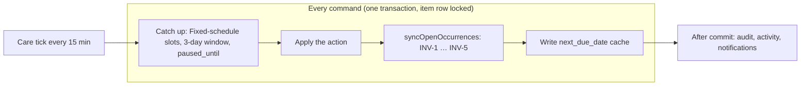

# Care Schedule Management

**Internal name:** CSM  
**Layer:** Authoritative scheduling core of `care_planning`

CSM defines how AgathaTrack **creates, projects, changes, and explains the timing of care** — recurring and non-recurring, single and multiple times per day — while preserving a trustworthy care history.

CSM owns **timing**. It does not own care meaning (`care_core`), suggestion-worthiness (`care_intelligence`), maturity (`care_progression`), or presentation (`care_presentation`).

```text
care_core (CareFamily, capabilities)
        ↑
   CARE SCHEDULE MANAGEMENT
   (depth of care_planning)
   ↑        ↑             ↑
care_context  care_progression  care_intelligence
        ↓
  care_presentation
```

**Dependency rule:** Everything above reads from CSM. CSM depends on nothing above it.

**Delivery status:** Care Schedule Management v1 shipped to `main` via programme integration ([#1193](https://github.com/KanopeeKa/AgathaCheck/pull/1193), 2026-09-15). All primitives below are live; the CSM-17 integration gate passed before merge ([#1192](https://github.com/KanopeeKa/AgathaCheck/pull/1192)). See [care-schedule-management-delivery-plan.md](../changes/care-schedule-management-delivery-plan.md) and [decision log](../changes/care-schedule-management-decisions.md).

| Phase | Status | Notes |
|-------|--------|-------|
| CSM-1 | Shipped | `care_schedule_events`, `completion_timing`, `paused_since`, `schedule_policy_version` |
| CSM-2 | Shipped | `server/lib/care/schedule/` + per-family anchor defaults on create |
| CSM-3 | Shipped | Unified `advanceSeries()` |
| CSM-4 | Shipped | No `anchor+1` pre-materialisation (D-CSM-004) |
| CSM-5 | Shipped | `completeOccurrence` (+ weight atomic path via `complete-weight`) |
| CSM-6 | Shipped | `skipOccurrence` + ledger `skipped` events |
| CSM-7 | Shipped | Entry-level `skip`/`unskip` removed; `mark-taken` delegates to oldest pending occurrence; **no new `health_history` writes** |
| CSM-8 | Shipped | `undoLastAction` (timestamp-aware); retires `undo-complete` guessing |
| CSM-9 | Shipped | `pauseSeries` / `resumeSeries` (no catch-up on resume) |
| CSM-10 | Shipped | `rescheduleOccurrence` |
| CSM-11 | Shipped | `adjustCadence` |
| CSM-12 | Shipped | `projectSchedule` refactor from `projectCareForPeriod` |
| CSM-13 | Shipped | `explainGap` read API |
| CSM-14 | Shipped | Care Context thin caller over `projectSchedule` |
| CSM-15 | Shipped | Flutter: client `snooze()` removed |
| CSM-17 | Shipped | Integration gate — projection corpus, CP weight evidence, CIM baseline (`integrationGate.test.js`) |
| Care occurrences (`care-next-occurrence-c1a7`) | In delivery | D-CSM-019 … D-CSM-033: stored open occurrence always; two schedule types; care tick; commands under one lock. Sections below describe this model |

---

## Model in one page (D-CSM-019 … D-CSM-033)

- **Always a real next date.** Every active planned item has at least one stored open occurrence, created in the same transaction as the command that needs it (D-CSM-019). No T−1 window, no “ensure” step. `next_due_date` is a read-only cache of the earliest open date.
- **Two schedule types** (D-CSM-020): **Fixed schedule** (`from_due_date`, default for medication) and **After it's done** (`from_completion`, default for every other family).
- **Origins** (D-CSM-021): `schedule` (Fixed-schedule rule), `computed` (After-it's-done rule, at most one open), `planned` (set by a person). The app never moves `schedule` or `planned` dates on its own; planned dates take precedence over the rule.
- **Fixed schedule** (D-CSM-023): slots from today − 3 days through today plus the next series date are stored; a slot is Overdue until the next slot is due, then **Not recorded** (the stack); a Not recorded slot closes as `not_recorded` once the slot after it is three days old, and can still be recorded as given from History.
- **After it's done** (D-CSM-022): one open date, Overdue until done, skipped or postponed; the next date counts from the done date.
- **Month-end clamp** (D-CSM-024), **Plan another date** (D-CSM-025), **Keep the waiting date** when done late, unless the item remembers another choice (D-CSM-026, revised 2026-10-01), **This date only / This and following** (D-CSM-027), **Postpone until** as the only pause/absence move (D-CSM-028), **whole-command undo** (D-CSM-029), **early completion** confirmation (D-CSM-030).
- **Care tick** every 15 minutes, with the same catch-up run by every command first (D-CSM-031).
- **Edits are commands** (D-CSM-032); **one lock, one transaction** per command; 409 when the occurrence is no longer open (D-CSM-033).



---

## Primitives

One entry point per real-world action. Every primitive runs inside `withCareItemLock` (D-CSM-033) and ends with `syncOpenOccurrences`, which restores the invariants below. Commands live in `server/lib/care/occurrence/commands/`; pure date rules in `server/lib/care/schedule/`.

| Primitive | Purpose | HTTP route |
|-----------|---------|------------|
| `complete` | Close an occurrence as done; store `completion_timing`; apply D-CSM-026 (no choice sent → remembered choice if it fits, otherwise keep); create the next date when nothing else is open | `POST …/occurrences/:occId/complete` |
| `skip` | Close as skipped (`close_reason = 'user'`); ledger `skipped` | `POST …/occurrences/:occId/skip` |
| `resolveStack` | Record earlier doses: Given → completed, Not given → skipped (`user`) | `POST …/occurrences/resolve-stack` |
| `recordAsGiven` | Record a closed Not recorded slot as given | `POST …/occurrences/:occId/record` |
| `changeDate` | Move one occurrence (`scope: this`) or the series from it (`scope: following`, Fixed schedule) | `POST …/occurrences/:occId/reschedule` |
| `planAnotherDate` | Add a `planned` occurrence | `POST …/occurrences` |
| `postpone` | Postpone until a date, or pause without one (D-CSM-028) | `POST …/:id/postpone` |
| `resume` | Resume on a chosen date (default: the date it would have had) | `POST …/:id/resume` |
| `adjustCadence` | Change the series rule forward from `effective_from` only | `POST …/:id/adjust-cadence` |
| `undo` | Reverse the last command as a whole (D-CSM-029) | `POST …/:id/schedule/undo` |
| `projectSchedule` | Read-only projection with per-item certainty | Care-period projection |
| `explainGap` | Read-only schedule facts for CIM | `GET …/:id/schedule-explain` |
| `careTick` | Fixed-schedule slots, 3-day window, `paused_until` resume (D-CSM-031) | `server/scripts/care/care_tick.js` (host cron, every 15 min) |

Invariants (checked by a DB property test and `server/scripts/care/repair_occurrences.js --dry-run`):

| id | Invariant |
|----|-----------|
| INV-1 | Every active planned item has ≥ 1 open occurrence |
| INV-2 | At most one open `computed` occurrence per item, only when nothing else is open |
| INV-3 | Fixed-schedule open `schedule` slots = the D-CSM-023 set at the item's “now” |
| INV-4 | Completed or unplanned items have no open occurrences; paused items get no new ones |
| INV-5 | `next_due_date` = earliest open occurrence date (or null), written only by the sync |
| INV-6 | Commands hold the item row lock in one transaction |
| INV-7 | “Today” = the pet's home calendar day on every server path |
| INV-8 | No two open occurrences on the same (item, date, slot) (unique index, migration 047) |

---

## HTTP API (health entries)

All routes mount under `/api/health-entries` and `/backend/api/health-entries`. Calendar dates on the wire: `YYYY-MM-DD` ([calendar-dates.md](/docs/architecture/calendar-dates.md)).

### Routes

| Method | Path | Body | Response |
|--------|------|------|----------|
| GET | `/` (`?pet_id=`), `/:id` | — | Entry fields plus `open_occurrences[] { id, scheduled_date, scheduled_time, status, origin }` (`status`: `coming_up` \| `due` \| `overdue` \| `not_recorded`), `as_of { date, time, timezone }`, `estimated_next { date, basis }` (display only), `schedule_anchor_date`, `late_completion_choice`, `paused_until`, `paused_since`, `resume_default_date` (paused items) |
| GET | `/:id/occurrences` | Query: `status=open` (default) or `status=past`; optional `as_of` | Open or closed occurrence rows, with `origin` and `close_reason` |
| POST | `/:id/occurrences/:occId/complete` | `{ completed_on?, notes?, next_choice?, remember_choice?, earlier_choice? }` | 200 `{ occurrence, next_due_date, entry, undo_token, next_choice_applied }` (D-CSM-026: no `next_choice` → remembered choice if it fits, otherwise `keep`; no `earlier_choice` → `keep`); **400 `next_choice_not_available`** when an explicit choice doesn't fit, nothing saved; **409 `occurrence_not_open`** |
| POST | `/:id/occurrences/:occId/skip` | `{ notes? }` | Same response shape as complete |
| POST | `/:id/occurrences` | `{ scheduled_date, scheduled_time? }` | New `planned` occurrence; `warnings[]` when another open date is within half an interval |
| POST | `/:id/occurrences/:occId/reschedule` | `{ scheduled_date, scope?: 'this' \| 'following', reason_code?, reason_note? }` | Validates per D-ACP-009 / D-CSM-027; ledger `rescheduled` or `schedule_scope_changed`; `warnings[]`, `next_due_date` |
| POST | `/:id/occurrences/:occId/record` | `{ completed_on }` | Records a Not recorded slot as given |
| POST | `/:id/occurrences/resolve-stack` | `{ given: [ids], not_given: [ids] }` | Closes the listed stack slots |
| POST | `/:id/postpone` | `{ until: date \| null, reason: 'pause' \| 'absence' \| 'manual', absence_id? }` | Ledger `postponed`; 400 for a past date |
| POST | `/:id/resume` | `{ date?, reason_note? }` | `status = active`; without `date`, the default date (D-CSM-028); **no catch-up** |
| POST | `/:id/adjust-cadence` | `{ effective_from, frequency?, frequency_interval?, recurrence_anchor?, reason_note? }` | Series-forward rule change; ledger `cadence_adjusted`; past occurrences immutable |
| POST | `/:id/schedule/undo` | — | Reverses the last command as a whole (D-CSM-029) |
| GET | `/:id/schedule-explain` | Query: optional window | Structured schedule facts for CIM |

**Compatibility routes (deleted when the new client ships, D-CSM-033):** `POST /:id/mark-taken` (completes the most urgent open slot; never 400 for an active planned item), `POST /:id/occurrences/ensure-open` (returns the open occurrences, `created: false`), `POST /:id/pause` (= postpone `until: null`), `POST /:id/occurrences/skip-missed`, `POST /:id/undo-complete`, `POST /:id/occurrences/:occId/undo`.

`PUT /:id` does **not** write `next_due_date`; schedule edits are applied as commands (D-CSM-032).

**Test clock:** in `development`, `test` and `ci` only, the header `X-Care-As-Of: <ISO local date-time>` replaces “now” for care reads and commands (ignored and logged on `uat` and `production`). See [care-item-evolution.md](./care-item-evolution.md) D-CIE-028.

Weight monitoring: use `POST /api/pets/:petId/care-rhythms/:entryId/occurrences/:occurrenceId/complete-weight` — generic complete and `mark-taken` return `400`.

**Removed (CSM-7):** `POST /:id/skip`, `POST /:id/unskip` — use occurrence skip APIs.

---

## Schedule types and defaults (D-CSM-020)

Applied on **create** when `recurrence_anchor` is omitted (`resolveRecurrenceAnchorForWrite` in `recurrenceAnchorDefaults.js`). The explicit choice always wins.

| Care family | Default | `recurrence_anchor` |
|-------------|---------|---------------------|
| `medication` | **Fixed schedule** | `from_due_date` |
| `vaccination`, `parasite_prevention`, `wellness_review`, `dental`, `weight_monitoring`, `grooming`, `nail_care`, `other` | **After it's done** | `from_completion` |

Several times of day require Fixed schedule (`times_require_fixed_schedule`).

### After it's done (`from_completion`)

Next date = **done date + interval** (month-end clamp, D-CSM-024). Late completions shift the rhythm, on purpose (D-CSM-002). While overdue, the item shows “Estimated next: today + interval” — display only (D-CSM-022).

### Fixed schedule (`from_due_date`)

Dates = `schedule_anchor_date + n × interval`, clamped, never chained. Missed slots stack for three days, then close as Not recorded (D-CSM-023).

`completion_timing` (`early` | `on_time` | `late`) is stored at write time on complete; it does not change the rules (D-CSM-002).

### Reschedule vs cadence change (D-CSM-006)

Moving one occurrence is **local** (`rescheduleOccurrence`). Changing the pattern going forward is **explicit** (`adjustCadence`). Never conflate.

### Schedule flexibility (D-ACP-006, read-only)

`resolveScheduleFlexibility(entry)` returns `{ flexibility, max_shift_days }` on every care-item read as `schedule_flexibility`. **Not persisted in v1** — derived from `care_family`, `care_source`, `recurrence_anchor`, and `frequency` (table-tested in `scheduleFlexibility.test.js`).

| `flexibility` | Planner | Manual reschedule |
|---------------|---------|-------------------|
| `fixed` | Never suggests a move | Allowed with non-blocking vet-schedule caution in `warnings[]` |
| `carer_task` | Counts as carer work only | Same as `fixed` for warnings |
| `earlier_only` | Earlier candidates only | Later moves return `earlier_only_later_move` warning |
| `flexible` | Full shift within `max_shift_days` | Gap / flexibility warnings only |

The Away Care Planner consumes flexibility strictly; guardians may still move dates from the care item (R-C4).

### Reschedule validation and cache sync (D-ACP-009)

`POST /:id/occurrences/:occId/reschedule` body: `{ scheduled_date, reason_code?, reason_note? }`.

`validateReschedule` (repeating entries) returns **400** when:

- `scheduled_date` is in the past (calendar day)
- No-op (same date as the open occurrence)
- Beyond the next natural hop (`advanceByFrequency` from current open date)
- Before the last closed occurrence date (`completed_on` for `from_completion`, `scheduled_date` for `from_due_date`)

`once` entries: past date and no-op only.

Fixed schedule asks for the scope: **This date only** (default; the slot becomes `planned`; it cannot move past the next series date) or **This and following** (new `schedule_anchor_date`, open future `schedule` slots rebuilt). After it's done: the occurrence moves and becomes `planned` (D-CSM-027).

On success: occurrence row updates, ledger `rescheduled` event, **`health_entries.next_due_date` synced** from open occurrences, response `{ occurrence, warnings[], next_due_date }`. Accepting a planner suggestion uses `reason_code: away_planner` and re-validates on the server (BR-9). Undo via `POST …/schedule/undo` (R-C7).

---

## `health_history` retirement (D-CSM-003)

`health_history` is **retired for complete/skip purposes**:

- **CSM-7:** No new `health_history` rows on complete or skip; occurrence rows + `care_schedule_events` are authoritative.
- `GET /:id/history` remains read-only for legacy rows until table drop.
- `POST /:id/undo-complete` and per-occurrence `undo` are **legacy** — replaced by `undoLastAction` (CSM-8).
- Table stays in place until a later cleanup migration; no backfill into `care_schedule_events`.

---

## Data model (summary)

**Existing (retained):** `health_entries`, `health_occurrences`

**Additions (care occurrences, migration 083):**

- `health_occurrences`: `origin` (`schedule` | `computed` | `planned`), `close_reason` (`user` | `not_recorded` | `paused` | `covered` | `system`)
- `health_entries`: `schedule_anchor_date`, `late_completion_choice` (`keep` | `skip_next` | `shift_following` | null = keep), `paused_until`
- `care_schedule_events` types: `postponed`, `materialised`, `late_choice_applied`, `not_recorded_closed`, `schedule_scope_changed`

**Additions (CSM-1):**

- `health_entries`: `paused_since`, `schedule_policy_version`; `status` includes `paused`
- `health_occurrences`: `completion_timing` (`early` | `on_time` | `late`), stored at write time
- `care_schedule_events`: append-only ledger — `skipped`, `rescheduled`, `paused`, `resumed`, `cadence_adjusted`; tagged with `policy_version` (`1.0.0`)

---

## Domain interfaces

| Domain | Reads | Writes |
|--------|-------|--------|
| [care_context](./care-context.md) | `projectSchedule` (care-period projection) | — |
| [care_intelligence](./care-intelligence.md) | `explainGap` | — |
| [care_progression](./care-progression.md) | pause/resume events | — |
| `care_presentation` | recent schedule events | — |
| [care_entitlements](./care-entitlements.md) | primitive gates | — |

Care Through Change reschedule/pause **UI** (post–CC-4 tranche) is unblocked — the CSM-17 integration gate cleared on merge to `main` (D-CSM-008).

---

## Related

- [occurrence-scheduling.md](/docs/domains/health_tracking/changes/occurrence-scheduling.md) — occurrence model, agenda and the acceptance case matrix
- [care-item-evolution.md](./care-item-evolution.md) — canonical Care Item product spec (status words, agenda, completion)
- [api-reference.md](/docs/architecture/api-reference.md) — endpoint index
- [calendar-dates.md](/docs/architecture/calendar-dates.md) — `YYYY-MM-DD` wire format for schedule fields
