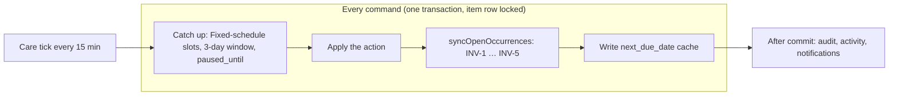

# Care Schedule Management

**Internal name:** CSM · **Layer:** authoritative scheduling core of `care_planning`

## Summary / scope

- **Owns:** occurrence lifecycle, schedule types, commands (complete, skip, reschedule, postpone, undo, cadence), care tick, `projectSchedule`, `explainGap`, `health_entries` schedule cache, occurrence-backed history reads.
- **Does not own:** care meaning (`care_core`), agenda copy and completion UX ([care-item-evolution.md](./care-item-evolution.md)), maturity ([care-progression.md](./care-progression.md)), suggestions ([care-intelligence.md](./care-intelligence.md)).
- **Depends on:** pet home timezone ([calendar-dates.md](/docs/architecture/calendar-dates.md)); entitlements gates ([care-entitlements.md](./care-entitlements.md)).

CSM defines how AgathaTrack **creates, projects, changes, and explains the timing of care** — recurring and non-recurring, single and multiple times per day — while preserving a trustworthy care history.

```text
care_core (CareFamily, capabilities)
        ↑
   CARE SCHEDULE MANAGEMENT
        ↑        ↑             ↑
care_context  care_progression  care_intelligence
        ↓
  care_presentation
```

**Dependency rule:** Everything above reads from CSM. CSM depends on nothing above it.

## Vocabulary

| Term | Meaning |
|------|---------|
| Fixed schedule | `recurrence_anchor = from_due_date` — calendar slots, stacks (D-CSM-020, D-CSM-023) |
| After it's done | `from_completion` — one open date; next from done date (D-CSM-022) |
| Open occurrence | `health_occurrences.status = pending` |
| Not recorded | Fixed-schedule slot open when the next slot is due (UI: [care-item-evolution.md](./care-item-evolution.md) D-CIE-024) |

User-facing words: `docs/design/terminology.md` and care-item spec — **occurrence** is internal (D-CIE-001).

## Requirements

| ID | Rule | Status |
|----|------|--------|
| CARE-SCHEDULE-MANAGEMENT-R-001 | Every active planned item has ≥1 stored open occurrence; created in the same transaction as the command that needs it (D-CSM-019) | Live |
| CARE-SCHEDULE-MANAGEMENT-R-002 | Schedule type defaults: medication → Fixed schedule; other families → After it's done unless explicit (D-CSM-020) | Live |
| CARE-SCHEDULE-MANAGEMENT-R-003 | Complete/skip/history use `health_occurrences` + `care_schedule_events`; no new `health_history` writes (D-CSM-003, D-CSM-035) | Live |
| CARE-SCHEDULE-MANAGEMENT-R-004 | Fixed-schedule open slots follow D-CSM-023; stacks close as `not_recorded` after the three-day window | Live |
| CARE-SCHEDULE-MANAGEMENT-R-005 | Late completion with a waiting date applies D-CSM-026 (remembered choice, `next_choice_applied`, 400 `next_choice_not_available`) | Live |
| CARE-SCHEDULE-MANAGEMENT-R-006 | Postpone until / pause / absence move_after share one command (D-CSM-028); resume without catch-up (D-CSM-005) | Live |
| CARE-SCHEDULE-MANAGEMENT-R-007 | Undo reverses the whole last command (D-CSM-029) | Live |
| CARE-SCHEDULE-MANAGEMENT-R-008 | Care tick every 15 minutes; every command catch-up first (D-CSM-031) | Live |
| CARE-SCHEDULE-MANAGEMENT-R-009 | `PUT /health-entries/:id` does not write `next_due_date`; schedule edits are commands (D-CSM-032) | Live |
| CARE-SCHEDULE-MANAGEMENT-R-010 | One item row lock per command; 409 `occurrence_not_open` when stale (D-CSM-033) | Live |
| CARE-SCHEDULE-MANAGEMENT-R-011 | Server supplies `as_of` and per-occurrence status; Flutter uses `HealthEntry.schedule` / `CareItemSchedule` for agenda grouping in production (not device `nextDueDate` alone) | Live |
| CARE-SCHEDULE-MANAGEMENT-R-012 | Agenda placement: Today (Overdue first), Due soon (7d), Upcoming — server-backed grouping (D-CIE-025; timing rules here) | Live |

## Occurrence existence and status

| Schedule type | Stored open occurrences |
|---------------|------------------------|
| Once | Single occurrence until closed |
| After it's done | One `computed` unless `planned` dates exist (D-CSM-021) |
| Fixed schedule | Slots from today−3 through today, latest series date ≤ today, next series day, plus `planned` extras (D-CSM-023) |
| Paused | Existing open rows stay hidden; tick still ages Fixed-schedule stacks (D-CSM-028) |

Server `status` on open rows: `coming_up` \| `due` \| `overdue` \| `not_recorded`. Timezone: pet home TZ; test clock `X-Care-As-Of` in dev/test/ci only.

## Client schedule status (Flutter)

For API-hydrated entries, **`CareItemSchedule` on `HealthEntry.schedule`** is the only source for overdue / due-today / agenda grouping. Device-clock fallbacks in `HealthEntry.isOverdue` / `isDueToday` apply only when `schedule == null` (widget tests, drafts). Production Pet Care surfaces must use server-backed entries from `CareItemsController`.

## Model in one page (D-CSM-019 … D-CSM-033)

- **Always a real next date.** Every active planned item has at least one stored open occurrence, created in the same transaction as the command that needs it (D-CSM-019). No T−1 window, no “ensure” step. `next_due_date` is a read-only cache of the earliest open date.
- **Two schedule types** (D-CSM-020): **Fixed schedule** (`from_due_date`, default for medication) and **After it's done** (`from_completion`, default for every other family).
- **Origins** (D-CSM-021): `schedule` (Fixed-schedule rule), `computed` (After-it's-done rule, at most one open), `planned` (set by a person). The app never moves `schedule` or `planned` dates on its own; planned dates take precedence over the rule.
- **Fixed schedule** (D-CSM-023): slots from today − 3 days through today plus the next series date are stored; a slot is Overdue until the next slot is due, then **Not recorded** (the stack); a Not recorded slot closes as `not_recorded` once the slot after it is three days old, and can still be recorded as given from History.
- **After it's done** (D-CSM-022): one open date, Overdue until done, skipped or postponed; the next date counts from the done date.
- **Month-end clamp** (D-CSM-024), **Plan another date** (D-CSM-025), **Keep the waiting date** when done late, unless the item remembers another choice (D-CSM-026, revised 2026-10-01), **This date only / This and following** (D-CSM-027), **Postpone until** as the only pause/absence move (D-CSM-028), **whole-command undo** (D-CSM-029), **early completion** confirmation (D-CSM-030).
- **Care tick** every 15 minutes, with the same catch-up run by every command first (D-CSM-031).
- **Edits are commands** (D-CSM-032); **one lock, one transaction** per command; 409 when the occurrence is no longer open (D-CSM-033).



---

## Primitives

One entry point per real-world action. Every primitive runs inside `withCareItemLock` (D-CSM-033) and ends with `syncOpenOccurrences`, which restores the invariants below. Commands live in `server/lib/care/occurrence/commands/`; pure date rules in `server/lib/care/schedule/`.

| Primitive | Purpose | HTTP route |
|-----------|---------|------------|
| `complete` | Close an occurrence as done; store `completion_timing`; apply D-CSM-026 (no choice sent → remembered choice if it fits, otherwise keep); create the next date when nothing else is open | `POST …/occurrences/:occId/complete` |
| `skip` | Close as skipped (`close_reason = 'user'`); ledger `skipped` | `POST …/occurrences/:occId/skip` |
| `resolveStack` | Record earlier doses: Given → completed, Not given → skipped (`user`) | `POST …/occurrences/resolve-stack` |
| `recordAsGiven` | Record a closed Not recorded slot as given | `POST …/occurrences/:occId/record` |
| `changeDate` | Move one occurrence (`scope: this`) or the series from it (`scope: following`, Fixed schedule) | `POST …/occurrences/:occId/reschedule` |
| `planAnotherDate` | Add a `planned` occurrence | `POST …/occurrences` |
| `postpone` | Postpone until a date, or pause without one (D-CSM-028) | `POST …/:id/postpone` |
| `resume` | Resume on a chosen date (default: the date it would have had) | `POST …/:id/resume` |
| `adjustCadence` | Change the series rule forward from `effective_from` only | `POST …/:id/adjust-cadence` |
| `changeCompletionDate` | Change when a completed occurrence was done; After it's done also moves the computed next date its completion created (D-CSM-034) | `PATCH …/occurrences/:occId` with `completed_on` |
| `undo` | Reverse the last command as a whole (D-CSM-029) | `POST …/:id/schedule/undo` |
| `projectSchedule` | Read-only projection with per-item certainty | Care-period projection |
| `explainGap` | Read-only schedule facts for CIM | `GET …/:id/schedule-explain` |
| `careTick` | Fixed-schedule slots, 3-day window, `paused_until` resume (D-CSM-031) | `server/scripts/care/care_tick.js` (host cron, every 15 min) |

Invariants (checked by a DB property test and `server/scripts/care/repair_occurrences.js --dry-run`):

| id | Invariant |
|----|-----------|
| INV-1 | Every active planned item has ≥ 1 open occurrence |
| INV-2 | At most one open `computed` occurrence per item, only when nothing else is open |
| INV-3 | Fixed-schedule open `schedule` slots = the D-CSM-023 set at the item's “now” |
| INV-4 | Completed or unplanned items have no open occurrences; paused items get no new ones |
| INV-5 | `next_due_date` = earliest open occurrence date (or null), written only by the sync |
| INV-6 | Commands hold the item row lock in one transaction |
| INV-7 | “Today” = the pet's home calendar day on every server path |
| INV-8 | No two open occurrences on the same (item, date, slot) (unique index, migration 047) |

---

## HTTP API (health entries)

All routes mount under `/api/health-entries` and `/backend/api/health-entries`. Calendar dates on the wire: `YYYY-MM-DD` ([calendar-dates.md](/docs/architecture/calendar-dates.md)).

### Routes

| Method | Path | Body | Response |
|--------|------|------|----------|
| GET | `/` (`?pet_id=`), `/:id` | — | Entry fields plus `open_occurrences[] { id, scheduled_date, scheduled_time, status, origin }` (`status`: `coming_up` \| `due` \| `overdue` \| `not_recorded`), `as_of { date, time, timezone }`, `estimated_next { date, basis }` (display only), `schedule_anchor_date`, `late_completion_choice`, `paused_until`, `paused_since`, `resume_default_date` (paused items) |
| GET | `/:id/occurrences` | Query: `status=open` (default) or `status=past`; optional `as_of` | Open or closed occurrence rows, with `origin` and `close_reason` |
| GET | `/:id/occurrences/:occId` | — | `{ occurrence (+ occurrence_status), entry { id, pet_id, name, care_family, recurrence_anchor, late_completion_choice, status, as_of }, last_action { type, occurrence_id } \| null, linked_weight? { value, unit } }`; 404 when not on that item |
| PATCH | `/:id/occurrences/:occId` | `{ completed_on }` alone, or `{ notes?, provider_contact_id?, provider_typed_name? }` | Completed occurrences only. `completed_on`: care command response plus `moved_next_id`, `next_unchanged` (D-CSM-034); 400 `invalid_completed_on` / `completed_on_in_future` / `completed_on_before_start` / `completed_on_with_other_fields`; 409 `occurrence_not_completed` |
| GET | `/:id/history` | — | Closed occurrences (completed, skipped), newest first, history wire fields (D-CSM-035) |
| POST | `/:id/occurrences/:occId/complete` | `{ completed_on?, notes?, next_choice?, remember_choice?, earlier_choice? }` | 200 `{ occurrence, next_due_date, entry, undo_token, next_choice_applied }` (D-CSM-026: no `next_choice` → remembered choice if it fits, otherwise `keep`; no `earlier_choice` → `keep`); **400 `next_choice_not_available`** when an explicit choice doesn't fit, nothing saved; **409 `occurrence_not_open`** |
| POST | `/:id/occurrences/:occId/skip` | `{ notes? }` | Same response shape as complete |
| POST | `/:id/occurrences` | `{ scheduled_date, scheduled_time? }` | New `planned` occurrence; `warnings[]` when another open date is within half an interval |
| POST | `/:id/occurrences/:occId/reschedule` | `{ scheduled_date, scope?: 'this' \| 'following', reason_code?, reason_note? }` | Validates per D-ACP-009 / D-CSM-027; ledger `rescheduled` or `schedule_scope_changed`; `warnings[]`, `next_due_date` |
| POST | `/:id/occurrences/:occId/record` | `{ completed_on }` | Records a Not recorded slot as given |
| POST | `/:id/occurrences/resolve-stack` | `{ given: [ids], not_given: [ids] }` | Closes the listed stack slots |
| POST | `/:id/postpone` | `{ until: date \| null, reason: 'pause' \| 'absence' \| 'manual', absence_id? }` | Ledger `postponed`; 400 for a past date |
| POST | `/:id/resume` | `{ date?, reason_note? }` | `status = active`; without `date`, the default date (D-CSM-028); **no catch-up** |
| POST | `/:id/adjust-cadence` | `{ effective_from, frequency?, frequency_interval?, recurrence_anchor?, reason_note? }` | Series-forward rule change; ledger `cadence_adjusted`; past occurrences immutable |
| POST | `/:id/schedule/undo` | Optional `{ undo_token }` | Reverses the **latest** ledger command when `undo_token` is omitted; with `undo_token`, reverses that specific command (D-CSM-029) |
| GET | `/:id/schedule-explain` | Query: optional window | Structured schedule facts for CIM |

**Undo route parity (C3):** `POST …/schedule/undo` is canonical; per-occurrence undo uses the occurrence command surface (legacy `POST …/occurrences/:occId/undo` removed — see debt #1547). After a single completion they restore the same open occurrence. After a **multi-step** sequence (for example complete then reschedule the next date), `schedule/undo` without a token reverses only the **most recent** command (the reschedule), while per-occurrence undo targets the **completion** event for that occurrence id. Prefer `schedule/undo` with the `undo_token` from the command response in new clients.

**Compatibility routes (deleted when the new client ships, D-CSM-033):** `POST /:id/mark-taken` (completes the most urgent open slot; never 400 for an active planned item), `POST /:id/occurrences/ensure-open` (returns the open occurrences, `created: false`), `POST /:id/pause` (= postpone `until: null`), `POST /:id/occurrences/skip-missed`, `POST /:id/undo-complete`, `POST /:id/occurrences/:occId/undo`.

`PUT /:id` does **not** write `next_due_date`; schedule edits are applied as commands (D-CSM-032).

**Test clock:** in `development`, `test` and `ci` only, the header `X-Care-As-Of: <ISO local date-time>` replaces “now” for care reads and commands (ignored and logged on `uat` and `production`). See [care-item-evolution.md](./care-item-evolution.md) D-CIE-028.

Weight monitoring: use `POST /api/pets/:petId/care-rhythms/:entryId/occurrences/:occurrenceId/complete-weight` — generic complete and `mark-taken` return `400`.

**Removed (CSM-7):** `POST /:id/skip`, `POST /:id/unskip` — use occurrence skip APIs.

---

## Schedule types and defaults (D-CSM-020)

Applied on **create** when `recurrence_anchor` is omitted (`resolveRecurrenceAnchorForWrite` in `recurrenceAnchorDefaults.js`). The explicit choice always wins.

| Care family | Default | `recurrence_anchor` |
|-------------|---------|---------------------|
| `medication` | **Fixed schedule** | `from_due_date` |
| `vaccination`, `parasite_prevention`, `wellness_review`, `dental`, `weight_monitoring`, `grooming`, `nail_care`, `other` | **After it's done** | `from_completion` |

Several times of day require Fixed schedule (`times_require_fixed_schedule`).

### After it's done (`from_completion`)

Next date = **done date + interval** (month-end clamp, D-CSM-024). Late completions shift the rhythm, on purpose (D-CSM-002). While overdue, the item shows “Estimated next: today + interval” — display only (D-CSM-022).

### Fixed schedule (`from_due_date`)

Dates = `schedule_anchor_date + n × interval`, clamped, never chained. Missed slots stack for three days, then close as Not recorded (D-CSM-023).

`completion_timing` (`early` | `on_time` | `late`) is stored at write time on complete; it does not change the rules (D-CSM-002).

### Reschedule vs cadence change (D-CSM-006)

Moving one occurrence is **local** (`rescheduleOccurrence`). Changing the pattern going forward is **explicit** (`adjustCadence`). Never conflate.

### Schedule flexibility (D-ACP-006, read-only)

`resolveScheduleFlexibility(entry)` returns `{ flexibility, max_shift_days }` on every care-item read as `schedule_flexibility`. **Not persisted in v1** — derived from `care_family`, `care_source`, `recurrence_anchor`, and `frequency` (table-tested in `scheduleFlexibility.test.js`).

| `flexibility` | Planner | Manual reschedule |
|---------------|---------|-------------------|
| `fixed` | Never suggests a move | Allowed with non-blocking vet-schedule caution in `warnings[]` |
| `carer_task` | Counts as carer work only | Same as `fixed` for warnings |
| `earlier_only` | Earlier candidates only | Later moves return `earlier_only_later_move` warning |
| `flexible` | Full shift within `max_shift_days` | Gap / flexibility warnings only |

The Away Care Planner consumes flexibility strictly; guardians may still move dates from the care item (R-C4).

### Reschedule validation and cache sync (D-ACP-009)

`POST /:id/occurrences/:occId/reschedule` body: `{ scheduled_date, reason_code?, reason_note? }`.

`validateReschedule` (repeating entries) returns **400** when:

- `scheduled_date` is in the past (calendar day)
- No-op (same date as the open occurrence)
- Beyond the next natural hop (`advanceByFrequency` from current open date)
- Before the last closed occurrence date (`completed_on` for `from_completion`, `scheduled_date` for `from_due_date`)

`once` entries: past date and no-op only.

Fixed schedule asks for the scope: **This date only** (default; the slot becomes `planned`; it cannot move past the next series date) or **This and following** (new `schedule_anchor_date`, open future `schedule` slots rebuilt). After it's done: the occurrence moves and becomes `planned` (D-CSM-027).

On success: occurrence row updates, ledger `rescheduled` event, **`health_entries.next_due_date` synced** from open occurrences, response `{ occurrence, warnings[], next_due_date }`. Accepting a planner suggestion uses `reason_code: away_planner` and re-validates on the server (BR-9). Undo via `POST …/schedule/undo` (R-C7).

---

## `health_history` retirement (D-CSM-003)

`health_history` is **retired for complete/skip purposes**:

- **CSM-7:** No new `health_history` rows on complete or skip; occurrence rows + `care_schedule_events` are authoritative.
- `GET /:id/history` reads closed occurrences (D-CSM-035); legacy rows are no longer read by care.
- The table is dropped by migration `*_drop_health_history` once the GDPR export reads occurrences (D-CSM-035).
- `POST /:id/undo-complete` and per-occurrence `undo` are **legacy** — replaced by `undoLastAction` (CSM-8).
- No backfill into `care_schedule_events` (pre-launch reset, care-next-occurrence-c1a7 §6.3).

---

## Data model (summary)

**Existing (retained):** `health_entries`, `health_occurrences`

**Additions (care occurrences, migration 083):**

- `health_occurrences`: `origin` (`schedule` | `computed` | `planned`), `close_reason` (`user` | `not_recorded` | `paused` | `covered` | `system`)
- `health_entries`: `schedule_anchor_date`, `late_completion_choice` (`keep` | `skip_next` | `shift_following` | null = keep), `paused_until`
- `care_schedule_events` types: `postponed`, `materialised`, `late_choice_applied`, `not_recorded_closed`, `schedule_scope_changed`

**Additions (CSM-1):**

- `health_entries`: `paused_since`, `schedule_policy_version`; `status` includes `paused`
- `health_occurrences`: `completion_timing` (`early` | `on_time` | `late`), stored at write time
- `care_schedule_events`: append-only ledger — `skipped`, `rescheduled`, `paused`, `resumed`, `cadence_adjusted`; tagged with `policy_version` (`1.0.0`)

---

## Domain interfaces

| Domain | Reads | Writes |
|--------|-------|--------|
| [care_context](./care-context.md) | `projectSchedule` (care-period projection) | — |
| [care_intelligence](./care-intelligence.md) | `explainGap` | — |
| [care_progression](./care-progression.md) | pause/resume events | — |
| `care_presentation` | recent schedule events | — |
| [care_entitlements](./care-entitlements.md) | primitive gates | — |

Care Through Change reschedule/pause **UI** (post–CC-4 tranche) is unblocked — the CSM-17 integration gate cleared on merge to `main` (D-CSM-008).

---

## Out of scope

- Care Item presentation strings and Care date screen layout ([care-item-evolution.md](./care-item-evolution.md)).
- Away planner resolution UX ([away-planning-carer-model.md](./away-planning-carer-model.md)).
- Notification copy and delivery timing.

## Still open

- GDPR export must read occurrences before `health_history` table drop (D-CSM-035).
- Coverage gaps tracked in [#1770](https://github.com/KanopeeKa/AgathaCheck/issues/1770).

## Acceptance criteria

Case matrix (AID = After it's done, FX = Fixed schedule). Agenda UX words: [care-item-evolution.md](./care-item-evolution.md) (D-CIE-024 … D-CIE-028).

| Given / When / Then | Requirement | Coverage |
|---------------------|-------------|----------|
| AID-1 — When Monthly flea due 5 Jun, done 5 Jun then Next `computed` 5 Jul, same request | CARE-SCHEDULE-MANAGEMENT-R-001 | test: server/test/db/careOccurrences.afterDone.integration.test.js#AID-1 marking done creates the next date in the same request |
| AID-2 — When Not done; today 7 Jun then “Overdue · 5 Jun”; “Estimated next: 7 Jul” | CARE-SCHEDULE-MANAGEMENT-R-001 | test: server/test/db/careOccurrences.afterDone.integration.test.js#AID-2 overdue shows an estimated next date that moves with today |
| AID-3 — When Done on 6 Jun (recorded 7 Jun) then Next 6 Jul | CARE-SCHEDULE-MANAGEMENT-R-001 | test: server/test/db/careOccurrences.afterDone.integration.test.js#AID-3 / AID-4 done or skipped late count from the done date or today |
| AID-4 — When Skipped on 7 Jun then Next 7 Jul | CARE-SCHEDULE-MANAGEMENT-R-001 | test: server/test/db/careOccurrences.afterDone.integration.test.js#AID-3 / AID-4 done or skipped late count from the done date or today |
| AID-5 — When Done 20 May (16 days early of 30) then Confirmation; next 20 Jun | CARE-SCHEDULE-MANAGEMENT-R-001 | none — #1770 |
| AID-6 — When Yearly wellness review due 1 Mar, done 15 Apr then Next 15 Apr next year | CARE-SCHEDULE-MANAGEMENT-R-001 | test: server/test/careSchedule/scheduleRules.test.js#AID-6 yearly done late |
| AID-7 — When Daily dental chew, not done for 3 days then One Overdue occurrence (no stack) | CARE-SCHEDULE-MANAGEMENT-R-001 | none — #1770 |
| AID-8 — When “Twice a day, after it's done” then Rejected `times_require_fixed_schedule`; the form prevents it | CARE-SCHEDULE-MANAGEMENT-R-001 | test: server/test/db/careOccurrences.afterDone.integration.test.js#AID-8 several times of day need a fixed schedule |
| AID-9 — When Created with due date 200 days away then Open occurrence exists; Mark as done works | CARE-SCHEDULE-MANAGEMENT-R-001 | test: server/test/db/careOccurrences.afterDone.integration.test.js#AID-9 a date 200 days away is a real occurrence that can be marked done early |
| AID-10 — When Overdue item shows “Estimated next” then Subtitle only; no row, action or reminder | CARE-SCHEDULE-MANAGEMENT-R-001 | none — #1770 |
| AID-11 — When Overdue item → Mark as done then “When was this done?” first; the answer is sent with the completion | CARE-SCHEDULE-MANAGEMENT-R-001 | none — #1770 |
| FX-1 — When Twice daily 08:00/18:00, at 07:00 then Today's and tomorrow's slots exist; only today's are listed | CARE-SCHEDULE-MANAGEMENT-R-001 | test: server/test/db/careOccurrences.fixed.integration.test.js#FX-1 twice daily stores today and tomorrow |
| FX-2 — When 08:00 not logged at 12:00 then “Overdue · 08:00” | CARE-SCHEDULE-MANAGEMENT-R-001 | test: server/test/db/careOccurrences.fixed.integration.test.js#FX-2 / FX-3 overdue until the next dose, then not recorded |
| FX-3 — When 08:00 still not logged at 18:01 then 08:00 → Not recorded (stack); 18:00 Due | CARE-SCHEDULE-MANAGEMENT-R-001 | test: server/test/db/careOccurrences.fixed.integration.test.js#FX-2 / FX-3 overdue until the next dose, then not recorded |
| FX-4 — When Mon, Tue not logged; today Wed then Stack of 4 (Review); Wed slots Due | CARE-SCHEDULE-MANAGEMENT-R-001 | test: server/test/db/careOccurrences.fixed.integration.test.js#FX-4 / FX-5 the stack keeps three days, older doses close as not recorded |
| FX-5 — When On Fri, Mon's slots then Closed by the tick as `not_recorded` | CARE-SCHEDULE-MANAGEMENT-R-001 | test: server/test/db/careOccurrences.fixed.integration.test.js#FX-4 / FX-5 the stack keeps three days, older doses close as not recorded |
| FX-6 — When Record a closed Not recorded dose from History then `completed`; nothing else changes; the tick leaves it | CARE-SCHEDULE-MANAGEMENT-R-001 | test: server/test/db/careOccurrences.fixed.integration.test.js#FX-6 a closed not recorded dose can be recorded as given |
| FX-7 — When Weekly Mondays, done Wednesday then Next Monday; no prompt (gap shrank 2/7) | CARE-SCHEDULE-MANAGEMENT-R-001 | test: server/test/db/careOccurrences.fixed.integration.test.js#FX-7 done two days late does not ask |
| FX-8 — When Weekly Mondays, done Saturday then Prompt: Keep Mon / Skip Mon / Move by 5 days | CARE-SCHEDULE-MANAGEMENT-R-001 | test: server/test/db/careOccurrences.fixed.integration.test.js#FX-8 done on Saturday keeps the next date unless a choice is sent (D-CSM-026 v4) |
| FX-9 — When Monthly injection not logged then Stack of 1; next month's slot when due | CARE-SCHEDULE-MANAGEMENT-R-001 | none — #1770 |
| FX-10 — When Record next dose early then Slot completed; dates unchanged; confirmation if more than half an interval early | CARE-SCHEDULE-MANAGEMENT-R-001 | none — #1770 |
| FX-11 — When End date passes then No slots after it; the item finishes when nothing is open | CARE-SCHEDULE-MANAGEMENT-R-001 | none — #1770 |
| FX-12 — When Record earlier doses: one Given, one Not given then `completed` / `skipped` + `user`; History shows “Given” and “No… | CARE-SCHEDULE-MANAGEMENT-R-001 | test: server/test/db/careOccurrences.fixed.integration.test.js#FX-12 record earlier doses: given and not given |
| FX-13 — When Twice-daily stack of 3 slots then “3 doses not recorded” (slots); other care: “3 not recorded” | CARE-SCHEDULE-MANAGEMENT-R-001 | none — #1770 |
| ME-1 — When FX monthly anchored 31 Jan then 28 Feb (29 leap), 31 Mar, 30 Apr, 31 May | CARE-SCHEDULE-MANAGEMENT-R-001 | test: server/test/careSchedule/scheduleRules.test.js#ME-1 monthly anchored on 31 Jan counts from the anchor |
| ME-2 — When Every 6 months from 31 Aug then 28/29 Feb, 31 Aug | CARE-SCHEDULE-MANAGEMENT-R-001 | test: server/test/careSchedule/scheduleRules.test.js#ME-2 every six months from 31 Aug |
| ME-3 — When Yearly from 29 Feb 2028 then 28 Feb 2029 … 29 Feb 2032 | CARE-SCHEDULE-MANAGEMENT-R-001 | test: server/test/careSchedule/scheduleRules.test.js#ME-3 yearly from 29 Feb 2028 |
| ME-4 — When AID monthly done 31 Jan then 28 Feb; then from each completion | CARE-SCHEDULE-MANAGEMENT-R-001 | none — #1770 |
| ME-5 — When FX “This and following” moved to 31 Oct then 30 Nov, 31 Dec | CARE-SCHEDULE-MANAGEMENT-R-001 | test: server/test/careSchedule/scheduleRules.test.js#ME-5 this-and-following moved to 31 Oct |
| PL-1 — When Vaccine yearly AID: first dose 1 Jun, booster 1 Jul then 1 Jun done → next 1 Jul (no computed); booster done → 1 Ju… | CARE-SCHEDULE-MANAGEMENT-R-001 | bdd: care_booster.feature#PL-1 first dose then booster then yearly recurrence |
| PL-2 — When First dose done 20 Jun (due 1 Jun), booster 1 Jul waiting then Gap 11 < 15 → Keep / Skip / Move by 19 days | CARE-SCHEDULE-MANAGEMENT-R-001 | test: server/test/db/careOccurrences.afterDone.integration.test.js#PL-2 a late first dose keeps the booster unless a choice is sent (D-CSM-026 v4) |
| PL-3 — When Change date on the open computed 5 Jun → 20 Jun then Same occurrence, now `planned` | CARE-SCHEDULE-MANAGEMENT-R-001 | test: server/test/db/careOccurrences.afterDone.integration.test.js#PL-3 changing the computed date keeps one occurrence, now planned |
| PL-4 — When Plan another date 8 Jun while 5 Jun open then Warning; add anyway → two open | CARE-SCHEDULE-MANAGEMENT-R-001 | test: server/test/db/careOccurrences.afterDone.integration.test.js#PL-4 planning another date near an open one warns and adds it |
| PL-5 — When AID: mark the later 1 Jul done while 5 Jun is open then No `earlier_choice` → 5 Jun stays open; `complete` / `skip`… | CARE-SCHEDULE-MANAGEMENT-R-001 | test: server/test/db/careOccurrences.afterDone.integration.test.js#PL-5 / OR-3 marking the later date first keeps the earlier one open unless a choice is sent |
| PL-6 — When Delete the only planned date then Rule creates the next; user confirms the date | CARE-SCHEDULE-MANAGEMENT-R-001 | none — #1770 |
| PL-7 — When FX: plan an extra one-off dose then `planned`, independent of the series | CARE-SCHEDULE-MANAGEMENT-R-001 | none — #1770 |
| PP-1 — When AID postpone 5 Jun → 20 Jun then Occurrence at 20 Jun (`planned`); done → next 20 Jul | CARE-SCHEDULE-MANAGEMENT-R-001 | test: server/test/db/careOccurrences.afterDone.integration.test.js#PP-1 postponing moves the date; done counts from the done date |
| PP-2 — When AID pause; resume 1 Aug then Hidden while paused; resume default 5 Aug; user picks 3 Aug | CARE-SCHEDULE-MANAGEMENT-R-001 | bdd: care_pause_resume.feature#PP-2 pause without end date then resume on the suggested date |
| PP-3 — When FX daily postpone until 10 Jun (today 5 Jun) then 6–9 Jun not created; stack stays; the tick resumes on 10 Jun | CARE-SCHEDULE-MANAGEMENT-R-001 | test: server/test/db/careOccurrences.fixed.integration.test.js#PP-3 postponing a fixed schedule pauses until the date, then the tick resumes it |
| PP-4 — When FX pause; resume 20 Jun then Default = first slot on or after now | CARE-SCHEDULE-MANAGEMENT-R-001 | none — #1770 |
| PP-5 — When Absence 10–15 Jun: move after on AID flea due 12 Jun then Postpone until 16 Jun (`reason: absence`) | CARE-SCHEDULE-MANAGEMENT-R-001 | none — #1770 |
| PP-6 — When Postpone to a past date then 400 | CARE-SCHEDULE-MANAGEMENT-R-001 | test: server/test/db/careOccurrences.afterDone.integration.test.js#PP-6 a past date is rejected |
| PP-7 — When Undo right after pause then Previous state | CARE-SCHEDULE-MANAGEMENT-R-001 | test: server/test/db/careOccurrences.afterDone.integration.test.js#PP-7 undo right after pause restores the item |
| PP-8 — When FX paused with 2 doses not recorded; 4 days pass then Not in the agenda; the tick closes old slots as `not_recorded… | CARE-SCHEDULE-MANAGEMENT-R-001 | none — #1770 |
| LC-1 — When Remember “Skip the next date” then Applied automatically in the completion transaction; visible and resettable in A… | CARE-SCHEDULE-MANAGEMENT-R-001 | test: server/test/db/careOccurrences.fixed.integration.test.js#LC-1 a remembered choice is applied without asking |
| LC-2 — When Nothing remembered, no choice sent then Keep; `next_choice_applied: keep` | CARE-SCHEDULE-MANAGEMENT-R-001 | none — #1770 |
| LC-3 — When FX twice daily: 08:00 recorded at 15:00, 18:00 waiting then Gap 10 h → 3 h → the trigger fires; with no choice the … | CARE-SCHEDULE-MANAGEMENT-R-001 | test: server/test/db/careOccurrences.fixed.integration.test.js#LC-3 twice daily recorded at 15:00 with no choice keeps the 18:00 dose |
| LC-4 — When Sent with `next_choice: 'skip_next'` then One transaction: dose completed, 18:00 skipped; Undo reverses both | CARE-SCHEDULE-MANAGEMENT-R-001 | test: server/test/db/careOccurrences.fixed.integration.test.js#LC-4 skip next is undone as a whole |
| LC-5 — When Response lost; app retries then 409 `occurrence_not_open`; the app reloads the item | CARE-SCHEDULE-MANAGEMENT-R-001 | test: server/test/db/careOccurrences.afterDone.integration.test.js#LC-5 completing a date twice answers 409 occurrence_not_open |
| UN-1 — When AID done → computed next → Undo then Reopen; computed next deleted | CARE-SCHEDULE-MANAGEMENT-R-001 | test: server/test/db/careOccurrences.afterDone.integration.test.js#UN-1 undo reopens the date and removes the new computed date |
| UN-2 — When AID done → next changed (planned) → Undo then Reopen; planned kept | CARE-SCHEDULE-MANAGEMENT-R-001 | test: server/test/db/careOccurrences.afterDone.integration.test.js#UN-2 a next date someone changed survives undo of the completion |
| UN-3 — When FX dose done → Undo then Reopen only | CARE-SCHEDULE-MANAGEMENT-R-001 | none — #1770 |
| UN-4 — When Done with “skip next” applied → Undo then Whole command reversed | CARE-SCHEDULE-MANAGEMENT-R-001 | none — #1770 |
| UN-5 — When Delete a weigh-in's weight entry then Same as UN-1 | CARE-SCHEDULE-MANAGEMENT-R-001 | none — #1770 |
| TS-1 — When FX → AID with 3 Not recorded + next scheduled then Confirm; all open `schedule` slots close as `not_recorded`; plan… | CARE-SCHEDULE-MANAGEMENT-R-001 | none — #1770 |
| TS-1b — When Same, with a `planned` date then The planned date is the only open occurrence; no computed date | CARE-SCHEDULE-MANAGEMENT-R-001 | none — #1770 |
| TS-2 — When AID → FX with a planned future date then Planned kept; anchor = open date; slots generated without duplicates | CARE-SCHEDULE-MANAGEMENT-R-001 | none — #1770 |
| TS-3 — When FX weekly → every 2 weeks then Cadence “this and following” from today | CARE-SCHEDULE-MANAGEMENT-R-001 | none — #1770 |
| TS-4 — When Edit form changes the next date then Change date on the open occurrence | CARE-SCHEDULE-MANAGEMENT-R-001 | test: server/test/db/careOccurrences.afterDone.integration.test.js#TS-4 editing the next date moves the open occurrence |
| AG-1 — When Only Anytime items today then Heading “Today's list”, no sub-groups | CARE-SCHEDULE-MANAGEMENT-R-012 | none — #1770 |
| AG-2 — When Morning + Anytime then Two headings | CARE-SCHEDULE-MANAGEMENT-R-012 | none — #1770 |
| AG-3 — When Overdue items then First in Today | CARE-SCHEDULE-MANAGEMENT-R-012 | test: flutter_app/test/features/care_item/domain/care_agenda_test.dart#AG overdue first, then today by time group, due soon, upcoming |
| AG-4 — When Daily med after all doses done then Stays in Today as Done until the day ends; never in Due soon | CARE-SCHEDULE-MANAGEMENT-R-012 | none — #1770 |
| AG-5 — When Weekly item due in 3 / 20 days then Due soon / Upcoming (collapsed) | CARE-SCHEDULE-MANAGEMENT-R-012 | none — #1770 |
| AG-6 — When Every-3-days item due tomorrow then Due soon | CARE-SCHEDULE-MANAGEMENT-R-012 | none — #1770 |
| AG-7 — When Stack of 3 then One row “3 doses not recorded” + Review | CARE-SCHEDULE-MANAGEMENT-R-012 | test: flutter_app/test/features/care_item/domain/care_agenda_test.dart#a stack is one overdue row with its count (DN-1b) |
| AG-8 — When Pet profile then Same groups, one pet | CARE-SCHEDULE-MANAGEMENT-R-012 | none — #1770 |
| AG-9 — When Yearly vaccine in 200 days, reminder 7 days then Upcoming; no notification yet | CARE-SCHEDULE-MANAGEMENT-R-012 | none — #1770 |
| AG-10 — When Nothing overdue or due today then “Nothing due today”, then Due soon / Upcoming | CARE-SCHEDULE-MANAGEMENT-R-012 | none — #1770 |
| AG-11 — When Loading / error then Skeleton / Retry; no empty copy while loading | CARE-SCHEDULE-MANAGEMENT-R-012 | none — #1770 |
| AB-1 — When AID done before a trip then The away plan lists it with its occurrence id | CARE-SCHEDULE-MANAGEMENT-R-001 | none — #1770 |
| AB-2 — When Plan a date inside the trip, looked after by Carol then The real occurrence carries the assignment | CARE-SCHEDULE-MANAGEMENT-R-001 | none — #1770 |
| AB-3 — When FX twice-daily med over a 7-day trip then One rhythm row; dates from the anchor; slots stored as days arrive | CARE-SCHEDULE-MANAGEMENT-R-001 | none — #1770 |
| AB-4 — When Trip dates change then Resolution “needs review” | CARE-SCHEDULE-MANAGEMENT-R-001 | none — #1770 |
| CR-1 — When Tick overlaps itself then Advisory lock; no duplicates | CARE-SCHEDULE-MANAGEMENT-R-001 | test: server/test/db/careOccurrences.catchupConcurrency.integration.test.js#CR-1 an overlapping tick skips the held advisory lock, then a later tick catches up once |
| CR-2 — When Tick late by 2 hours then The next command catches up first | CARE-SCHEDULE-MANAGEMENT-R-001 | test: server/test/db/careOccurrences.catchupConcurrency.integration.test.js#CR-2 a command catches up a two-hour-late tick before applying its skip |
| CR-3 — When Pet timezone differs from server then Day boundaries per pet timezone | CARE-SCHEDULE-MANAGEMENT-R-001 | test: server/test/db/careOccurrences.catchupConcurrency.integration.test.js#CR-3 one instant straddles the Tokyo/UTC calendar boundary for two pets |
| CR-4 — When Two carers complete the same slot then One 200, one 409 | CARE-SCHEDULE-MANAGEMENT-R-001 | test: server/test/db/careOccurrences.catchupConcurrency.integration.test.js#CR-4 two authorized carers race for one dose: only one completion and one ledger event |
| CR-5 — When Two carers complete different stack slots then Both 200 | CARE-SCHEDULE-MANAGEMENT-R-001 | test: server/test/db/careOccurrences.catchupConcurrency.integration.test.js#CR-5 concurrent completion of different stack slots commits both, with two ledger events |
| CR-6 — When Spring clock change, slot at 02:30 then Slot kept on its date; effective time 03:00; no duplicate | CARE-SCHEDULE-MANAGEMENT-R-001 | test: server/test/careSchedule/scheduleRules.test.js#CR-6 spring-forward 02:30 is due at the first real minute 03:00, not 03:30 |
| CR-7 — When Autumn clock change, tick runs twice in the repeated hour then No duplicate slots, no double closing | CARE-SCHEDULE-MANAGEMENT-R-001 | test: server/test/db/careOccurrences.catchupConcurrency.integration.test.js#CR-7 two distinct UTC instants in Paris repeated 02:30 do not close twice or duplicate slots |
| OR-1 — When AID computed 5 Jun moved to 20 Jun (planned); the tick runs then Nothing created; one open occurrence | CARE-SCHEDULE-MANAGEMENT-R-001 | none — #1770 |
| OR-2 — When FX with a planned extra; “This and following” rebuilds the series then Only `schedule` slots rebuilt; the planned e… | CARE-SCHEDULE-MANAGEMENT-R-001 | none — #1770 |
| OR-3 — When AID vaccine: first dose overdue, booster planned; booster done first then Asks about the earlier date (PL-5); no co… | CARE-SCHEDULE-MANAGEMENT-R-001 | test: server/test/db/careOccurrences.afterDone.integration.test.js#PL-5 / OR-3 marking the later date first keeps the earlier one open unless a choice is sent |
| OR-4 — When Any command sequence above then Property test: never zero open occurrences for an active planned item; never two co… | CARE-SCHEDULE-MANAGEMENT-R-001 | test: server/test/db/careOccurrences.property.integration.test.js#care occurrence invariants under random commands (OR-4) |

## Decision log

| ID | Decision | Rationale | Status | Date | PR |
|----|----------|-----------|--------|------|----|
| D-CSM-001 | Recurrence anchor defaults by care family (amended by D-CSM-020) | Explicit choice wins on create | Live | 2026-09-15 | — |
| D-CSM-002 | `from_completion` drift is intentional; `completion_timing` informational | Guardian-paced rhythms | Live | 2026-09-15 | — |
| D-CSM-003 | `health_history` retired for complete/skip; no backfill | Occurrences + ledger authoritative | Live | 2026-09-15 | — |
| D-CSM-004 | Remove `anchor+1` pre-materialisation at create | Unified advanceSeries | Superseded by D-CSM-019 | 2026-09-15 | — |
| D-CSM-005 | Pause resume has no catch-up | Matches care progression | Live | 2026-09-15 | — |
| D-CSM-006 | Reschedule one occurrence vs `adjustCadence` series-forward | Never implicit rule change | Live | 2026-09-15 | — |
| D-CSM-007 | Demo/UAT seed exercises CSM edge cases | Parallel infra | Live | 2026-09-15 | — |
| D-CSM-008 | Care Through Change reschedule UI gated on CSM integration | Satisfied on main | Live | 2026-09-15 | — |
| D-CSM-018 | Intent-based `ensure-open` for open head | On-demand materialisation | Superseded by D-CSM-019 | 2026-09-28 | — |
| D-CSM-019 | Always ≥1 stored open occurrence; no T−1; `next_due_date` cache | Same-transaction create | Live | 2026-09-29 | — |
| D-CSM-020 | Fixed schedule vs After it's done; family defaults | Medication fixed; others after done | Live | 2026-09-29 | — |
| D-CSM-021 | Origins `schedule` / `computed` / `planned` + precedence rules | App never moves planned/schedule alone | Live | 2026-09-29 | — |
| D-CSM-022 | After-it's-done done/skip/overdue/estimated-next rules | Display-only estimated next | Live | 2026-09-29 | — |
| D-CSM-023 | Fixed-schedule slots, stack, not recorded window | Three-day stack close | Live | 2026-09-29 | — |
| D-CSM-024 | Month-end clamp from anchor or done date | No JS overflow dates | Live | 2026-09-29 | — |
| D-CSM-025 | Plan another date; booster pattern | Planned extras | Live | 2026-09-29 | — |
| D-CSM-026 | Late completion with waiting date; remembered choice; 400 not 409 | Revised 2026-10-01 | Live | 2026-10-01 | — |
| D-CSM-027 | Change date scopes this vs following | Re-anchors fixed series | Live | 2026-09-29 | — |
| D-CSM-028 | Postpone until unifies pause/absence/resume | No catch-up on resume | Live | 2026-09-29 | — |
| D-CSM-029 | Undo reverses whole command | Deletes computed next only if still computed | Live | 2026-09-29 | — |
| D-CSM-030 | Early completion with half-interval confirm | Any surface | Live | 2026-09-29 | — |
| D-CSM-031 | Care tick every 15 min + command catch-up first | Advisory lock per item | Live | 2026-09-29 | — |
| D-CSM-032 | Schedule edits via commands; `PUT` no `next_due_date` | Type switch rules documented | Live | 2026-09-29 | — |
| D-CSM-033 | One lock per command; write-path guard; compatibility routes temporary | 409 when not open | Live | 2026-09-29 | — |
| D-CSM-034 | PATCH `completed_on` on completed occurrence | Moves computed next when applicable | Live | 2026-10-01 | — |
| D-CSM-035 | History reads occurrences only; table drop pending GDPR export | Replaces `health_history` reads | Live | 2026-10-01 | — |

## Related

| Kind | Link |
|------|------|
| Care Item UX | [care-item-evolution.md](./care-item-evolution.md) |
| API index | [api-reference.md](/docs/architecture/api-reference.md) |
| Calendar dates | [calendar-dates.md](/docs/architecture/calendar-dates.md) |
| Care tick ops | [care-tick.md](/docs/ops/care-tick.md) |
| BDD | `flutter_app/test/bdd/features/care_agenda.feature`, `care_booster.feature`, `care_pause_resume.feature` |

