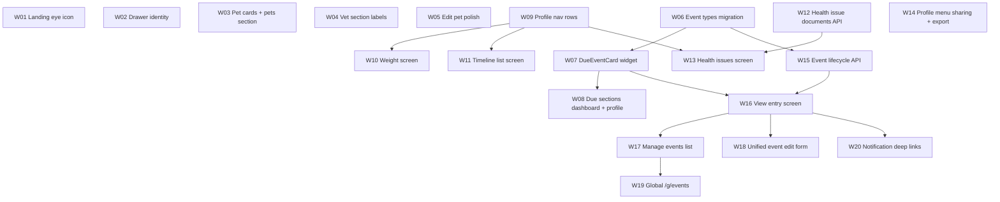

# Guardian UI wave 2 — feature issue briefs

**Status:** Planning snapshot (2026-07-27). One brief = one atomic PR = one sprint outcome.  
**Parent context:** Post–guardian UI rework (`main` after #407/#408).  
**Merge policy:** Single-agent PRs → `main` when CI green. Run `./scripts/pre-push-changed.sh` during work; `./scripts/pre-push.sh` before merge.

## Sprint dependency overview

**Parallel lanes after W09:** Weight (W10) · Timeline (W11) · Health issues API+UI (W12→W13) · Events core (W06→W15→**W16 View entry**→W17 Manage list→W18 Edit form→W19→W20).

---

## W01 — Landing password toggle uses eye icon (web)

### Problem
On web landing, the native HTML login (password-manager path) shows text **Show/Hide** on the password toggle. Users expect an eye open/closed icon, consistent with Flutter auth forms.

### Type
UI (web shell + minor Flutter parity check)

### Affected screens
- Landing login (`web/index.html` native login host)
- Flutter `LandingLoginForm` (verify icons already present; tooltip-only if needed)

### Desired behavior
- Password toggle displays **visibility / visibility_off** icon (or SVG equivalent), not “Show”/“Hide” text.
- Toggle still switches `type` between `password` and `text`.
- `aria-label` and `aria-pressed` remain correct for screen readers.

### UI notes
- Match Material icon semantics used in `landing_auth_forms.dart`.
- Position toggle inside password field suffix area (existing `.anl-password-wrap` layout).

### Acceptance criteria
- [ ] Web native login toggle is icon-only, functional, accessible.
- [ ] BDD `authentication.feature` scenario “Toggling password visibility on the login screen” passes.
- [ ] EN + FR strings unchanged unless tooltip keys reused.

### Deferred work
- Signup native HTML path (if added later) should mirror same pattern.

### Critical checks before commit
- [ ] `./scripts/pre-push-changed.sh` (web + auth tests).
- [ ] Playwright/BDD auth scenario green.
- [ ] No regression to password-manager autofill (native DOM fields preserved).
- [ ] Verify `aria-label` uses existing `showPassword` / `hidePassword` l10n where wired from Flutter configure hook.

---

## W02 — Drawer header shows user identity; Account in top block

### Problem
Drawer shows linked logo + “Agatha Track” and bottom-pinned Account. Users want logo without navigation, their name and email, and Account directly under email.

### Type
UI + policy doc update

### Affected screens
- `ExperienceSectionDrawer`
- `docs/experience-program/phase-1-navigation.md` (delete bottom-pin Account rules; update §1, §9)
- Drawer/account tests

### Desired behavior
- Logo in drawer: **no tap navigation** (drawer only; `AppLogoTitle` elsewhere unchanged).
- Replace app title with **first name** (line 1) and **last name** (line 2); fallback to email if names empty.
- Show **email** under name.
- **Account** menu item immediately below email in top block (not bottom-pinned).
- Bottom of drawer: Guardian + Organisation list only (no pinned footer item).

### UI notes
- Read `AuthUser` from `authProvider`.
- Keep close button and divider below header block.
- Preserve semantic keys: `drawer_account`, `drawer_guardian`, `drawer_organisation`.

### Acceptance criteria
- [ ] Drawer matches layout spec; Account reachable from top block.
- [ ] `experience_section_drawer_test.dart` updated.
- [ ] `phase-1-navigation.md` updated; contradictory rules removed.
- [ ] EN + FR: any new strings for name fallback if added.

### Deferred work
- Avatar/photo in drawer header.

### Critical checks before commit
- [ ] Widget tests + experience navigation BDD if touched.
- [ ] Confirm `/account` still works from drawer.
- [ ] No logo home navigation **in drawer only**.

---

## W03 — Dashboard pet cards vertical, wrap grid, merged pets section

### Problem
Pet tiles are horizontal strips requiring scroll. Owned and foster pets are separate bordered sections. Cards should be vertical (photo top, text bottom) and wrap to new rows.

### Type
UI

### Affected screens
- `PetCard`, `PetTileStrip`
- `GuardianMyPetsSection`
- Dashboard widget tests; guardian BDD if pet dashboard asserted

### Desired behavior
- **One** pets section with **Option A** subgroups:
  - Subtitle **“My pets”** + owned pet grid
  - Subtitle **“My foster pets”** + foster grid (only if foster pets exist)
  - No `DashboardSection` divider between subgroups
- Cards: **vertical** layout — top ~⅔ photo, bottom ~⅓ name + species/type.
- Card **height = current tile width** (160–220px responsive); width unchanged.
- **Wrap** layout (`useWrap: true`) — no horizontal scroll on dashboard.
- Keep foster **colour bar** and foster label on foster cards.
- “Manage pets” link unchanged at section end.

### UI notes
- Reuse `PetCard.tileWidthFor()` for both width and height.
- Passed-away overlay unchanged.

### Acceptance criteria
- [ ] Owned and foster subgroups titled per Option A.
- [ ] Cards wrap on narrow viewports without horizontal scroll.
- [ ] Foster visual distinction preserved.
- [ ] Tap card → pet profile.

### Deferred work
- Cap preview count on dashboard (currently shows all in strip).

### Critical checks before commit
- [ ] `guardian_shell_home_content_test.dart` / pet card tests updated.
- [ ] `flutter analyze` + changed-file pre-push.
- [ ] Semantic labels still announce pet name and species.

---

## W04 — Vet dashboard section: remove Add vet; rename footer link

### Problem
Dashboard vet section exposes Add vet in header; footer says “All vets”. Product wants add only on full vet screens; footer should say “Manage veterinarians”.

### Type
UI + l10n

### Affected screens
- `GuardianMyVetsSection`
- `app_en.arb` / `app_fr.arb` (`manageVeterinarians` key)

### Desired behavior
- Remove `headerAction` Add vet from dashboard section.
- Footer link label → **Manage veterinarians** → still routes to `/g/vets`.
- Empty state copy unchanged (still guides user to add first vet from manage screen).

### Acceptance criteria
- [ ] No Add vet button on dashboard vet section.
- [ ] Footer link text updated EN + FR.
- [ ] `/g/vets/add` still reachable from manage veterinarians screen.

### Deferred work
- None.

### Critical checks before commit
- [ ] Guardian dashboard tests updated.
- [ ] l10n codegen run.

---

## W05 — Edit pet screen title, back navigation, form polish

### Problem
Edit screen title is generic “Edit pet”; back goes to home; species field has paw icon; clear icons inconsistent.

### Type
UI

### Affected screens
- `PetFormScreen` and pet form field widgets (`PetSpeciesSection`, etc.)

### Desired behavior
- Title when editing: **Edit [PetName]** (Add pet title unchanged).
- Back / save navigation when editing from pet profile → **`/pet/:petId`** (not dashboard).
- Remove `suffixIcon: Icons.pets` from species dropdown.
- Normalize clear (×) icon **size** across all form fields.

### UI notes
- Preserve org-context navigation (`initialOrgId`, org dashboard) when applicable.
- Consider `ExperienceShellScaffold` for consistent back (optional if `context.pop` to profile works).

### Acceptance criteria
- [ ] Edit title includes pet name.
- [ ] Back from edit returns to pet profile when that was the entry point.
- [ ] Species field has no paw icon.
- [ ] Clear icons visually consistent.

### Deferred work
- Full pet form shell migration to experience chrome.

### Critical checks before commit
- [ ] Pet form widget tests / route tests.
- [ ] BDD pet edit scenarios if present.

---

## W06 — Consolidate event types to four (Medication / Preventive / Vet visit / Other)

### Problem
Five wire types split across “health” and “other” UI groupings (`family_event`, `procedure`). Product wants four types under one “Events” concept.

### Type
Full-stack (DB migration + API + Flutter)

### Affected screens / layers
- DB migration: `health_entries.type`
- `HealthEntryType` enum, labels, filters, forms
- `kHealthEventTypes` / `kOtherEventTypes` constants (deprecate split)
- Server validation on create/update
- Tests referencing `family_event` / `procedure`

### Desired behavior
- Canonical types: **medication**, **preventive**, **vet_visit**, **other**.
- Migrate existing rows: `family_event` → `other`, `procedure` → `other` (legacy `vaccine` → `preventive` unchanged).
- API rejects deprecated types on new writes.
- Flutter shows four types in dropdowns/filters.
- **Do not touch** organisation `family_events` table (foster/placement).

### UI notes
- EN label for `other`: **Other**.
- Remove “Care event” / separate other-event form type pickers (unification in W18).

### Acceptance criteria
- [ ] Migration runs clean on dev DB.
- [ ] All existing entries readable after migration.
- [ ] Server + Flutter tests updated.
- [ ] No user-facing reference to deprecated type names.

### Deferred work
- CSV export column documentation.

### Critical checks before commit
- [ ] `cd server && npx jest --env=node --forceExit` (health entry tests).
- [ ] Flutter unit tests for models/enums.
- [ ] `node server/scripts/migrate.js up` verified locally.
- [ ] Audit `health_dashboard_screen` tab labels (updated in W19 if not here).

---

## W07 — Unified DueEventCard (health-screen skin + Open action)

### Problem
Due/overdue UI uses compact `DueEventRow` without coloured action columns. Legacy `HealthEntryCard` lacks explicit Open and uses tap-to-open. Product wants one skin everywhere.

### Type
UI (extract widget)

### Affected screens
- New: `DueEventCard` (or extended `HealthEntryCard` config)
- Replaces usages in dashboard, profile, view-entry iteration slot (later PRs wire consumers)

### Desired behavior
Card layout (left → right):
1. Pet photo with pet colour strip (`HealthEntryPetStrip` pattern)
2. Pet name
3. Event type icon
4. Two lines: **event name** (top), **status date line** (bottom) — reuse `formatHealthEntryStatusLine` + `healthEntryStatusColor`
5. Action columns: **Open** (grey), **Snooze** (pale orange), **Mark done** (green)

- **Open** → event **edit** route (`/pet/:petId/health/edit/:id` until W18 unifies).
- Snooze / Mark done → existing `HomeEventActions` / health notifier flows.
- Support `showActions: false` variant if needed for tight spaces (default: show per product).

### UI notes
- Reuse `HealthEntrySnoozeButton`, `HealthEntryMarkDoneButton`; add `HealthEntryOpenButton` (grey).
- On pet profile due list, Open still goes to edit (not view) per locked decision.

### Acceptance criteria
- [ ] Widget tests for layout and action callbacks.
- [ ] Semantics labels include pet, event name, status.
- [ ] Visual parity with legacy health dashboard card skin.

### Deferred work
- Wiring into all surfaces (W08, W17).

### Critical checks before commit
- [ ] Golden/widget tests.
- [ ] No regression to `HealthEntryCard` on screens not yet migrated.

---

## W08 — Due and overdue sections use DueEventCard (dashboard + pet profile)

### Problem
Guardian dashboard preview hides inline actions; pet profile shows event count summary instead of due cards.

### Type
UI

### Affected screens
- `GuardianUpcomingEventsSection`
- `GuardianDueEventsScreen` (`/g/events` due list portion — or defer full rework to W19)
- `PetEventsPreviewSection` → renamed **Due and overdue** with inline cards

### Desired behavior
- **Dashboard** due preview: up to 5 items (existing limit) with **inline actions** via `DueEventCard`.
- **Pet profile** section title **Due and overdue**; show **all** due/overdue entries for that pet (filter `guardianDueEntries` / `isEntryDueOrOverdue` scoped to `petId`).
- Keep **Manage events** footer link → `/pet/:petId/events`.
- End link on dashboard section **All events** → `/g/events` unchanged.

### Acceptance criteria
- [ ] Dashboard cards have Open / Snooze / Mark done.
- [ ] Pet profile lists all due/overdue for pet, not count summary.
- [ ] Empty states preserved.
- [ ] Open navigates to event edit.

### Deferred work
- Full `/g/events` rework (W19).

### Critical checks before commit
- [ ] `guardian_upcoming_events` tests.
- [ ] Pet detail widget tests.
- [ ] BDD due/overdue scenarios if mapped.

---

## W09 — Pet profile section nav rows (Timeline, Weight, Health issues)

### Problem
Timeline, weight, and health issues are inline expansion/list blocks. Product wants chevron navigation rows with dividers.

### Type
UI

### Affected screens
- `PetDetailScreen`
- Remove/replace inline `PetTimelineSection`, `WeightTrackingSection`, `HealthIssuesSection` bodies with nav rows
- Routes must exist (can 404 to stub **only if** W10–W13 follow immediately — prefer landing on real screens in same sprint batch)

### Desired behavior
- After profile card (and reminders/foster placement if shown):
  - **Timeline** row → `/pet/:id/timeline`
  - Divider
  - **Weight tracking** row → `/pet/:id/weight`
  - Divider
  - **Health issues** row → `/pet/:id/health-issues`
  - Divider (existing border before Events section)
- Events (**Due and overdue** — W08) and following sections unchanged in this PR except row ordering.

### UI notes
- Reuse `ListTile` + `Icons.chevron_right` pattern (account screen style).
- Section rows inside horizontal padding consistent with profile card.

### Acceptance criteria
- [ ] Three nav rows visible on pet profile.
- [ ] Dividers between Timeline / Weight / Health issues.
- [ ] Tapping rows navigates to dedicated routes.
- [ ] Inline expansion content removed from profile scroll.

### Deferred work
- Arrow-of-time visualization on timeline screen.

### Critical checks before commit
- [ ] Routes registered in `app_router.dart`.
- [ ] Pet detail tests updated (keys for timeline section may change).
- [ ] Back from sub-screens returns to profile (shell back).

---

## W10 — Weight tracking dedicated screen

### Problem
Weight tracking is a collapsible block on pet profile. Content should live on a dedicated screen with symmetric add affordances.

### Type
UI (extract)

### Affected screens
- New: `PetWeightTrackingScreen` at `/pet/:petId/weight`
- Extract from `WeightTrackingSection`

### Desired behavior
- Move chart, unit toggle, entry list, add-entry flow from expansion tile to full screen.
- **Add weight entry**: contextual app-bar icon + button at bottom of entry list.
- Title: **Weight tracking**.
- Back → pet profile.

### Acceptance criteria
- [ ] Feature parity with former expansion content.
- [ ] Add entry works from app bar and list footer.
- [ ] `weight_tracking.feature` BDD still passes (update navigation steps).

### Deferred work
- None.

### Critical checks before commit
- [ ] `weight_tracking_section_test.dart` → screen tests.
- [ ] `flutter test` weight-related suite.

---

## W11 — Timeline list screen (v1, no arrow / no custody / no gap fill)

### Problem
Timeline is inline on pet profile. Users need a dedicated list screen structured for a future arrow view.

### Type
UI (+ minor API/client composition)

### Affected screens
- New: `PetTimelineScreen` at `/pet/:petId/timeline`
- Refactor `PetTimelineSection` logic into screen

### Desired behavior
- **No arrow graphic** in v1.
- List entries, **latest first** (by start date):
  - **Date of birth** (read-only) if set on pet
  - **Joined AgathaTrack** (read-only): `pet.createdAt` + guardian name (pet owner at creation)
  - **Fostering sessions** (read-only) from timeline API
  - **Manual entries** (editable): edit + delete on row
- **Out of scope v1:** custody segments, gap fill UI
- **Add entry**: app-bar icon + bottom button → existing fill/create sheet/API
- Back → pet profile
- Data model: stable segment `kind` + ids for future arrow markers

### Acceptance criteria
- [ ] DOB and Joined markers appear when data exists.
- [ ] Fostering sessions read-only.
- [ ] Manual CRUD works.
- [ ] `pet_timeline.feature` updated for navigation to screen.

### Deferred work
- Arrow-of-time UI, dashed gaps, custody segments, gap fill.

### Critical checks before commit
- [ ] Timeline API contract unchanged or versioned.
- [ ] Server timeline tests if client adds synthetic markers only.

---

## W12 — Health issue documents API

### Problem
Health issues have no attachment storage. UI needs upload/view/download/delete per issue (max 4).

### Type
Backend (+ Flutter datasource stubs if needed same PR)

### Affected screens / layers
- New table `health_issue_documents` (mirror `health_event_photos`)
- Routes: `GET|POST|DELETE /api/health-issues/:id/documents`
- Reuse `safeUpload.js`; storage under `uploads/health_documents/` or dedicated subfolder
- `ON DELETE CASCADE` from `health_issues`
- Delete issue handler removes files from disk

### Desired behavior
- Multipart upload, JPG/PNG/PDF, ≤2 MB, max **4** per issue.
- Same response shape pattern as entry photos.
- Access guard via `userCanManageHealthIssue`.

### Acceptance criteria
- [ ] CRUD tests in `server/test/`.
- [ ] Flutter datasource methods (can be thin in this PR).
- [ ] GDPR export updated if required.

### Deferred work
- UI (W13).

### Critical checks before commit
- [ ] Migration + jest.
- [ ] No raw exception text in 5xx bodies.
- [ ] File path containment via `safeUpload`.

---

## W13 — Health issues dedicated screen

### Problem
Health issues are inline expandable cards without documents, resolved status, or structured dates.

### Type
Full-stack UI

### Affected screens
- New: `PetHealthIssuesScreen` at `/pet/:petId/health-issues`
- Expandable issue cards per spec

### Desired behavior
**List card (collapsed):**
- Left: title (row 1), description max 5 lines with expand if longer (row 2)
- Right: date, document icon if attachments exist
- Chevron to expand

**Expanded:**
- Title + description; edit button → inline edit mode
- Edit mode: save (primary), cancel (secondary), delete (with confirm — deletes issue, documents, unlinks events; events remain)
- Fields: **Issue since** (date picker), **Issue resolved** (date picker, past/today only)
- Status: **open** | **resolved** (resolved when resolved date set)
- **Reopen issue**: clear resolved date, set open, append to **description**: `Issue previously closed on [date] and reopened on [date]`
- Horizontal documents strip (+ add); tap → view / download / delete
- Horizontal linked **events** strip (+ add → event edit/create); tap event → event screen
- App bar: **+ Add health issue** (title + description required)

### Acceptance criteria
- [ ] Documents upload/list/delete (max 4).
- [ ] Open/resolved lifecycle works.
- [ ] Event links use `health_issue_id` on entries.
- [ ] EN + FR strings for new labels.

### Deferred work
- Navigate from view-entry issue chip with auto-expand (wire in W17).

### Critical checks before commit
- [ ] Issue API + new document routes integration test.
- [ ] Widget tests for expand/collapse.
- [ ] File size/MIME validation mirrored from entry documents.

---

## W14 — Pet profile app-bar menu: sharing sheet + export report

### Problem
Sharing is a bottom scroll section; export PDF is buried in Manage events History tab.

### Type
UI

### Affected screens
- `PetDetailScreen` → `ExperienceShellScaffold.contextualActions`
- Remove `SharingSection` from scroll body
- New `showSharingSheet()` wrapper

### Desired behavior
- App-bar contextual icons:
  - **Sharing** (when `manageSharing` or shared/foster visibility rules today)
  - **Export pet report** (when `PetDetailAction.downloadReport`) → opens existing **section picker** dialog (`DownloadReportController`)
- Sharing opens **modal bottom sheet** with current owner/foster/follower content; dismiss → pet profile.
- Remove inline Sharing section from profile body.

### Acceptance criteria
- [ ] Sharing sheet parity with former section.
- [ ] Export opens section picker (not one-tap).
- [ ] Icons visible only when permissions allow.

### Deferred work
- None.

### Critical checks before commit
- [ ] `pet_detail_viewer_context` tests.
- [ ] Download report flow still generates PDF.

---

## W15 — Event lifecycle API: close, reopen, skip iteration, unmark done

### Problem
Recurring series cannot be closed at event level; iterations lack skip; unmark only works for latest via undo-complete; no `skipped` state.

### Type
Backend (+ Flutter notifier methods)

### Affected screens / layers
- `server/routes/healthEntries/completionRouter.js` (+ new routes if needed)
- `health_history.status` values: add **`skipped`**
- Flutter health repository / notifier

### Desired behavior

| Action | Behavior |
|--------|----------|
| **Close event** (recurring or open) | `status = completed`, `repeat_end_date = yesterday` (calendar date) |
| **Reopen event** | `status = active`, `repeat_end_date = null`, **`next_due_date` cleared** — user must set due date in edit (like create) |
| **Skip iteration** (past-occurrence UI) | Mark occurrence skipped: history row `status = skipped`, does not advance series; listed as **Skipped** in manage lists; sort key = original `due_date`; can **unskip** (reverse skip) |
| **Unmark done** | Only on **last** completed (non-skipped) history row — existing undo-complete semantics, renamed in UI |

- Skipped rows appear in manage event filters and ordering at due-date position.
- Close does not delete history.

### Acceptance criteria
- [ ] API tests for close, reopen, skip, unskip, unmark done.
- [ ] Flutter notifiers expose new operations.
- [ ] Audit log entries for state changes where other health actions log.

### Deferred work
- Enforce `repeat_end_date` on mark-taken (currently stored but ignored).

### Critical checks before commit
- [ ] Migration if new enum/check constraint on history status.
- [ ] jest full health entry suite.
- [ ] Calendar dates as `YYYY-MM-DD` on wire.

---

## W16 — View entry screen

### Problem
No read-only event detail; edit form is the only entry point.

### Type
Full-stack UI

### Affected screens
- New: `PetEventViewScreen` `/pet/:petId/events/:entryId`
- Consumes W07 `DueEventCard` for current iteration block

### Desired behavior
**App bar:** title **View [entry name]**; back → manage events; contextual **Edit** + **See history** (admin log = current administration history dialog/screen); bell unchanged.

**Body (read-only layout):**
1. Pet thumbnail + name card (single pet per entry; bulk-created entries are separate rows)
2. Type icon + type name + dosage if any
3. Status: **Open** | **Closed** (grey out all fields when closed)
4. Buttons (visibility by status): **Edit**, **Close** (open) / **Reopen** (closed — clears repeat end, clears next due)
5. Recurrence summary: “Does not repeat” or “Repeats every … until …”; “You will be reminded X days before”
6. **Iteration card:** if closed → last iteration (actions greyed); if open → next iteration with **DueEventCard** actions (Open/Snooze/Mark done)
7. **Relates to health issue:** `[Name] >` → health issues screen (expand target issue)
8. **Notes** field display
9. **Documents** horizontal strip (same UX as health issue documents)
10. **Past iterations** (recurring): collapsible list of occurrence cards ordered by due/done desc; actions: **Skip** (not delete), **Unmark done** only on last marked-done row
11. **See history** → administration log (separate from past iterations)

**Edit** (nav or button) → unified edit form; save → return to **View entry**.

### Acceptance criteria
- [ ] All fields read-only except action buttons.
- [ ] Close/Reopen/Skip/Unmark done call W15 APIs.
- [ ] Closed state greys UI.
- [ ] Health issue link navigates to issues screen.

### Deferred work
- Auto-expand health issue from query param (wire when W13 merged).

### Critical checks before commit
- [ ] Widget tests for open/closed/skipped states.
- [ ] Integration with documents API.
- [ ] BDD scenario for view entry happy path (add if missing).
- [ ] Direct route testable before W17 list links here.

---

## W17 — Manage events: single list, filters, compact cards → View entry

### Problem
Manage events has Edit/History tabs and split health/other lists. Product wants one Events list, filters, compact rows linking to View entry; PDF removed from this screen.

### Type
UI

### Affected screens
- `PetManageEventsScreen` — remove tabs and `DownloadReportSection`
- Replace `HealthEventsSection` + `OtherEventsSection` with unified list
- New compact **EventListCard** (2 lines, date right, chevron)
- Links to `/pet/:petId/events/:entryId` (W16)

### Desired behavior
- Title: **Manage events** (screen); list heading **Events**.
- Single list of all entries for pet (all four types).
- **Filters:** type, recurring yes/no, open/closed, due/overdue (and skipped visibility per W15).
- **Sort:** active/open → `next_due_date`; closed → last `completed_on` from history, else due date if never marked done.
- **Card:** line1 name, line2 `type · dosage`; date floated right (`formatHealthEntryStatusLine`); chevron → **View entry**.
- Footer: none for PDF (export on profile menu).

### Acceptance criteria
- [ ] No tabs on manage events screen.
- [ ] Filters combine correctly.
- [ ] Sort order matches spec.
- [ ] Skipped occurrences display as Skipped.

### Deferred work
- None.

### Critical checks before commit
- [ ] `pet_manage_events_screen_test.dart` rewritten.
- [ ] Remove dead l10n for tabs if unused elsewhere.

---

## W18 — Unified event edit form; retire other routes; post-save → view entry

### Problem
Separate `/pet/:id/other/*` form and health form; administration history on edit; delete confirm omits iterations; save returns to list.

### Type
UI + routing

### Affected screens
- `HealthEntryFormScreen` — all four types on pet routes
- Remove `OtherEventFormScreen` routes
- `HealthEntryEditActions` — remove Administration History button (moved to view entry)
- Delete confirm mentions recurring iterations
- Save navigates to **View entry**

### Desired behavior
- Single edit route: `/pet/:petId/events/:entryId/edit` (redirect old `/health/edit` and `/other/edit`).
- Type dropdown: four types only.
- Bulk create on global `/health/add` unchanged (N entries for N pets).
- Remove administration history from edit bottom actions.
- Delete confirmation: warns that **all iterations** removed for recurring events.

### Acceptance criteria
- [ ] Old other routes redirect or removed.
- [ ] Create/edit works for type `other`.
- [ ] Save lands on view entry screen.
- [ ] Global add still supports multi-pet bulk create.

### Deferred work
- None.

### Critical checks before commit
- [ ] Router tests.
- [ ] `health_entry_form` tests updated.
- [ ] E2E health tracking flows updated.

---

## W19 — Global events screen `/g/events` (all pets, filters, view entry)

### Problem
`/g/events` uses legacy tabbed `HealthDashboardScreen`. Should match manage-events UX for all guardian pets.

### Type
UI

### Affected screens
- `GuardianDueEventsScreen` / `experience_routes` embedding
- Replace tabbed health dashboard with unified list + view entry flow

### Desired behavior
- Same list card, filters, and view-entry navigation as W16.
- Scope: **all guardian shell pets** (owned + foster; **shared pets = own**).
- **Additional filters:** by **pet**; by **My pets / Foster pets** cohort.
- Add event affordance preserved (existing picker sheet).
- Due/overdue filter semantics match dashboard.

### Acceptance criteria
- [ ] No type tabs at top level.
- [ ] Pet filter + cohort filter work together.
- [ ] Tap → view entry (not edit).
- [ ] `/health` redirect still resolves.

### Deferred work
- PDF export from global events (not required; export per-pet on profile).

### Critical checks before commit
- [ ] Guardian events BDD / e2e navigation.
- [ ] `health_dashboard_screen` retirement or reduction to wrapper.

---

## W20 — Due event notifications deep-link to View entry

### Problem
Notifications for due/overdue events should open the relevant **view entry** screen on tap.

### Type
Full-stack

### Affected screens
- Notification payload construction (server or client)
- Notification tap handler / router
- `checkDueNotifications` or equivalent

### Desired behavior
- Care notifications referencing a health entry navigate to `/pet/:petId/events/:entryId` (view).
- If entry deleted or inaccessible, graceful fallback (pet profile or events list + message).

### Acceptance criteria
- [ ] Tap notification → view entry for that event.
- [ ] Existing notification kinds unchanged except deep link target.
- [ ] BDD notification scenario added or updated.

### Deferred work
- Push notification payload parity (if separate from in-app).

### Critical checks before commit
- [ ] Server notification metadata includes `entryId` + `petId`.
- [ ] Flutter router handles cold start.
- [ ] `notifications.feature` coverage.

---

## Cross-cutting checklist (every PR)

Before merge to `main`:

1. `git fetch origin main && git rebase origin main`
2. `./scripts/pre-push-changed.sh` (full `./scripts/pre-push.sh` before final merge PR if batching)
3. `flutter analyze` (changed Dart)
4. `cd server && npx jest --env=node --forceExit` (if `server/` touched)
5. Update **EN + FR** arb files for user-visible strings
6. Update **BDD** scenarios + priority map if journey changed (`node e2e/scripts/check_bdd_coverage.js`)
7. Update **docs** if policy superseded (`phase-1-navigation.md`, decisions log)
8. **Audit logging** for new mutating API routes (match `health_entry.marked_complete` pattern)
9. No hand-written file >500 lines (`node scripts/check_file_size.js`)
10. Confirm no raw exception text in prod 5xx bodies

---

## Explicitly deferred (whole programme)

| Item | Notes |
|------|--------|
| Timeline arrow graphic | List-only v1 (W11) |
| Custody segments + gap fill on timeline | Out of v1 |
| `repeat_end_date` enforcement on mark-taken | Existing tech debt |
| Org `family_events` table | Unrelated to pet event types |
| Manage events PDF / History tab | Export via profile menu only |

---

## Decisions log entries to add at implementation

- D-??: Event types four-way consolidation (`other` supersedes `family_event`/`procedure` on `health_entries` only)
- D-??: Drawer Account top-block supersedes phase-1 bottom-pin
- D-??: Event close = `completed` + `repeat_end_date` yesterday; reopen clears due date
- D-??: Skip iteration (not delete) with `skipped` history status
- D-??: View entry as canonical notification target for due events
