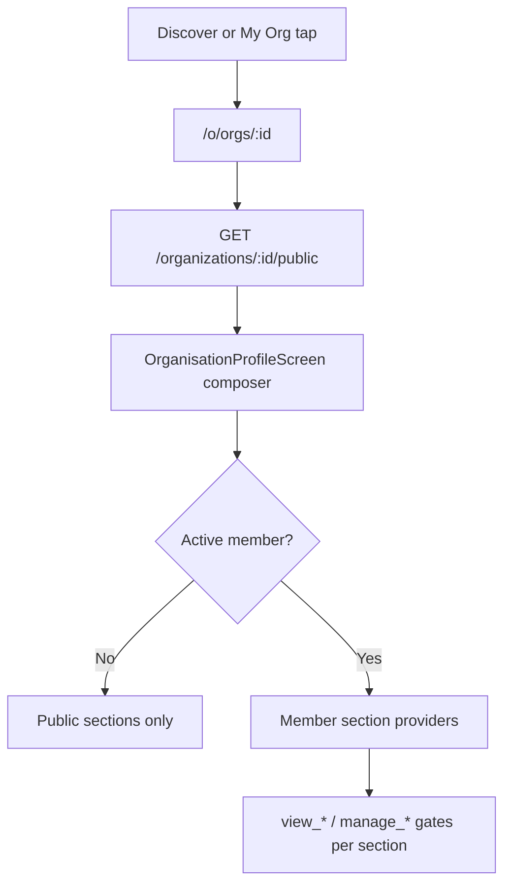

# Organisation v2 — delivery plan

**Status:** Locked — implementation in progress (`execute-plan organisation-v2-abc9`, control issue #537)  
**Supersedes:** Experience-program Phase 3 “section-card dashboard” as primary organisation IA  
**Parent:** [../../cross-domain/changes/program-contract.md](../../cross-domain/changes/program-contract.md) · [shelter-decisions.md](../features/shelter-decisions.md)  
**Last updated:** 2026-08-02

---

## Purpose

Rebuild the Organisation area around a **single organisation profile** (pet-profile-style stacked flow), with robust public/member tiers, formal view permissions, a product activity log for last-activity sorting, and full BDD/TDD coverage for the org persona.

This plan incorporates v2 product decisions, critical review findings, and confirmed architecture choices. **No implementation code until slices begin.**

---

## Locked v2 decisions

| ID | Decision |
|----|----------|
| **D-v2-IA-1** | `/o/orgs/:id` is a **profile composer** (header + stacked sections), not a link-only dashboard |
| **D-v2-IA-2** | `/o/orgs/:id/presentation` **redirects** to profile — no separate primary destination |
| **D-v2-IA-3** | Discover tile tap → **profile route**; non-members see **public tier only** |
| **D-v2-IA-4** | Profile shows **12 pets** (preview), sorted by last activity |
| **D-v2-PERM-1** | Formal **`view_*` permission keys** + `GET /organizations/:orgId/permissions/me` |
| **D-v2-PERM-2** | **Associates** may **view pets on profile preview** only — pet tap opens **redacted organisation pet profile** (Option B): permitted summary fields only; **not** timelines, fostering sessions, health, documents, or other operational depth unless granted additional keys. Enforce on **API**, not UI-only hiding. |
| **D-v2-PERM-3** | Admin tile “title” = existing **role label** (Admin, Super Admin, etc.) |
| **D-v2-ACT-1** | `pet_activity_events` (append-only) + denormalized `pets.last_activity_at`; **no backfill** |
| **D-v2-ACT-2** | “Foster update” = fostering-session mutation + foster-visible health/document writes (Option A) |
| **D-v2-FILTER-1** | Shadow / Rainbow Bridge filters remain **additive** (union onto tab results) |
| **D-v2-ADDR-1** | Postcode in `public_profile_metadata.postcode` for now; discover shows **`display_locality`** (server-computed). **Future:** proper addresses API (out of v2 scope) |
| **D-v2-MSG-1** | Message = **mailto/tel** everywhere |
| **D-v2-NOTIF-1** | In-app notifications only this iteration; email deferred |
| **D-v2-NOTIF-2** | Placement mutations invalidate pending + notification providers at **repository boundary** |
| **D-v2-CONN-1** | Connected-org disconnect = **simple confirm** (no typed REMOVE) |
| **D-v2-SESSION-1** | Sessions list uses existing `foster_placements` table; `/direct-adopt` remains legacy shortcut until future unification |

---

## Architecture overview

### Profile tiers



| Tier | Who | Visible |
|------|-----|---------|
| **Public** | Anyone (incl. anonymous discover tap) | Hero, logo, name, type, description, legal block, public contact |
| **Member** | Active org membership | Public + permission-gated internal sections (previews + manage links) |

Non-members **never** see admin contacts, fostering sessions, internal pets depth, or connected-org management — only the public tier.

### Profile composer (not monolithic)

`OrganisationProfileScreen` is a thin route shell composing:

```
OrganisationProfileHeader          ← reuse org_presentation/* widgets
OrganisationProfileDescription
OrganisationProfileAdminContacts   ← preview; view_admin_contacts
OrganisationProfileFosters         ← entry; view_org_internal + manage_fosters for manage
OrganisationProfileFosteringSessions ← entry only; manage_fostering_sessions
OrganisationProfilePets            ← 12-card preview; view_org_pets
OrganisationProfileConnections     ← tiles; view_connections
OrganisationProfileLegalDocuments  ← drawer entry; unchanged behaviour
```

Each section: own widget (≤80 lines target), own provider, own widget tests. Deep screens (pets list, sessions list, admin directory) remain dedicated routes.

### Permission model (view vs manage)

**New view keys** (server defaults + Jest matrix; Flutter loads via `GET /permissions/me`):

| Key | Default grant (v2) | Gates |
|-----|-------------------|-------|
| `view_org_internal` | All active members | Base member sections |
| `view_admin_contacts` | associate, foster, admin, super_admin | Admin contacts preview + directory read |
| `view_org_pets` | associate, foster, admin, super_admin | **Profile pet preview only** (12 cards) |
| `view_connections` | associate, foster, admin, super_admin | Connected org tiles (read) |
| `view_fostering_sessions` | admin, super_admin (+ bundle overrides) | Sessions list entry |

**Manage keys** (unchanged G0 `manage_*`) gate create/edit/delete actions and deep operational screens.

**Associates + pets (confirmed — Option B):** associates with `view_org_pets` see the **12-card profile preview** and may open a **redacted organisation pet profile** (summary fields only). Timeline, fostering session detail, health logs, and documents are **blocked at the API** unless the user holds additional keys.

### Activity & log strategy

| Layer | Mechanism | Purpose |
|-------|-----------|---------|
| **Product activity** | `pet_activity_events` + `pets.last_activity_at` | Last-activity sort; future activity UI |
| **Compliance** | `audit_events` (extend coverage) | Permission changes, admin actions |
| **User timeline** | `pet_timeline_entries` + composite read | Pet Care history — **not** used for org sort |

**Write path:** single `recordPetActivity()` updates both event row and `pets.last_activity_at` in one transaction.

**Event types (v1):** `health_log`, `foster_session`, `profile_edit`, `document_upload`.

**Hook contract:** `server/test/contracts/petActivityHooks.contract.test.js` — manifest of required write sites; CI fails if routes change without contract update.

**Sort fallback:** `COALESCE(last_activity_at, created_at)` — no backfill.

### Address / postcode (interim)

- Edit form: address line, town, administrative_area; postcode → `public_profile_metadata.postcode`.
- Discover API returns `display_locality`: postcode if set in metadata, else town, else administrative_area.
- **Tech debt note:** evaluate proper structured addresses API (geocoding, validation, international formats) in a future phase — not v2.

### Image upload guidance (UI copy; server unchanged)

| Asset | Guidance | Server limit |
|-------|----------|--------------|
| Hero | Landscape ~8:3, min 1200×450 px | 2 MB, JPG/PNG/WebP |
| Logo | Square, min 256×256 px (shown circular) | 2 MB, JPG/PNG/WebP |

### Sessions list

- Extend `GET /:orgId/placements` with query filters (pet name, foster name, dates, status, in_view_to_adopt).
- `deriveSessionStatus(placement, now)` pure function — Jest table tests; “nearly finished” = end within 10 days.
- Flutter route: `/o/orgs/:id/sessions`.
- Direct-adopt rows appear in list; endpoint unification deferred.

### Notifications

- Fix: `OrganizationRepositoryImpl` placement mutations call shared side-effects helper → invalidate `pendingFosterPlacementsProvider`, `pendingAdoptionPlacementsProvider`, `notificationsProvider`.
- Jest: assert notification insert on `POST …/placements` and `POST …/direct-adopt`.
- Email: out of scope.

### Pet filters (additive)

- Filter algebra documented in `org_pets_care_utils.dart`.
- **Table-driven unit tests** (~15 cases) in `org_pets_filter_algebra_test.dart`.
- BDD: 4 journey scenarios as smoke; not exhaustive matrix.

---

## Testing strategy

### Pyramid (per vertical slice)

| Layer | Focus |
|-------|-------|
| Pure functions | Filter algebra, session status, `display_locality`, activity recording |
| Jest | Permission matrix, activity hooks contract, placement notifications, sessions filters, public org API |
| Flutter widget | Each `org_profile/*` section, discovery tile, edit upload |
| BDD + Playwright | 1–3 scenarios **per slice PR** (shift-left, not end-loaded) |
| Integration | Discover → public profile; member profile with gated sections |

### BDD file strategy

| Action | Files |
|--------|-------|
| **Add** | `organisation_profile.feature`, `fostering_sessions.feature`, `organisation_edit.feature` |
| **Extend** | `organisation_discovery.feature`, `pet_screen_filters.feature`, `admin_contacts.feature`, `organisation_pet_management.feature` |
| **Legacy** | Dashboard-specific scenarios in `organisation_management.feature` → `@legacy` when profile lands; do not rewrite in place |

### File size & modularity

- Hand-written `.dart` / `.js` ≤ **500 lines** (CI gate).
- Split tests by domain early:

```
server/test/organizations/
  petActivity.test.js
  petActivityHooks.test.js
  permissionsView.test.js
  placements/notifications.test.js
  sessions/list.test.js
  publicProfile.test.js

e2e/playwright/tests/
  organisation.profile.spec.ts
  organisation.discovery.spec.ts
  organisation.sessions.spec.ts
  organisation.edit.spec.ts
  organisation.pet-filters.spec.ts
```

### Gate ratchet

- Ratchet `e2e/scripts/check_bdd_coverage.js` **once** in Slice 8 after net-new scenarios are mapped.
- Update `docs/quality/scorecard.md`, `docs/quality/bdd-journey-matrix.md`, `docs/debt/refactoring-log.md`.
- Target: org persona features **≥90%** scenario→Playwright; overall gate **≥130 mapped** (exact number set when scenario count final).

---

## Delivery slices

**~14 PRs** in **9 slices**. Each PR includes behaviour + tests + l10n for its scope.

### Phase F0 — Foundation (2 PRs)

#### PR-F1: v2 decisions & architecture docs
- Append v2 block to [shelter-decisions.md](../features/shelter-decisions.md).
- Mark organisation dashboard brief § IA as superseded (header note).
- `docs/architecture/pet-activity-model.md`.
- Extend `docs/ops/observability.md` (pet activity vs audit).
- Update `docs/architecture/index.md`.

**Tests:** none (docs).

#### PR-F2: View permissions foundation
- Add `view_*` keys to `G0_PERMISSION_DEFAULTS` with associate/foster/admin grants per table above.
- `GET /organizations/:orgId/permissions/me` returns effective keys (role defaults ∪ overrides).
- Flutter: `orgEffectivePermissionsProvider` replaces role-only gates; deprecate empty override cache pattern.

**TDD:** Jest matrix — 4 wire roles × each view key + bundle override case.

**Exit:** server and Flutter agree on permission source before profile UI.

---

### Slice 1 — Activity log (1–2 PRs)

#### PR-1a: Activity core
- Migration: `pet_activity_events`, `pets.last_activity_at`.
- `server/lib/petActivity.js` — `recordPetActivity()`.
- Hooks: health entry, pet update, placement mutations, document upload.
- Contract test manifest.

**TDD:** unit + contract tests first.

#### PR-1b: Pet summary read API
- `GET /organizations/:orgId/pets/summary?limit=12&sort=last_activity`.
- Permission: `view_org_pets`.

**TDD:** Jest sort order, limit, no-backfill fallback.

**BDD (draft):** scenarios in `organisation_pet_management.feature` — mapped in Slice 4.

---

### Slice 2 — Public + member profile shell (2 PRs)

#### PR-2a: Public API + profile composer
- `GET /organizations/:id/public` (unauthenticated-safe).
- `OrganisationProfileScreen` composer + header (reuse `org_presentation/*`).
- `organisationProfileProvider` — public fetch; member detection.
- Redirect `/presentation` → `/o/orgs/:id`.
- Remove dashboard as primary (refactor or thin redirect).

**TDD:** Jest public endpoint field allowlist; widget tests header.

**BDD:** `organisation_profile.feature` — first 4 scenarios → `organisation.profile.spec.ts`.

#### PR-2b: Section framework
- `OrganisationProfileSection` widget (title, preview, manage link, permission gate).
- Public tier renders header + description + legal/contact only.
- Member tier mounts section slots (empty shells).

**TDD:** widget tests per gate combination.

---

### Slice 3 — Landing & discover (1 PR)

#### PR-3: Landing + discover tiles
- `OrgCard` hero strip (My organisation).
- `OrgDiscoveryTile` — 2/3 hero, centred logo, name + `display_locality`; **onTap → profile**.
- Discover API: `photo_url`, `display_locality`.
- Skeleton / empty / no-results states.

**TDD:** widget tests; Jest discover response shape.

**BDD:** +3 `organisation_discovery.feature` scenarios → `organisation.discovery.spec.ts`.

**Exit:** anonymous and signed-in non-member tap → public tier only.

---

### Slice 4 — Profile sections: pets, people, connections (2 PRs)

#### PR-4a: Pets preview
- `OrganisationProfilePets` — 12 `PetCard.sizedTile`, last-activity sort via summary API.
- “Manage pets” → `/o/orgs/:id/pets`.
- Associates: preview only; **redacted pet profile** on tap; full depth APIs return 403 for associates without extra keys.

**TDD:** widget tests; Jest associate can summary but not timeline.

**BDD:** map pet preview scenarios.

#### PR-4b: Admin contacts + connections
- Admin contacts preview (photo, name, role label); default contact styling.
- Connected org tiles + manage entry.
- mailto/tel messaging.

**TDD:** widget tests; Jest `view_admin_contacts` / `view_connections`.

**BDD:** extend `admin_contacts.feature`; connections profile scenarios.

---

### Slice 5 — Organisation edit & media (1 PR)

#### PR-5: Edit form
- Hero + logo upload UI (existing endpoints).
- File guidance copy (l10n).
- Structured address + `public_profile_metadata.postcode`.
- `orgThemed()` on form.
- Settings/customisations cog in profile header (manage_permissions).

**TDD:** widget tests; Jest postcode metadata persistence.

**BDD:** `organisation_edit.feature` → `organisation.edit.spec.ts`.

---

### Slice 6 — Fostering sessions list (1 PR)

#### PR-6: Sessions list
- Extend `GET /:orgId/placements` filters + `deriveSessionStatus`.
- `/o/orgs/:id/sessions` screen; profile entry between fosters and pets.
- Session row → existing detail route; mailto on foster.

**TDD:** Jest status table + filter combinations.

**BDD:** `fostering_sessions.feature` → `organisation.sessions.spec.ts`.

---

### Slice 7 — Pets management, notifications, API wiring (2 PRs)

#### PR-7a: Pets screen polish
- Top-nav Add pet (keep FAB).
- Filter algebra + table-driven unit tests.
- Pet Care Manage Pets top-nav Add parity.
- Need-attention info-icon regression test.

**BDD:** extend `pet_screen_filters.feature` (+4 scenarios).

#### PR-7b: Notifications + people API
- Placement mutation side-effects helper.
- Jest notification-on-create (standard + direct-adopt).
- `GET /people` gated on `view_admin_contacts` with field redaction.

**BDD:** 2 notification scenarios (incl. dual-role self-assign).

---

### Slice 8 — Hardening & BDD gate (2 PRs)

#### PR-8a: BDD completion
- Map all remaining org v2 scenarios.
- `@legacy` dashboard scenarios in `organisation_management.feature`.
- Split any Playwright file >500 lines.

#### PR-8b: Gate ratchet & counts
- Update `check_bdd_coverage.js` GATE.
- Update `scorecard.md`, `bdd-journey-matrix.md`, `refactoring-log.md`.
- `./scripts/pre-push.sh` green.

---

### Slice 9 — Documentation & l10n (1 PR)

#### PR-9: Doc sweep + l10n
- Supersession banners on `phase-3-organisation-presentation.md`, roadmap.
- `docs/architecture/api-reference.md` new endpoints.
- `docs/domains/fostering/changes/org-fostering-strategy.md` — email deferred note.
- Tech debt: structured addresses API evaluation.
- EN/FR ARB parity; `flutter gen-l10n`.

---

## Per-PR checklist

```
[ ] Behaviour matches one atomic outcome (single sentence)
[ ] view_* checked server-side; UI mirrors, does not replace
[ ] TDD: Jest and/or flutter test in same PR
[ ] BDD: scenario exists with @P0/@P1/@P2; Playwright @bdd header if UI journey
[ ] app_en.arb + app_fr.arb updated
[ ] bdd-journey-matrix.md row added
[ ] Files ≤500 lines
[ ] recordPetActivity vs logAuditEventSafe — correct layer
[ ] ./scripts/pre-push-changed.sh green
[ ] Pre-PR critical self-review
```

---

## Out of scope (v2)

- Email notifications for fostering sessions
- Direct-adopt endpoint unification (documented deferral)
- Typed postcode column / addresses API integration
- Legal documents redesign
- Manage Fosters major redesign
- In-app messaging (mailto only)
- Full activity history UI
- Activity log backfill

---

## Future work (logged, not v2)

| Item | Notes |
|------|-------|
| Structured addresses API | Replace metadata postcode; international formats; geocoding |
| `POST /placements` unified create | `session_type` includes direct-to-adoption; deprecate `/direct-adopt` |
| Server-side org pet tab filters | When org inventory scale requires it |
| Email notification layer | Nodemailer infrastructure does not exist today |

---

## Exit criteria (program complete)

- [ ] Profile composer at `/o/orgs/:id`; presentation redirects
- [ ] Discover tap → public tier (non-member) or member tier (member)
- [ ] `view_*` keys + `/permissions/me` on server and Flutter
- [ ] Associates see 12-pet preview; timeline/session depth blocked at API
- [ ] Last-activity sort via activity log + denormalized column
- [ ] Sessions list with filters and 10-day nearly-finished rule
- [ ] Additive filters with documented algebra + table tests
- [ ] In-app placement notifications + repository invalidation
- [ ] Org BDD ≥90% mapped; CI gate ratcheted
- [ ] Docs and l10n current; no contradictory Phase 3 dashboard guidance

---

## Slice summary

| Slice | PRs | Primary deliverable |
|-------|-----|---------------------|
| F0 | 2 | Decisions, view permissions API |
| 1 | 1–2 | Activity log + pet summary API |
| 2 | 2 | Profile composer + section framework |
| 3 | 1 | Landing + discover tiles |
| 4 | 2 | Pets + contacts + connections previews |
| 5 | 1 | Edit + uploads + address metadata |
| 6 | 1 | Fostering sessions list |
| 7 | 2 | Filters + notifications + people API |
| 8 | 2 | BDD gate + legacy tags |
| 9 | 1 | Docs + l10n |

**Total: 9 slices, ~14 PRs**
