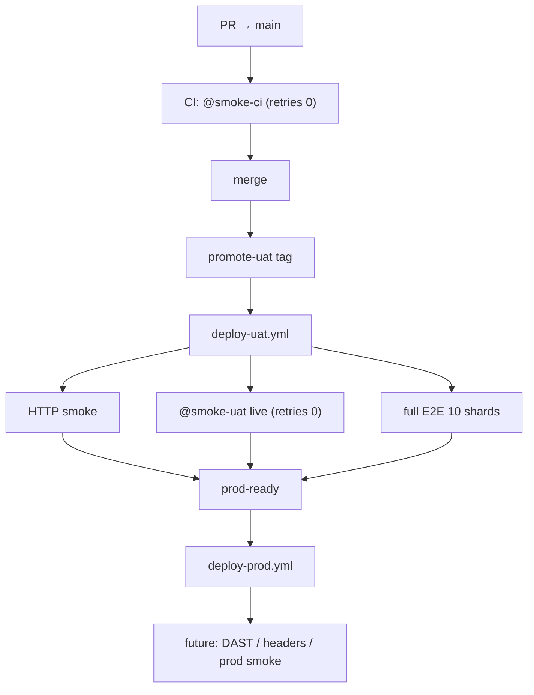

# E2E fail-fast canary — phased implementation plan

**Status:** Partially superseded by [e2e/uat-deploy-tiers.md](./e2e/uat-deploy-tiers.md) (Jul 2026) — full E2E now runs in `pre-uat-e2e.yml`; live `@smoke-uat` is advisory via `uat-live-e2e.yml`. PR `@smoke-ci` goals below remain current.

**Historical:** Phase 3–4 deploy-path goals (full E2E + `@smoke-uat` inside `deploy-uat.yml`) superseded Jul 2026 — see [uat-deploy-tiers.md](./e2e/uat-deploy-tiers.md).
**Owner track:** CI/CD reliability (see [ci-cd-gates.md](./ci-cd-gates.md), [ci-cd-baseline.md](./ci-cd-baseline.md))  
**Related:** [e2e/README.md](../e2e/README.md), [promotion-contract.md](./promotion-contract.md)  
**Agent policy:** `cursor/*` PRs may edit `.github/workflows/` (see `agent-safety-lib.js`); update `ci-gate` / `assert-ci-gate.sh` / `docs/ci-cd-gates.md` in the same PR when adding blocking jobs.

---

## Goals

1. **Fast PR CI** — catch cross-cutting regressions in ~3–4 min without running full Playwright shards.
2. **Fail fast on UAT live smoke** — `retries: 0` on `@smoke-uat`; fix flakes with in-test polling, not whole-test retries.
3. **Keep prod-ready contract** — UAT deploy still runs **live `@smoke-uat` + full localhost E2E (10 shards)** before `Deploy UAT / Prod ready`.
4. **Post-merge autonomy** (later phase) — extend babysit+ to watch UAT deploy through prod-ready.
5. **Prod promotion enrichment** (future) — security scans after prod-ready; not in this initiative’s first delivery.

---

## Gate stack (target end state)

| Stage | Tests | Retries | Blocking? |
|-------|-------|---------|-----------|
| PR CI | `@smoke-ci` (~3 journeys) | **0** | Yes (new `ci-gate` input) |
| UAT deploy | HTTP smoke script | n/a | Yes |
| UAT deploy | `@smoke-uat` live Playwright | **0** | Yes |
| UAT deploy | Full localhost E2E shards | 0→1 during transition | Yes |
| Prod (future) | Security / attestation | TBD | TBD |

**Invariant:** `@smoke-ci ⊂ @smoke-uat` — every CI canary test is also a UAT smoke test.

---

## Phase 0 — Instrumentation & baseline (no gate changes)

**Deliverables**

| Item | Path / action |
|------|----------------|
| Retry outcome script | `e2e/scripts/summarize-playwright-retries.mjs` — parse list/HTML reporter output; count pass-on-retry vs fail-both |
| Baseline note | Append retry stats to [ci-cd-baseline.md](./ci-cd-baseline.md) from last 20 `deploy-uat` runs |
| Tag lint (skeleton) | `e2e/scripts/check-smoke-tags.mjs` — enforce `@smoke-ci` ⊆ `@smoke-uat` once tags exist |

**Exit:** Documented retry recovery rate; confirm ~67% of live-smoke retries are quick semantics flakes vs ~0% on cascade failures.

**Risk:** Low — read-only.

---

## Phase 1 — Tiered smoke tags & Playwright projects

**Deliverables**

| Item | Detail |
|------|--------|
| Tags | Introduce `@smoke-ci` and `@smoke-uat` in test titles (keep `@smoke` as alias → `@smoke-uat` during migration) |
| `@smoke-ci` set (3 tests) | (1) login → home shell, (2) API-seeded health read, (3) anonymous sharing or landing probe |
| Exclude from `@smoke-ci` | signup (slow), axe (→ `@smoke-a11y` weekly), pet-create UI, weight UI |
| `playwright.config.ts` | Projects: `ci-canary` (`@smoke-ci`, retries 0, timeout 45s), `uat-smoke` (`@smoke-uat`, retries 0), `full` (default, retries 1 until Phase 3) |
| npm scripts | `test:smoke-ci`, `test:smoke-uat` (replace/alias `test:smoke`) |
| Docs | [e2e/README.md](../e2e/README.md) § smoke tiers |

**Exit:** `npm run test:smoke-ci` passes locally in &lt;2 min with stack running.

**Risk:** Tag drift — mitigated by Phase 0 lint script.

---

## Phase 2 — PR CI job (`@smoke-ci`)

**Deliverables**

| Item | Detail |
|------|--------|
| Workflow | New `ci-e2e-canary` job in [`.github/workflows/ci.yml`](../.github/workflows/ci.yml) — `needs: flutter-build-web`, reuses `_reusable-e2e-local.yml` or inline localhost stack |
| Scope | Run **only** `@smoke-ci` project (not domain shards) |
| Artifact | Download `flutter-build-web` artifact (same as UAT shards) |
| Gate | Add to `ci-gate` / `assert-ci-gate.sh` |
| Rollout | **Week 1:** advisory (parallel, non-blocking). **Week 2:** blocking after flake rate &lt;5% |

**Expected PR wall-clock:** +0–4 min (runs parallel with `flutter-test-rest`; median ~3 min job).

**Exit:** `ci-gate / CI passed` requires `@smoke-ci` green on PRs.

**Risk:** False positives on experience-shell routing — login canary must use `reachAuthenticatedHome`.

---

## Phase 3 — UAT live smoke hardening (`retries: 0`)

**Deliverables**

| Item | Detail |
|------|--------|
| `deploy-uat.yml` | `uat-e2e-smoke` uses `test:smoke-uat` with `retries: 0` project |
| Test fixes | Move timing tolerance into `expect().toPass()` in health/sharing smokes (observed flake recoveries) |
| WAF/TLS | Ensure flakes are handled in `passHostingWaf` / setup — not test-level retry |
| Slim `@smoke-uat` | Drop signup from UAT smoke if login covers routing; keep domain smokes (pet, weight) on UAT only |
| `weight.tracking` `@smoke` | Fix or demote — currently fails both attempts on live UAT in sampled runs |

**Unchanged:** `uat-e2e-full` (10 shards) remains blocking for `prod-ready`.

**Exit:** Live smoke job ≤5 min on green; no pass-on-retry in steady state.

**Risk:** Short-term UAT deploy failure rate may rise until weight/live issues fixed.

---

## Phase 4 — Full-suite retry reduction (localhost shards)

**Deliverables**

| Item | Detail |
|------|--------|
| Config | `full` project `retries: 0` with `fail-fast: true` on deploy-uat matrix (optional: canary shard first) |
| Hardening | Apply `toPass` pattern to top flake specs (auth.profile, org.management — passed on retry in logs) |
| Optional | Staged deploy-uat: run affected shard(s) before remaining 9 (separate from smoke tiers) |

**Exit:** Median failed deploy no longer waits for 10× retry-doubled shards on cascade failures.

**Risk:** Medium — tune per-shard before global `retries: 0`.

---

## Phase 5 — Post-merge UAT coordination (superseded)

**Superseded (Jul 2026):** CI owns promotion — `pre-uat-e2e.yml` on merge to `main`,
`promote-uat.yml` via `workflow_run`, no coordinator dispatch or queue ledger hold.

See [uat-deploy-tiers.md](./e2e/uat-deploy-tiers.md). Historical: [uat-coordinator-plan.md](./agent-efficiency/uat-coordinator-plan.md).

---

## Phase 6 — Prod promotion enrichment (future / not scheduled)

**Note only** — implement when `PROD_DEPLOY_ENABLED=true` is routine.

| Candidate | Trigger | Notes |
|-----------|---------|-------|
| OWASP ZAP / DAST | After prod-ready, before/at prod deploy | Scan UAT or staging URL; scope auth |
| Dependency audit gate | `npm audit` / OSV on promoted SHA | May extend existing `test-suite` |
| CodeQL on promotion | Re-attest merge commit | Already on PR; optional prod env gate |
| TLS / security headers | Post-prod deploy smoke | HSTS, CSP, cookie flags |
| Prod `@smoke-prod` | 1–2 journeys on agathatrack.com | Even slimmer than `@smoke-ci` |

Track in [ci-cd-gates.md](./ci-cd-gates.md) § follow-up when scheduled.

---

## PR sequencing (recommended)

| PR | Phase | Scope |
|----|-------|-------|
| A | 0 | Retry instrumentation script + baseline note |
| B | 1 | Tags, playwright projects, npm scripts, e2e README |
| C | 2 | `ci.yml` canary job (advisory) + assert-ci-gate wiring |
| D | 2 | Flip canary to blocking |
| E | 3 | UAT live smoke retries 0 + test hardening |
| F | 4 | Full shard retry / fail-fast tuning |
| G | 5 | babysit-plus §8 UAT sub-agent + optional `uat_deploy_runtime.js` |

---

## Success metrics

| Metric | Baseline | Target |
|--------|----------|--------|
| PR CI wall-clock | ~6 min | ≤9 min (p95) with `@smoke-ci` |
| UAT live smoke duration (green) | ~5–10 min | ≤5 min |
| Pass-on-retry rate (`@smoke-uat`) | ~30% of first-failures | &lt;5% |
| UAT deploy failure rate | ~80% | ≤40% (program target) |
| Time to detect routing regression | post-merge (~45 min) | pre-merge (~3 min) |

---

## Non-goals (this initiative)

- Replacing full 10-shard E2E on UAT deploy
- Running domain shards on every PR (use `@smoke-ci` + existing Flutter/Jest shards instead)
- Prod security scans in Phase 1–4

---

## References

- Bugbot/babysit review polling: [pr-review-cost-efficiency.md](./agent-efficiency/pr-review-cost-efficiency.md) · [autonomous-pr-policy.md](./agent-efficiency/autonomous-pr-policy.md) §Automatic reviews
- Shard manifest: [e2e/scripts/shard-files.mjs](../e2e/scripts/shard-files.mjs)
- UAT gate table: [scripts/ci/assert-uat-gates.sh](../scripts/ci/assert-uat-gates.sh)
