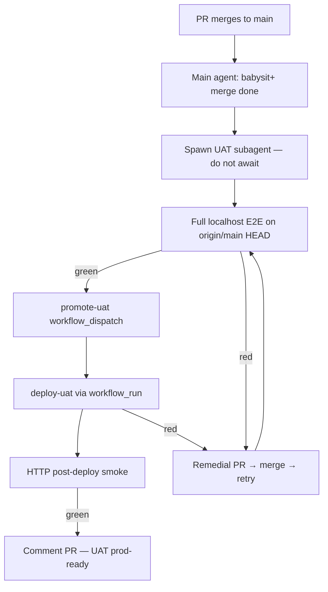

# UAT agent babysit

Per-merge UAT promotion owned by the **merge agent** via a fire-and-forget **UAT subagent**. Replaces the blocking Pre-UAT CI gate and UAT coordinator queue.

**Related:** [uat-promote-manual.md](./uat-promote-manual.md) · [uat-deploy-tiers.md](./uat-deploy-tiers.md) · [babysit-plus SKILL](../../.cursor/skills/babysit-plus/SKILL.md) §8

---

## Flow



| Role | Owns |
|------|------|
| **Main agent** (merge) | PR CI, merge, spawn UAT subagent, continue next work |
| **UAT subagent** | E2E → tag → deploy → remedial loop until green or retry cap |
| **Human** | Manual tag + `deploy-uat` dispatch when agents stall — see [uat-promote-manual.md](./uat-promote-manual.md) |

---

## Main agent (after merge)

1. Verify merge commit on `origin/main` (`gh pr view --json mergeCommit`).
2. Post PR comment with merge SHA and that UAT babysit started.
3. Spawn UAT subagent with:
   - `merge_sha`, `pr_number`, `pr_url`
   - `plan_id` / `phase_id` when in execute-plan
4. **Do not await** the subagent — advance to next phase or end session.

```bash
# Example spawn context (orchestrator passes to subagent)
./scripts/agent-uat-babysit.sh \
  --merge <merge-sha> \
  --pr <n> \
  --pr-url <url> \
  --ref "plan:uat-agent-babysit-5641 phase-1"
```

---

## UAT subagent contract

### Preflight

```bash
git fetch origin main
git checkout <merge-sha>   # must match origin/main HEAD at start
sudo pg_ctlcluster 16 main start
```

If `origin/main` advanced during spawn, **rebase intent**: run babysit on latest `main` HEAD (the subagent owns blocking E2E on current `main`, not only failures from its PR).

### Steps

1. **Full localhost E2E** — all 11 CI shards (`scripts/agent-uat-babysit.sh` runs them sequentially or via `npm run test:ci-shard`).
2. **Promote** — `scripts/ci/trigger-promote-uat.sh --commit <sha> --pr <n>`.
3. **Wait deploy** — `scripts/ci/wait-uat-deploy.sh --tag <uat-tag>` until `prod-ready` green or timeout.
4. **Comment** on PR with outcome (tag, deploy run URL, smoke result).

### On E2E or deploy failure

| Attempt | Action |
|---------|--------|
| 1–3 | Open remedial PR, babysit+ merge, re-run from step 1 on latest `main` |
| 4+ | Stop — comment PR + control issue with failure summary; human uses [manual promote](./uat-promote-manual.md) |

**Retry cap:** `UAT_BABYSIT_MAX_ATTEMPTS=3` (default). One remedial burst per attempt.

### Ownership rule

Fix **blocking E2E on `main`** regardless of which PR introduced the failure. The next merge agent uses the same rule — self-healing over subsequent merges.

### Concurrency

- **One active UAT babysit per repo** — if a subagent is already running, the newer merge posts a comment and exits (latest `main` wins on the next spawn).
- Integration-branch merges: spawn UAT babysit only on **final merge to `main`**, not intermediate integration PRs.

### Forbidden

| Anti-pattern | Why |
|--------------|-----|
| Main agent polls `deploy-uat` | Blocks next phase (~45–60 min) |
| Skip E2E and tag directly | Regresses quality gate to PR smoke only |
| Weaken CI or smoke gates | Policy violation |

---

## Integration with execute-plan

- Phase gate = **merge-done** (unchanged).
- UAT babysit spawn = babysit+ §8 (replaces `uat_queue_runtime.js enqueue`).
- **No** `barrier-check` or coordinator preflight.
- UAT failure does **not** halt execute-plan — subagent or next merge agent heals `main`.

---

## Key files

| Path | Role |
|------|------|
| `scripts/agent-uat-babysit.sh` | Subagent entry — E2E, promote, wait |
| `scripts/ci/trigger-promote-uat.sh` | `gh workflow run` for promote-uat |
| `scripts/ci/wait-uat-deploy.sh` | Poll deploy-uat / prod-ready |
| `.cursor/skills/babysit-plus/SKILL.md` | §8 spawn contract |
| `.github/workflows/promote-uat.yml` | `workflow_dispatch` tag creation |
| `.github/workflows/deploy-uat.yml` | Deploy + HTTP smoke |
