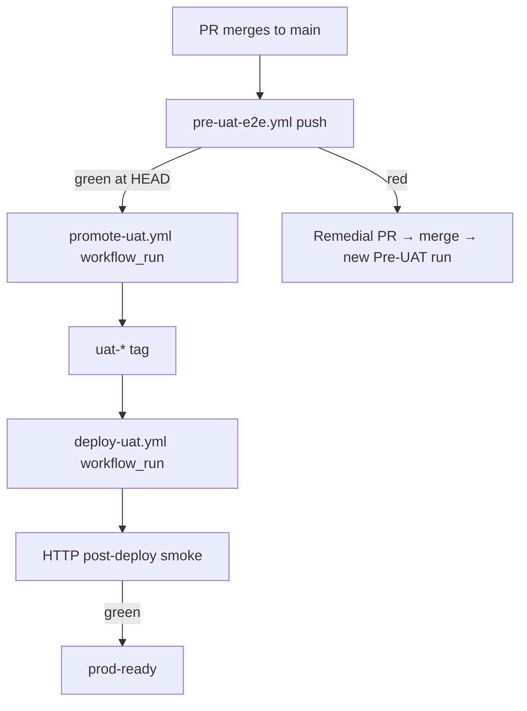

# UAT agent babysit (manual ops only)

**Default path:** CI owns promotion — merge to `main` triggers `pre-uat-e2e.yml` →
`promote-uat.yml` → `deploy-uat.yml`. See [uat-deploy-tiers.md](./uat-deploy-tiers.md).

This doc and `scripts/agent-uat-babysit.sh` are for **manual localhost replay** when
Actions is unavailable or you need to debug E2E before a manual promote dispatch.

**Related:** [uat-promote-manual.md](./uat-promote-manual.md) · [uat-deploy-tiers.md](./uat-deploy-tiers.md)

---

## CI flow (default)



| Role | Owns |
|------|------|
| **GitHub Actions** | Pre-UAT E2E, promote tag, deploy, prod-ready |
| **Merge agent** | PR CI + merge only — **no** UAT spawn or deploy polling |
| **Human** | Manual tag + `deploy-uat` / `promote-uat` dispatch — [uat-promote-manual.md](./uat-promote-manual.md) |

---

## Manual ops script

When you need localhost E2E outside CI:

```bash
./scripts/agent-uat-babysit.sh \
  --merge <merge-sha> \
  --pr <n> \
  --pr-url <url> \
  --ref "manual-ops"
```

The script:

1. Runs full localhost E2E (11 shards) on the merge commit.
2. On green → dispatches `promote-uat.yml` via `scripts/ci/trigger-promote-uat.sh`.
3. Waits for deploy + HTTP smoke; comments on the PR.

**Do not** use as the default post-merge path — CI Pre-UAT replaces per-merge agent spawn.

---

## Removed (Jul 2026)

- UAT coordinator dispatch workflow
- UAT queue health workflow
- Queue ledger promote hold (`evaluate-promote-hold`)
- Mandatory UAT subagent spawn from babysit+ / execute-plan

Historical: `docs/agent-efficiency/uat-coordinator-plan.md`, `docs/e2e/uat-waf-queue-lessons.md`.
