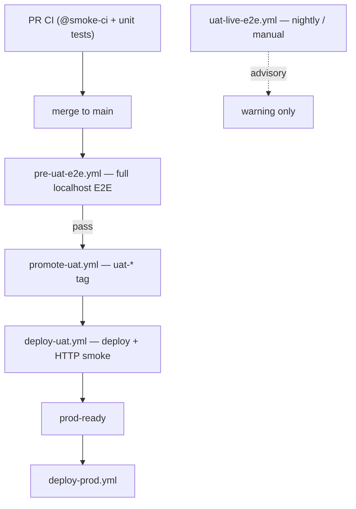

# UAT deploy tiers

Single source of truth for the UAT release pipeline after the pre-E2E refactor (Jul 2026).

**Related:** [ci-cd-gates.md](../ci-cd-gates.md) · [promotion-contract.md](../promotion-contract.md) · [uat-waf-queue-lessons.md](./uat-waf-queue-lessons.md)

---

## Pipeline overview

| Tier | Workflow | Blocking? | WAF exposure |
|------|----------|-----------|--------------|
| **PR** | `ci.yml` (`@smoke-ci`) | Yes (via `ci-gate`) | None |
| **1 — Pre-UAT E2E** | `pre-uat-e2e.yml` | Yes (gates tagging) | None |
| **2 — UAT deploy** | `deploy-uat.yml` (HTTP smoke) | Yes (`prod-ready`) | Low (health curl) |
| **3 — Live UAT** | `uat-live-e2e.yml` | **No** (advisory) | High (browser + Tiger Protect) |

---

## Tier 1: Pre-UAT E2E (`pre-uat-e2e.yml`)

**Trigger:** every push to `main`.

**Concurrency:** `pre-uat-e2e` group, `cancel-in-progress: false` — rapid merges queue; each run tests **latest `origin/main` HEAD** at job start.

**Bundling:** if `main` advances during a run, `gate-summary` may succeed without tagging; `promote-uat` skips stale SHAs (`stale_pre_uat_head`) so the queued run promotes latest HEAD only.

**Jobs:** resolve HEAD → `build-web` artifact → 11-shard localhost Playwright (`_reusable-e2e-local.yml`).

**On success:** `promote-uat.yml` runs via `workflow_run`.

**On failure:** no UAT tag; UAT coordinator may dispatch from `uat-coordinator-dispatch.yml`.

---

## Tier 2: UAT deploy (`deploy-uat.yml`)

**Trigger:** `uat-*` tag or `workflow_run` after promote.

**Gates for `prod-ready`:**

1. Build Flutter web + deploy (FTP/SSH)
2. HTTP post-deploy smoke (`scripts/uat-post-deploy-smoke.sh`)
3. Live migration status (when SSH collects it)

**Does not run:** full localhost E2E, live `@smoke-uat`, or WAF browser warmup.

### HTTP smoke contract (`uat-post-deploy-smoke.sh`)

| Allowed | Forbidden |
|---------|-----------|
| `GET /backend/health` | Any `/backend/api/auth/*` |
| `GET /landing` (priming) | Playwright / `passHostingWaf` |
| `GET /backend/` root | |

---

## Tier 3: Live UAT E2E (`uat-live-e2e.yml`)

**Trigger:** cron `0 2 * * *` UTC + `workflow_dispatch`.

**Entry:** `scripts/ci/run-live-uat-gate.sh` (warmup-uat + @smoke-uat, single Playwright process).

**Failure:** workflow warning only — **does not block promotion**.

**WAF rules:** see [uat-waf-queue-lessons.md](./uat-waf-queue-lessons.md) — one WAF challenge per run; persist cookies across contexts; no per-test `resetHostingWafSession`.

---

## Promotion semantics

| Event | Ledger / promotion |
|-------|-------------------|
| Pre-UAT E2E pass | `promote-uat` creates `uat-*` tag |
| Deploy + HTTP smoke pass | `prod-ready` green → PROD |
| Pre-UAT E2E fail | No tag; coordinator for code failures |
| Live UAT E2E fail (nightly) | Advisory only |
| HTTP smoke WAF | `infra_failed` if classified — does not freeze queue head |

**Removed:** `uat-promote-catchup.yml`, deploy cadence (`UAT_DEPLOY_MIN_INTERVAL_MINUTES`), full-E2E cadence at deploy (`UAT_FULL_E2E_MERGE_THRESHOLD`).

---

## Forbidden regressions

1. `push: main` trigger on `promote-uat.yml` (must stay `workflow_run` from Pre-UAT E2E)
2. Curl or Node auth warmup in deploy smoke
3. `@smoke-uat` or full E2E shards inside `deploy-uat.yml`
4. `resetHostingWafSession()` in live smoke fixtures
5. Reintroducing deploy or E2E cadence skip logic

---

## Key files

| Concern | Path |
|---------|------|
| Pre-UAT workflow | `.github/workflows/pre-uat-e2e.yml` |
| Promote (post-E2E) | `.github/workflows/promote-uat.yml` |
| Light deploy | `.github/workflows/deploy-uat.yml` |
| Advisory live E2E | `.github/workflows/uat-live-e2e.yml` |
| HTTP smoke | `scripts/uat-post-deploy-smoke.sh` |
| Prod-ready gates | `scripts/ci/assert-uat-gates.sh` |
| Live WAF gate | `scripts/ci/run-live-uat-gate.sh` |
| Resolve test SHA | `scripts/ci/resolve-pre-uat-e2e-sha.sh` |
