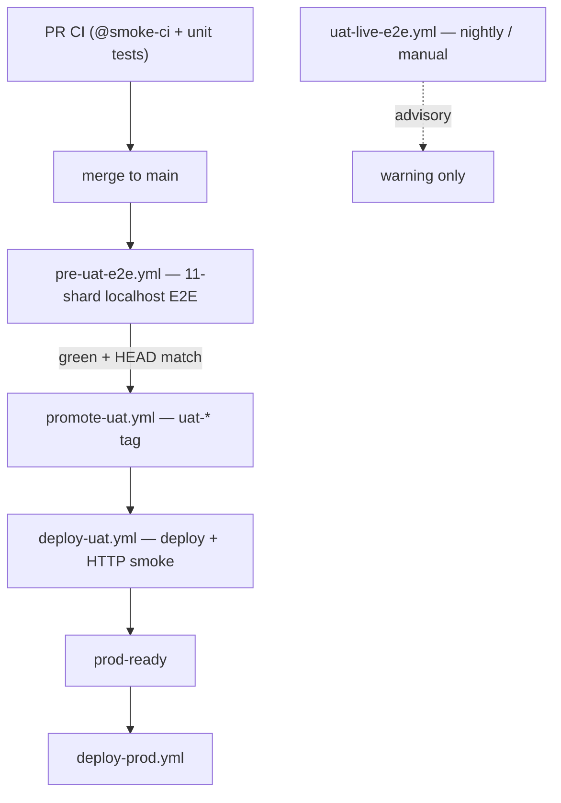

# UAT deploy tiers

Single source of truth for the UAT release pipeline (CI-driven, Jul 2026).

**Related:** [ci-cd-gates.md](../ci-cd-gates.md) · [promotion-contract.md](../promotion-contract.md) · [uat-promote-manual.md](./uat-promote-manual.md)

---

## Pipeline overview

| Tier | Workflow | Blocking merge? | Gates UAT deploy? |
|------|----------|-----------------|-------------------|
| **PR** | `ci.yml` (`@smoke-ci`) | Yes (via `ci-gate`) | — |
| **1 — Pre-UAT E2E** | `pre-uat-e2e.yml` on `push: main` | **No** (async) | Yes |
| **2 — UAT deploy** | `deploy-uat.yml` (HTTP smoke) | — | Yes (`prod-ready`) |
| **3 — Live UAT** | `uat-live-e2e.yml` | **No** (advisory) | No |

**Throttle:** only the **latest green E2E at `origin/main` HEAD** promotes. If `main` advances during a run, that run skips promote; the queued run for the newer HEAD is authoritative.

**Ops replay:** `workflow_dispatch` on `pre-uat-e2e.yml` or `promote-uat.yml` — see [uat-promote-manual.md](./uat-promote-manual.md).

---

## Tier 1: Pre-UAT localhost E2E

**Trigger:** every push to `main` (queued via `concurrency: pre-uat-e2e`).

**Steps:** resolve `origin/main` HEAD → build web → 11-shard Playwright → gate-summary.

**On green + HEAD match:** `promote-uat.yml` runs via `workflow_run` → `uat-*` tag → `deploy-uat.yml`.

**On failure:** no tag until a remedial merge fixes E2E. Agents (babysit+) open remedial PRs; CI re-runs automatically on the fix merge.

**Manual localhost replay:** `scripts/agent-uat-babysit.sh` (ops only — does not replace CI).

---

## Tier 2: UAT deploy (`deploy-uat.yml`)

**Trigger:** `workflow_run` after `promote-uat.yml` succeeds, `workflow_dispatch`, or `uat-*` tag push (PAT).

**Gates for `prod-ready`:**

1. Build Flutter web + deploy (FTP/SSH)
2. HTTP post-deploy smoke (`scripts/uat-post-deploy-smoke.sh`)
3. Live migration status (when SSH collects it)

**Does not run:** full localhost E2E, live `@smoke-uat`, or WAF browser warmup.

### HTTP smoke contract (`uat-post-deploy-smoke.sh`)

| Allowed | Forbidden |
|---------|-----------|
| `GET /backend/health` | Any `/backend/api/auth/*` |
| `GET /landing` (priming) | Playwright / `passHostingWaf` |
| `GET /backend/` root | |

**Basic Auth (optional):** when `UAT_BASIC_AUTH_ENABLED=true`, smoke proves anonymous `/backend/health` → **401** (or 403), then uses `curl -u` with `UAT_BASIC_AUTH_USER`/`PASSWORD` for all subsequent probes. Flag default **off** — localhost and pre-UAT E2E are unchanged. Canonical ops: [public-access.md](../ops/public-access.md).

---

## Tier 3: Live UAT E2E (`uat-live-e2e.yml`)

**Trigger:** cron `0 2 * * *` UTC + `workflow_dispatch`.

**Entry:** `scripts/ci/run-live-uat-gate.sh` (warmup-uat + @smoke-uat, single Playwright process).

**Failure:** workflow warning only — **does not block promotion**.

**WAF rules:** see [uat-waf-queue-lessons.md](./uat-waf-queue-lessons.md).

---

## Promotion semantics

| Event | Outcome |
|-------|---------|
| Pre-UAT E2E green + HEAD match | `uat-*` tag created |
| Deploy + HTTP smoke pass | `prod-ready` green → PROD |
| Pre-UAT E2E red on `main` | No tag until remedial merge |
| `main` advanced during E2E | Stale run skips promote; newer run decides |
| Live UAT E2E fail (nightly) | Advisory only |

**Removed:** UAT coordinator dispatch, queue ledger promote hold, per-merge agent UAT subagent as default path.

---

## Forbidden regressions

1. Making Pre-UAT E2E a **required** PR check (it is async post-merge only)
2. Curl or Node auth warmup in deploy smoke
3. `@smoke-uat` or full E2E shards inside `deploy-uat.yml`
4. `resetHostingWafSession()` in live smoke fixtures
5. Reintroducing UAT queue coordinator as promotion gate

---

## Key files

| Concern | Path |
|---------|------|
| Pre-UAT E2E | `.github/workflows/pre-uat-e2e.yml` |
| Promote tag | `.github/workflows/promote-uat.yml` |
| Light deploy | `.github/workflows/deploy-uat.yml` |
| Advisory live E2E | `.github/workflows/uat-live-e2e.yml` |
| HTTP smoke | `scripts/uat-post-deploy-smoke.sh` |
| Prod-ready gates | `scripts/ci/assert-uat-gates.sh` |
| Manual runbook | `docs/e2e/uat-promote-manual.md` |
| Ops localhost replay | `scripts/agent-uat-babysit.sh` |
