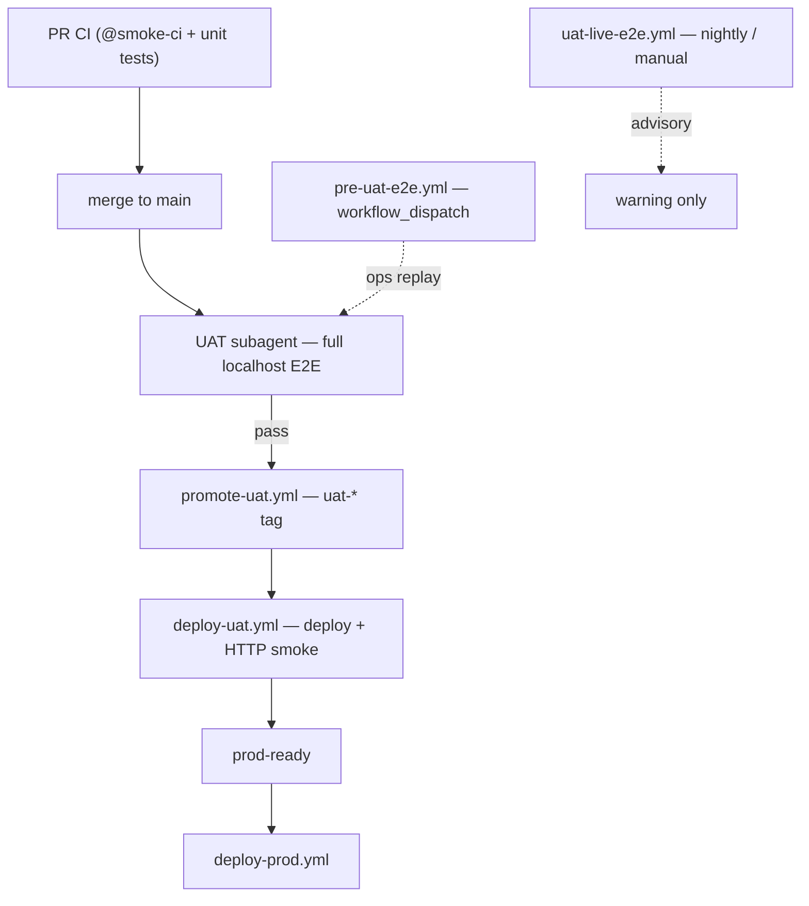

# UAT deploy tiers

Single source of truth for the UAT release pipeline after agent-babysit cutover (Jul 2026).

**Related:** [ci-cd-gates.md](../ci-cd-gates.md) · [promotion-contract.md](../promotion-contract.md) · [uat-agent-babysit.md](./uat-agent-babysit.md) · [uat-promote-manual.md](./uat-promote-manual.md)

---

## Pipeline overview

| Tier | Workflow / agent | Blocking? | WAF exposure |
|------|------------------|-----------|--------------|
| **PR** | `ci.yml` (`@smoke-ci`) | Yes (via `ci-gate`) | None |
| **1 — Agent E2E** | UAT subagent + `scripts/agent-uat-babysit.sh` | Yes (gates tagging) | None |
| **2 — UAT deploy** | `deploy-uat.yml` (HTTP smoke) | Yes (`prod-ready`) | Low (health curl) |
| **3 — Live UAT** | `uat-live-e2e.yml` | **No** (advisory) | High (browser + Tiger Protect) |

**Ops replay:** `pre-uat-e2e.yml` (`workflow_dispatch` only) — same 11-shard localhost E2E without blocking every merge.

---

## Tier 1: Agent localhost E2E

**Trigger:** merge agent spawns UAT subagent after PR lands on `main`.

**Steps:** latest `origin/main` HEAD → build web → 11-shard Playwright → `promote-uat` dispatch.

**On failure:** subagent opens remedial PR (retry cap); next merge agent may also heal drift.

**Manual:** [uat-promote-manual.md](./uat-promote-manual.md) · [uat-agent-babysit.md](./uat-agent-babysit.md)

---

## Tier 2: UAT deploy (`deploy-uat.yml`)

**Trigger:** `workflow_run` after `promote-uat.yml` succeeds, `workflow_dispatch`, or `uat-*` tag push (PAT).

**Gates for `prod-ready`:**

1. Build Flutter web + deploy (FTP/SSH)
2. HTTP post-deploy smoke (`scripts/uat-post-deploy-smoke.sh`)
3. Live migration status (when SSH collects it)

**Does not run:** full localhost E2E, live `@smoke-uat`, or WAF browser warmup.

### HTTP smoke contract (`uat-post-deploy-smoke.sh`)

| Allowed | Forbidden |
|---------|-----------|
| `GET /backend/health` | Any `/backend/api/auth/*` |
| `GET /landing` (priming) | Playwright / `passHostingWaf` |
| `GET /backend/` root | |

---

## Tier 3: Live UAT E2E (`uat-live-e2e.yml`)

**Trigger:** cron `0 2 * * *` UTC + `workflow_dispatch`.

**Entry:** `scripts/ci/run-live-uat-gate.sh` (warmup-uat + @smoke-uat, single Playwright process).

**Failure:** workflow warning only — **does not block promotion**.

**WAF rules:** see [uat-waf-queue-lessons.md](./uat-waf-queue-lessons.md).

---

## Promotion semantics

| Event | Outcome |
|-------|---------|
| Agent E2E pass + promote dispatch | `uat-*` tag created |
| Deploy + HTTP smoke pass | `prod-ready` green → PROD |
| Agent E2E fail (retry cap) | No tag until remedial or manual promote |
| Live UAT E2E fail (nightly) | Advisory only |
| Subagent death | Next merge agent or manual promote |

**Removed:** UAT coordinator, queue ledger promote hold, blocking `pre-uat-e2e` on `push: main`.

---

## Forbidden regressions

1. Blocking `push: main` on `pre-uat-e2e.yml` (use agent babysit or manual dispatch)
2. Curl or Node auth warmup in deploy smoke
3. `@smoke-uat` or full E2E shards inside `deploy-uat.yml`
4. `resetHostingWafSession()` in live smoke fixtures
5. Reintroducing UAT queue coordinator as promotion gate

---

## Key files

| Concern | Path |
|---------|------|
| Agent babysit | `scripts/agent-uat-babysit.sh` |
| Ops E2E replay | `.github/workflows/pre-uat-e2e.yml` |
| Promote (dispatch) | `.github/workflows/promote-uat.yml` |
| Light deploy | `.github/workflows/deploy-uat.yml` |
| Advisory live E2E | `.github/workflows/uat-live-e2e.yml` |
| HTTP smoke | `scripts/uat-post-deploy-smoke.sh` |
| Prod-ready gates | `scripts/ci/assert-uat-gates.sh` |
| Manual runbook | `docs/e2e/uat-promote-manual.md` |
