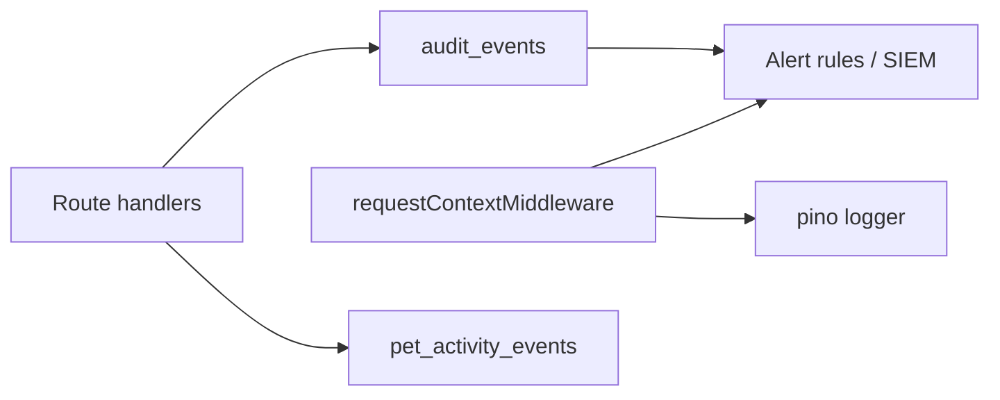

# Pet Care security event taxonomy (F-23)

Formal taxonomy for **alert-worthy** and **audit-retained** events in the Pet Care hardening programme. Implements discovery finding **F-23** — `requestContextMiddleware` exists but lacked a documented security-event model.

**Related code:**

| Layer | Module | Purpose |
|-------|--------|---------|
| HTTP access log | `server/middleware/requestContext.js` | Per-request `requestId`, method, path, status, duration |
| Structured app log | `server/lib/logger.js` (pino) | JSON logs; level via `LOG_LEVEL` |
| Persistent audit trail | `server/lib/audit.js` | `audit_events` table — security-sensitive mutations |
| Product activity | `server/lib/petActivity.js` | Org activity feed — **not** a security alert source |
| Retention defaults | `server/config/observability.js` | Hot/warm/cold audit retention tiers |

**Parent programme:** [README.md](./README.md) · Discovery: [hardening-discovery.md](../../domains/pet_care/changes/hardening-discovery.md) §F-23

---

## Event layers (do not conflate)



| Layer | Storage | Security use | Alert? |
|-------|---------|--------------|--------|
| **Request context** | Log stream only | Abuse detection, 5xx spikes, latency | Rate-based on 401/403/429/5xx |
| **Audit events** | PostgreSQL `audit_events` | Accountability, forensics, compliance | Per-action rules below |
| **Pet activity** | PostgreSQL product table | UX / org dashboards | No — product telemetry only |

Every audit row should correlate to HTTP traffic via shared `request_id` (`auditContextFromReq` copies `req.requestId`).

---

## Severity tiers

| Tier | Response time | Examples |
|------|---------------|----------|
| **P0 — Critical** | Page on-call immediately | Mass account deletion, credential stuffing success spike, suspected data exfiltration |
| **P1 — High** | Review within 1 hour | Repeated `auth.login_failed`, permission grant to sensitive role, share token abuse |
| **P2 — Medium** | Daily review | Single failed login bursts, password reset storms, unusual data export |
| **P3 — Low** | Weekly / dashboard | Routine CRUD audit volume, profile edits, health entry mutations |

---

## HTTP signals (`requestContextMiddleware`)

Logged on API `finish` for paths under `/api/`, `/backend/api/`, `/server/api/`:

```json
{
  "requestId": "<uuid>",
  "method": "GET",
  "path": "/backend/api/pets/...",
  "status": 403,
  "durationMs": 42
}
```

### Alert-worthy HTTP patterns

| Pattern | Tier | Suggested threshold (UAT/prod) |
|---------|------|--------------------------------|
| `status >= 500` rate by route | P1 | >5/min on single route |
| `status` 401/403 spike by IP | P1 | >20/min same IP |
| `status` 429 (rate limit) | P2 | >50/hour per IP on `/uploads` or API |
| `durationMs` p99 | P2 | >3s sustained 5 min on auth or pet routes |
| Missing `X-Request-Id` on inbound | P3 | Info only — middleware generates one |

Non-API paths (static Flutter, `/uploads`) are **not** covered by request context logging today — monitor nginx/WAF or add path-specific logging if health-file abuse is suspected (see F-01 remediation).

---

## Audit event taxonomy (`audit_events.action`)

Canonical `action` strings use dot-separated namespaces: `<domain>.<verb>` or `snake_case` for legacy org/foster events.

### Authentication & session (P0–P1)

| `action` | `resource_type` | Tier | Alert when |
|----------|-----------------|------|------------|
| `auth.login_failed` | `user` | P1 | >10 failures / 15 min / IP or email hash |
| `auth.login` | `user` | P3 | Baseline only |
| `auth.signup` | `user` | P2 | Spike vs 7-day median |
| `auth.logout` | `session` | P3 | — |
| `auth.token_refresh` | `session` | P2 | >30/min per user |
| `auth.password_changed` | `user` | P1 | Any success after `login_failed` burst |
| `auth.password_reset_requested` | `user` | P2 | >5/hour per email |
| `auth.password_reset_completed` | `user` | P1 | Without prior request in window |
| `auth.account_deletion_requested` | `user` | P1 | Any |
| `auth.account_deleted` | `user` | P0 | Any — verify cascade (F-12) |
| `auth.data_export` | `user` | P1 | >3/day per user |

**Source:** `server/routes/auth/sessionRouter.js`, `passwordRouter.js`, `profileRouter.js`

### User profile (P2–P3)

| `action` | Tier | Alert when |
|----------|------|------------|
| `user.profile_updated` | P3 | — |
| `user.photo_updated` | P3 | — |

### Pet lifecycle (P1–P3)

| `action` | Tier | Alert when |
|----------|------|------------|
| `pet.created` | P3 | — |
| `pet.updated` | P3 | — |
| `pet.deleted` | P1 | Bulk delete >10/hour per org |
| `pet.photo_updated` | P3 | — |
| `pet.data_deleted` | P0 | GDPR/lifecycle — any |
| `weight_entry.created` / `.updated` / `.deleted` | P3 | — |

**Source:** `server/routes/pets/*`, `server/lib/petDataLifecycle.js`, `server/routes/weightEntries.js`

### Health & clinical data (P2–P3)

| `action` | Tier | Alert when |
|----------|------|------------|
| `health_entry.marked_complete` | P3 | — |
| `health_entry.completion_undone` | P2 | Unusual undo rate |
| `health_entry.closed` / `.reopened` | P3 | — |
| `health_entry.iteration_skipped` / `.iteration_unskipped` | P3 | — |
| `health_occurrence.completed` / `.skipped` / `.skip_missed` | P3 | — |

Health CRUD also emits **pet activity** `health_log` / `document_upload` — use audit rows for security, activity for product UX.

**Source:** `server/routes/healthEntries/*`

### Timeline (P3)

| `action` | Tier |
|----------|------|
| `pet_timeline_entry_created` | P3 |
| `pet_timeline_entry_updated` | P3 |
| `pet_timeline_entry_deleted` | P2 |

**Source:** `server/routes/timeline/index.js`

### Organisation permissions & foster (P1–P2)

| `action` | Tier | Alert when |
|----------|------|------------|
| `permission_granted` | P1 | `manage_pets` or org-admin bundles |
| `permission_revoked` | P2 | — |
| `bundle_preset_applied` | P1 | Admin-tier presets |
| `org_tier_defaults_updated` | P1 | Any |
| `foster_agreement_withdrawn` | P2 | — |
| `foster_visibility_changed` | P2 | — |
| `member_visibility_changed` | P2 | — |
| `fostering_session_created` | P3 | — |
| `session_start_confirmed_shelter` / `_foster` | P2 | — |
| `session_return_confirmed` | P3 | — |

**Source:** `server/lib/orgPermissions.js`, foster org routers, `server/lib/fosterSessions.js`

---

## Outcomes and metadata

Audit events support `outcome`: `success` | `failure` (default `success`). **Alert on `failure`** for auth and permission actions.

`metadata` must never contain secrets, tokens, or health payloads. Safe keys are enforced per route (see `SAFE_AUDIT_METADATA_KEYS` in org permission audit reads).

`retention_tier`: `hot` (default) → `warm` → `cold` per `server/config/observability.js`.

---

## Correlation checklist

When investigating an alert:

1. Start from `audit_events.request_id` or HTTP log `requestId`
2. Join to `audit_events` on `request_id` + time window
3. Pseudonymized actor: `pseudonymizeActor(userId)` in exports — never log raw user id in external SIEM without policy
4. Cross-check capability denials in app logs (403 without audit row = authorization layer only)

---

## Gaps and follow-ups (not in F-23 scope)

| Gap | Finding | Tracking |
|-----|---------|----------|
| Share link create/revoke not in audit table | F-03/F-04 | Future audit hooks on `sharing.js` |
| Static `/uploads` access not request-logged | F-01/F-16 | WAF or middleware extension |
| No automated alert rules in repo | — | Ops/SIEM configuration outside codebase |
| ESLint/CI observability jobs | F-17/F-20 | Debt issue #1025 |

---

## Verification

This document is **documentation-only** for F-23. No runtime behaviour change.

- [ ] On-call runbook links this doc from programme README
- [ ] Future PRs adding `logAuditEventSafe` must register `action` in this taxonomy
- [ ] SIEM rules reference `action` strings exactly as emitted
