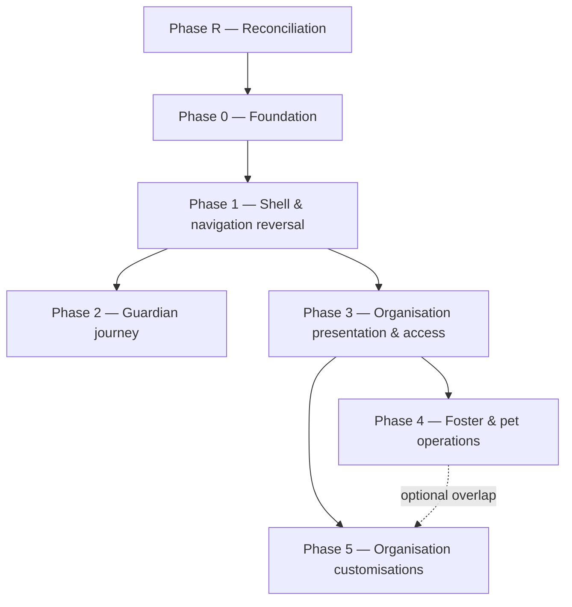

# Experience program — delivery plan (Phase R + 0–5)

**Status:** Ready to start  
**Last updated:** 2026-07-25  
**Parent:** [`program-contract.md`](program-contract.md) · [`decisions-log.md`](decisions-log.md)

Defines **sequential gates**, **sprint boundaries**, and **branch naming** for delivery. Phase
docs (linked below) own detailed scenarios and screens; this doc owns **order and sprint
breakdown only** — same split of responsibility as
`docs/fostering-platform/roadmap-delivery-plan.md`.

**Default delivery mode (D33): single agent, sequential, direct-to-`main` per phase.** Each phase
below is small enough to be one agent's focused work, verified end-to-end before the next phase
starts. `/spawn-sprint-agents` remains available if a phase turns out to have genuinely disjoint
parallel tracks (flagged per-phase below), but is not assumed.

---

## Dependency graph

Phase 2 (Guardian) and Phase 3 (Organisation) both depend only on Phase 1's shell, not on each
other — they could run in either order or, if desired later, in parallel on disjoint paths
(`flutter_app/lib/features/experience/` guardian-home widgets vs
`flutter_app/lib/features/organization/` screens). Default plan still sequences them (Guardian
first — smaller, proves the shell + notification model before the larger Organisation IA rework).

---

## Branch naming per phase

| Phase | Branch | Base |
|---|---|---|
| R | `cursor/experience-reconciliation-<suffix>` | `main` |
| 0 | `cursor/experience-foundation-<suffix>` | `main` |
| 1 | `cursor/experience-nav-shell-<suffix>` | `main` |
| 2 | `cursor/experience-guardian-journey-<suffix>` | `main` |
| 3 | `cursor/experience-org-presentation-<suffix>` | `main` |
| 4 | `cursor/experience-foster-pet-ops-<suffix>` | `main` |
| 5 | `cursor/experience-org-customisations-<suffix>` | `main` |

Each phase may need more than one PR (see sprint breakdown) — use the atomic-PR "stacked PRs"
pattern (prep → behaviour → BDD/E2E) against the **same** phase branch name pattern, or split into
`-part2` suffixed branches if a phase runs long. All phases target `main` directly per D33
(single-agent, single-domain) — no integration branch needed unless a phase is later split into
parallel agents.

---

## Phase R — Reconciliation

**Doc:** [`phase-r-reconciliation.md`](phase-r-reconciliation.md)  
**Goal:** Close out conflicting prior work before new implementation starts. No product code
changes beyond doc headers and BDD tags.

| Sprint | Deliverable |
|---|---|
| R.1 | Header-tag `docs/design/navigation-v2.md` superseded (D2); link forward to this program |
| R.2 | Close `cursor/org-mode-nav-phase3-shell-acf1` branch + control issue #262 (D6) with a comment explaining supersession; delete the stale branch and its sibling plan-snapshot branches once closed |
| R.3 | Tag `experience_navigation.feature` (one scenario) and `organisation_pet_timeline.feature` (feature-level) `@legacy` (G0 §14.2 pattern) — do not delete yet; `notifications.feature` needs no `@legacy` tag (see `program-contract.md` §6.1) |
| R.4 | Publish this `docs/experience-program/` folder itself (this PR) |

**Exit criteria:** decisions log + contract + roadmap merged to `main`; acf1 branch/issue closed;
`@legacy` tags in place; no BDD coverage regression (tags don't remove scenarios yet).

---

## Phase 0 — Foundation

**Doc:** [`phase-0-foundation.md`](phase-0-foundation.md)  
**Goal:** Contracts and shared primitives every later phase depends on — no visible UI change yet.

| Sprint | Deliverable |
|---|---|
| 0.1 | `experience_settings_screen.dart` content audit (Q3) — mapping doc of every existing row → {Account / org edit / self-card} |
| 0.2 | Notification schema migration: `kind`, `priority`, `resolved_at` columns + backfill existing rows `kind='care'` |
| 0.3 | `NotificationKind` enum + `notification.type` → default `kind` mapping table (Flutter + Node) |
| 0.4 | Shared "dashboard section" widget (title, optional header action, preview slot, end link) — one component reused by all three Guardian sections and the Organisation section cards |
| 0.5 | Permission-key helper scaffolding (`hasPermission()`, bundle preset constants) wired to existing G0 defaults only — no new table yet (table lands in Phase 3) |

**Exit criteria:** shared widget has a widget test + Storybook-style preview screen (or existing
pattern equivalent); notification migration has up/down test; zero visual change on any existing
screen.

---

## Phase 1 — Shell & navigation reversal

**Doc:** [`phase-1-navigation.md`](phase-1-navigation.md)  
**Goal:** Ship the reversed navigation model end-to-end. This is the highest-risk phase (touches
every authenticated screen's chrome) — do it in full before Guardian/Organisation content changes.

| Sprint | Deliverable |
|---|---|
| 1.1 | New drawer: Guardian / Organisation (top), Account (bottom-pinned), light theme, plum/green/neutral accents |
| 1.2 | Header rework: hamburger (dashboards) / back arrow (sub-screens) + persistent bell; remove nav-v2's Home button |
| 1.3 | Bell + unified notification slide-over (kind chips, combined badge) — implements program-contract §3 |
| 1.4 | New `/account` route + Account dashboard (profile, help/FAQ, contact, legal, about, sign out, cross-org personal prefs) |
| 1.5 | Retire `/g/notifications`, `/o/notifications`, per-mode Settings screens; route content per the Phase 0.1 audit |
| 1.6 | `@legacy`-tag and replace the one drawer-switch scenario in `experience_navigation.feature`; extend `notifications.feature` with kind-chip/unified-badge/resolved-state scenarios (no deletions there); new Playwright specs |

**Exit criteria:** no drawer item routes to Events/Vets; single bell badge visible on every
authenticated screen; `/account` reachable and content-complete per the audit; BDD/E2E green;
`/ui-design-deep` review done.

---

## Phase 2 — Guardian journey

**Doc:** [`phase-2-guardian-journey.md`](phase-2-guardian-journey.md)

| Sprint | Deliverable |
|---|---|
| 2.1 | `/g/home` rebuilt as 3 sections (My Pets, Upcoming Pet Events, My Vets) using the Phase 0.4 shared section widget |
| 2.2 | Pending inboxes migrated to administrative notifications (D10); dashboard banners removed only after 2.3 lands |
| 2.3 | New pet card visual (rounded rect, status bar, responsive 2/3-column) — shared `pet_card.dart` update, verified on all 3 call sites (guardian dashboard, org dashboard, org pets screen) |
| 2.4 | `/g/events` reframed as health/weight/other due-item list (D17); "Add an event" quick-add sheet |
| 2.5 | Vet display-first detail screen + separate edit screen (D24) |
| 2.6 | Bulk share wrapper on All Pets screen (D23) |
| 2.7 | Pet timeline (D18): custody-segment + session + manual-entry composite on pet detail; `family_events` data migration + retirement (D19) |
| 2.8 | Rewrite `organisation_pet_timeline.feature` → `pet_timeline.feature`; new `guardian_dashboard.feature` |

**Exit criteria:** dashboard shows no full mixed feed; pending items surface only via
notifications; pet timeline renders for at least one guardian-owned and one org-fostered pet in
manual QA; BDD/E2E green.

---

## Phase 3 — Organisation presentation & access control

**Doc:** [`phase-3-organisation-presentation.md`](phase-3-organisation-presentation.md)  
**Largest phase — candidate for `/spawn-sprint-agents` split if desired** (disjoint paths: Admin
Contacts screen vs Discover Organisations vs Pet screen tabs vs role/permission backend). Default
plan keeps it sequential single-agent per D33; flag to the user if scope proves too large for one
sitting.

| Sprint | Deliverable |
|---|---|
| 3.1 | `organizations` schema migration: discoverability fields, legal identifier fields, `is_discoverable` (D20, D21, D28) |
| 3.2 | `organization_permissions` table + `associate` role migration + bundle preset constants wired to real data (D13, D14) |
| 3.3 | `GET /organizations/discover` public endpoint + rate limiting; `OrgDiscoveryList` reusable widget; Discover section on `/o/orgs` |
| 3.4 | `organization_detail_screen.dart` decomposition into modular section cards (`/split-flutter-screen`) |
| 3.5 | Organisation Presentation screen: cover+logo hero, legal info block (localised labels), contact block |
| 3.6 | Admin Contacts dedicated screen: directory + self-card + visibility prefs (D26, D31) — split off from `OrganizationPeopleSection` |
| 3.7 | Legal & Documents read-only slide-over (reuses G1 template storage with a new `is_public` flag as its data source) |
| 3.8 | Pet screen tabs (Need attention / In foster / Adopted / All) + filters (Name / Fostered by / Shadow / Rainbow bridge) |
| 3.9 | Permission audit events (D16) wired to every new grant/revoke/role-change call site |
| 3.10 | Extend `organisation_management.feature`; new `organisation_discovery.feature`, `organisation_permissions.feature`, `admin_contacts.feature`, `pet_screen_filters.feature` |

**Exit criteria:** no single screen mixes public identity + internal directory + configuration;
Discover Organisations returns real data pre-login (manual curl/Playwright check, no auth header);
permission checks for every new admin action verified in Jest with all 4 wire roles + at least one
bundle preset + one individual override.

---

## Phase 4 — Foster & pet operations

**Doc:** [`phase-4-foster-pet-operations.md`](phase-4-foster-pet-operations.md)  
**Goal:** This is the smallest phase because J1–J5 already ship most of the operational
substance. Scope is deliberately narrow: self-management privacy + the withdrawal flow +
threading the new permission bundles through existing foster/pet actions.

| Sprint | Deliverable |
|---|---|
| 4.1 | Foster self-management visibility columns (D26, D31) on `foster_profiles`/relationship: visible-to, address visibility, contact visibility |
| 4.2 | Foster self-card UI: visibility controls + notification prefs (reusing `notification_preferences`) |
| 4.3 | Agreement withdrawal flow: type-to-confirm UI, auto-pause of active/preparation sessions, urgent administrative notification to org admins (D30, D11) |
| 4.4 | Thread new permission bundles (Foster Admin / Pet Admin) through existing foster/pet action gates (add/confirm/pause/archive foster, add/edit pet, manage sessions) — replace any remaining `isOrgAdmin`-only checks on these specific actions with the new `hasPermission()` calls |
| 4.5 | Extend `foster_onboarding.feature`, `org_foster_and_adoption.feature`; new `foster_self_management.feature` |

**Exit criteria:** withdrawal flow tested end-to-end (type "withdraw", session auto-paused,
notification received by an org admin test account); no foster/pet action gate still reads a raw
role string where a permission key now exists.

---

## Phase 5 — Organisation customisations

**Doc:** [`phase-5-organisation-customisations.md`](phase-5-organisation-customisations.md)

| Sprint | Deliverable |
|---|---|
| 5.1 | Organisation Customisations screen shell, reached from org edit screen, Super Admin only (D25) |
| 5.2 | Surface existing J1/G1 template management (journey/document/agreement/email templates) under this new IA location — relocation, not rebuild |
| 5.3 | Roles & Permissions admin UI: bundle preset picker, individual override grant/revoke, audit log viewer (reads `audit_events` per §4.5) |
| 5.4 | Change-control note: freeze feature scope at sprint start per program-contract; this screen is where that governance becomes visible to Super Admins (audit log viewer doubles as the "who changed what" surface) |

**Exit criteria:** Super Admin can apply a bundle preset and see it reflected immediately in
another member's effective permissions (verified via Jest + one manual QA pass); audit log shows
every grant/revoke with actor + timestamp.

---

## Recommended delivery order

1. **Sequential:** R → 0 → 1 (shell must be right before any content phase starts)
2. **Sequential (default):** 2 → 3 (Guardian first — smaller, proves notification model)
3. **Sequential:** 3 → 4 → 5 (each depends on the prior phase's schema/permission work)

**Never parallelize within a phase without an explicit ownership map** (`agent-coordination.mdc`)
— if Phase 3 is split, publish the ownership map in `docs/refactoring-log.md` before spawning.

---

## Merge policy for this program

Direct-to-`main` per phase PR (or per sprint, if a phase is stacked into multiple PRs), gated by
the existing `ci-gate / CI passed` + `Analyze JavaScript` required checks. No integration branch
unless a phase is later split across multiple agents (`agent-coordination.mdc` applies from that
point on).
