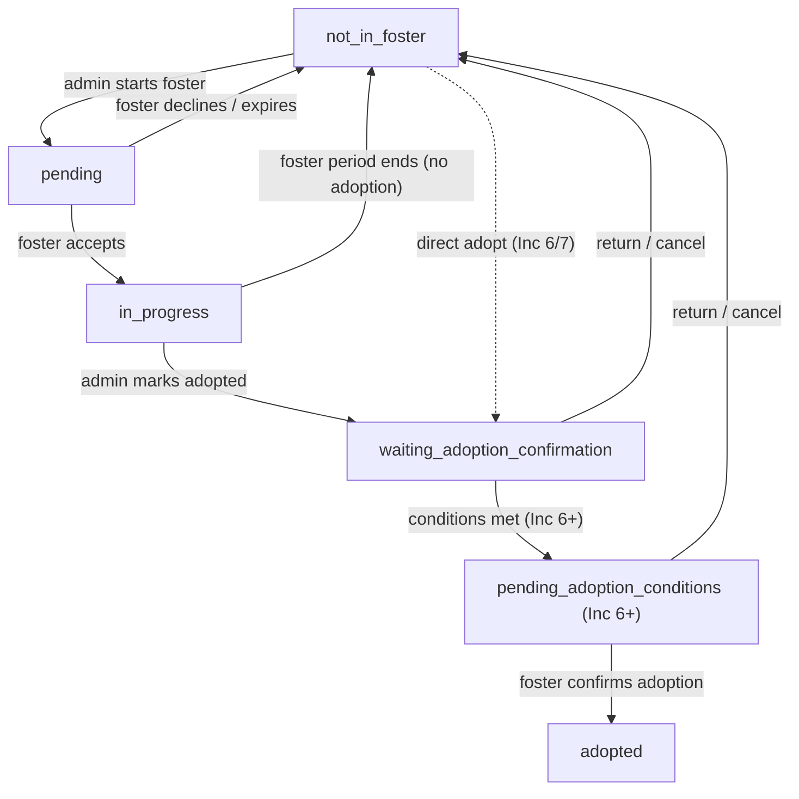

# Organization & fostering — delivery strategy

This document is the authoritative roadmap for org roles, pet custody, sharing,
transfer, and foster placements. It is updated each increment.

**Branch:** `cursor/org-fostering-6825` (reset from `main` after each merged PR).

**Canonical backend:** Node.js (`server/`). Dart/Shelf parity is not a blocker.

**Mobile portability:** All state changes are API-driven; calendar dates use
`YYYY-MM-DD` on the wire (`docs/calendar-dates.md`); email notifications can
later become push + deep links without changing core semantics.

---

## Glossary

| Term | Meaning |
|------|---------|
| **Super admin** | Org role: full control including edit/delete org. Multiple allowed; super admins can promote others. |
| **Admin** | Org role: manage members, pets, foster placements; cannot edit/delete org. |
| **Foster** | Org role: sees only pets they are fostering + org contact details. |
| **Owner** | `pets.user_id` — legal owner in the system. |
| **Shared** | `pet_access.role = shared` — collaborator via share link. |
| **Foster access** | `pet_access.role = foster` — day-to-day care during an active placement. |
| **Placement** | A foster period for one pet with a status lifecycle (see below). |

### Current roles (until increment 1)

| DB value | UI label |
|----------|----------|
| `super_user` | Super admin |
| `member` | Member (becomes **admin** in increment 1) |

---

## Foster placement lifecycle

**Locked decisions:**

- A foster parent may foster **multiple pets** at once.
- **Admins** are valid foster parents (included in picker).
- Declining a pending placement → `not_in_foster`.
- Non-adoption exits return to `not_in_foster` (org retains the pet); no separate `returned` status.
- At any point during the adoption process (`waiting` / `pending_adoption_conditions`), placement can return to `not_in_foster`.

**Deferred refinements (increment mapping):**

| Refinement | Target increment |
|------------|------------------|
| Pre-adoption conditions (e.g. neutered/spayed) before fully `adopted` | Inc 6 (core), Inc 7 (polish) |
| Foster direct adopt (skip fostering period) | Inc 6 or 7 |
| Non-app foster parents (org creates foster without user account) | Inc 3 (entity), Inc 4 (assign), Inc 5–6 (admin on behalf) |

---

## Permission matrix (target — after increment 1)

| Action | Super admin | Admin | Foster |
|--------|:-----------:|:-----:|:------:|
| Edit / delete org | ✓ | ✗ | ✗ |
| Invite / remove members | ✓ | ✓ | ✗ |
| Promote to super admin | ✓ | ✗ | ✗ |
| See all org pets | ✓ | ✓ | ✗ |
| See org contact | ✓ | ✓ | ✓ |
| Foster parent directory | ✓ | ✓ | ✗ |
| Start / manage placements | ✓ | ✓ | ✗ |
| Day-to-day pet care (fostered pet) | ✓ | ✓ | ✓ |
| Transfer ownership | ✓ | ✓ | ✗ |
| Share pet (as foster) | — | — | ✓ (Inc 5) |

---

## Increments

### Increment 0 — Foundation (this document + invite tidy) ✓ in progress

- Email-only org invites in Flutter (no invite-code / join-by-code UI).
- Document 501 stubs in `API.md`.
- No schema changes.

### Increment 1 — Three org roles

- Migration: `super_user` → `super_admin`, `member` → **`super_admin`** (all existing members promoted to avoid losing control in test data).
- Add `admin`, `foster` (+ pending variants).
- Permission guards + Jest matrix tests.
- Flutter role labels and invite picker.

**Locked:** Multiple super admins; super admin can promote to super admin.

### Increment 2 — User share → transfer ownership

- `POST /pets/:id/transfer` with pet-name confirmation.
- Former owner → `pet_access.shared` automatically.
- `archived_pets` audit row.

### Increment 3 — Foster membership + directory

- Foster invite role; foster sees org contact only.
- Admin **Foster parents** section (admins + fosters, pet counts).

### Increment 4 — Placement core (`not_in_foster` → `pending` → `in_progress`)

- `foster_placements` table (or extended `family_events` with `status`).
- Start foster UI; foster accept/decline; foster `pet_access`.
- Foster pet list shows org name.
- End foster period → `not_in_foster`.

### Increment 5 — Foster sharing

- Foster can create share links; still cannot transfer.

### Increment 6 — Adoption completion

- `in_progress` → `waiting_adoption_confirmation` → conditions (optional) → `adopted`.
- Foster confirm; ownership transfer on confirm.
- Return/cancel → `not_in_foster` at any adoption step.
- Direct adopt shortcut (refine in this increment).

### Increment 7 — Polish

- Foster directory with live pet assignments.
- PDF foster history.
- Retire remaining org/pet 501 stubs used in UI.
- Migrate legacy `family_events` placement rows if needed.

---

## API stubs (501)

See `API.md` § Not implemented. Flutter must not call these from primary workflows.

| Endpoint | Planned increment |
|----------|-------------------|
| `POST /organizations/join/:code` | Removed from UI (Inc 0); may never implement |
| `POST /organizations/:orgId/pets` | Inc 7 or via `POST /pets` + `organization_id` |
| `POST /organizations/:orgId/pets/:petId/transfer` | Inc 6/7 |
| `POST /pets/:id/transfer-to-org` | Inc 7 |
| `PUT /pets/:id/access/:userId/role` | Inc 5 or superseded by foster role |

---

## Portability notes (iOS / Android)

- Accept/decline placement: tokenised `POST` endpoints (same pattern as org email invites).
- No browser-only state; mobile clients use the same REST API.
- Dates: always calendar `YYYY-MM-DD`, never UTC midnight tricks.
- Notifications: email first; push can wrap the same deep-link targets later.
