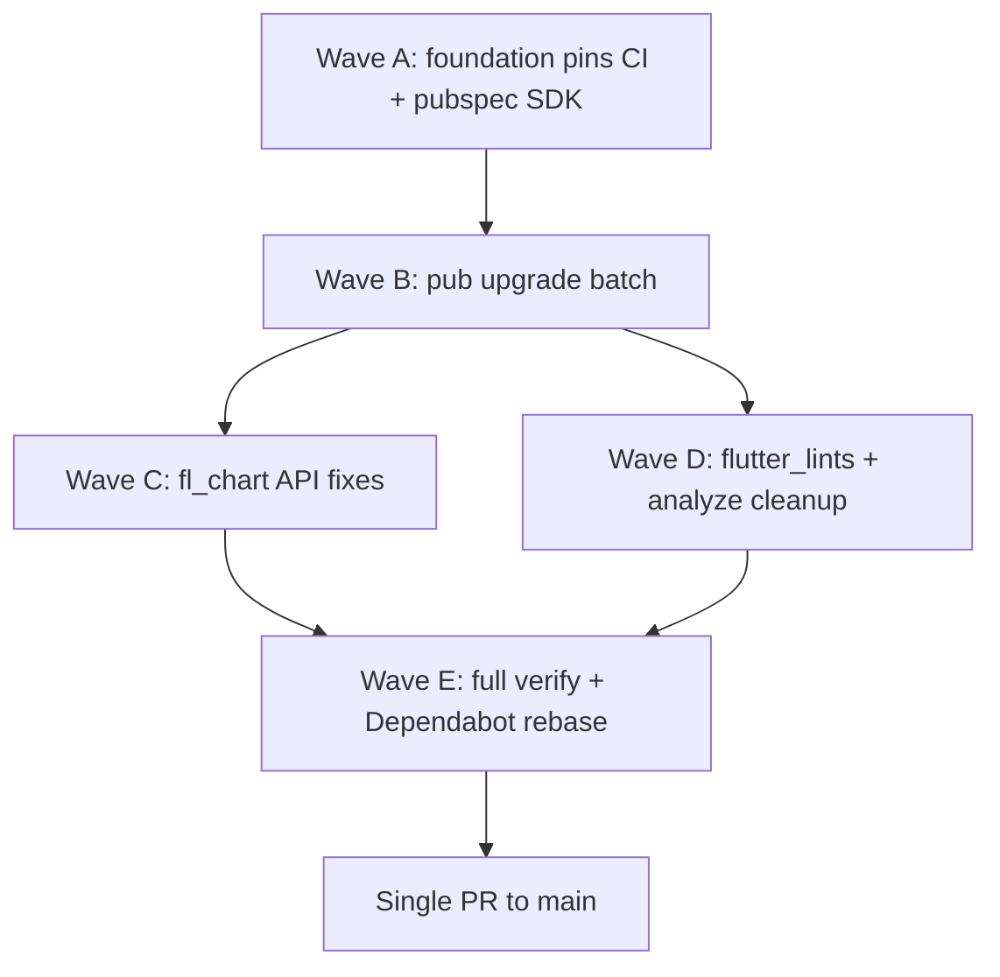

# Sprint 10 — Flutter 3.44 / Dart 3.12 toolchain upgrade

**Status:** Planned  
**Goal:** Move Agatha Track from **Flutter 3.32.0 / Dart 3.8.0** to **Flutter 3.44 / Dart 3.12**, unblock blocked Dependabot pub PRs, and keep CI + UAT deploy green.

**Integration branch:** `cursor/sprint-10-flutter-344-integration-c246`  
**Single PR:** integration → `main` when exit criteria met.

Companion: `docs/refactoring-log.md` · Skill: `/spawn-sprint-agents` · Verify: `./scripts/pre-push.sh`

---

## Why this sprint

| Current pin | Target | Unblocks |
|-------------|--------|----------|
| Flutter 3.32.0 | 3.44.0 | `fl_chart` 1.x (`vector_math` with `flutter_test`) |
| Dart 3.8.0 | 3.12.x | `pdf` 3.13, `printing` 5.15, `mockito` 5.7, `flutter_lints` 6 |
| `sdk: ^3.8.0` in `flutter_app/pubspec.yaml` | `^3.12.0` | pub resolution for above packages |
| `server/pubspec.yaml` `sdk: ^3.5.0` | `^3.12.0` | Dart analyze parity in CI |

**Out of scope (separate decision):** Babel 8 migration (`@babel/preset-env` 8, `babel-plugin-transform-import-meta` 3). Close or ignore those Dependabot PRs; Babel 7 + Jest 30 is working.

**Blocked Dependabot PRs to re-run after exit:** #77, #78, #79, #80, #81.

---

## Inventory — version pins to update

| Location | Current | Target |
|----------|---------|--------|
| `.github/workflows/_reusable-test.yml` | `FLUTTER_VERSION: '3.32.0'`, Dart `3.8.0` | `3.44.0`, `3.12.0` |
| `.github/workflows/_reusable-e2e-local.yml` | `3.32.0` | `3.44.0` |
| `.github/workflows/deploy-uat.yml` | `3.32.0` | `3.44.0` |
| `.github/workflows/deploy-prod.yml` | `3.32.0` | `3.44.0` |
| `flutter_app/pubspec.yaml` | `sdk: ^3.8.0` | `sdk: ^3.12.0` |
| `server/pubspec.yaml` | `sdk: ^3.5.0` | `sdk: ^3.12.0` |
| `AGENTS.md` | Flutter 3.32 / Dart 3.8 | Flutter 3.44 / Dart 3.12 |
| `README.md`, `e2e/README.md` | 3.32 / 3.8 references | 3.44 / 3.12 |
| Cloud agent image (`/opt/flutter/bin`) | 3.32.0 | **Operator:** rebuild env or document `flutter upgrade` path |

---

## Dependency upgrade batch (Wave B, after foundation)

Apply on integration after Wave A pins resolve `pub get`:

| Package | Current | Target | Risk |
|---------|---------|--------|------|
| `fl_chart` | ^0.69.2 | ^1.2.0 | **Medium** — 1 file + tests; `LineTouchTooltipData` API |
| `pdf` | ^3.11.2 | ^3.13.0 | Low — pet report + events PDF services |
| `printing` | ^5.13.4 | ^5.15.0 | Low — transitive with `pdf` |
| `flutter_lints` | ^5.0.0 | ^6.0.0 | Low–medium — new lint rules may surface warnings |
| `mockito` | ^5.4.5 | ^5.7.0 | Low — regenerate `*.mocks.dart` via `build_runner` |
| `build_runner` / `source_gen` | (lockfile) | let `pub upgrade` resolve | Low |

**`fl_chart` touch surface (small):**

- `flutter_app/lib/features/pet_profile/presentation/screens/widgets/weight_chart.dart`
- `flutter_app/test/.../weight_tracking_section_test.dart`

Audit for deprecated `tooltipRoundedRadius` → `tooltipBorderRadius` if analyzer flags it after bump.

**`pdf` / `printing` touch surface:**

- `flutter_app/lib/features/pet_profile/data/services/pet_report_*.dart` (8 files)
- `flutter_app/lib/features/health_tracking/data/services/events_pdf_service.dart`
- `flutter_app/lib/features/pet_profile/data/services/pdf_saver_mobile.dart`

---

## Dependency graph



| Phase | Serial / parallel | Reason |
|-------|-------------------|--------|
| A Foundation | **Serial, first** | CI + SDK constraints gate everything |
| B Pub batch | Serial on integration | One `pubspec.lock` / `server/pubspec.lock` |
| C fl_chart | Parallel with D | Disjoint paths |
| D lints | Parallel with C | `analysis_options.yaml` only if needed |
| E Verify | Serial, last | `./scripts/pre-push.sh` on integration tip |

---

## Agent ownership map

| Phase | Agent | Branch | Owns | Avoid |
|-------|-------|--------|------|-------|
| **A** | `foundation-toolchain` | `cursor/sprint-10-foundation-toolchain-c246` | `.github/workflows/*`, `flutter_app/pubspec.yaml` (SDK only), `server/pubspec.yaml` (SDK only), `AGENTS.md`, `README.md`, `e2e/README.md` | app lib code, lockfiles beyond `pub get` |
| **B** | `pub-upgrade` | `cursor/sprint-10-pub-upgrade-c246` | `flutter_app/pubspec.yaml` (deps), `flutter_app/pubspec.lock`, `server/pubspec.lock` | workflows |
| **C** | `fl-chart-migration` | `cursor/sprint-10-fl-chart-c246` | `weight_chart.dart`, `weight_tracking_section_test.dart` | other features |
| **D** | `lints-cleanup` | `cursor/sprint-10-lints-c246` | `analysis_options.yaml`, lint-driven fixes in `flutter_app/lib/**` | `server/`, `e2e/` |
| **E** | coordinator | integration branch | merge, `./scripts/pre-push.sh`, Dependabot PR rebases | — |

**Never parallelize:** `.github/workflows/`, both `pubspec.lock` files, same Dart source file.

---

## Wave A — Foundation (1 agent, merge first)

### Deliverables

1. Bump `FLUTTER_VERSION` to `3.44.0` in all four workflow files.
2. Bump `dart-lang/setup-dart` SDK to `3.12.0` in `_reusable-test.yml`.
3. Set `environment: sdk: ^3.12.0` in `flutter_app/pubspec.yaml` and `server/pubspec.yaml`.
4. Update docs (`AGENTS.md`, `README.md`, `e2e/README.md`).
5. Run locally (or on integration CI):
   ```bash
   cd flutter_app && flutter pub get
   cd server && dart pub get
   ```
6. Fix **only** pub-resolution blockers introduced by the SDK bump (do not batch dep upgrades yet).

### Exit criteria (Wave A)

- `flutter pub get` succeeds in `flutter_app/` on Dart 3.12.
- `dart pub get && dart analyze lib` succeeds in `server/`.
- CI Flutter job gets past **Fetch Flutter dependencies** on integration.

---

## Wave B — Pub upgrade batch (1 agent)

### Steps

```bash
cd flutter_app
flutter pub upgrade fl_chart pdf printing mockito flutter_lints
dart run build_runner build --delete-conflicting-outputs
flutter analyze --no-fatal-warnings --no-fatal-infos
flutter test --concurrency=1 --exclude-tags=integration

cd ../server
dart pub get
dart analyze lib
```

Commit lockfiles. If `fl_chart` 1.2.0 still conflicts at 3.44, try `^1.1.0` (Dependabot suggestion) before escalating.

### Exit criteria (Wave B)

- `pub get` clean on both packages.
- `build_runner` regenerates mocks without errors.

---

## Wave C — fl_chart 1.x migration (1 agent)

### Checklist

- [ ] `weight_chart.dart` compiles under `fl_chart` ^1.2.0
- [ ] Replace any deprecated tooltip radius APIs if flagged
- [ ] `weight_tracking_section_test.dart` still passes (chart smoke + empty/single-entry states)
- [ ] Visual spot-check: weight chart renders on pet detail (manual or widget golden if available)

### Exit criteria (Wave C)

- `flutter test test/features/pet_profile/presentation/screens/widgets/weight_tracking_section_test.dart` green.

---

## Wave D — flutter_lints 6 + analyze (1 agent)

### Checklist

- [ ] Bump `flutter_lints` to ^6.0.0
- [ ] Run `flutter analyze`; fix **errors** only (warnings can match current CI policy)
- [ ] Run `dart format` on any touched files
- [ ] Do not drive unrelated refactors — lint fixes only where CI would fail

### Exit criteria (Wave D)

- `flutter analyze --no-fatal-warnings --no-fatal-infos` passes in CI.

---

## Wave E — Integration verify + Dependabot (coordinator)

### Full gate

```bash
./scripts/pre-push.sh
```

Includes: BDD 105/165, file size, Flutter analyze/test/build, Node Jest, Dart analyze, npm audit.

### Post-merge Dependabot

Rebase and verify (or merge if green):

| PR | Package |
|----|---------|
| #77 | pdf 3.13 |
| #78 | flutter_lints 6 |
| #79 | fl_chart 1.2 |
| #80 | printing 5.15 |
| #81 | mockito 5.7 |

If Sprint 10 already contains these versions, **close** the Dependabot PRs as superseded.

### UAT smoke (after merge to `main`)

- Deploy UAT workflow with new Flutter pin.
- Run `@smoke` Playwright on UAT (axe + guardian paths).
- Confirm web build artifact serves at `/` with API at `/backend`.

---

## Risks and mitigations

| Risk | Likelihood | Mitigation |
|------|------------|------------|
| Flutter 3.44 Material/Cupertino decoupling breaks widgets | Medium | Run full widget test suite; fix import/theme breaks early in Wave A CI |
| `fl_chart` 1.x API drift | Low | Only 1 production widget; migration guide is small |
| Cloud agent image still on 3.32 | High | Document in `AGENTS.md`; operator updates image before agents run Sprint 10 |
| PDF report regressions | Low | Manual export smoke on one pet report after Wave B |
| CI Flutter job timeout (~45 min) | Medium | No new integration tests; keep `run_tests_ci.sh` unchanged |
| RevenueCat / `purchases_flutter` incompatibility with 3.44 | Low | Verify `pub get`; check changelog if resolution fails |

---

## Sprint 10 exit criteria

- [ ] `main` CI green with Flutter **3.44.0** and Dart **3.12.x**
- [ ] `./scripts/pre-push.sh` green on integration tip
- [ ] Blocked pub Dependabot PRs (#77–#81) merged or closed as superseded
- [ ] `AGENTS.md` + workflow pins consistent
- [ ] No regression in BDD gate (105/165) or file-size gate (500 lines)
- [ ] UAT deploy succeeds with new Flutter build

---

## Deferred / follow-up

| Item | Notes |
|------|-------|
| Babel 8 (#73, #75) | Ignore in Dependabot until Jest/Node ESM story changes |
| Cloud image Flutter 3.44 | Track as infra task outside this PR |
| `express` 5 (#76) | Independent server PR; can merge before or after Sprint 10 |
| `uuid` 14 (#70) | Independent server PR; Jest fix already drafted |

---

## Coordinator prompt (copy-paste)

```
Sprint 10 — Flutter 3.44 / Dart 3.12 toolchain upgrade.

Integration branch: cursor/sprint-10-flutter-344-integration-c246
Plan: docs/sprint-10-flutter-344-execution-plan.md

You own Wave E (coordinator) OR Wave A if starting fresh:
- Rebase integration on origin/main
- Ensure FLUTTER_VERSION=3.44.0 and Dart SDK ^3.12.0 everywhere listed in the plan
- Run ./scripts/pre-push.sh before opening PR integration → main
- Do NOT touch Babel 8 Dependabot PRs
- Exit: CI green, Dependabot #77–#81 resolved

During iteration: ./scripts/pre-push-changed.sh
```
